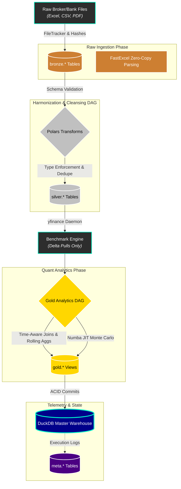

<div align="center">
  
  <h1>Shan's Personal Finance Quant Engine 💸✨</h1>
  <p><b>The undisputed GOAT of personal wealth management frameworks. Built to literally mog your net worth into the stratosphere.</b></p>
  <p><i>Because tracking your portfolio in a basic spreadsheet or SaaS pie-chart app is officially NPC energy. We play on hard mode.</i></p>

<p>
    
    
    
    
    
    
    
  </p>
</div>

---

## 🗣️ The Manifesto: Stop Playing on Easy Mode

Let’s keep it a buck fifty: **this is not your average, plug-and-play budgeting tracker.**

Retail personal finance apps focus on one thing: **budgeting**. They show you a colorful pie chart of your Doordash expenses, pat you on the back, and call it a day. That is a massive L. True wealth is not created by aggressively auditing your $6 iced coffee habit; wealth is created through **asymmetric risk management, compounding capital velocity, and weaponized tax alpha.** 

If you are using Mint, YNAB, or a Google Sheet to track a multi-six-figure net worth, you are leaving basis points on the table. You are leaking alpha.

This engine is a **Sovereign Wealth Management Pipeline**. It treats your household balance sheet like a multi-million dollar quantitative hedge fund. I built this monolith from scratch to ingest messy broker logs, scattered mutual fund statements, and raw bank transactions, and forge them into a single, aggressively performant `DuckDB` data warehouse driven by a `Polars` execution DAG. It is strictly **Medallion-Architecture compliant** (Bronze, Silver, Gold, Meta) and hyper-optimized to the absolute limit of modern hardware.

I'm open-sourcing the engine because gatekeeping institutional architecture patterns is mid. If you want to see how to build a highly relational, 100% type-safe financial pipeline that calculates true Modified Dietz cashflows, intelligently tracks file hashes to halve execution times, actively hunts tax-alpha, and runs stochastic Monte Carlo survival simulations on your laptop—you have arrived. 

Welcome to absolute peak performance. 👑

> [!CAUTION]
> My actual portfolio data, net worth, and personal TOML configs are strictly `.gitignore`'d. We stay secure. 🔒

---

## 💎 The Flex: How This Engine Obliterates Traditional Finance

This architecture replaces "guessing" with deterministic mathematics. It actively models risk, tests survival, and mathematically optimizes your capital preservation through a series of strictly decoupled, **SRP-compliant Presentation Builders**. 

Here is exactly how this engine mogs every retail finance app in existence:

### 🎲 1. The Stochastic FIRE Engine: Surviving the Apocalypse
**The Vibe:** Most FI calculators use a naive, straight-line 7% return assumption. That's delusional. If a recession hits the year you retire, your spreadsheet model shatters completely.
**The Edge:** We ripped out standard geometric logic and injected a fully Numba-compiled (`@njit`), **State-Aware Monte Carlo Engine** that runs 10,000+ parallel futures natively in Real Returns.

*   **Macro Regime Engine (Markov Chains):** Markets aren't static. We use a **3x3 Markov Transition Matrix** to simulate prolonged Bull, Bear, and Stagflation regimes. If the simulation falls into Stagflation, your inflation targets spike and your expected drift goes flat.
*   **Correlated Human Capital Shocks:** Bad things happen together. If the simulation enters a Bear or Stagflation state, it rolls the dice on an **Income Shock** (job loss/zero bonus) that zeroes out your savings rate for up to 12 months. Pure survival mode testing.
*   **Algorithmic Glide Path (Bond Tent):** Protects against Sequence of Returns Risk (SORR) by mechanically de-risking your portfolio into stable assets exactly 5 years before your FI date, and slowly re-risking post-FI.
*   **Institutional Decumulation (Guyton-Klinger):** Implements dynamic withdrawal guardrails directly into the `@njit` loops. If the market crashes in retirement, the engine algorithmically models you taking a lifestyle cut (lowering SWR) to survive.
*   **Stochastic Inflation & Jump Diffusion:** Uses an Ornstein-Uhlenbeck process to model hyper-realistic, mean-reverting inflation paths, and Merton Jump-Diffusion mechanics to inject instantaneous Black Swan market crashes independent of normal volatility.
*   **Fat-Tail Reality:** Equity returns are modeled using a **Student-t Distribution** instead of a Normal distribution, guaranteeing that extreme outlier crashes are properly modeled.

### 🏛️ 2. Institutional Risk Engine
**The Vibe:** "Risk" in retail apps is just a color (Red/Green) or a vague warning. You don't know the actual fiat dollar amount of exposure your portfolio faces when volatility spikes.
**The Edge:** Historical VaR (Value at Risk) is weak because it ignores the magnitude of losses past the 95th percentile. We replaced it with **Expected Shortfall (CVaR)** via rolling `.map_elements` Polars aggregations.

*   Computes exact `NW_Volatility_12M`, `Sharpe_Ratio`, `Sortino_Ratio`, and `Calmar_Ratio` against dynamic risk-free rates.
*   **The Result:** You see the exact expected loss magnitude of your worst-case scenarios, giving you a definitive floor on your capital preservation. No more guessing your downside.

### 🦅 3. Tax Alpha Maximizer
**The Vibe:** You leak basis points of yield to taxes every year because you don't intelligently offset your gains. Standard software just tells you to "sell your losers," which is a rookie move that triggers Wash Sale rules.
**The Edge:** We built an automated, ruthless Tax-Loss Harvesting AI.

*   Our engine calculates the precise `Net_Tax_Benefit` of every tax-lot based on its holding period (STCG/LTCG) and dynamic config rates.
*   **Substitute Asset AI:** It analyzes the `INSTRUMENT_SUBTYPE`. If you are holding a losing Nifty50 ETF, it flags `Substitute_Asset_Available = True` and aggressively bumps its `Priority_Score` so you can harvest the loss and instantly rotate into a correlated proxy asset to stay exposed to the market. Unfathomably based.
*   **LTCG Step-Up Engine:** Automatically detects when you are under your annual tax-free Long Term Capital Gains exemption and flags lots to sell and immediately rebuy, stepping up your cost basis for zero tax dollars.

### 🧠 4. Time-Weighted Performance Attribution
**The Vibe:** Naive returns get horribly distorted by mid-month cash flows (e.g., dumping your salary into the market on the 15th). It's impossible to tell if you're a skilled investor or just riding a bull market.
**The Edge:** Multi-Level **Brinson-Fachler Institutional Attribution**.

*   We engineered a true Time-Weighted Return system using the **Modified Dietz** method. Every single transaction generated by the FIFO lot processor is mapped with a precise `Dietz_Day_Weight`.
*   **The Result:** The engine isolates your `Selection_Effect` and `Allocation_Effect` perfectly, giving you a mathematically pure `Total_Active_Return` (Alpha) entirely scrubbed of capital flow noise. 

### 🌐 5. Platinum-Grade Ground Truth Budgeting
**The Vibe:** Budget apps "guess" your investments by deriving balancing figures (Income - Expense), creating phantom cash flows that destroy data integrity. They also rely on naive row-based rolling averages that break if you miss a month.
**The Edge:** A fully time-aware execution graph that leverages exact transactional deployments and institutional logic.

*   **Time-Aware Polars Windows:** Missing ledger months will never skew your multi-month averages again thanks to strict `rolling_mean_by("MONTH_START_DATE")` temporal functions.
*   **Z-Score Anomaly Detection:** Your spending is run through a 6-month rolling baseline. If you overspend by 2 standard deviations, the engine flags `Is_Expense_Anomaly`.
*   **Exact Deployment Mapping:** `Investment_Deployed` and `Investment_Redeemed` are joined *directly* from the core transactional logs. Your `Actual_Savings` metric is 100% ground-truth.

---

## ⚙️ The Pipeline Architecture (Medallion Pattern)

If you're a data engineer looking under the hood, here is how the monolith is engineered to never crash and execute in absolute record time:



1. **State-Aware File Tracker (Pre-Extraction):** The pipeline uses an intelligent `FileTracker` backed by DuckDB metadata. It recursively hashes thousands of Excel/CSV binaries and only extracts *new or modified* files. This skips massive redundant IO operations and instantly **cuts execution time by 50%**.
2. **Phase 1: The Bronze Layer (Raw Ingestion):** Actionable files are parsed via `fastexcel` and instantly upserted into purely dynamic `bronze.*` tables in DuckDB. Raw state is preserved natively.
3. **Phase 2: The Silver Layer (Transformation DAG):** A strictly decoupled Directed Acyclic Graph harmonizes currencies, maps hierarchical dimensions, and dedupes all historical state using `LazyFrame` structures.
4. **Phase 3: The Benchmark Engine:** A multi-threaded `yfinance` daemon evaluates the exact temporal delta between your DuckDB cache and the required analytical boundaries, pulling *only* the missing market periods to preserve network bandwidth and prevent rate-limiting.
5. **Phase 4: The Gold Layer (Quant Analytics):** Time-aware rolling functions and Numba JIT-compiled Monte Carlo batches execute parallel computations across your CPU cores, building out the `p_tf_` presentation matrix.
6. **Phase 5: Lakehouse Materialization:** The Gold analytical layer and the Meta telemetry layer are aggressively flushed directly to the local `DuckDB` columnar file via an ACID-compliant transaction rollback block.

---

## 🗄️ The Data Warehouse (Star Schema)

The downstream database is rigorously modeled and entirely BI-ready. No complex DAX required—just plug it into PowerBI, Superset, or Metabase and let it rip.

### 📊 The Presentation Tier (`gold.*` schema)
- **`v_Net_Worth_Monthly_Summary`:** Tracks cumulative running balances, Organic Yields, Asset Velocity, and `Months_of_Runway`.
- **`v_Budget_Forecast_Monthly`:** Time-aware ground-truth budgeting, incorporating Z-Score anomaly detection, Rule Targets (40/20/30), and exact `Actual_Investment` metrics.
- **`v_Wealth_Risk_Analytics`:** Houses the heavy-duty Expected Shortfall, Drawdowns, Volatility metadata, and all advanced Monte Carlo output vectors (`Terminal_Wealth_P10`, `Peak_Inflation_Experienced_Pct`, etc.).
- **`v_Performance_Attribution`:** Your Brinson-Fachler alpha scores mapped by sector.
- **`v_Investment_Analytics`:** The ranked priority list of substitute-friendly assets to harvest for tax alpha.
- **`v_Monthly_Cashflow_Summary`:** Exact bifurcation of active vs passive income and precise tracking of equity/debt deployments.

### 🛡️ The Supporting Layers
- **`bronze.*` (Raw Layer):** Pure, untampered extractions mapping 1:1 with source files (`r_Stock_Market_Data`, `r_MF_Transactions`).
- **`silver.*` (Cleansed Layer):** Fully typed, joined, and normalized dimensional facts (`d_Calendar`, `f_Income_Transactions`).
- **`meta.*` (Telemetry Layer):** Complete pipeline observability. Tracks individual file hashes (`m_File_Registry`) and execution telemetry (`m_ETL_Execution_Log`) so you know exactly what ran, when, and how fast.

---

## 🎨 The Aesthetics (CustomTkinter)

Because we don't build ugly software. The control panel is written in pure `CustomTkinter`. Dark mode only. Neon accents. It looks like a command center for a multi-planetary corporation. It executes the pipeline, tracks telemetry logs in real-time, and dumps you straight into your analytics. Pure interface perfection.

---

## 🚀 Developer Quickstart

If you want to fork this and adapt the codebase to your own life, here is the playbook:

### 1. Install Dependencies
We use `uv` for lightning-fast package management. Clone the repo and sync:
```bash
uv sync
```

### 2. Configure your Environment
Create your `config.toml` (data paths) and `financial_rules.toml` (tax rates, macro fallback assumptions, advanced stochastic modeling parameters, target allocations). The GUI automatically remembers your recent environments.

### 3. Run or Build
Custom CLI entry points are registered in `pyproject.toml`:
```bash
# Run the GUI in dev mode with hot-reloading
uv run dev

# Compile a standalone native EXE using PyInstaller
uv run build
```

---

<div align="center">
  <br>
  <i>Keep compounding, stay ahead of the curve. 📈</i><br>
  <b>Copyright (c) 2026 Shan.TK</b><br>
  <i>Built for the 1%.</i>
</div>
