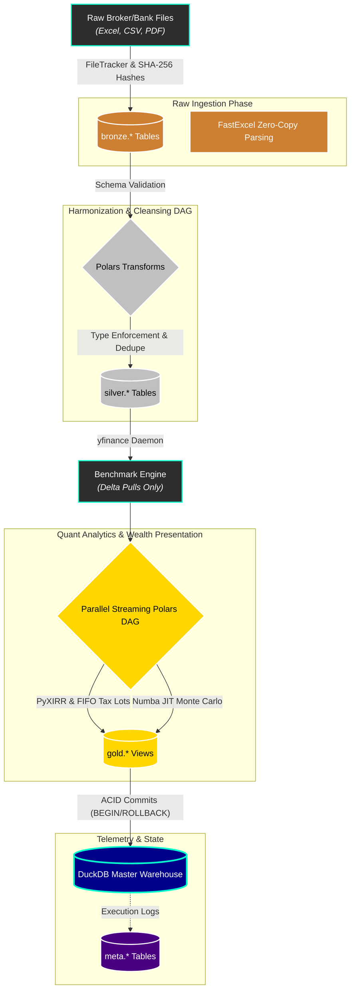

<div align="center">
  
  <h1>Shan's Personal Finance Quant Engine 💸✨</h1>
  <p><b>The undisputed GOAT of personal wealth management frameworks. Built to literally mog your net worth into the stratosphere.</b></p>
  <p><i>Because tracking your portfolio in a basic spreadsheet or SaaS pie-chart app is officially NPC energy. We play on hard mode.</i></p>

<p>
    
    
    
    
    
    
    
  </p>
</div>

---

## 🗣️ The Manifesto: Stop Playing on Easy Mode

Let’s keep it a buck fifty: **this is not your average, plug-and-play budgeting tracker.**

Retail personal finance apps focus on one thing: **budgeting**. They show you a colorful pie chart of your expenses, pat you on the back, and call it a day. That is a massive L. True wealth is not created by aggressively auditing your ₹400 artisanal matcha latte habit; wealth is created through **asymmetric risk management, compounding capital velocity, weaponized tax strategies, and flawless cashflow tracking.**

If you are using a basic Google Sheet to track a multi-lakh or multi-crore net worth, you are leaving insane alpha on the table.

This engine is a **Sovereign Wealth Management Pipeline**. It treats your personal household finances exactly like a multi-crore quantitative hedge fund based in Dalal Street. I built this gigachad monolith from scratch to ingest messy broker logs, scattered mutual fund statements, and raw bank transactions, and forge them into a single, aggressively performant data warehouse.

> [!CAUTION]
> My actual portfolio data, net worth, and personal TOML configs are strictly `.gitignore`'d. We stay secure and based. 🔒

---

## 🌟 The Vision: What This Engine Actually Delivers (In Plain English)

> [!IMPORTANT]
> **ARCHITECTURE TEMPLATE NOT A PLUG-AND-PLAY APP**
> This repository is a **highly customized Medallion Architecture Template** tailored specifically to the author's personal broker data dumps and bank CSV formats. While it provides a complete, production-ready ecosystem for managing household financial statements (complete with a DuckDB state manager, Polars DAG, Monte Carlo engine, and UI), you must fork it and write your own custom Python Extractors to parse your specific bank's data.

Imagine having a **hyper-intelligent, institutional-grade financial advisor** living on your laptop. It never sleeps, it doesn't charge you a 1% AUM fee, and it processes millions of data points a second to ruthlessly optimize your wealth. Pure W.

Here is exactly what it does for you:

1. **Absolute Financial Omniscience (Zero Manual Data Entry):**
   Drop your messy bank PDFs, scattered mutual fund logs, and raw broker Excel files into a folder. The engine instantly ingests them, cleans the data, categorizes every rupee, and builds an unbreakable, mathematically perfect history of your net worth.
2. **Predicting the Future (Stress-Testing Your Retirement):**
   Standard apps ask you to guess a magic number. This engine runs a **Numba JIT-compiled 10,000+ path Monte Carlo simulation**. It simulates the economy booming, crashing, or stagflating. It randomly fires you from your job to test your emergency fund. It tells you _exactly_ how likely you are to survive retirement under absolute worst-case (Black Swan / Jump Diffusion) scenarios.
3. **Hunting for "Free Money" (Algorithmic Tax-Loss Harvesting):**
   The engine actively scans every single stock and mutual fund tax lot you own. It hunts for legal loopholes, flags assets losing money, calculates your exact `Net_Tax_Benefit`, and leverages the Indian ₹1.25L LTCG exemption limit dynamically so you legally starve the taxman.
4. **Separating "Dumb Luck" from "Actual Skill":**
   It mathematically strips out the rupees you deposited using the **Time-Weighted Return (TWR) / Modified Dietz** and **PyXIRR** to compare your true portfolio growth against Nifty/global benchmarks. It generates exact `Portfolio_Active_Return` (Alpha).
5. **Institutional Cashflow Management (NEW):**
   It generates a strict Direct Method Cashflow Statement separating Operating (CFO), Investing (CFI), and Financing (CFF) activities. It ruthlessly enforces the **40/20/30+10 Budgeting Rule** and tracks your exact `Zero_Income_Runway_Months`.

If you are serious about treating your personal capital like a hedge fund, **this is the undisputed GOAT framework to get you there.**

---

## 💎 The Flex: How This Engine Obliterates Traditional Finance

This architecture replaces "guessing" with deterministic mathematics. Here is exactly how this engine mogs every retail finance app in existence:

### 🎲 1. The Stochastic FIRE Engine: Surviving the Apocalypse

**The Vibe:** Most financial independence (FIRE) calculators use a naive, straight-line 7% return assumption. Delusional.
**The Edge:** A fully Numba-compiled **State-Aware Monte Carlo Engine** running 10k parallel futures.

- **Markov Chains (Macro Regimes):** Simulates dynamic shifts between "Bull", "Bear", and "Stagflation".
- **Guyton-Klinger Rules & Glide Paths:** Automatically models tightening your belt during a recession and de-risking your portfolio into a "Bond Tent" 5 years before FI.
- **Jump-Diffusion (Black Swan Events):** Injects sudden, violent, random market crashes into the simulation to test true portfolio resilience.

### 🏛️ 2. Institutional Risk Engine

**The Edge:** Dalal street level risk metrics against dynamic risk-free rates.

- **Sharpe & Sortino Ratios:** Measuring your return against "bad risk".
- **Calmar Ratio:** Return compared to your absolute worst-case drop (Max Drawdown).
- **Expected Shortfall (CVaR):** Standard apps say "you might lose 5%." Expected shortfall says: "In the absolute worst 5% of alternate realities, your average loss will be exactly ₹42,35,000."

### 🦅 3. Tax Alpha Maximizer & Hierarchy Aggregation

**The Edge:** Automated Tax-Loss Harvesting AI. It actively computes your exact `Projected_Tax_Bill` factoring in LTCG/STCG slabs and dynamically computes `Tax_Harvesting_Capacity` and `Harvesting_Offset_Remaining` at an ISIN and tax-lot level.

### 🧠 4. Cashflow Efficiency & Budget Forecasting

**The Edge:** Pure financial forecasting using recency-biased weighted averages (`3*T1 + 2*T2 + 1*T3 / 6`). Tracks your `Runway_Months_Linear` and automatically triggers Z-Score anomaly detection for unusual spending sprees.

---

## ⚙️ The Pipeline Architecture (Medallion Pattern)

If you're a data engineer or software dev looking under the hood, here is how the monolith is engineered to never crash and execute in absolute record time:



1. **State-Aware File Tracker:** Recursively SHA-256 hashes thousands of binaries and only extracts _new or modified_ files. Skips massive redundant IO operations.
2. **Phase 1: The Bronze Layer:** Parses messy broker files via `fastexcel` and upserts into dynamic `DuckDB` tables.
3. **Phase 2: The Silver Layer:** A decoupled DAG using `Polars` harmonizes dimensions (Calendar, Investments, Class) and dedupes all historical facts.
4. **Phase 3: The Benchmark Engine:** A multi-threaded `yfinance` daemon evaluates the exact temporal delta between your cache and pulls _only_ the missing market periods.
5. **Phase 4: The Gold Layer (Quant Analytics & Presentation):** Numba JIT Monte Carlo and PyXIRR array math execute via multiprocessing worker pools down to the granular ISIN and tax-lot level.
6. **Phase 5: Lakehouse Materialization:** Aggressively flushes 17 highly-optimized BI-ready presentation tables directly to the local `DuckDB` file via an ACID-compliant transaction rollback block.

---

## 🗄️ The Data Warehouse (Star Schema)

The downstream database is rigorously modeled, entirely BI-ready, and cleared of all bloatware. Plug it into PowerBI, Superset, or Metabase and let it rip.

### 📊 The Presentation Tier (`gold.*` schema)

- **`gold.Wealth_Asset_Breakdown` / `gold.Core_Monthly_Fact`:** Core running balances, `Organic_Yield_%`, Asset Velocity, and cumulative inflation-adjusted net worth growth.
- **`gold.Cashflow_Activity_Summary` (NEW):** Direct-method cash flow statement perfectly balancing `Net_Cashflow_Operating`, `Net_Cashflow_Investing`, and `Net_Cashflow_Financing`.
- **`gold.Forecast_Budget_Variance` (NEW):** Strict adherence to the 40/20/30+10 deployment rule with exact `Zero_Income_Runway_Months` and dynamic emergency fund gaps.
- **`gold.Wealth_FIRE_Analytics`:** Heavy-duty Monte Carlo vectors (`Runway_Months_Stressed_P10`, `Probability_Of_Success_Pct`, `Coast_FI_Today`) alongside 12M trailing safe withdrawal rates.
- **`gold.Forecast_Tax_Liability`:** Tracks STCG/LTCG realized gains against the Indian ₹1.25L exemption, generating your actual `Projected_Tax_Bill`.
- **`gold.Investment_By_*` Hierarchy:** Exact TWR/XIRR attribution rolled up by ISIN, Subtype, Class, Sector, and Portfolio. Tracks class drift against your target TOML allocations (e.g. 40% Stocks / 40% ETFs).
- **`gold.Cashflow_Efficiency_Analytics`:** MoM cashflow efficiency, tracking `Savings_Rate_Pct`, `Investment_Rate_Pct` and `Liquidity_Ratio_Months`.

---

## 🎨 Dual-Interface Design (CLI & GUI)

We provide radically different ways to interact with the engine, tailored to your aesthetic:

1. **The Desktop App (GUI):** Written in pure `CustomTkinter`. Dark mode only. Neon accents. It looks like a command center for a multi-planetary corporation.
2. **The Terminal CLI:** A highly optimized, savage terminal interface built with `Rich`. Features interactive prompts, dynamic loading bars, and gorgeous colored logging that streams natively as the backend processes data.

---

## 🚀 Developer Quickstart (Fork & Adapt)

> **⚠️ IMPORTANT DISCLAIMER:**
> This is **not** a generic "out-of-the-box" tool that will magically parse any random bank statement you throw at it.
>
> This codebase is a **highly customized Medallion Architecture Template** explicitly tailored to _my_ specific portfolio of broker data dumps, mutual fund statements, and bank CSV formats.
>
> However, it provides a **complete, production-ready ecosystem** for managing household financial statements. The core orchestration, DuckDB state management, Polars DAGs, Monte Carlo engines, and CustomTkinter GUI are entirely data-agnostic.
>
> To use this for your own net worth, you will need to fork this repository and write your own custom Python Extractors and Transformers to map your specific bank's messy CSVs into the standardized Silver layer schema.

If you are a developer ready to adapt this institutional codebase to your own life, here is the playbook:

### 1. Install the Package

We use `uv` for lightning-fast package management.

```bash
pip install personal-finance-etl
```

### 2. Configure your Environment

Create your `config.toml` (data paths, DB paths) and `financial_rules.toml` (tax rates, macro fallback assumptions, advanced stochastic modeling parameters, target allocations).
_Check `tests/config.toml` and `tests/financial_rules.toml` for templates._

### 3. Launch the Engine

The package natively installs global commands to your system. Launch it from anywhere:

```bash
# Launch the Savage Terminal CLI interactively
shan-fin cli

# Launch the Desktop Control Center GUI
shan-fin tkinter

# Run Headless / Unattended (Perfect for Cron Jobs)
shan-fin cli --cron --config path/to/config.toml --rules path/to/rules.toml

# Run Headless DuckDB Snapshot (Backup your DB)
shan-fin cli --snapshot --config path/to/config.toml
```

---

<div align="center">
  <br>
  <i>Keep compounding, stay ahead of the curve. 📈</i><br>
  <b>Copyright (c) 2026 Shan.TK</b><br>
  <i>Built for the 1%.</i>
</div>
