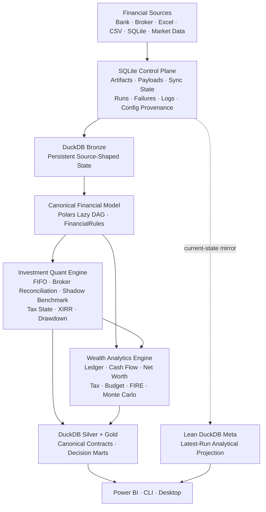
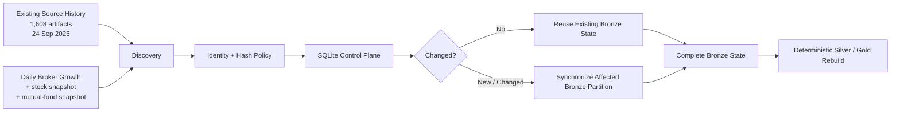
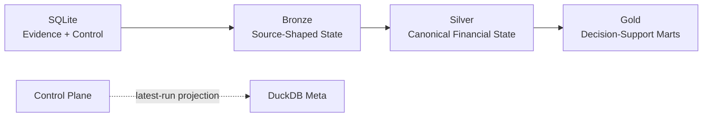
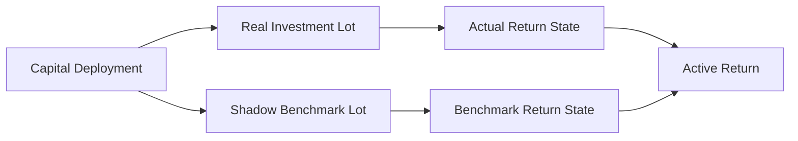
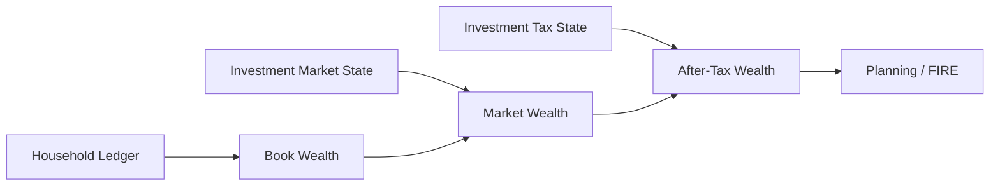
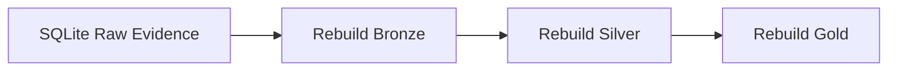
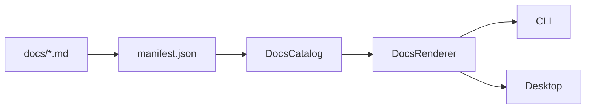

# Personal Finance ETL

**A local-first financial data engineering, BI, and quantitative decision-support platform.**

I built Personal Finance ETL to turn fragmented financial evidence into one reconciled, tax-aware, decision-ready financial state.

It now powers my month-end close, investment accounting, portfolio analysis, cash-flow reconciliation, wealth tracking, tax planning, and FIRE modelling through one connected data lineage.

[](https://pypi.org/project/personal-finance-etl/)


---

## The system



The architecture is deliberately split into two planes:

> **SQLite owns operational truth and raw evidence. DuckDB owns analytical state.**

That boundary is the spine of the current system.

---

## What this project actually combines

This repository is one production system, but its implementation crosses several engineering disciplines.

| Plane | Production evidence |
| --- | --- |
| **Data Engineering** | Content-addressed raw artifacts, change-aware ingestion, persistent Bronze, deterministic Silver/Gold rebuilds, contract-driven publication |
| **Python Engineering** | Pydantic models, repositories, facades, protocols, process isolation, multiprocessing, strict typing |
| **Software Architecture** | Authoritative Control Plane, analytical plane separation, explicit contracts, strategy seams, transactional orchestration |
| **BI Engineering** | Canonical semantics, explicit grain, Silver facts/dimensions, Gold decision marts, Power BI serving |
| **Finance** | Household ledger, transfers, cash/non-cash semantics, FIFO tax lots, holding periods, tax-aware wealth |
| **Investment Analytics** | Broker reconciliation, shadow benchmarks, XIRR, after-tax XIRR, active return, drawdown |
| **Quantitative Engineering** | Numba Monte Carlo, market regimes, fat tails, jumps, stochastic inflation, human-capital shocks |
| **Reliability** | Run lifecycle, failure persistence, rollback, raw-state recovery, configuration fingerprints |
| **Product Engineering** | Backend facade, Rich CLI, desktop GUI, packaged documentation, manifest-driven docs runtime |

The implementation is the evidence; the rest of this README shows where those disciplines meet in production.

---

## Why I built it

The original question was simple:

> **Where exactly do I stand financially?**

Answering it properly was not.

A bank transaction is not useful merely because it has a date and amount. An investment balance is not economically complete without market value and tax state. A portfolio return is not meaningful if irregular cash flows are aggregated incorrectly. A cash-flow dashboard is not trustworthy if it cannot explain actual movement in cash accounts.

The problem gradually became:

```text
What happened?
      ↓
What does it mean financially?
      ↓
Can I reconcile it?
      ↓
What is the current economic state?
      ↓
What decisions does that state support?
```

That is why this repository grew from an ETL workflow into a financial platform.

### The production workload

The architecture is not built around a toy folder containing a handful of sample statements.

As of **24 September 2026**, my production source environment contains **1,608 source artifacts** participating in the pipeline.

The source population includes:

- daily broker snapshots for **stocks**,
- daily broker snapshots for **mutual funds**,
- historical transaction and market files,
- financial/reference masters,
- mappings and opening-state inputs,
- my personal finance SQLite database,
- and other source/reference artifacts required to reconstruct the financial model.

The broker snapshot population alone grows by approximately **two files per day**:

```text
1 stock snapshot
+
1 mutual-fund snapshot
        ↓
~2 additional source artifacts / day
```

So the ingestion problem is continuously growing even when the financial model itself does not change.



That workload is one reason the architecture distinguishes:

```text
discover everything
        ≠
reprocess everything
```

The Control Plane, content hashing, synchronization state, persistent Bronze, and file-aware upserts exist because repeatedly reparsing an ever-growing source history would be wasteful and operationally opaque.

At the same time, Silver and Gold remain deterministically rebuildable from complete Bronze state, which keeps downstream correctness simpler than trying to incrementally patch every analytical dependency.

The scale therefore shaped the architecture:

> **Incrementalize expensive source synchronization. Rebuild derived financial truth from a complete canonical state.**

The figures above describe my production environment at that date, not a benchmark dataset bundled with the repository.

---

## 1 · The Control Plane

The most important production-hardening change was moving operational authority into SQLite.

The facade is intentionally small:

```python
class ControlPlane:
    """Authoritative orchestrator for ETL Control Plane operations."""

    def __init__(self, base_path: str, db_name: str = "Raw_Documents.sqlite"):
        self.db = SQLiteManager(base_path, db_name)
        self.artifacts = ArtifactRepository(self.db)
        self.runs = RunRepository(self.db)
        self.file_sync = FileSyncService(self.artifacts)

    def begin_transaction(self) -> None:
        self.db.begin_transaction()

    def commit(self) -> None:
        self.db.commit()

    def rollback(self) -> None:
        self.db.rollback()
```

The important part is the ownership model:

```text
ControlPlane
├── ArtifactRepository
│   └── artifact identity · hashes · payloads · sync state
├── RunRepository
│   └── lifecycle · config snapshots · failures · execution logs
└── FileSyncService
    └── discovery reconciliation · change detection
```

The ETL orchestrator consumes those responsibilities rather than manipulating SQLite control tables directly.

With more than sixteen hundred artifacts in the current production source population and new broker evidence arriving daily, that boundary gives ingestion a durable memory of **what exists, what changed, what has already reached Bronze, and which run acted on it**.

### Run lifecycle

A run is created before analytical work begins:

```python
run_id = cp.runs.start_run(
    cfg_json=self.cfg.model_dump_json(),
    rules_json=self.rules.model_dump_json() if self.rules else None,
)

self.db_manager.conn.execute("BEGIN TRANSACTION")
cp.begin_transaction()

cp.runs.update_run_status(run_id, "RUNNING")
```

Successful publication moves through an explicit commit state:

```python
cp.runs.update_run_status(run_id, "COMMITTING")

self.db_manager.conn.execute("COMMIT")
cp.commit()

cp.runs.finish_run(run_id, "SUCCESS")
```

Failures are rolled back and then persisted as operational history.

The Control Plane retains:

- artifact identity and payload state,
- file synchronization state,
- content-hashed Settings snapshots,
- content-hashed FinancialRules snapshots,
- run lifecycle,
- failures,
- tracebacks,
- and complete execution logs.

DuckDB no longer competes with SQLite for ownership of historical run truth.

---

## 2 · Raw evidence before derived state

Source artifacts are registered and persisted before they become analytical data.


The pipeline can therefore scan the full source population while making only the new or changed subset actionable:

```python
new_files, changed_files, _ = cp.file_sync.sync_with_disk(
    discovered_files,
    self.cfg.FILE_HASH_POLICY,
    full_replace_categories,
)

actionable_all = {
    category: new_files.get(category, []) + changed_files.get(category, [])
    for category in discovered_files
}
```

That makes ingestion stateful without making downstream analytics incrementally fragile.

### Bronze uses source semantics

Reference/current-state sources can be fully replaced.

Historical/event sources use file-aware replacement so one changed source does not destroy unrelated history.

Then the complete Bronze state is read for deterministic downstream reconstruction.

That combination gives the system:

```text
incremental source synchronization
             +
deterministic analytical reconstruction
```

rather than forcing one persistence strategy onto every layer.

---

## 3 · Polars as the canonical compute plane

After Bronze synchronization, the complete analytical state enters a Polars transformation DAG.

```text
Source-shaped Bronze
        ↓
Lazy transformations
        ↓
Canonical household contracts
        +
Canonical investment contracts
        +
Benchmark / macro contracts
```

The pipeline keeps lazy frames composable until collection is meaningful, and independent presentation nodes can be collected together:

```python
results = pl.collect_all(
    lazy_frames,
    engine="streaming",
)
```

This is where source vocabulary stops being the downstream interface.

Bank, broker, Excel, CSV, and reference-specific structure is converted into financial concepts such as:

```text
Income
Expense
Transfer
Opening Balance
Investment Master
Purchase
Sale
Market Observation
Benchmark Observation
```

The analytical engines consume those concepts, not source worksheets.

---

## 4 · Explicit analytical contracts

Silver and Gold publication is driven by a lightweight contract registry.

```python
@dataclass
class DataContract:
    contract_id: str
    layer: str
    physical_table: str
    domain: str
    grain: str
    producer: str
    publication_order: int
```

A Gold contract is explicit about both physical destination and analytical meaning:

```python
DataContract(
    "df_f_investment_analytics_isin",
    "gold",
    "gold.Investment_By_ISIN",
    "Investments",
    "Date-ISIN",
    "InvestmentQuantEngine",
    200,
)
```

Publication consumes those contracts in declared order:

```python
contracts = sorted(
    (c for c in DATA_CONTRACT_REGISTRY if c.layer == "gold"),
    key=lambda c: c.publication_order,
)

for contract in contracts:
    if contract.contract_id in dfs:
        self._write(
            dfs[contract.contract_id],
            contract.physical_table,
        )
```

This removes table/layer inference from the publication path.

The contract itself states:

```text
What is this dataset?
Where does it live?
What domain owns it?
What does one row mean?
Who produces it?
When is it published?
```

The registry makes analytical identity inspectable before a frame ever reaches DuckDB.

---

## 5 · Silver and Gold

The warehouse is Medallion-inspired, but the layers have precise responsibilities.



## Silver

The current architecture publishes **20 Silver contracts**:

```text
11 dimensions / reference models
 9 facts
```

Silver includes canonical household activity, investment transactions, market/reference state, and deep lot-level investment analytics.

## Gold

The current architecture publishes **17 Gold marts** across:

| Domain | Marts |
| --- | ---: |
| Wealth | 2 |
| Cash Flow | 4 |
| Planning | 3 |
| Portfolio Management | 1 |
| Investment Analytics | 7 |

Gold is intentionally multi-grain.

```text
Month
Month × Asset
Month × Expense Category
Month × Income Category
Month × ISIN
Date × ISIN
Date × Subtype
Date × Class
Date × Instrument Type
Date × Sector
Date × Industry
Date × Portfolio
```

A number does not have complete analytical meaning without its grain.

---

## 6 · FIFO tax-lot accounting

Investment purchases create tax lots.

Sales consume the oldest active inventory first.

The production implementation is deliberately stateful:

```python
while rem > 0 and self._active_lots:
    lot = self._active_lots[0]
    consumed = min(rem, lot.qty)

    age_sale = max((sell_date - lot.date).days, 1)
    holding_type = self.fy_table.get_holding_type(
        age_sale,
        self.tax_type,
        self.tax_subtype,
        lot.date,
        sell_date,
    )

    pnl = (price - lot.price) * consumed if lot.price > 0 else 0.0
```

A partial disposal preserves the remaining lot and proportionally reduces its shadow benchmark exposure:

```python
new_shadow_qty = (
    lot.shadow_qty - (lot.shadow_qty * (rem / lot.qty))
    if lot.shadow_qty
    else 0
)

self._active_lots[0] = TaxLot(
    date=lot.date,
    qty=lot.qty - rem,
    price=lot.price,
    shadow_qty=new_shadow_qty,
    bm_buy=lot.bm_buy,
)
```

That one piece of state supports several downstream questions at once:

```text
FIFO disposal
     ↓
realized P&L
     ↓
sale-date holding classification
     ↓
tax state
     ↓
remaining active inventory
     ↓
future market + benchmark state
```

The investment engine therefore reconstructs stateful investment history rather than reducing broker transactions to grouped totals.

---

## 7 · Broker reconciliation

Transaction history explains how the portfolio got here.

Broker-reported state anchors where it is now.

> **Transactions explain history; broker state anchors current truth.**

The FIFO portfolio can reconcile reconstructed quantity against reported quantity:

```python
if broker_qty > current_units + 1e-8:
    diff = broker_qty - current_units
    self.buy(market_date, diff, 0.0, 0.0, benchmark_price)

elif broker_qty < current_units - 1e-8:
    diff = current_units - broker_qty
    # consume reconstructed inventory until reported quantity is matched
```

Cost basis can also be reconciled against broker-reported buy value.

This is an explicit operational policy, not a claim that historical transaction evidence is always complete.

That distinction matters for tax interpretation.

---

## 8 · Shadow benchmark portfolio

Benchmark analysis follows actual capital deployment.

Each investment purchase creates equivalent benchmark exposure.



When a real lot is partially sold, shadow benchmark quantity is reduced proportionally.

The comparison therefore asks:

> **What happened to the same economic capital if it had been deployed into the configured benchmark at the same time?**

That preserves capital-deployment timing in the comparison instead of subtracting two unrelated point-to-point returns.

---

## 9 · Cash-flow-aware returns

The solver wrapper is intentionally small:

```python
def calculate_xirr(dates: list[date], amounts: list[float]) -> float:
    try:
        result = xirr(dates, amounts)
        return float(result) if result is not None else float("nan")
    except Exception:
        return float("nan")
```

The difficult part is not calling `xirr()`.

The difficult part is constructing the correct dated cash-flow series at the required grain.

```text
ISIN XIRR
≠ average(lot returns)

Class XIRR
≠ average(ISIN XIRR)

Portfolio XIRR
≠ average(security XIRR)
```

Portfolio return is reconstructed from portfolio-level dated flows and terminal value.

The current serving model focuses on decision-useful measures:

- CAGR
- XIRR
- After-Tax XIRR
- Benchmark CAGR
- Benchmark XIRR
- Active Return
- Max Drawdown
- realized/unrealized tax state

Older Sharpe/Sortino/Calmar/beta/tracking-error style machinery was deliberately removed from the production path.

**Compute what supports the decision. Do not preserve complexity because it once existed.**

---

## 10 · Financial policy is validated configuration

Operational configuration and financial meaning are separate contracts.

A policy such as rebalancing tolerance belongs in `FinancialRules`, not inside a presentation formula.

```python
class PortfolioManagementRules(BaseModel):
    rebalance_tolerance_pct_points: float = Field(
        default=5.0,
        ge=0.0,
    )
```

The analytical builder consumes that policy rather than embedding the threshold:

```text
FinancialRules
      ↓
validated policy
      ↓
portfolio-management builder
      ↓
allocation drift / rebalance state
```

The same policy plane carries concepts around:

- income semantics,
- expense semantics,
- cash/non-cash treatment,
- cash pools,
- asset classifications,
- target allocation,
- tax parameters,
- FIRE assumptions,
- market regimes,
- human-capital shocks,
- glide paths,
- and withdrawal behaviour.

> **Parameters belong in configuration. Genuinely different behaviour belongs behind adapters or strategies.**

---

## 11 · Household ledger and wealth

Household activity is reconstructed from:

```text
Opening Balances
Income
Expenses
Transfers
```

Transfers remain distinct from income and expense so internal movement does not manufacture financial performance.

The model also keeps several concepts separate that are easy to blur in a spreadsheet:

```text
cash income       ≠ total income
cash expense      ≠ total expense
book wealth       ≠ market wealth
market wealth     ≠ after-tax wealth
savings growth    ≠ organic market growth
```

Investment market and tax state flows back into the household balance sheet.



This is why the investment engine and household engine are not separate applications.

They are different views of one financial state.

---

## 12 · Cash-flow reconciliation

A categorized expense report can look plausible while still failing to explain actual cash movement.

The system therefore anchors cash flow to configured cash-pool balances.

```text
Opening Cash
    +
Operating Activity
    +
Investing Activity
    +
Financing Activity
    +
Internal Transfer Treatment
    =
Calculated Closing Cash
```

Then:

```text
Actual Closing Cash
        -
Calculated Closing Cash
        =
Unreconciled Difference
```

A non-zero difference remains visible.

It is a data-quality and financial-reconciliation signal, not something to zero out for a prettier dashboard.

---

## 13 · FIRE is downstream of financial truth

FIRE does not begin from a manually entered portfolio number.

It consumes connected household state:

```text
After-Tax Market Wealth
        +
Trailing Spending
        +
Trailing Savings
        +
FinancialRules
        ↓
Current-State FIRE
        ↓
Deterministic Planning
        ↓
Monte Carlo
```

The stochastic model can represent:

- Bull / Bear / Stagflation regimes,
- Markov regime transitions,
- fat-tailed return shocks,
- jump events,
- stochastic inflation,
- human-capital shocks,
- glide paths,
- portfolio drag,
- dynamic withdrawal rules,
- and sequence-of-returns risk.

The simulation is accelerated with NumPy/Numba because this is a numerical workload, not a dataframe transformation problem.

The Gold serving contract intentionally exposes selected planning outputs rather than every simulation statistic:

```text
P10 / P50 / P90 months to FI
modelled probability of success
projected P50 FI date
base / stressed runway
P50 nominal terminal wealth
```

These are **scenario distributions under configured assumptions**, not predictions.

---

## 14 · Failure is part of the architecture

Per-instrument investment work runs in parallel.

A failed worker is not allowed to disappear from a successful portfolio.

The failure propagates through the investment engine into the orchestrator, where it becomes Control Plane history:

```python
cp.runs.log_run_failure(
    run_id=run_id,
    failed_isin=failed_isin,
    stage="InvestmentQuantEngine",
    error_type="RuntimeError",
    error_message=error_msg,
    traceback_log=traceback.format_exc(),
)
```

The analytical transactions are rolled back:

```python
self.db_manager.conn.execute("ROLLBACK")
cp.rollback()
```

and the run is finalized as failed:

```python
cp.runs.finish_run(run_id, "FAILED")
```

The complete execution log is persisted afterward.

This is intentionally described as **application-coordinated transactional consistency across two local databases**.

It is not distributed two-phase commit.

---

## 15 · Recoverability

Raw evidence survives independently from derived analytical state.

That creates a recovery path:



The Control Plane can also compare its artifact state with DuckDB registry state and return missing analytical artifacts to the Bronze synchronization path.

Recoverability and immutable historical replay are different concepts.

A future rebuild can still use newer:

- application code,
- schemas,
- financial rules,
- or tax behaviour.

That is why configuration and run provenance matter.

---

## 16 · Lean DuckDB Meta

DuckDB Meta is intentionally no longer the historical operational authority.

It contains only analytical context useful beside the latest warehouse state:

```text
m_File_Registry
m_Table_Row_Counts
m_Financial_Rules
m_Settings
```

Historical execution truth lives in SQLite.

The Control Plane is authoritative.

DuckDB Meta is a projection.

That keeps Power BI/query consumers close to useful operational context without duplicating the full control system.

---

## 17 · Documentation has an architecture too

The documentation is packaged with the application and discovered through a manifest.



The catalog does not hard-code individual pages:

```python
for section_data in manifest_data.get("sections", []):
    section_title = section_data.get("title", "")

    for page in section_data.get("pages", []):
        catalog.append(
            DocEntry(
                section=section_title,
                title=page.get("title", ""),
                path=page.get("path", ""),
                order=page.get("order", 9999),
            )
        )
```

One documentation tree therefore serves:

```text
GitHub
CLI
Desktop
Packaged distribution
```

The [GitHub Wiki](https://github.com/tks18/personal-finance-etl/wiki) now sits above this source of truth as the guided exploration layer rather than becoming a competing copy.

Yes, the documentation explaining the architecture now has an architecture. 😅

---

## 18 · Application surfaces

The financial logic sits behind a backend facade rather than being implemented separately in every interface.

```text
                 PersonalFinanceEngine
                         │
            ┌────────────┼────────────┐
            ▼            ▼            ▼
          CLI          Desktop     Headless
                         │
                         ▼
                      Power BI
```

The surfaces have different jobs.

The engine remains shared.

That principle dates back to much earlier projects in my engineering journey and remains one of the architectural instincts I keep returning to.

---

## 19 · Performance

The production-hardening cycle also removed analytical work that no longer supported the serving contract.

That included legacy risk calculations and associated presentation processing.

### Production snapshot

The timing below is measured against my real source environment, not a synthetic benchmark:

| Production context | Snapshot |
| --- | ---: |
| Source artifacts | **1,608** |
| Snapshot date | **24 September 2026** |
| Ongoing broker growth | **~2 files/day** |
| Main daily additions | Stock snapshot + mutual-fund snapshot |
| Other inputs | Transaction/history files, masters, mappings, personal-finance SQLite data, reference inputs |
| Previous E2E runtime | **~23 sec** |
| Hardened E2E runtime | **~14–17 sec** |
| Financial outputs | **Reconciled unchanged** |

The runtime is possible because the pipeline does not confuse source discovery with source reprocessing.

```text
1,608 discovered artifacts
        ↓
Control Plane identity + hash policy
        ↓
only new / changed artifacts become actionable
        ↓
persistent Bronze preserves synchronized history
        ↓
complete Bronze feeds deterministic analytics
```

The hardening work also reduced the amount of downstream computation by removing metrics and presentation nodes that no longer served a decision.

So the improvement is not a claim that Python can magically process arbitrary financial workloads in 14 seconds.

It is the result of several architectural choices working together:

- change-aware source synchronization,
- persistent Bronze,
- file-aware historical replacement,
- Polars lazy/vectorized execution,
- concurrent collection of independent lazy outputs,
- per-instrument parallelism where state boundaries allow it,
- and removal of analytical work with no serving value.

On this production workload, the end-to-end pipeline moved from roughly:

```text
~23 seconds
```

to approximately:

```text
~14–17 seconds
```

while preserving the financial outputs I rely on.

I treat those figures as an **environment-specific production snapshot**, not a universal benchmark.

The more important result is architectural:

> **Process what changed. Preserve what did not. Rebuild what must remain financially coherent.**

And another lesson from the hardening cycle remains equally important:

> Removing computation with no decision value can be a better optimization than making unnecessary computation faster.

---

## 20 · Technology ownership

The stack is deliberately heterogeneous.

| Technology | Responsibility |
| --- | --- |
| **SQLite** | Authoritative Control Plane, raw artifacts, payloads, run history, failures, configuration provenance |
| **DuckDB** | Persistent Bronze/Silver/Gold analytical warehouse and lean current-state Meta |
| **Polars** | Lazy/vectorized transformation and analytical computation |
| **Pydantic** | Operational and financial-policy contracts |
| **PyXIRR** | Irregular dated return solving |
| **NumPy / Numba** | Numerical stochastic simulation |
| **multiprocessing** | Per-instrument analytical parallelism and process isolation |
| **Rich** | CLI |
| **CustomTkinter** | Desktop application |
| **Power BI** | Decision-oriented analytical consumption |

The question is not which tool wins.

It is which tool should own the responsibility.

---

## 21 · Running the project

> **Important:** installing the package does not make the current source contracts portable to an arbitrary financial environment.

Requires **Python 3.13+**.

### Install

```bash
pip install personal-finance-etl
```

### CLI

```bash
shan-fin
```

### Desktop

```bash
shan-fin-gui
```

### Development

```bash
git clone https://github.com/tks18/personal-finance-etl.git
cd personal-finance-etl
pip install -e .
```

A working deployment also requires:

- valid operational Settings,
- valid FinancialRules,
- reference/mapping inputs,
- and source contracts compatible with the current adapters.

See:

- [Installation](docs/getting-started/installation.md)
- [Configuration](docs/getting-started/configuration.md)
- [Running the Pipeline](docs/getting-started/running-the-pipeline.md)

---

## 22 · Is this plug-and-play?

**No, not yet.**

The current system is production software built around my financial environment.

Substantial parts are already reusable:

```text
Control Plane
Raw evidence lifecycle
Bronze synchronization
deterministic reconstruction
canonical modelling patterns
investment engine
wealth engine
contract registry
application architecture
documentation runtime
```

But another financial environment can still require customization of:

- bank/broker source contracts,
- mappings,
- statement layouts,
- asset pipelines,
- financial classifications,
- jurisdictional tax behaviour,
- reconciliation policy,
- and selected analytical assumptions.

I would rather make that boundary explicit than call a purpose-built system "fully configurable" before it is.

---

## 23 · Where the architecture is going

The long-term direction is not a rewrite.

It is controlled extraction of the assumptions embedded in the working vertical system.

```text
Working Production System
        ↓
Harden semantics & provenance
        ↓
Formalize contracts
        ↓
Extract source adapters
        ↓
Extract behavioural strategies
        ↓
Preserve canonical financial contracts
        ↓
Broader configuration-led deployment
```

The migration rule is:

```text
characterize current behaviour
        ↓
extract assumption
        ↓
route current environment through new boundary
        ↓
reconcile financial outputs
        ↓
adopt generalized path
```

The current production system remains the behavioural baseline.

See the full [Roadmap](docs/about/roadmap.md).

---

## 24 · Explore the project

The repository now has two complementary knowledge surfaces built on top of the source code.

| I want to... | Go here |
| --- | --- |
| 🧭 **Understand the system as a guided journey** | [Explore the Wiki](https://github.com/tks18/personal-finance-etl/wiki) |
| 📚 **Inspect the canonical technical specification** | [Open `/docs`](https://github.com/tks18/personal-finance-etl/blob/master/docs/README.md) |
| 🔬 **Verify the implementation itself** | [Browse the source](https://github.com/tks18/personal-finance-etl) |

```text
README
   ↓
choose the depth you need
   ├── Wiki   → guided exploration
   ├── /docs  → canonical technical knowledge
   └── source → implementation ground truth
```

The Wiki connects the architecture, data lifecycle, financial model, investment engine, tax, wealth, FIRE, BI, reliability, and project journey as one guided tour.

`/docs` remains the authoritative technical documentation. The source code remains the implementation ground truth.

### Explore the canonical docs

| Section | Start here |
| --- | --- |
| 🚀 **Getting Started** | [Installation](docs/getting-started/installation.md) |
| 🏗️ **Architecture** | [System Architecture](docs/architecture/system-architecture.md) |
| 💰 **Finance & Methodology** | [Financial Model](docs/finance/financial-model.md) |
| ⚙️ **Configuration** | [Financial Rules](docs/configuration/financial-rules.md) |
| 🧑‍💻 **Developer** | [Development Guide](docs/developer/development-guide.md) |
| 📖 **Reference** | [Gold Data Contracts](docs/reference/gold-data-contracts.md) |
| 🧭 **About** | [Project Overview](docs/about/project.md) |

Or open the complete **[Documentation Portal](docs/README.md)**.

### Choose by interest

**Data Engineering**  
→ [Data Lifecycle](docs/architecture/data-lifecycle.md)  
→ [Warehouse Architecture](docs/architecture/warehouse-architecture.md)

**Python / Software Architecture**  
→ [System Architecture](docs/architecture/system-architecture.md)  
→ [Development Guide](docs/developer/development-guide.md)

**BI / Data Modelling**  
→ [Data Model](docs/architecture/data-model.md)  
→ [Gold Data Contracts](docs/reference/gold-data-contracts.md)

**Investment Engineering**  
→ [Investment Analytics](docs/finance/investment-analytics.md)  
→ [Tax Methodology](docs/finance/tax-methodology.md)

**FIRE / Quantitative Planning**  
→ [FIRE Methodology](docs/finance/fire-methodology.md)  
→ [FIRE Configuration](docs/configuration/fire-configuration.md)

**The engineering journey behind the project**  
→ [About Me](docs/about/about-me.md)

---

## 25 · Engineering principles

A few principles survive almost every refactor.

### Preserve evidence

Derived analytical state can be rebuilt. Original financial evidence deserves a separate durability boundary.

### Make ownership explicit

SQLite owns operational truth. DuckDB owns analytical state.

### Respect grain

A metric without grain is an invitation to calculate the right formula over the wrong financial object.

### Reconcile against independent truth

Cash movement and broker state are valuable precisely because they can challenge reconstructed state.

### Keep financial policy explicit

A threshold or classification that changes financial meaning should not hide inside a presentation expression.

### Let different workloads use different compute models

Polars is excellent for lazy/vectorized transformations.

FIFO is stateful.

Monte Carlo is numerical.

One abstraction does not need to win every argument.

### Compute richly. Publish selectively.

A metric earns Gold real estate because it supports a decision, not because it was difficult to calculate.

### Generalize from working behaviour

I prefer extracting abstractions from a production vertical system over designing a universal framework before the variation exists.

---

## 26 · About the builder

I am a **Chartered Accountant who builds data-intensive software systems**.

My engineering path moved through web development, Python, data analytics, data engineering, BI automation, software architecture, semantic/local-AI systems, and eventually into projects where those disciplines meet finance.

Personal Finance ETL is currently the clearest convergence of that journey.

The longer story is in **[About Me](docs/about/about-me.md)**.

---

## Final note

This started because I wanted a better month-end view of my own finances.

It now has:

```text
an authoritative SQLite Control Plane
a DuckDB analytical warehouse
a Polars canonical transformation DAG
FIFO tax-lot accounting
broker reconciliation
shadow benchmark portfolios
cash-flow reconciliation
tax-aware wealth
contract-driven Silver / Gold publication
Numba Monte Carlo
Power BI
CLI + desktop surfaces
and a manifest-driven documentation runtime
```

Is that a lot of engineering for personal finance?

Yes.

But it is not architecture built around a hypothetical problem.

**I use the system. The financial state reconciles. The outputs guide real decisions.**

That is the part I care about.

---

## License

See [LICENSE](LICENSE) for usage terms.
