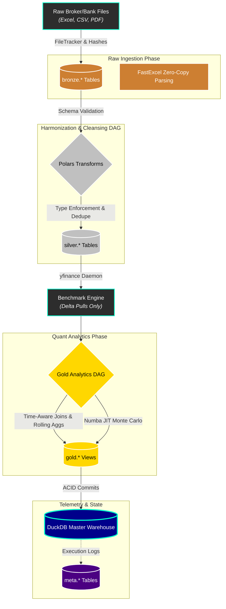

<div align="center">
  
  <h1>Shan's Personal Finance Quant Engine 💸✨</h1>
  <p><b>The undisputed GOAT of personal wealth management frameworks. Built to literally mog your net worth into the stratosphere.</b></p>
  <p><i>Because tracking your portfolio in a basic spreadsheet or SaaS pie-chart app is officially NPC energy. We play on hard mode.</i></p>

<p>
    
    
    
    
    
    
    
  </p>
</div>

---

## 🗣️ The Manifesto: Stop Playing on Easy Mode

Let’s keep it a buck fifty: **this is not your average, plug-and-play budgeting tracker.**

Retail personal finance apps focus on one thing: **budgeting**. They show you a colorful pie chart of your coffee expenses, pat you on the back, and call it a day. That is a massive L. True wealth is not created by aggressively auditing your $6 iced coffee habit; wealth is created through **asymmetric risk management, compounding capital velocity, and weaponized tax strategies.** 

If you are using a basic Google Sheet to track a multi-six-figure net worth, you are leaving money on the table. 

This engine is a **Sovereign Wealth Management Pipeline**. It treats your personal household finances exactly like a multi-million dollar quantitative hedge fund. I built this monolith from scratch to ingest messy broker logs, scattered mutual fund statements, and raw bank transactions, and forge them into a single, aggressively performant data warehouse.

> [!CAUTION]
> My actual portfolio data, net worth, and personal TOML configs are strictly `.gitignore`'d. We stay secure. 🔒

---

## 🌟 The Vision: What This Engine Actually Delivers (In Plain English)

If you're browsing this repository and wondering if you should invest the time to set it up, the answer is an absolute **yes**. This isn't just a coding project; it's a completely different way to look at your financial life.

Imagine having a **hyper-intelligent, institutional-grade financial advisor** living on your laptop. It never sleeps, it doesn't charge you a 1% AUM fee, and it processes millions of data points a second to ruthlessly optimize your wealth.

Here is exactly what it does for you:

1. **Absolute Financial Omniscience (Zero Manual Data Entry):** 
   You no longer need to type expenses into a spreadsheet. You simply drop your messy bank PDFs, scattered mutual fund logs, and raw broker Excel files into a folder. The engine instantly ingests them, cleans the data, categorizes every penny, and builds an unbreakable, mathematically perfect history of your net worth. 
2. **Predicting the Future (Stress-Testing Your Retirement):** 
   Standard apps ask you to guess a magic number ("Assume my stocks grow 7% a year"). That is how people go broke in a recession. Instead, this engine runs **10,000 alternate realities** of your life. It simulates the economy booming, crashing, or stagnating. It randomly fires you from your job to test your emergency fund. It tells you *exactly* how likely you are to survive retirement under the absolute worst-case scenarios.
3. **Hunting for "Free Money" (Algorithmic Tax-Loss Harvesting):** 
   The engine actively scans every single stock and mutual fund you own to hunt for legal loopholes. If it finds an asset losing money, it flags it, tells you exactly how much you'll save on taxes by selling it, and suggests a nearly identical asset to buy instead. It weaponizes the tax code in your favor.
4. **Separating "Dumb Luck" from "Actual Skill":** 
   If you put $5,000 into the stock market and your portfolio goes up, most apps say "You made $5,000!" That's misleading. This engine mathematically strips out the money you deposited and compares your true portfolio growth against global benchmarks. It tells you definitively whether you are a skilled investor, or if you're just riding a bull market.
5. **Hyper-Accurate Budgeting (Anomaly Detection):**
   Instead of shaming you for buying a coffee, the engine tracks your 6-month spending baselines. It only alerts you when your spending statistically deviates from your normal behavior (using Z-Score anomalies). It focuses on the macro, not the micro.

If you are serious about treating your personal capital like a hedge fund, **this is the undisputed GOAT framework to get you there.** Dive in.

---

## 💎 The Flex: How This Engine Obliterates Traditional Finance

This architecture replaces "guessing" with deterministic mathematics. Here is exactly how this engine mogs every retail finance app in existence, with a breakdown of the complex math under the hood:

### 🎲 1. The Stochastic FIRE Engine: Surviving the Apocalypse
**The Vibe:** Most financial independence (FIRE) calculators use a naive, straight-line 7% return assumption. That's delusional.
**The Edge:** We use a fully Numba-compiled **State-Aware Monte Carlo Engine** that runs 10,000+ parallel futures natively in Real Returns.

📚 **The Math Dictionary:**
*   **Monte Carlo Simulation:** A mathematical technique that runs thousands of random scenarios (like rolling dice 10,000 times) to find the probability of different outcomes. Instead of saying "you will have $2M," it says "you have a 95% chance of having between $1M and $3M."
*   **Markov Chains (Macro Regimes):** A model that predicts the economy shifting between "Bull" (good), "Bear" (bad), and "Stagflation" (terrible) markets based on historical probabilities.
*   **Guyton-Klinger Rules:** A famous set of retirement withdrawal rules. If the market crashes, the rule says "cut your spending by 10% so you don't go broke." Our engine automatically simulates you tightening your belt if a recession hits.
*   **Jump-Diffusion (Black Swan Events):** Normal math assumes the stock market moves in smooth curves. *Jump-diffusion* injects sudden, violent, random market crashes (like the 2008 crash or 2020 pandemic) into the simulation to test if your portfolio can survive sudden chaos.
*   **Sequence of Returns Risk (SORR):** The danger of the stock market crashing *exactly* when you retire. We algorithmically model a "Bond Tent" (shifting money to safe bonds right before retirement) to shield you from this.

### 🏛️ 2. Institutional Risk Engine
**The Vibe:** "Risk" in retail apps is just a color (Red/Green) or a vague warning. 
**The Edge:** We compute exact, wall-street level risk metrics against dynamic risk-free rates.

📚 **The Math Dictionary:**
*   **Sharpe Ratio:** Measures how much return you get for the risk you take. (Higher is better).
*   **Sortino Ratio:** Like Sharpe, but it *only* penalizes you for "bad risk" (losing money). It ignores "good risk" (stocks going up really fast).
*   **Calmar Ratio:** Measures your return compared to your absolute worst-case drop (Max Drawdown). It tells you if the panic attacks are worth the profit.
*   **Expected Shortfall (CVaR):** Standard apps tell you "you might lose 5%." Expected shortfall tells you: "In the absolute worst 5% of alternate realities, your average loss will be exactly $42,350."

### 🦅 3. Tax Alpha Maximizer
**The Edge:** We built an automated, ruthless Tax-Loss Harvesting AI. It calculates the precise `Net_Tax_Benefit` of every tax-lot.

📚 **The Translation:** 
*   **Tax-Loss Harvesting:** If you buy a stock and it goes down, you sell it to claim a "loss" on your taxes (lowering your tax bill), and instantly buy a *similar* (but not identical) stock so you stay invested when the market goes back up. The engine automatically finds these opportunities for you.

### 🧠 4. Time-Weighted Performance Attribution
**The Edge:** We engineered a true Time-Weighted Return system using the **Modified Dietz** method to give you a mathematically pure `Total_Active_Return` (Alpha).

📚 **The Translation:** 
*   **Modified Dietz:** If you put $10,000 into the market on the 29th of the month, a dumb app will think your portfolio "grew" by $10,000 that month and say you are a genius. Modified Dietz mathematically strips out your deposits/withdrawals so you can see if your investments *actually* grew or if you just deposited money.

---

## ⚙️ The Pipeline Architecture (Medallion Pattern)

If you're a data engineer or software dev looking under the hood, here is how the monolith is engineered to never crash and execute in absolute record time:

> **What is Medallion Architecture?** A data engineering design pattern that logically organizes data into Bronze (raw, messy data), Silver (cleaned and filtered data), and Gold (business-ready, analytics data).



1. **State-Aware File Tracker:** Recursively hashes thousands of binaries and only extracts *new or modified* files. Skips massive redundant IO operations and instantly cuts execution time by 50%.
2. **Phase 1: The Bronze Layer (Raw Ingestion):** Parses messy broker files via `fastexcel` and upserts into `DuckDB`.
3. **Phase 2: The Silver Layer (Transformation):** A strictly decoupled Directed Acyclic Graph (DAG) using `Polars` harmonizes currencies and dedupes all historical state.
4. **Phase 3: The Benchmark Engine:** A multi-threaded `yfinance` daemon that evaluates the exact temporal delta between your cache and pulls *only* the missing market periods.
5. **Phase 4: The Gold Layer (Quant Analytics):** Numba JIT-compiled Monte Carlo batches execute parallel computations across your CPU cores.
6. **Phase 5: Lakehouse Materialization:** Aggressively flushes directly to the local `DuckDB` columnar file via an ACID-compliant transaction rollback block.

---

## 🗄️ The Data Warehouse (Star Schema)

The downstream database is rigorously modeled and entirely BI-ready. Just plug it into PowerBI, Superset, or Metabase and let it rip.

### 📊 The Presentation Tier (`gold.*` schema)
- **`p_Net_Worth_Monthly_Summary`:** Tracks cumulative running balances, Organic Yields, Asset Velocity, and `Months_of_Runway` (both nominal and inflation-adjusted).
- **`p_Budget_Forecast_Monthly`:** Time-aware ground-truth budgeting, incorporating Z-Score anomaly detection, Rule Targets (40/20/30), and exact `Actual_Investment` metrics.
- **`p_Wealth_Risk_Analytics`:** Houses the heavy-duty Expected Shortfall, Drawdowns, Risk-Adjusted Ratios (Sharpe, Sortino, Calmar), and all advanced Monte Carlo output vectors (`Terminal_Wealth_P10`, `Probability_Of_Success_Pct`, etc.).
- **`p_Tax_Liability_Forecast`:** Actively projects your real-time tax bill, tracking STCG/LTCG realized gains against your remaining tax-free exemptions to calculate your `Tax_Drag_Pct`.
- **`p_Investment_Analytics`:** Computes the ranked priority list of substitute-friendly assets (`Tax_Harvesting_Priority_Score`) to harvest for tax alpha, along with automated portfolio rebalancing targets.
- **`p_Monthly_Cashflow_Summary`:** Exact bifurcation of active vs. passive income streams, equity deployment ratios, and calculation of your true `Real_Savings_Rate_Pct`.
- **`p_Category_Spend_Analytics`:** Deep-dive anomaly detection on a per-category basis, ranking your `Spend_Consistency_Score` and tracking category-specific inflation.
- **`p_Income_Streams_Monthly`:** Grades your income reliability via an `Income_Stability_Score` and `Income_Diversification_Score`, separating true passive dividend/interest yields from active labor.

---

## 🎨 Dual-Interface Design (CLI & GUI)

We provide two radically different ways to interact with the engine, tailored to your aesthetic:

1. **The Desktop App (GUI):** Written in pure `CustomTkinter`. Dark mode only. Neon accents. It looks like a command center for a multi-planetary corporation. 
2. **The Terminal CLI:** A highly optimized, savage terminal interface built with `Rich`. Features interactive prompts, dynamic loading bars, and gorgeous colored logging that streams natively as the backend processes data.

---

## 🚀 Developer Quickstart

If you want to adapt this institutional codebase to your own life, here is the playbook:

### 1. Install the Package
We use `uv` for lightning-fast package management, but it's fully compatible with `pip`.
```bash
pip install personal-finance-etl
```

### 2. Configure your Environment
Create your `config.toml` (data paths) and `financial_rules.toml` (tax rates, macro fallback assumptions, advanced stochastic modeling parameters, target allocations). 

### 3. Launch the Engine
The package natively installs global commands to your system. Launch it from anywhere:

```bash
# Launch the Savage Terminal CLI
shan-fin

# Launch the Desktop Control Center GUI
shan-fin-gui

# Run headless DuckDB snapshot via CLI
shan-fin --snapshot
```

---

<div align="center">
  <br>
  <i>Keep compounding, stay ahead of the curve. 📈</i><br>
  <b>Copyright (c) 2026 Shan.TK</b><br>
  <i>Built for the 1%.</i>
</div>
