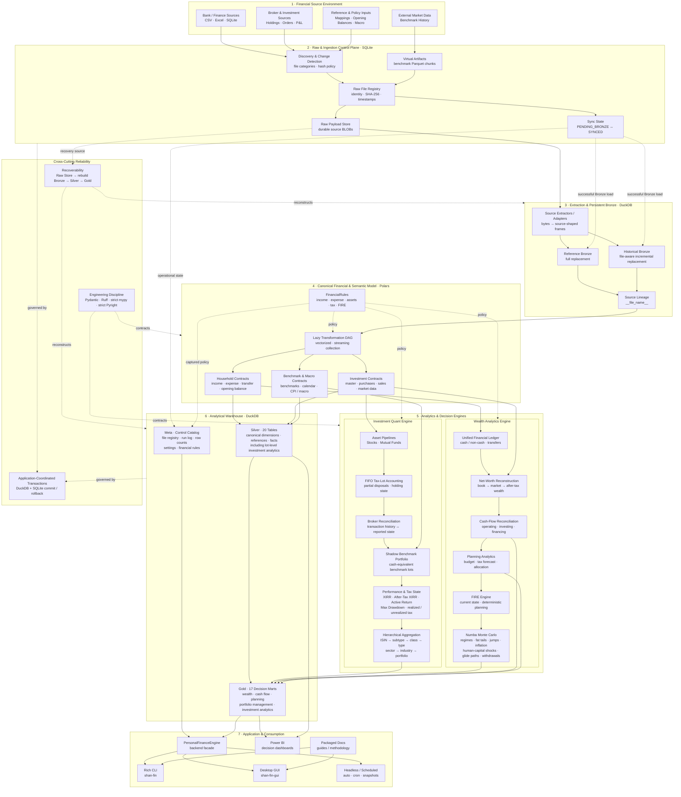

# Personal Finance ETL

**A local-first financial data engineering, BI, and quantitative decision-support platform.**

Built for real month-end close, investment accounting, portfolio analysis, cash-flow intelligence, and long-range financial planning.

[](https://pypi.org/project/personal-finance-etl/)


---

## Explore

[Why I built it](#why-i-built-it) ·
[Architecture](#architecture) ·
[Warehouse](#analytical-warehouse) ·
[Investment Analytics](#investment-analytics) ·
[FIRE](#fire--long-range-planning) ·
[Software Engineering](#software-engineering) ·
[Run It](#running-the-project) ·
[Docs](#documentation)

## What is this?

`personal-finance-etl` is the production financial system I built for
myself after a collection of spreadsheets, broker statements, bank data,
investment records, and planning models stopped being a sensible way to
understand one financial life.

Things escalated. 😅

Today the project combines:

-   **Data engineering** --- durable raw-artifact persistence,
    change-aware ingestion, incremental Bronze loading, deterministic
    downstream reconstruction, lineage, and local analytical storage.
-   **BI engineering** --- canonical financial modelling, explicit
    analytical grains, domain-oriented Gold marts, and Power BI-ready
    serving tables.
-   **Python & software engineering** --- typed configuration contracts,
    strategy abstractions, builder-based analytics, multiprocessing,
    transactional orchestration, strict static analysis, and separated
    application surfaces.
-   **Financial engineering** --- household accounting, cash/non-cash
    semantics, FIFO tax lots, broker reconciliation, benchmark-relative
    performance, tax-aware valuation, cash-flow reconciliation,
    budgeting, and wealth modelling.
-   **Quantitative planning** --- irregular-cash-flow XIRR, drawdown
    analysis, stochastic FIRE modelling, market regimes, inflation,
    human-capital shocks, glide paths, dynamic withdrawals, and
    terminal-wealth scenarios.

This is a **working vertical system built around my own financial
environment**, not a generic consumer-finance app. I actually use it for
month-end closure, investment review, and long-range planning.

A spreadsheet can technically do pieces of this. At some point that
became spreadsheet NPC energy.

---
## Why I built it

I wanted one local system that could answer a deceptively simple
question:

> **What is actually happening with my money?**

That eventually became several connected questions:

### Month-end close

Reconcile income, expenses, transfers, cash movement, asset balances,
investments, and net worth from heterogeneous financial sources.

### Wealth

Understand book wealth, market-adjusted wealth, liquidity, liabilities,
savings, organic growth, and how the household balance sheet is
evolving.

### Investments

Reconstruct positions from transactions, maintain FIFO tax lots,
reconcile against broker state, compare capital deployment against
benchmarks, calculate cash-flow-aware returns, and understand after-tax
outcomes.

### Cash flow

Separate accounting activity from actual cash movement and reconcile
operating, investing, financing, and internal-transfer activity against
cash-pool balances.

### Planning

Track budgets, tax exposure, savings capacity, runway, and progress
toward financial independence.

### Stress testing

Use configurable stochastic scenarios to explore distributions of FI
timing, runway, portfolio survival, and terminal wealth.

What started as an ETL pipeline therefore grew into a **local financial
data and decision-support platform**.

---
## The system in one line

```text
Raw financial evidence
        ↓
Durable ingestion state
        ↓
Canonical financial model
        ↓
Investment + household analytics
        ↓
Tax-aware wealth & planning
        ↓
Decision-support marts
        ↓
Power BI • CLI • Desktop
```

That lineage is the core of the project. The investment engine, household accounting model, cash-flow model, tax analytics, and FIRE engine are not isolated calculators; they operate on the same reconstructed financial state.

---

## Architecture

The core design principle is simple:

> **Preserve raw evidence, reconstruct canonical financial state,
> compute richly, and publish selectively.**



> **How to read this:** the solid path is the financial-data lineage from raw evidence to decisions. Dotted paths represent policy, operational state, recovery, and cross-cutting engineering controls. The architecture deliberately separates source persistence, canonical semantics, analytical computation, serving contracts, and application surfaces.

Each technology has a deliberately narrow job:

| Technology | Role |
| --- | --- |
| **SQLite** | Durable raw-document store, file registry, hashes, and ingestion synchronization state |
| **DuckDB** | Local analytical warehouse and BI-serving layer |
| **Polars** | Lazy/vectorized transformation and analytical computation |
| **NumPy + Numba** | Numerically intensive stochastic simulation |
| **Pydantic** | Validated operational and financial configuration contracts |
| **PyXIRR** | Irregular-cash-flow return calculations |
| **Rich** | CLI experience |
| **CustomTkinter** | Desktop application |
| **Power BI** | Analytical consumption and visualization |

---

## How the system works

### 1. Raw & control plane

Source artifacts are first registered in a dedicated SQLite **Raw
Document Store**.

It persists:

-   source metadata and relative paths,
-   SHA-256 fingerprints,
-   binary payloads,
-   first/last ingestion timestamps,
-   and Bronze synchronization state.

Files move through an explicit lifecycle such as:

``` text
Source artifact
      ↓
Raw Store
[PENDING_BRONZE]
      ↓
Extraction + Bronze load
      ↓
Raw Store
[SYNCED]
```

This is more than archival storage. It creates a **recoverability
boundary**: if the analytical DuckDB warehouse is recreated while the
Raw Store survives, persisted raw artifacts can be reprocessed to
rebuild downstream state.

The same mechanism also supports **virtual artifacts**. Incrementally
fetched benchmark history is serialized as Parquet bytes and registered
under synthetic `virtual://...` identities before entering Bronze.

### 2. Bronze

Bronze is the persistent source-shaped analytical layer.

Loading strategy depends on source semantics:

-   **Reference/configuration sources** are treated as full
    replacements.
-   **Historical/event sources** use file-aware replacement, deleting
    and reloading only rows belonging to changed source artifacts.

This keeps source history incremental without forcing every downstream
model to become incrementally stateful.

### 3. Silver

Silver is rebuilt deterministically from the current Bronze state.

It is the **canonical financial and analytical model**, containing
dimensions/reference models and facts for household transactions,
assets, investments, benchmarks, market data, and lot-level analytics.

### 4. Gold

Gold is also rebuilt deterministically.

Rather than being one giant star schema, Gold contains **domain-oriented
decision-support marts at explicit grains**: household wealth, cash
flow, planning, portfolio management, and investment analytics.

### 5. Meta

Meta captures operational and reproducibility context: source registry
state, pipeline runs, output row counts, financial rules, and
application settings.

---
## Analytical warehouse

### Silver: canonical financial and analytical model

Silver currently contains **20 physical tables**.

### Dimensions and reference models

``` text
d_Calendar
d_Income_Category
d_Income_Subcategory
d_Expense_Category
d_Expense_Subcategory
d_Asset_Category
d_Asset_SubCategory
d_Currency
d_Investment_Benchmark_Master
d_Investment_Master
d_Macro_Parameters
```

### Facts

``` text
f_Income_Transactions
f_Expense_Transactions
f_Transfer_Transactions
f_Opening_Balances
f_Investment_Market_Data
f_Investment_Purchase_Data
f_Investment_Sale_Data
f_Investment_Benchmark_Data
f_Investment_Analytics_Lot
```

`f_Investment_Analytics_Lot` is the deepest investment analytical fact,
carrying lot-level position, holding-period, benchmark, return, tax, and
realized/unrealized state.

### Gold: curated decision-support marts

Gold currently contains **17 physical analytical marts**.

| Domain | Mart | Approximate grain |
| --- | --- | --- |
| Wealth | `Core_Monthly_Fact` | Month |
| Wealth | `Wealth_Asset_Breakdown` | Month × Asset |
| Cash flow | `Cashflow_Expense_Breakdown` | Month × Expense Category |
| Cash flow | `Cashflow_Income_Breakdown` | Month × Income Category |
| Cash flow | `Cashflow_Efficiency_Analytics` | Month |
| Cash flow | `Cashflow_Activity_Summary` | Month |
| Planning | `Wealth_FIRE_Analytics` | Month |
| Planning | `Forecast_Tax_Liability` | Month |
| Planning | `Forecast_Budget_Variance` | Month |
| Portfolio management | `Investment_Portfolio_Summary` | Month × ISIN |
| Investment analytics | `Investment_By_ISIN` | Date × ISIN |
| Investment analytics | `Investment_By_Subtype` | Date × Subtype |
| Investment analytics | `Investment_By_Class` | Date × Class |
| Investment analytics | `Investment_By_Instrument_Type` | Date × Instrument Type |
| Investment analytics | `Investment_By_Sector` | Date × Sector |
| Investment analytics | `Investment_By_Industry` | Date × Industry |
| Investment analytics | `Investment_By_Portfolio` | Date |

The distinction is intentional:

> **Silver models canonical financial state. Gold publishes decision-ready analytical views of that state.**

---

## Investment analytics

> **From transaction evidence to tax-aware portfolio state.**

The investment engine is a separate computational pipeline rather than a
handful of dashboard calculations.

``` text
Investment transactions
        ↓
Per-instrument processing
        ↓
FIFO tax-lot reconstruction
        ↓
Broker-state reconciliation
        ↓
Shadow benchmark inventory
        ↓
Historical market snapshots
        ↓
Tax-aware valuation
        ↓
XIRR / After-Tax XIRR / Benchmark XIRR
        ↓
Hierarchical portfolio aggregation
```

### FIFO tax lots

Purchases create individual lots. Sales consume the oldest available
lots first, including partial-lot disposals.

The engine tracks:

-   quantity and cost basis,
-   holding age and tax classification,
-   realized gains and losses,
-   unrealized gains and losses,
-   days remaining to long-term classification,
-   estimated tax if sold,
-   and after-tax position value.

### Broker reconciliation

Transaction history explains the position, but broker-reported state
anchors the current position.

When reconstructed quantity or cost basis differs from broker state, the
engine reconciles the lot inventory so downstream analytics reflect the
authoritative reported position.

This is a deliberate real-world trade-off: financial source history is
not always pristine.

### Shadow benchmarks

Each investment purchase creates a cash-equivalent position in its
configured benchmark.

The benchmark shadow inventory evolves alongside the real position,
including proportional reduction on partial disposals. This allows
actual capital deployment to be compared with the benchmark under a more
meaningful cash-flow context than simply subtracting two unrelated
CAGRs.

Benchmark history is itself cached incrementally and persisted through
the Raw Store.

### Current performance contract

v6.1.1 intentionally exposes a focused set of decision-useful analytics
rather than every ratio the engine could calculate:

-   CAGR
-   XIRR
-   After-Tax XIRR
-   Benchmark CAGR
-   Benchmark XIRR
-   Active Return
-   Max Drawdown
-   realized and unrealized tax state
-   position and portfolio weights

The project previously carried a broader collection of risk ratios.
Those were deliberately pruned from the current serving model as the
analytics shifted toward metrics that are useful in my actual investment
workflow.

**Compute richly. Publish selectively.**

### Portfolio management

A separate monthly management mart handles questions such as:

-   current portfolio weight,
-   asset-class weight,
-   target allocation,
-   allocation drift,
-   rebalance flags,
-   sector concentration,
-   harvestable losses,
-   and harvesting priority.

Performance analytics and portfolio-management decisions therefore
remain related but distinct analytical concerns.

---
## Household finance & BI model

### Unified ledger

Income, expenses, transfers, and opening balances are normalized into a
common financial activity model.

The system explicitly distinguishes concepts such as:

-   cash vs non-cash income,
-   cash vs non-cash expense,
-   core vs non-core expense,
-   transfers,
-   book balances,
-   market balances,
-   liquid vs illiquid assets,
-   and liabilities.

This ledger becomes the foundation for monthly asset balances and
net-worth reconstruction.

### Book wealth vs market wealth

The system first reconstructs balances from financial activity, then
overlays investment market valuations where available.

That creates distinct views of:

-   **book / ledger-derived wealth**, and
-   **market-adjusted wealth**.

Tax-aware investment valuation can then flow into long-range planning.

### Cash-flow reconciliation

Cash-flow analytics are not merely an expense summary.

Configured cash-pool assets are used to reconcile actual cash movement
across:

-   operating activity,
-   investing activity,
-   financing activity,
-   internal transfers,
-   cash expenses,
-   and non-cash expenses.

`Cashflow_Activity_Summary` compares calculated movement with
opening/closing cash balances and surfaces any unreconciled difference.

### `Core_Monthly_Fact`

This is the monthly BI spine of the household model, bringing together
major measures across:

-   income,
-   expenses,
-   cash flow,
-   assets,
-   investments,
-   liquidity,
-   liabilities,
-   net worth,
-   CPI,
-   and inflation.

`Wealth_Asset_Breakdown` complements it at Month × Asset grain for
drill-down analysis.

---
## FIRE & long-range planning

> **Planning guidance, not prophecy.** Every stochastic output is conditional on the configured model assumptions.

The FIRE subsystem has three conceptual layers.

### 1. Current state

Where am I today?

-   current wealth,
-   spending,
-   savings,
-   FI coverage,
-   FI gap,
-   withdrawal rate,
-   and runway.

### 2. Deterministic planning

What does the current trajectory imply?

-   Target FI,
-   Lean FI,
-   Coast FI,
-   linear time-to-FI,
-   required savings rate,
-   projected FI trajectory,
-   and base runway.

### 3. Stochastic scenario modelling

What happens when the future refuses to behave nicely?

The Numba-accelerated Monte Carlo model can incorporate:

-   Bull/Bear/Stagflation market regimes,
-   Markov regime transitions,
-   fat-tailed return shocks,
-   jump/crash events,
-   stochastic inflation,
-   human-capital and unemployment shocks,
-   equity/debt glide paths,
-   portfolio expense drag,
-   dynamic withdrawal rules,
-   and sequence-of-returns effects.

The serving model deliberately exposes a compact set of scenario
outputs, including:

-   P10 / P50 / P90 months to FI,
-   modelled probability of success,
-   stressed and base runway,
-   projected median FI date,
-   and P50 nominal terminal wealth.

These are **scenario-model outputs conditional on configured
assumptions**, not predictions or financial guarantees.

In other words, the FIRE calculator has seen some things. 🔥

---
## Configuration & financial policy

The project separates operational settings from financial semantics.

### Operational configuration

Controls things such as:

-   source locations,
-   statement folders,
-   target database,
-   raw-store location,
-   mapping/reference files,
-   and per-file-type hashing policy.

### `FinancialRules`

Defines much of the financial meaning of the system:

-   income classification,
-   non-cash income,
-   core expenses,
-   budget allocation,
-   cash pools,
-   cash-flow activity classification,
-   asset semantics,
-   investment classifications,
-   target allocations,
-   macro assumptions,
-   tax parameters,
-   FIRE assumptions,
-   market regimes,
-   human-capital shocks,
-   glide paths,
-   jump diffusion,
-   dynamic withdrawal rules,
-   and stochastic inflation.

This configuration layer is already an important step toward the
project's longer-term goal of separating reusable engine behavior from
user-specific financial policy.

---
## Software engineering

The project is built as a typed Python application, not a collection of
notebook scripts.

Key engineering characteristics include:

-   **Python 3.13+**
-   validated **Pydantic** configuration models,
-   structural **Protocols** and strategy boundaries,
-   asset-specific pipeline implementations behind common contracts,
-   builder-based analytical composition,
-   **Polars LazyFrames** and streaming collection,
-   multiprocessing and per-instrument process-pool execution,
-   backend facade separated from CLI/desktop frontends,
-   coordinated SQLite/DuckDB transaction handling,
-   snapshot and recovery workflows,
-   **Ruff** linting,
-   **strict mypy**,
-   and **strict Pyright** for the core application.

The goal is not abstraction for abstraction's sake. Interfaces exist
where behavior genuinely varies; concrete implementations remain
concrete where they make the system easier to reason about.

No Enterprise Java cosplay required.

---
## Reliability & recoverability

The pipeline coordinates a DuckDB analytical transaction with a SQLite
Raw Store transaction.

On downstream failure, both are rolled back by the orchestrator. On
success, both are committed before the run is marked successful.

This is **application-coordinated transactional consistency across two
local stores**, not a distributed two-phase commit protocol.

Operational run telemetry is intentionally maintained so failed
executions remain observable even when the analytical transaction is
rolled back.

Combined with persisted raw artifacts and deterministic Silver/Gold
reconstruction, this gives the platform a strong local recoverability
model.

---
## Application surfaces

The package exposes:

``` bash
shan-fin
shan-fin-gui
```

and supports interactive and unattended workflows including
configuration selection, snapshots, automatic execution,
scheduled/headless execution, and packaged documentation access.

The heavy pipeline runs outside the GUI event loop through a backend
execution process, keeping presentation concerns separated from
analytical execution.

---
## Is this plug-and-play?

**No --- not yet.**

The current implementation is a production system tailored to my
financial environment.

The reusable parts are substantial: raw persistence, state management,
orchestration, warehouse architecture, canonical modelling patterns,
analytical engines, application structure, and much of the configuration
system.

But adopting the project for another person today can require
customization of:

-   bank/broker source adapters,
-   statement layouts,
-   source mappings,
-   asset pipelines,
-   financial classifications,
-   tax/regulatory behaviour,
-   and selected analytical policies.

That boundary is intentional and documented rather than hidden.

---
## Long-term direction

The long-term goal is to evolve the current vertical implementation into
a **configuration- and adapter-driven financial platform** without
changing the analytical results produced for my own environment.

Conceptually:

``` text
Current engine + my source assumptions
                 │
                 ▼
          Expected results
                 ▲
                 │
Future generic engine + my configuration
```

The path is evolutionary:

1.  identify an embedded assumption,
2.  characterize its current behaviour,
3.  move it behind configuration or an explicit strategy/adapter,
4.  run my existing configuration,
5.  reconcile the outputs,
6.  repeat.

The likely future separation is:

``` text
Configuration
     │
     ├── Source definitions
     ├── Financial semantics
     └── Policy parameters
     │
     ▼
Adapter / Strategy Registry
     │
     ├── Bank adapters
     ├── Broker adapters
     ├── Asset pipelines
     ├── Market-data providers
     └── Tax strategies
     │
     ▼
Canonical Contracts
     │
     ▼
Generic Analytical Engine
```

Configuration should describe ordinary differences. Python extension
points should handle genuinely different behaviour.

A 4,000-line YAML file wearing a fake moustache is still programming.

---
## Running the project

> **Important:** the repository is currently tailored to my own source
> contracts. Installation alone does not make it a universal
> personal-finance application.

Requires **Python 3.13+**.

``` bash
pip install personal-finance-etl
```

Launch the CLI:

``` bash
shan-fin
```

Launch the desktop application:

``` bash
shan-fin-gui
```

For development:

``` bash
git clone https://github.com/tks18/personal-finance-etl.git
cd personal-finance-etl
pip install -e .
```

A working deployment also requires valid operational configuration,
financial rules, source mappings, and compatible source adapters.

---
## Documentation

The repository documentation is being expanded around the actual v6
architecture and financial model.

Current technical guides live under [`docs/`](docs/). They are being aligned with the v6 architecture before the deeper project Wiki is built.

The documentation is intended to serve four audiences:

-   **Users** --- operating the pipeline and understanding outputs.
-   **Data/BI engineers** --- warehouse design, grains, lineage, and
    serving models.
-   **Python developers** --- architecture, extension points, adapters,
    and analytical builders.
-   **Finance/quant readers** --- definitions, methodology, assumptions,
    and limitations.

A deeper project Wiki will build on those foundations with architecture
decisions, data contracts, financial methodology, extension guides, and
end-to-end lineage.

---
## Engineering philosophy

A few principles shaped the project:

### Preserve evidence

Raw financial artifacts should survive independently of derived
analytical state.

### Make derived state reproducible

Bronze keeps incremental source history; Silver and Gold can be
reconstructed deterministically.

### Model financial meaning explicitly

Income, expenses, assets, investments, tax treatment, cash flow, and
planning assumptions should be represented as financial semantics rather
than scattered transformations.

### Respect analytical grain

Month, asset, ISIN, tax lot, category, class, and portfolio are
different questions. They deserve different contracts.

### Compute richly, publish selectively

A metric existing in code is not sufficient reason to put it in a
dashboard.

### Prefer decision usefulness over metric collecting

If a ratio does not help the actual financial workflow, it does not earn
permanent real estate merely because a textbook has a formula for it.

### Keep it local

Financial data stays on the machine. The platform is designed around
local storage and computation.

---
## What this project demonstrates

The repository is intentionally one coherent system rather than a collection of disconnected portfolio demos.

**Data engineering:** stateful ingestion, durable raw evidence, incremental history, deterministic reconstruction, lineage, recovery, and analytical persistence.

**BI engineering:** canonical semantics, grain design, dimensional/reference modelling, domain marts, reconciliation, and decision-oriented serving contracts.

**Software architecture:** typed boundaries, configuration models, strategy seams, builder composition, process isolation, transactional orchestration, and frontend/backend separation.

**Finance & quantitative modelling:** household accounting, investment lots, tax-aware valuation, benchmark-relative returns, cash-flow reconciliation, wealth planning, and stochastic FIRE.

The interesting part is not that each capability exists individually. It is that they share one end-to-end financial lineage.

---

## Project status

This project is actively used for my own financial workflow and
continues to evolve.

The current architecture is a **purpose-built vertical implementation**,
not the final form of the reusable platform I eventually want it to
become.

That is also part of the engineering story: build something that works
against a real workload first, understand its assumptions, and then
extract generality without sacrificing behaviour.

---
## Final note

This repository started because I wanted better visibility into my own
finances.

It somehow ended up with a raw-document control plane, an analytical
warehouse, FIFO tax-lot accounting, benchmark shadow portfolios,
cash-flow reconciliation, typed financial policy, a Numba Monte Carlo
engine, Power BI marts, a CLI, and a desktop app.

**Is this overengineered for personal finance?**

Almost certainly.

That is also half the point. 😎

---
## License

See the repository license for usage terms.
