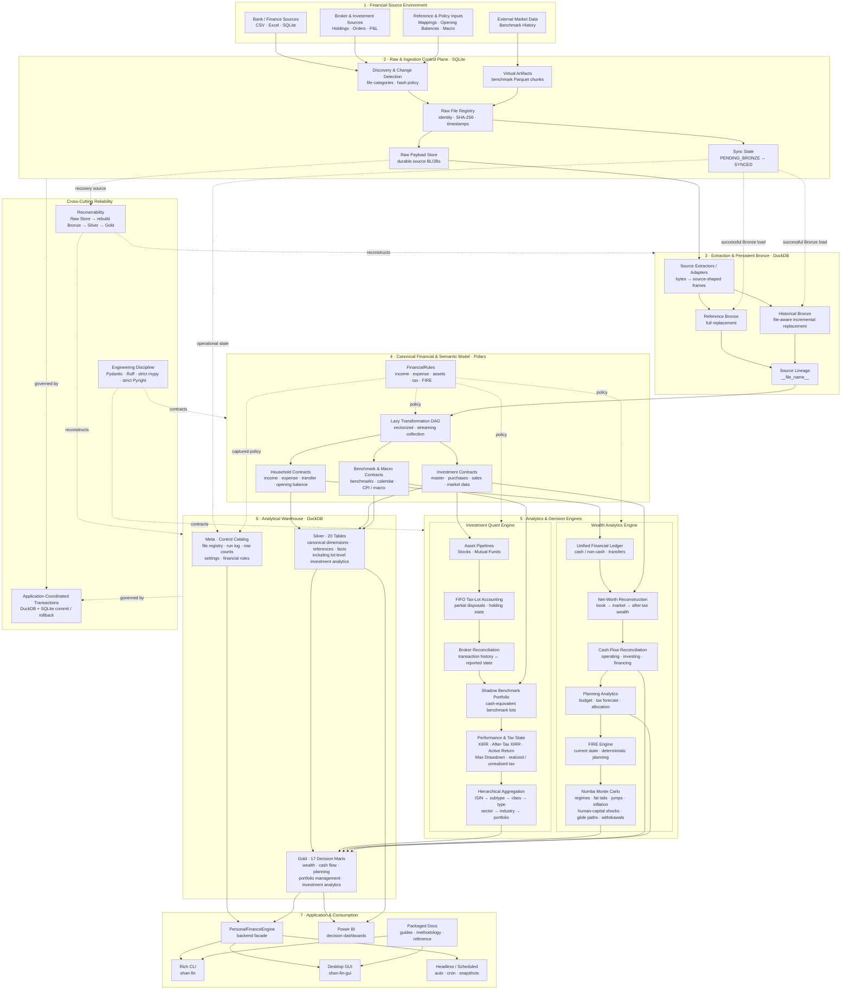
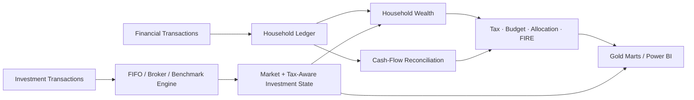

# Personal Finance ETL

**A local-first financial data engineering, BI, and quantitative decision-support platform.**

Built for real month-end close, investment accounting, portfolio analysis, cash-flow reconciliation, wealth tracking, and long-range financial planning.

[](https://pypi.org/project/personal-finance-etl/)


---

## Explore

[Why I built it](#why-i-built-it) ·
[Architecture](#architecture) ·
[Financial system](#one-financial-lineage) ·
[Engineering](#software-engineering) ·
[Run it](#running-the-project) ·
[Documentation](#documentation) ·
[Roadmap](#where-this-is-going)

---

## What is this?

`personal-finance-etl` is the production financial system I built after spreadsheets, bank data, broker statements, investment records, Power BI models, and planning calculations stopped being a sensible collection of separate workflows.

I wanted one system that could tell me:

> **What is actually happening with my money, why did it happen, and what does the current state imply for the decisions ahead?**

Things escalated slightly. 😅

Today the project combines five disciplines inside one end-to-end financial lineage:

| Discipline | What it looks like in the project |
| --- | --- |
| **Data engineering** | Durable raw-artifact persistence, change-aware ingestion, persistent Bronze, deterministic reconstruction, lineage, recovery, local analytical storage |
| **BI engineering** | Canonical financial semantics, explicit grains, 20 Silver contracts, 17 domain-oriented Gold marts, Power BI-ready serving state |
| **Python & software engineering** | Pydantic contracts, Polars LazyFrames, strategy/protocol seams, multiprocessing, backend/frontend separation, transactional orchestration, strict static analysis |
| **Finance** | Household accounting, cash/non-cash semantics, FIFO tax lots, broker reconciliation, tax-aware valuation, cash-flow reconciliation, budgeting and wealth modelling |
| **Quantitative planning** | XIRR, benchmark shadow portfolios, drawdown, deterministic FIRE and Numba-accelerated stochastic scenario modelling |

This is a **working vertical system built around my financial environment**, not a generic consumer-finance application. I use it for month-end closure, investment review, wealth monitoring and long-range planning.

The repository is also deliberately transparent about that boundary. A new developer can study or extend the architecture, but using it against a different financial environment today can require meaningful customization of source contracts, mappings and financial policy.

> New to the project? Start with the [Project Overview](docs/about/project.md), or enter the full [Documentation Portal](docs/README.md).

---

## Why I built it

The original problem was practical, not architectural.

I wanted a reliable month-end view of income, expenses, transfers, cash, investments and net worth without manually stitching together multiple financial sources.

That gradually expanded into a connected set of questions.

### Month-end close

Can I reconstruct household financial activity and reconcile the resulting balances?

### Wealth

How much of my wealth change came from savings, market movement, liquidity changes or liabilities?

### Investments

What do transaction history, current broker state, FIFO tax lots, benchmark-relative performance and tax exposure say together?

### Cash flow

Does classified operating, investing and financing activity actually explain the movement in my cash-pool balances?

### Planning

What do current savings, spending, tax exposure, allocation and wealth imply for the next decision?

### FIRE

What does the current state imply under deterministic assumptions, and how does that picture change across stochastic market, inflation, employment and withdrawal scenarios?

What began as ETL therefore became a **local financial data and decision-support platform**.

For the longer project story and philosophy, see [About the Project](docs/about/project.md).

---

## The system in one line

```text
Raw financial evidence
        ↓
Durable ingestion state
        ↓
Canonical financial model
        ↓
Investment + household analytics
        ↓
Tax-aware wealth & planning
        ↓
Decision-support marts
        ↓
Power BI • CLI • Desktop
```

The important part is not that each capability exists individually.

It is that they operate on the **same reconstructed financial state**.

---

## Architecture

The core design principle is:

> **Preserve raw evidence, model financial meaning explicitly, reconstruct derived state deterministically, and publish analytics at the grain required by the decision.**



The README deliberately keeps this as the **executive architecture view**. The full architecture suite now lives under [`docs/architecture/`](docs/architecture/README.md):

- [System Architecture](docs/architecture/system-architecture.md)
- [Data Lifecycle](docs/architecture/data-lifecycle.md)
- [Warehouse Architecture](docs/architecture/warehouse-architecture.md)
- [Data Model](docs/architecture/data-model.md)
- [Reliability & Recovery](docs/architecture/reliability-and-recovery.md)
- [Design Decisions](docs/architecture/design-decisions.md)

---

## Why SQLite + DuckDB + Polars?

Each technology has a deliberately narrow responsibility.

| Technology | Role |
| --- | --- |
| **SQLite** | Durable raw-document store, registry, hashes, payload BLOBs and synchronization state |
| **DuckDB** | Persistent Bronze/Silver/Gold/Meta analytical warehouse and BI-serving layer |
| **Polars** | Lazy/vectorized canonical transformation and analytical computation |
| **NumPy + Numba** | Numerically intensive stochastic simulation |
| **Pydantic** | Validated operational and financial-policy contracts |
| **PyXIRR** | Irregular dated cash-flow return calculations |
| **Rich** | CLI |
| **CustomTkinter** | Desktop application |
| **Power BI** | Decision-oriented analytical consumption |

I prefer explicit role separation over forcing one technology to own every workload.

The reasoning behind these choices is documented in [Design Decisions](docs/architecture/design-decisions.md).

---

## Analytical warehouse

The warehouse is Medallion-inspired, but each layer has a more specific contract.

```text
Raw
→ preserve evidence and ingestion/control state

Bronze
→ preserve extracted source-shaped analytical state

Silver
→ publish canonical financial and analytical state

Gold
→ publish decision-support marts

Meta
→ record operational and reproducibility context
```

### Silver

The current architecture publishes **20 Silver tables**:

- 11 dimensions/reference models
- 9 facts
- including `f_Investment_Analytics_Lot` at deep tax-lot analytical grain

### Gold

The current architecture publishes **17 Gold marts** across:

| Domain | Marts |
| --- | ---: |
| Wealth | 2 |
| Cash Flow | 4 |
| Planning | 3 |
| Portfolio Management | 1 |
| Investment Analytics | 7 |

Gold is deliberately **multi-grain**. Month, Month × Asset, Month × ISIN, Date × ISIN, Date × Class, Date × Portfolio and Date × ISIN × Tax Lot are different analytical questions.

For the physical warehouse contracts:

- [Silver Data Contracts](docs/reference/silver-data-contracts.md)
- [Gold Data Contracts](docs/reference/gold-data-contracts.md)
- [Meta Data Contracts](docs/reference/meta-data-contracts.md)

---

## One financial lineage

The investment engine, household model, tax model and FIRE engine are not independent calculators.

They connect.



That shared lineage is the core product idea.

---

## Investment analytics

The investment engine reconstructs state rather than merely calculating dashboard ratios.

```text
Canonical investment transactions
        ↓
Per-ISIN processing
        ↓
FIFO tax-lot inventory
        ↓
Broker reconciliation
        ↓
Shadow benchmark portfolio
        ↓
Historical market snapshots
        ↓
Tax-aware valuation
        ↓
XIRR / After-Tax XIRR / Benchmark XIRR
        ↓
Hierarchical portfolio analytics
```

The current serving contract focuses on measures I actually use:

- CAGR
- XIRR
- After-Tax XIRR
- Benchmark CAGR
- Benchmark XIRR
- Active Return
- Max Drawdown
- realized/unrealized tax state
- position and portfolio weights

Earlier versions carried a broader collection of institutional-style risk ratios. Those were deliberately pruned from the serving model.

**Compute richly. Publish selectively.**

For the actual methodology:

- [Investment Analytics](docs/finance/investment-analytics.md)
- [Tax Methodology](docs/finance/tax-methodology.md)
- [Metrics & Methodology](docs/finance/metrics-and-methodology.md)

---

## Household finance, cash flow & wealth

Income, expenses, transfers and opening balances are normalized into a common household financial model.

The system distinguishes concepts such as:

```text
cash vs non-cash income
cash vs non-cash expense
core vs broader spending
transfers vs external activity
book vs market wealth
liquid vs illiquid assets
gross vs after-tax investment value
```

The wealth engine reconstructs asset balances, overlays investment market state, and connects that state to household planning.

Cash-flow analytics independently reconcile classified operating, investing, financing and internal-transfer activity against actual cash-pool movement.

A dashboard can look plausible while failing to explain where the cash went. I would rather surface the difference.

See:

- [Financial Model](docs/finance/financial-model.md)
- [Cash Flow & Wealth](docs/finance/cashflow-and-wealth.md)

---

## FIRE & long-range planning

> **Planning guidance, not prophecy.**

FIRE has three conceptual layers:

```text
Current state
      ↓
Deterministic planning
      ↓
Stochastic scenario modelling
```

The stochastic engine can model:

- Bull/Bear/Stagflation regimes
- Markov regime transitions
- fat-tailed return shocks
- jump/crash events
- stochastic inflation
- human-capital and unemployment shocks
- glide paths
- portfolio drag
- dynamic withdrawal rules
- sequence-of-returns effects

The Gold contract exposes a curated set of outputs such as:

- P10 / P50 / P90 months to FI
- modelled probability of success
- base and stressed runway
- projected median FI date
- P50 nominal terminal wealth

These are **scenario outputs conditional on the configured model**, not predictions.

See:

- [FIRE Methodology](docs/finance/fire-methodology.md)
- [FIRE Configuration](docs/configuration/fire-configuration.md)

---

## Configuration & financial policy

The project deliberately separates two concerns.

### Operational settings

Describe **where and how the system runs**:

- source locations
- statement folders
- database locations
- mappings/reference inputs
- hash policy

### `FinancialRules`

Describe **what the financial model means**:

- income/expense semantics
- cash/non-cash treatment
- core expenses
- cash pools
- activity classifications
- investment classifications
- target allocations
- tax parameters
- FIRE assumptions
- market regimes
- human-capital shocks
- glide paths
- withdrawal policy

The long-term principle is:

> **Parameters belong in configuration. Genuinely different behaviour belongs behind adapters or strategies.**

See [Financial Rules](docs/configuration/financial-rules.md).

---

## Software engineering

This is a typed Python application, not a collection of finance notebooks.

The implementation uses:

- **Python 3.13+**
- **Pydantic** configuration contracts
- structural **Protocols** and strategy seams
- asset-specific pipelines behind common investment contracts
- builder-based analytical composition
- **Polars LazyFrames**
- multiprocessing and per-instrument process-pool execution
- a backend facade separated from CLI/desktop frontends
- coordinated SQLite/DuckDB transaction handling
- snapshot/recovery workflows
- **Ruff**
- **strict mypy**
- **strict Pyright**

The goal is not abstraction density.

Interfaces exist where behaviour genuinely varies.

Concrete code stays concrete where that makes the system easier to understand.

No Enterprise Java cosplay required.

For extension architecture:

- [Development Guide](docs/developer/development-guide.md)
- [Adding a Data Source](docs/developer/adding-data-sources.md)
- [Adding an Asset Pipeline](docs/developer/adding-asset-pipelines.md)
- [Adding a Gold Mart](docs/developer/adding-gold-marts.md)

---

## Reliability & recoverability

The pipeline coordinates local DuckDB and SQLite transactions at the application layer.

On failure, active work is rolled back and failed-run telemetry remains observable.

Persisted raw artifacts form a separate recovery boundary, allowing analytical state to be reconstructed when the Raw Store survives.

This is deliberately described as **application-coordinated transactional consistency**, not distributed two-phase commit.

That distinction matters.

See [Reliability & Recovery](docs/architecture/reliability-and-recovery.md).

---

## Running the project

> **Important:** installing the package does not make the current source contracts portable to an arbitrary financial environment.

Requires **Python 3.13+**.

### Install

```bash
pip install personal-finance-etl
```

### CLI

```bash
shan-fin
```

### Desktop

```bash
shan-fin-gui
```

### Development

```bash
git clone https://github.com/tks18/personal-finance-etl.git
cd personal-finance-etl
pip install -e .
```

A working deployment also requires valid operational configuration, FinancialRules, mappings/reference inputs and compatible source contracts.

For the real operating path:

- [Installation](docs/getting-started/installation.md)
- [Configuration](docs/getting-started/configuration.md)
- [Running the Pipeline](docs/getting-started/running-the-pipeline.md)

---

## Is this plug-and-play?

**No, not yet.**

The current implementation is a production system tailored to my financial environment.

Substantial parts are already reusable:

- Raw Store infrastructure
- state management
- orchestration
- Bronze synchronization patterns
- deterministic reconstruction
- canonical modelling patterns
- investment/wealth analytical engines
- application architecture
- much of the policy model

But another deployment can currently require customization of:

- bank/broker source contracts
- statement layouts
- source mappings
- asset pipelines
- financial classifications
- jurisdictional tax behaviour
- reconciliation policy
- selected analytical thresholds

I would rather document that boundary precisely than hide it behind "fully configurable" marketing.

---

## Where this is going

The long-term goal is a **configuration-, adapter-, and strategy-driven financial platform** that preserves the analytical behaviour I rely on today.

```text
Current vertical system
        ↓
Harden semantics & observability
        ↓
Version contracts & reproducibility
        ↓
Extract bank / broker / provider adapters
        ↓
Extract tax / reconciliation strategies
        ↓
Preserve canonical financial contracts
        ↓
Broader configuration-led deployment
```

The migration discipline is equally important:

```text
identify embedded assumption
        ↓
characterize current behaviour
        ↓
extract configuration / adapter / strategy
        ↓
run my current environment
        ↓
reconcile outputs
        ↓
adopt generalized path
```

The current working system is the behavioural baseline, not something I want to throw away in pursuit of a prettier abstraction.

See the full [Roadmap](docs/about/roadmap.md).

---

## Documentation

The documentation is now a first-class part of the repository rather than a handful of disconnected guides.

### Documentation portal

**[Open the full documentation →](docs/README.md)**

| Section | What it covers |
| --- | --- |
| 🚀 [Getting Started](docs/getting-started/README.md) | Installation, operational configuration and running the pipeline |
| 🏗️ [Architecture](docs/architecture/README.md) | System architecture, data lifecycle, warehouse, model, reliability and ADRs |
| 💰 [Finance & Methodology](docs/finance/README.md) | Financial model, metrics, investments, cash flow, tax and FIRE |
| ⚙️ [Configuration](docs/configuration/README.md) | FinancialRules and FIRE/Monte Carlo configuration |
| 🧑‍💻 [Developer](docs/developer/README.md) | Development conventions and extension workflows |
| 📖 [Reference](docs/reference/README.md) | Silver, Gold, Meta contracts and project glossary |
| 🧭 [About](docs/about/README.md) | Project philosophy, roadmap and the engineering journey behind it |

### A few good entry points

If you are a **data engineer**, start with [Data Lifecycle](docs/architecture/data-lifecycle.md).

If you are a **BI engineer**, start with [Data Model](docs/architecture/data-model.md) and [Gold Data Contracts](docs/reference/gold-data-contracts.md).

If you are a **Python developer**, start with [System Architecture](docs/architecture/system-architecture.md) and the [Development Guide](docs/developer/development-guide.md).

If you are interested in the **finance**, start with [Financial Model](docs/finance/financial-model.md).

If you are interested in the **quantitative planning**, start with [FIRE Methodology](docs/finance/fire-methodology.md).

If you want the **story behind the system**, read [Project Overview](docs/about/project.md) and [About Me](docs/about/about-me.md).

The same Markdown tree is intended to become the source for packaged application documentation and the future project Wiki.

---

## Engineering philosophy

A few principles keep showing up across the system.

### Preserve evidence

Raw financial artifacts survive independently from derived analytical state.

### Model meaning explicitly

Financial semantics belong in canonical contracts and validated policy, not scattered report formulas.

### Respect grain

Month, asset, ISIN, tax lot, category, class and portfolio are different analytical objects.

### Reconcile reality

Broker state, cash movement and analytical totals should be checked against independent evidence where possible.

### Rebuild derived state deliberately

Persistent Bronze supports deterministic Silver/Gold reconstruction and simpler correctness.

### Keep interfaces thin

CLI, desktop and Power BI consume the engine; they do not become competing implementations of financial logic.

### Compute richly. Publish selectively.

A calculation earns serving-layer real estate only when it helps the actual decision workflow.

### Generalize from working behaviour

I prefer extracting abstractions from a real vertical system over designing a universal framework before the variation exists.

---

## What this project demonstrates

This repository is intentionally one coherent system rather than a collection of disconnected portfolio demos.

**Data engineering**  
Stateful ingestion, durable raw evidence, incremental source history, deterministic reconstruction, lineage, recovery and analytical persistence.

**BI engineering**  
Canonical semantics, dimensional/reference modelling, explicit grain design, domain marts, reconciliation and decision-oriented serving contracts.

**Software architecture**  
Typed boundaries, configuration models, strategy seams, builder composition, process isolation, transactional orchestration and frontend/backend separation.

**Finance & quantitative modelling**  
Household accounting, investment lots, tax-aware valuation, benchmark-relative returns, cash-flow reconciliation, wealth planning and stochastic FIRE.

The interesting part is not the number of technologies involved.

It is that they share one end-to-end financial lineage.

---

## Project status

The project is actively used in my own financial workflow and continues to evolve.

The current architecture is a **purpose-built vertical implementation**, not the final form of the reusable platform I eventually want it to become.

That is part of the engineering story:

> **Build against a real workload. Understand the assumptions. Extract generality without sacrificing behaviour.**

---

## About the builder

I am a **Chartered Accountant who builds data-intensive software systems**, with my work increasingly sitting at the intersection of finance, data engineering, BI, Python software architecture and automation.

The longer story, including the path from web development through PyQuery, BI/Excel engineering, semantic systems and financial data engineering, lives in:

**[About Me →](docs/about/about-me.md)**

---

## Final note

This repository started because I wanted better visibility into my own finances.

It somehow ended up with a Raw Document Store, an analytical warehouse, FIFO tax-lot accounting, broker reconciliation, shadow benchmark portfolios, cash-flow reconciliation, typed financial policy, Power BI marts, a Numba Monte Carlo engine, a CLI, a desktop app, and enough documentation to explain why all of those things are in the same repository.

**Is this overengineered for personal finance?**

Almost certainly.

It is also genuinely useful every month.

That is the part that matters. 😎

---

## License

See the repository license for usage terms.
