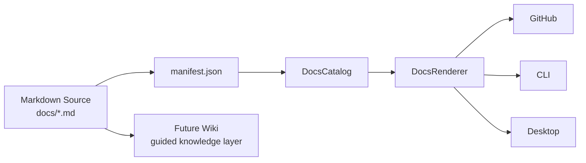
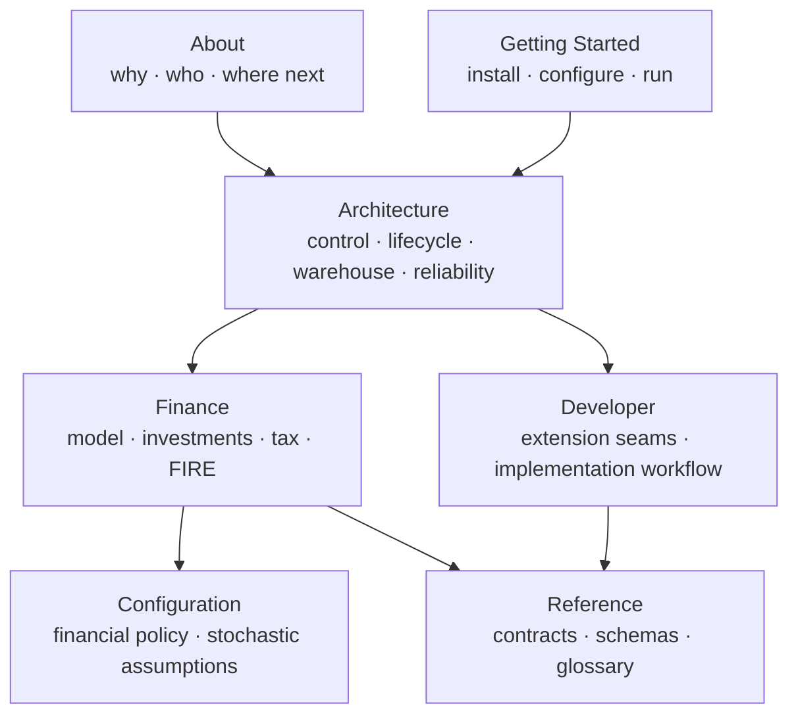

# Personal Finance ETL Documentation

This is the technical knowledge base for **Personal Finance ETL**.

The documentation follows the same rule as the codebase:

> **Show the system. Show the code. Show the financial meaning. Explain the decisions. Expose the trade-offs. Let the work speak for the skill.**

The repository documentation is version-controlled, packaged with the application, and discovered through `docs/manifest.json`.



The Markdown files remain the authoritative source.

---

## Documentation runtime

The application does not hard-code a list of guide files.

The manifest describes sections and pages:

```json
{
  "id": "architecture",
  "title": "Architecture",
  "order": 3000,
  "pages": [
    {
      "title": "System Architecture",
      "path": "architecture/system-architecture.md",
      "order": 3010
    }
  ]
}
```

`DocsCatalog` turns that manifest into application navigation:

```python
for section_data in manifest_data.get("sections", []):
    section_title = section_data.get("title", "")

    for page in section_data.get("pages", []):
        catalog.append(
            DocEntry(
                section=section_title,
                title=page.get("title", ""),
                path=page.get("path", ""),
                order=page.get("order", 9999),
            )
        )
```

One documentation structure therefore serves the repository, packaged distribution, CLI, and desktop application.

---

## Choose your route

| If you want to understand... | Start here |
| --- | --- |
| **Why the project exists** | [Project Overview](about/project.md) |
| **The whole platform** | [System Architecture](architecture/system-architecture.md) |
| **How 1,608+ source artifacts move through it** | [Data Lifecycle](architecture/data-lifecycle.md) |
| **SQLite Control Plane vs DuckDB warehouse** | [Warehouse Architecture](architecture/warehouse-architecture.md) |
| **Canonical finance and analytical grain** | [Data Model](architecture/data-model.md) |
| **FIFO, broker reconciliation and benchmarks** | [Investment Analytics](finance/investment-analytics.md) |
| **Household cash flow and wealth** | [Cash Flow & Wealth](finance/cashflow-and-wealth.md) |
| **Tax-aware investment state** | [Tax Methodology](finance/tax-methodology.md) |
| **FIRE and stochastic planning** | [FIRE Methodology](finance/fire-methodology.md) |
| **Financial policy** | [Financial Rules](configuration/financial-rules.md) |
| **How to extend the codebase** | [Development Guide](developer/development-guide.md) |
| **Physical Silver/Gold contracts** | [Reference](reference/README.md) |
| **How I ended up building this** | [About Me](about/about-me.md) |

---

## The documentation map



---

## Sections

### 🚀 Getting Started

Operate the current production application.

- [Getting Started Overview](getting-started/README.md)
- [Installation](getting-started/installation.md)
- [Configuration](getting-started/configuration.md)
- [Running the Pipeline](getting-started/running-the-pipeline.md)

### 🏗️ Architecture

Understand the system boundaries and execution model.

- [Architecture Overview](architecture/README.md)
- [System Architecture](architecture/system-architecture.md)
- [Data Lifecycle](architecture/data-lifecycle.md)
- [Warehouse Architecture](architecture/warehouse-architecture.md)
- [Data Model](architecture/data-model.md)
- [Reliability & Recovery](architecture/reliability-and-recovery.md)
- [Design Decisions](architecture/design-decisions.md)

### 💰 Finance & Methodology

Understand the financial state the software reconstructs.

- [Finance Overview](finance/README.md)
- [Financial Model](finance/financial-model.md)
- [Metrics & Methodology](finance/metrics-and-methodology.md)
- [Investment Analytics](finance/investment-analytics.md)
- [Cash Flow & Wealth](finance/cashflow-and-wealth.md)
- [Tax Methodology](finance/tax-methodology.md)
- [FIRE Methodology](finance/fire-methodology.md)

### ⚙️ Configuration

Understand what is policy rather than code.

- [Configuration Overview](configuration/README.md)
- [Financial Rules](configuration/financial-rules.md)
- [FIRE Configuration](configuration/fire-configuration.md)

### 🧑‍💻 Developer

Extend the platform without leaking source-specific behaviour downstream.

- [Developer Overview](developer/README.md)
- [Development Guide](developer/development-guide.md)
- [Adding a Data Source](developer/adding-data-sources.md)
- [Adding an Asset Pipeline](developer/adding-asset-pipelines.md)
- [Adding a Gold Mart](developer/adding-gold-marts.md)

### 📖 Reference

Inspect the physical analytical contracts.

- [Reference Overview](reference/README.md)
- [Silver Data Contracts](reference/silver-data-contracts.md)
- [Gold Data Contracts](reference/gold-data-contracts.md)
- [Meta Data Contracts](reference/meta-data-contracts.md)
- [Glossary](reference/glossary.md)

### 🧭 About

Understand the project, the engineering journey, and the roadmap.

- [About Overview](about/README.md)
- [Project Overview](about/project.md)
- [About Me](about/about-me.md)
- [Roadmap](about/roadmap.md)

---

## Reading by discipline

### Data Engineering

```text
System Architecture
→ Data Lifecycle
→ Warehouse Architecture
→ Reliability & Recovery
→ Silver / Gold Contracts
```

### Python / Software Architecture

```text
System Architecture
→ Design Decisions
→ Development Guide
→ extension guides
```

### BI Engineering

```text
Data Model
→ Metrics & Methodology
→ Gold Data Contracts
```

### Finance & Investment Analytics

```text
Financial Model
→ Investment Analytics
→ Tax Methodology
→ Cash Flow & Wealth
```

### Quantitative Planning

```text
Financial Model
→ FIRE Methodology
→ FIRE Configuration
```

---

## Documentation contract

Across the substantive guides, expect a consistent pattern:

```text
Concept
   ↓
Focused architecture diagram
   ↓
Real production implementation
   ↓
How it works
   ↓
Why I designed it this way
   ↓
Financial / analytical implications
   ↓
Failure modes and trade-offs
```

Production code is preferred over illustrative code.

When pseudocode is useful, it is labelled as conceptual.

The docs do not assign adjectives to the architecture. They expose the implementation and let the reader inspect it.

---

## Source of truth

The hierarchy is:

```text
Production code
      ↓
Persisted schema / contract
      ↓
Validated configuration
      ↓
Documentation
      ↓
Wiki / presentation layers
```

If documentation and implementation disagree, the implementation wins and the documentation should be corrected.

---

[← Repository README](../README.md)
