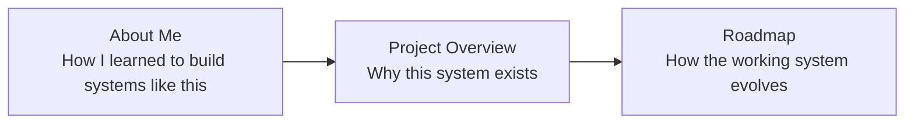

# About

This section is the narrative layer around Personal Finance ETL.

The rest of the documentation explains how the platform runs, how the data moves, how the financial model works, and how another developer can extend it.

These pages answer three different questions:

```text
Project
→ Why did I build this?

About Me
→ How did I end up building systems like this?

Roadmap
→ Where do I want to take it next?
```

Together they provide the context behind the architecture.

---

## Start here

| Guide | What it covers |
| --- | --- |
| [Project Overview](project.md) | Why Personal Finance ETL exists, what problem it solves, what it is today, and the philosophy behind the current vertical system |
| [About Me](about-me.md) | My engineering journey from web development into Python, data engineering, BI and software architecture, alongside Chartered Accountancy |
| [Roadmap](roadmap.md) | How I plan to harden and generalize the platform without sacrificing the financial behaviour I already rely on |

---

## Project Overview

[**Read `project.md` →**](project.md)

This is the story of the system itself.

It explains how a practical personal-finance problem grew into a local platform spanning:

- ingestion,
- financial modelling,
- investment analytics,
- cash-flow reconciliation,
- tax-aware wealth,
- BI,
- and FIRE.

It also explains an important boundary: the current project is a **working vertical implementation built around my financial environment**, not yet a universal plug-and-play personal-finance framework.

If you want to understand *why the architecture exists at all*, start here.

---

## About Me

[**Read `about-me.md` →**](about-me.md)

This is the story behind the builder rather than the repository.

It traces the path from:

```text
HTML / CSS / JavaScript
        ↓
Vue.js / React
        ↓
Python
        ↓
Data Analytics & Data Engineering
        ↓
BI Engineering & Automation
        ↓
Semantic / Local AI Systems
        ↓
Finance + Engineering
```

and connects that progression with my Chartered Accountancy qualification.

The document is grounded in the public projects that shaped that journey, including:

- PyQuery Legacy,
- PyQuery Core,
- PBI to SQL,
- XL Power Query Handler,
- Xlwings Excel API,
- Open Memory Lane,
- and Personal Finance ETL.

The point is not to turn the project documentation into a résumé.

It is to explain why certain engineering instincts keep appearing across the system:

- semantic boundaries,
- local-first architecture,
- reusable engines,
- multiple consumption surfaces,
- automation around real workflows,
- and a preference for assigning tools clear responsibilities rather than replacing useful business tools for technological purity.

---

## Roadmap

[**Read `roadmap.md` →**](roadmap.md)

The roadmap starts from one constraint:

> **The working system is the behavioural baseline.**

The long-term goal is to make the platform substantially more portable through:

- stronger reproducibility,
- explicit data contracts,
- bank/broker/provider adapters,
- asset-pipeline extension points,
- tax strategies,
- explicit reconciliation policy,
- and configuration-led deployment.

But the migration philosophy is deliberately incremental:

```text
working behaviour
      ↓
identify embedded assumption
      ↓
extract parameter / adapter / strategy
      ↓
run the current environment
      ↓
reconcile outputs
      ↓
adopt the generalized path
```

The destination is broader deployability without turning the current production system into a speculative rewrite.

---

## How these pages fit together



You can read them independently, but the natural sequence is:

1. [Project Overview](project.md)
2. [About Me](about-me.md)
3. [Roadmap](roadmap.md)

That sequence moves from the system, to the person behind it, to the future direction.

---

## Where to go next

If the About section gives you the context and you want the implementation:

- [System Architecture](../architecture/system-architecture.md)
- [Data Lifecycle](../architecture/data-lifecycle.md)
- [Financial Model](../finance/financial-model.md)
- [Design Decisions](../architecture/design-decisions.md)

If you want to extend the system:

- [Development Guide](../developer/development-guide.md)
- [Adding a Data Source](../developer/adding-data-sources.md)
- [Adding an Asset Pipeline](../developer/adding-asset-pipelines.md)

If you want the physical analytical contracts:

- [Silver Data Contracts](../reference/silver-data-contracts.md)
- [Gold Data Contracts](../reference/gold-data-contracts.md)
- [Meta Data Contracts](../reference/meta-data-contracts.md)

---

[← Documentation Home](../README.md)
