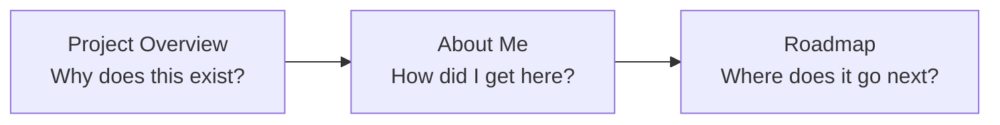

# About

This section explains the context around the code.

## Three different stories

| Guide | Question |
| --- | --- |
| [Project Overview](project.md) | Why did a personal-finance workflow become a full financial platform? |
| [About Me](about-me.md) | How did web development, Python, data engineering, BI and Chartered Accountancy converge into work like this? |
| [Roadmap](roadmap.md) | How does the working vertical system become more portable without sacrificing financial behaviour? |

These pages are intentionally more narrative than the technical documentation.

They still follow the same evidence rule: technical claims are grounded in projects and production implementation rather than portfolio adjectives.

## The project in one sentence

> **A real financial workload became the place where my finance, data engineering, BI, Python and software-architecture paths converged.**

[← Documentation Home](../README.md)
