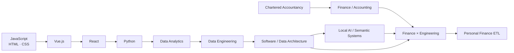
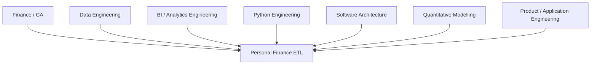

# About Me

I am a **Chartered Accountant who builds data-intensive software systems**.

That sentence makes more sense in hindsight than it would have at the beginning of my engineering journey.

I did not start with a plan to combine finance, data engineering, BI, Python, and software architecture.

I followed problems that kept pulling me toward that intersection.

---

## The path



The path was not linear.

That is probably why the projects are not all the same species.

---

## I started with web development

My early learning path moved through:

```text
JavaScript
HTML
CSS
Vue.js
React
```

That period taught me to think about:

- interfaces,
- state,
- user interaction,
- components,
- application structure.

I eventually found that the problems I wanted to spend more time on were increasingly data-heavy.

Python became the bridge.

---

## Python changed the direction

Python pulled me toward:

```text
data analytics
automation
data engineering
BI
software architecture
```

The questions became less about:

> How do I render this interface?

and more about:

> How should this data move, transform, persist, reconcile, and remain reusable?

That shift is visible across the repositories I have built.

---

## Excel and BI were not things I wanted to escape

A lot of engineering discourse treats Excel as something to graduate away from.

My experience was different.

Excel, Power Query, Power BI, Python, and databases often live in the same real workflow.

So several projects explore how those worlds can cooperate rather than compete.

For example, **`xlwings-excel-api`** is a modular Python–Excel–VBA automation framework that centralizes UDFs, Power Query helpers, and reusable transformation utilities across Excel/Power Query/Power BI. Its repository structure includes separate API, helper, and Power Query components rather than treating Excel automation as one monolithic macro.

That kind of work shaped an instinct I still use:

> **Meet users and workflows where they are, then improve the engineering underneath them.**

---

## Data engineering became the core niche

Over time, the projects moved closer to reusable data infrastructure.

The repositories I consider important in that journey include work around:

```text
PyQuery Core / PyQuery Legacy
Power BI → SQL workflows
Excel / Power Query handling
xlwings-based Excel APIs
local memory / semantic systems
```

The recurring questions are remarkably consistent:

```text
How do I make transformations reusable?
How do I formalize contracts?
How do I move logic out of fragile manual workflows?
How do I preserve user accessibility?
How do I make systems extensible without making them abstract for sport?
```

Personal Finance ETL inherits a lot of those instincts.

---

## Chartered Accountancy developed in parallel

At the same time, I completed Chartered Accountancy.

That gave me another way of looking at systems.

Finance/accounting repeatedly asks:

```text
What happened?
What evidence supports it?
Does it reconcile?
What is the economic meaning?
What assumptions are being made?
What is the decision consequence?
```

Those questions map surprisingly well onto good data engineering.

```text
evidence
→ lineage

reconciliation
→ data quality

financial classification
→ semantic modelling

controls
→ reliability

financial statements
→ serving contracts

audit trail
→ provenance
```

I do not see finance and engineering as separate halves anymore.

They frequently reinforce each other.

---

## Personal Finance ETL is where the paths converge

This project combines more of those threads than anything else I have built so far.



And the evidence is in the implementation:

### Data engineering

```text
SQLite Control Plane
content hashing
raw payload persistence
Bronze synchronization
deterministic rebuild
contract-driven publication
```

### Software/Python engineering

```text
Pydantic policy models
repositories
facades
asset pipelines
stateful FIFO
multiprocessing
strict typing
```

### BI engineering

```text
canonical semantics
explicit grain
Silver contracts
17 Gold marts
Power BI serving
```

### Finance

```text
household ledger
transfers
cash-flow reconciliation
tax lots
after-tax wealth
```

### Investment/quantitative work

```text
FIFO
broker reconciliation
shadow benchmark portfolios
XIRR
drawdown
Numba FIRE simulation
market regimes
human-capital shocks
```

I would rather show those things than describe myself with a stack of adjectives.

---

## The CA + engineering intersection changes how I build

A few examples:

### I care about reconciliation

Because a plausible total is not enough.

```text
reconstructed cash
vs
actual cash
```

and:

```text
reconstructed investment quantity
vs
broker quantity
```

are deliberate controls.

### I care about evidence

That instinct eventually became:

```text
SQLite raw payloads
artifact identity
content hashes
run provenance
```

### I care about semantic precision

That is why names such as:

```text
Outperformance_Probability
```

were hardened into:

```text
Outperforming_Lot_Ratio
```

when the old name implied more than the calculation actually meant.

### I care about grain

Because finance is full of calculations that are mathematically valid and economically wrong when aggregated incorrectly.

```text
Portfolio XIRR
≠ average(ISIN XIRR)
```

---

## I also enjoy building the tooling around the tool

Personal Finance ETL now has:

```text
CLI
desktop application
Power BI serving
packaged documentation
manifest-driven docs navigation
```

That is a recurring pattern in my work.

Once I build an engine, I tend to ask:

> How should somebody actually interact with this?

The answer is not always another web app.

Sometimes it is Excel.

Sometimes Power BI.

Sometimes a CLI.

Sometimes a local desktop surface.

The interface should fit the workflow.

---

## My engineering preferences

### Local-first when the problem allows it

I like architectures that can deliver substantial capability without creating infrastructure obligations the workload does not need.

### Explicit contracts

I prefer:

```text
grain
schema
policy
ownership
```

to remain inspectable.

### Real variation before abstraction

I do not want to create five strategies because a design-pattern diagram looks nice.

I want a strategy when I have genuinely different behaviour.

### Configuration for values, code for behaviour

This rule has become increasingly important as I build more configurable systems.

### Financial truth over architectural purity

If a refactor makes the class diagram prettier but changes the month-end answer without explanation, the refactor failed.

---

## What I am building toward

The longer-term direction across my work is increasingly about systems that are:

```text
configuration-led
local-first
semantically explicit
reusable
inspectable
AI-ready where useful
```

without losing the practical interfaces people already work with.

For Personal Finance ETL specifically, that means moving from:

```text
a deeply engineered vertical system for my environment
```

toward:

```text
a more portable financial data platform
```

through adapters, strategies, and configuration extracted from proven behaviour.

---

## Why this project is important in my portfolio

Different projects show different slices of how I think.

Personal Finance ETL is unusual because many of those slices are present at once.

It is:

```text
a financial system
a data pipeline
an analytical warehouse
a Python application
a BI backend
a quantitative simulator
an operational control system
```

but it still exists for one concrete reason:

> **I wanted a financial system I could trust and actually use.**

That practical constraint keeps the project grounded.

---

## Explore the evidence

Within this repository:

- [System Architecture](../architecture/system-architecture.md)
- [Data Lifecycle](../architecture/data-lifecycle.md)
- [Investment Analytics](../finance/investment-analytics.md)
- [Cash Flow & Wealth](../finance/cashflow-and-wealth.md)
- [FIRE Methodology](../finance/fire-methodology.md)
- [Developer Guide](../developer/development-guide.md)

External projects mentioned above should be evaluated from their own repositories and documentation rather than from this page alone.

[← About Home](README.md) · [← Documentation Home](../README.md)
