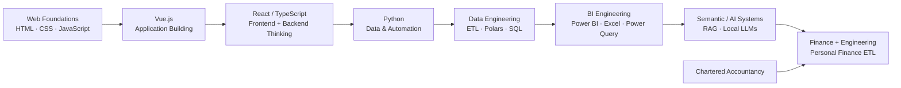

# About Me

I am a **Chartered Accountant who builds data-intensive software systems**.

That combination did not begin as a carefully planned career identity.

I started by learning how to build things on the web: HTML, CSS, JavaScript, then Vue.js and React. Over time, I became less interested in the interface alone and increasingly interested in the machinery underneath it:

- where the data comes from,
- how it is ingested,
- how messy inputs become reliable state,
- how semantics survive transformation,
- how analytical logic should be structured,
- how repetitive workflows can become reusable systems,
- and how one engine can serve many different interfaces.

Python eventually became the language in which those questions clicked for me.

Data analytics led into data engineering. Data engineering led deeper into software architecture, BI engineering, automation, semantic modelling, and local AI systems.

At the same time, I completed my Chartered Accountancy qualification.

Those paths eventually converged.

Today, the work I enjoy most sits somewhere in the intersection of:

```text
Finance
   +
Data Engineering
   +
Analytics Engineering
   +
BI Engineering
   +
Python / Software Architecture
   +
Automation
```

I did not arrive at that intersection by collecting technologies.

I arrived there by repeatedly finding workflows that annoyed me enough to engineer them properly.

---

## How I got here

My public projects preserve a surprisingly good record of how my engineering interests evolved.



The technologies changed, but several instincts remained.

I still think about:

- application boundaries,
- user-facing workflows,
- backend engines,
- packaging,
- reusable components,
- and multiple consumption surfaces.

What changed was the center of gravity.

I moved from asking:

> **How do I build this interface?**

toward asking:

> **How should the system underneath it actually work?**

---

## From applications to engines

My earlier software work taught me to think in applications.

Later projects increasingly taught me to think in **engines, contracts, state, semantics, and extension boundaries**.

The clearest example is PyQuery.

## PyQuery Legacy

[PyQuery Legacy](https://github.com/PyQuery-HQ/pyquery-legacy) grew into a broad local-first data application around Polars.

It explored a large surface:

```text
ETL
EDA
SQL
ML
CLI
UI
API
SDK
Headless Automation
```

Underneath that surface were engineering problems I kept returning to:

- lazy execution,
- streaming I/O,
- file-level isolation,
- broken/mixed-encoding source handling,
- recursive discovery,
- typed transformation parameters,
- transform registries,
- source metadata,
- reusable recipes,
- and automation.

PyQuery Legacy was ambitious, sometimes excessively so.

That is part of why it matters to my engineering journey.

It was a laboratory where I learned not only what I could build, but also where boundaries start to matter.

---

## PyQuery Core

[PyQuery Core](https://github.com/PyQuery-HQ/pyquery-core) represents an important architectural shift.

Instead of continuing to let the engine live inside the larger application ecosystem, I extracted the reusable backend into a dedicated headless package.

Its public architecture separates concerns such as:

```text
pyquery_core.io
pyquery_core.transforms
pyquery_core.analytics
pyquery_core.recipes
pyquery_core.jobs
```

and builds around:

- Polars LazyFrames,
- Pydantic validation,
- deterministic step-based pipelines,
- transform registration,
- serializable recipes,
- and background execution.

That transition captures an important change in how I think.

Earlier, the instinct was often:

> **How much can this application do?**

Increasingly, the question became:

> **What is the reusable core, and what should depend on it?**

That question now appears throughout my newer projects.

---

## I like engineering around real business tools

I have never been particularly interested in replacing Excel or Power BI merely because they are not fashionable engineering platforms.

They are extremely capable business tools.

The interesting problem is often:

> **How do I give them better engineering infrastructure?**

Two projects make that especially visible.

---

## XL Power Query Handler

[XL Power Query Handler](https://github.com/tks18/xl-pq-handler) treats reusable Power Query code as something closer to a managed software artifact.

Instead of leaving `.pq` functions as snippets copied between workbooks, the project organizes them around concepts such as:

- metadata,
- categories,
- tags,
- descriptions,
- versions,
- dependencies,
- indexing,
- search,
- extraction,
- validation,
- insertion,
- and Excel synchronization.

That project reflects one of my recurring instincts:

```text
useful business logic
        ↓
make it reusable
        ↓
attach metadata
        ↓
understand dependencies
        ↓
index it
        ↓
automate its lifecycle
```

The goal is not to replace Power Query.

It is to make working with reusable Power Query logic feel more like software engineering.

---

## Xlwings Excel API

[Xlwings Excel API](https://github.com/tks18/xlwings-excel-api) pushes the same idea across Python, Excel, VBA, Power Query, and Power BI.

It centralizes:

- Python-backed Excel UDFs,
- VBA integration,
- text/table/data helpers,
- reusable Power Query functions,
- query metadata,
- and automation workflows.

The project structure separates reusable API functions, helpers, and a Power Query repository.

The interesting part for me is the boundary.

Excel remains the user-facing environment where it makes sense.

Python becomes the reusable engineering layer behind it.

I do not see those technologies as competitors.

I see them as different parts of the same workflow.

---

## BI models are data systems too

[PBI to SQL](https://github.com/tks18/pbi-to-sql) came from another question I find interesting:

> **Why should the meaning inside a Power BI semantic model remain trapped inside Power BI?**

The project parses TMDL and reconstructs the model in SQL.

That includes:

- tables,
- columns,
- relationships,
- Power BI-to-SQL type mapping,
- foreign-key reconstruction,
- dependency handling,
- and semantic metadata.

The architecture separates:

```text
Adapters
Services
Pipelines
Configuration
```

and exposes different execution paths for:

```text
Full ingestion
Schema only
Data only
Semantic analysis
```

The project then adds a local semantic/AI layer using LangChain, Ollama, and small local language models.

The AI layer generates context such as:

- model summaries,
- table purpose,
- important fields,
- fact/dimension roles,
- relationship meaning,
- and structured semantic descriptors.

Those semantics are persisted back into SQL.

That project sits at an intersection I keep returning to:

```text
BI
   +
Data Modelling
   +
SQL
   +
Data Engineering
   +
Semantic Metadata
   +
Local AI
```

What interests me about AI here is not adding a chatbot to a dashboard.

It is making the structure and meaning of an analytical system available to machines as well as humans.

---

## I keep building local-first systems

Another pattern across my work is a preference for local-first architecture where the problem allows it.

PyQuery is local-first.

Personal Finance ETL is local-first.

PBI to SQL uses local SQL and local model infrastructure.

[Open Memory Lane](https://github.com/tks18/open-memory-lane) is another example.

That project explores a memory-efficient, open implementation of the useful idea behind Windows Recall.

The problem is not simply:

> take screenshots forever.

The more interesting engineering question is:

> **How do I preserve useful evidence without treating storage and compute as infinite?**

The project uses ideas around:

- screenshot capture,
- WebP storage,
- perceptual change detection,
- OpenCV,
- SQLite metadata,
- application/window/session context,
- background processing,
- generated clips,
- daily summaries,
- timeline navigation,
- and export for further analysis.

Once again, the pattern is familiar:

```text
capture evidence
      ↓
avoid unnecessary duplication
      ↓
structure metadata
      ↓
persist locally
      ↓
make it queryable
      ↓
build useful interfaces over it
```

---

## The pattern I see across my projects

Looking across these repositories, I do not think the common thread is Python, Polars, Power BI, or any other individual technology.

The common thread is the kind of problem I tend to notice.

## Messy inputs become structured systems

I repeatedly start from environments that are difficult to reason about directly:

- folders of inconsistent files,
- Power Query snippets,
- Power BI semantic models,
- Excel automation,
- financial statements,
- broker records,
- or streams of screen activity.

My instinct is usually to introduce a structure between the messy input and the eventual consumer.

---

## I build semantic boundaries

A recurring architecture looks like:

```text
messy / tool-specific input
        ↓
ingestion / adapter
        ↓
structured representation
        ↓
canonical / semantic model
        ↓
reusable engine
        ↓
consumer
```

That pattern appears in different forms across PyQuery, PBI to SQL, my Excel tooling, and Personal Finance ETL.

---

## I automate boundaries, not only calculations

I am interested in more than making one calculation faster.

I tend to automate the lifecycle around it:

- discovery,
- ingestion,
- metadata,
- dependency handling,
- validation,
- persistence,
- execution,
- publication,
- and consumption.

That is probably why many of my projects grow from scripts into systems.

---

## I prefer engines with multiple surfaces

Another recurring pattern is:

```text
Reusable Engine
      ↓
CLI
GUI
API
SDK
BI
Automation
```

Not every project needs every surface.

But I generally prefer the business logic to sit behind the interface rather than inside it.

My web-development background never really disappeared.

It evolved into an instinct for separating the system from the way people interact with it.

---

## I care about resource constraints

Many of my projects are designed around ordinary local hardware.

That has pushed me toward:

- lazy execution,
- streaming,
- file-level processing,
- efficient local databases,
- selective persistence,
- perceptual deduplication,
- process isolation,
- and local models.

I like architectures that understand the machine they are running on.

"Just add more infrastructure" is rarely my first answer.

---

## I tend to preserve useful tools rather than replace them

Excel, Power Query, Power BI, SQLite, DuckDB, Polars, Python, and local LLMs can all coexist when they have clear responsibilities.

I am less interested in technology purity than in building a workflow that makes sense.

The question is usually not:

> **Which tool wins?**

It is:

> **Which tool should own this responsibility?**

---

## Where finance entered the picture

While this engineering path was evolving, I completed my **Chartered Accountancy qualification**.

That did not replace the software path.

It gave it another dimension.

Finance is a domain where terminology, grain, reconciliation, evidence, period treatment, classification, and methodology matter enormously.

Those concerns map naturally onto the parts of engineering I had already become interested in:

```text
Financial evidence
        ↕
Data lineage

Accounting classification
        ↕
Canonical semantics

Reconciliation
        ↕
Data quality

Financial statements
        ↕
Analytical models

Controls
        ↕
Reliability

Planning assumptions
        ↕
Configuration

Management information
        ↕
BI / serving contracts
```

I do not think finance and engineering are separate skill sets that happen to sit next to each other for me anymore.

The interesting work happens where they overlap.

---

## Personal Finance ETL: where the threads converge

[Personal Finance ETL](https://github.com/tks18/personal-finance-etl) is probably the clearest convergence of those paths so far.

It began with a practical question:

> **Where exactly do I stand financially?**

Answering that properly eventually required:

- source-state management,
- raw evidence persistence,
- incremental ingestion,
- canonical financial modelling,
- DuckDB,
- SQLite,
- Polars,
- FIFO tax lots,
- broker reconciliation,
- benchmark shadow portfolios,
- tax-aware valuation,
- household cash-flow reconciliation,
- Power BI serving marts,
- FIRE modelling,
- Monte Carlo simulation,
- CLI and desktop surfaces,
- and a documentation architecture substantial enough to explain the thing.

The technology is not the point.

The important part is that the system connects:

```text
what happened
      ↓
what it means financially
      ↓
where I stand now
      ↓
what decisions the current state supports
```

That is the kind of system I most enjoy building.

---

## Finance changes how I think about data engineering

Financial systems make certain engineering shortcuts difficult to ignore.

A number can be technically valid and financially wrong.

A join can execute perfectly and destroy grain.

A total can reconcile while the underlying classification is wrong.

A return can be mathematically correct at one grain and meaningless at another.

A simulation can be sophisticated and still answer the wrong question.

That is why I increasingly care about:

- grain,
- lineage,
- reconciliation,
- canonical semantics,
- explicit assumptions,
- observed versus modelled state,
- and methodology.

Those are data-engineering concerns.

They are also finance concerns.

For me, that overlap is the interesting bit.

---

## Engineering changes how I think about finance

The influence also runs in the other direction.

Engineering encourages me to ask:

- Can this methodology be made explicit?
- Can this assumption be configured?
- Can this calculation be reproduced?
- Can this source be traced?
- Can this state be rebuilt?
- Can the consumer understand the grain?
- Can another implementation satisfy the same contract?
- Can I separate parameters from behaviour?

That mindset turns a spreadsheet calculation into something closer to a financial system.

---

## How my architecture thinking evolved

I can see a progression across my own projects.


I still enjoy features.

But increasingly, I am interested in the boundary that lets the next feature exist without making the system worse.

That is why newer projects spend more attention on:

- protocols,
- strategies,
- adapters,
- registries,
- typed configuration,
- canonical contracts,
- persistence boundaries,
- and explicit analytical grains.

---

## What I am still learning

I do not consider this progression finished.

There are areas in my own projects that I want to improve:

- removing abstractions that no longer earn their complexity,
- improving failure visibility,
- strengthening reproducibility metadata,
- making semantic names more precise,
- extracting purpose-built assumptions behind cleaner adapters/strategies,
- and learning where **not** to generalize.

Some of my older projects also show the opposite failure mode: adding too much because it was interesting.

That is useful history too.

PyQuery Legacy taught me a lot about capability.

Its later evolution helped teach me about boundaries.

Personal Finance ETL is now teaching me about preserving a working vertical system while generalizing it carefully.

I expect the next projects to teach me something else.

---

## The kind of systems I enjoy building

The projects I keep returning to tend to share a few properties.

They usually involve:

- messy real-world data,
- a workflow that is too manual,
- an existing tool worth preserving,
- meaningful domain semantics,
- performance or resource constraints,
- multiple ways of consuming the result,
- and enough complexity that a one-off script eventually becomes uncomfortable.

That is usually the point where I start having fun. 😄

---

## My current technical intersection

If I had to describe the engineering space I occupy today, I would use:

```text
Chartered Accountancy / Finance
              +
Data Engineering
              +
Analytics & BI Engineering
              +
Python Software Architecture
              +
Automation
              +
Semantic / Local AI Systems
```

Not because every project uses every discipline.

Because my most interesting projects increasingly draw from several of them at once.

---

## Selected projects

| Project | What it represents in my journey |
| --- | --- |
| [PyQuery Legacy](https://github.com/PyQuery-HQ/pyquery-legacy) | Large-scale experimentation with local-first ETL, analytics, automation, multiple interfaces, and Polars |
| [PyQuery Core](https://github.com/PyQuery-HQ/pyquery-core) | Architectural extraction of a reusable typed data engine from the broader application |
| [PBI to SQL](https://github.com/tks18/pbi-to-sql) | BI semantic modelling meeting SQL, data engineering, and local AI |
| [XL Power Query Handler](https://github.com/tks18/xl-pq-handler) | Treating Power Query functions as managed, metadata-rich software artifacts |
| [Xlwings Excel API](https://github.com/tks18/xlwings-excel-api) | Engineering a reusable Python/VBA/Power Query layer behind Excel workflows |
| [Open Memory Lane](https://github.com/tks18/open-memory-lane) | Local-first, resource-aware capture and metadata engineering |
| [Personal Finance ETL](https://github.com/tks18/personal-finance-etl) | Convergence of finance, data engineering, BI, software architecture, and quantitative planning |

---

## The shortest version

I started by learning how to build software people interact with.

Then I became increasingly interested in the systems underneath those interfaces: how data is ingested, transformed, modelled, automated, persisted, and exposed.

Python and data engineering became the center of that work.

Chartered Accountancy gave that engineering path a domain where correctness, semantics, reconciliation, and evidence matter deeply.

Today, I build at that intersection.

And apparently, when a workflow annoys me enough, there is a non-zero probability that it eventually becomes an architecture diagram. 😅

---

## Explore further

- [Project Overview](project.md)
- [Roadmap](roadmap.md)
- [System Architecture](../architecture/system-architecture.md)
- [Design Decisions](../architecture/design-decisions.md)

[← About Home](README.md) · [← Documentation Home](../README.md)
