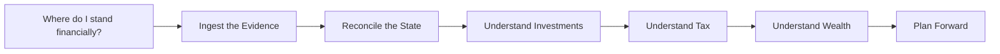
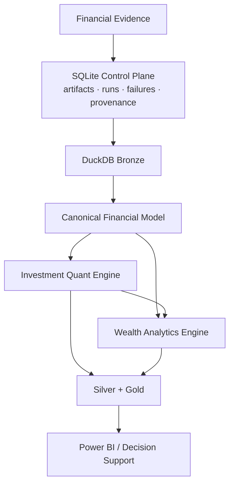
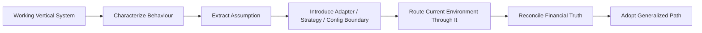

# Project Overview

Personal Finance ETL began with a personal question:

> **Can I reconstruct my financial state well enough to trust it at month-end and use it for real investment and long-term planning decisions?**

The answer eventually required much more than importing statements.



The project grew because each answer exposed the next missing layer.

---

## From files to financial state

A raw transaction is evidence.

It is not yet a financial model.

A broker snapshot is evidence.

It is not yet portfolio history.

A market price is evidence.

It is not yet performance.

The system therefore evolved around a progression:

```text
Evidence
   ↓
Canonical Financial Meaning
   ↓
Reconstructed State
   ↓
Reconciliation
   ↓
Decision Support
```

That progression remains the project's core.

---

## The production workload changed the engineering problem

As of **24 September 2026**, my production source environment contains **1,608 source artifacts**.

It includes:

```text
stock broker snapshots
mutual-fund broker snapshots
historical transaction files
market/reference files
masters and mappings
opening-state inputs
my personal-finance SQLite database
```

Broker history grows by roughly:

```text
1 stock snapshot/day
+
1 mutual-fund snapshot/day
=
~2 additional artifacts/day
```

That scale is one reason the project now has:

```text
content hashing
an authoritative SQLite Control Plane
persistent raw payloads
change-aware synchronization
persistent Bronze
file-aware replacement
deterministic downstream rebuilds
```

Those mechanisms were not added to decorate an architecture diagram.

The workload made them useful.

---

## The current architecture



The defining ownership rule is:

> **SQLite owns operational truth and raw evidence. DuckDB owns analytical state.**

That separation emerged through production hardening rather than from trying to imitate a large enterprise platform.

---

## What the system now does

### Data engineering

```text
discover
→ identify
→ hash
→ persist evidence
→ synchronize Bronze
→ rebuild canonical state
→ publish analytical contracts
```

### Household finance

```text
opening state
+ income
- expense
± transfers
→ book wealth
→ market wealth
→ after-tax wealth
```

### Investment analytics

```text
transactions
→ FIFO lots
→ broker reconciliation
→ shadow benchmark
→ tax-aware state
→ XIRR / drawdown
→ portfolio hierarchy
```

### Planning

```text
current wealth
+ spending
+ savings
+ financial policy
→ deterministic FI
→ stochastic FIRE
```

The value of the project comes from those domains sharing one lineage.

---

## Why reconciliation matters so much

I did not want a dashboard that merely looked plausible.

I wanted the model to be challengeable by independent state.

Examples:

```text
reconstructed investment quantity
vs
broker-reported quantity
```

and:

```text
calculated closing cash
vs
actual cash-pool closing state
```

A mismatch remains information.

It should not be hidden merely to make a report cleaner.

That philosophy influences both the finance and data-engineering sides of the project.

---

## Why the project is local-first

The data is personal and financially sensitive.

The workload is also entirely manageable on a local workstation.

So the system uses:

```text
SQLite
DuckDB
Polars
NumPy / Numba
Python
Power BI
```

without requiring cloud infrastructure to coordinate the core financial workflow.

Local-first is therefore both a privacy choice and an architectural fit.

---

## Why the project is not "fully configurable" yet

The current system is production software for my financial environment.

It already has reusable architecture:

```text
Control Plane
Raw/Bronze lifecycle
canonical contracts
investment engine
wealth engine
contract registry
application surfaces
documentation runtime
```

But source-specific assumptions remain around:

```text
bank/broker formats
mappings
statement layouts
asset behaviour
tax jurisdiction
reconciliation policy
```

Another developer can extend the system, but should expect meaningful customization.

I prefer documenting that boundary explicitly over calling the current vertical implementation universal.

---

## The long-term direction

The goal is not to discard the working system and design a framework from scratch.

It is to extract generality from behaviour that is already proven.



The current production outputs remain the behavioural baseline.

That is how I want portability to evolve.

---

## Production hardening as a design loop

One of the most useful phases of the project came from documenting it deeply.

The first documentation archaeology exposed places where the implementation could become cleaner.

That fed directly into the 6.2.x hardening cycle:

```text
code
→ documentation
→ architectural insight
→ refactor
→ reconcile
→ better code
→ better documentation
```

The result included:

- a redesigned Control Plane,
- explicit run lifecycle,
- structured failures,
- content-addressed configuration provenance,
- lean DuckDB Meta,
- explicit Data Contract Registry,
- hardened worker failure semantics,
- pruned unused metrics,
- manifest-driven documentation.

The production workload also moved from roughly **23 seconds** end-to-end to approximately **14–17 seconds** on my environment while preserving the financial outputs I rely on.

The benchmark is environment-specific.

The more important result was architectural clarity.

---

## Why this project matters to me

This system is not a portfolio project invented to demonstrate a stack.

I use it.

It supports:

```text
month-end financial closure
investment review
tax-aware portfolio understanding
cash-flow analysis
wealth tracking
FIRE planning
```

That creates a useful engineering constraint:

> **The architecture has to survive contact with my own financial truth.**

A broken demo is embarrassing.

A broken month-end close is immediately useful feedback. 😄

---

## What I want the repository to demonstrate

I do not want the documentation to tell readers:

```text
this project proves strong data engineering
this project proves finance knowledge
this project proves Python skill
```

The repository should make those conclusions inspectable.

That is why the current documentation shows:

- production code,
- physical contracts,
- grains,
- formulas in renderer-safe form,
- failure paths,
- financial methodology,
- trade-offs,
- limitations.

The work should carry the claim.

---

## Project principles

### Preserve evidence

Derived state can be rebuilt.

Original financial evidence deserves a stronger durability boundary.

### Respect grain

A correct formula at the wrong grain is still financially wrong.

### Reconcile against independent truth

A model becomes more useful when something outside the model can challenge it.

### Keep policy explicit

Financial assumptions should not hide in presentation literals.

### Use the compute model that fits

Polars, stateful Python, multiprocessing, and Numba solve different problems.

### Compute selectively

A metric earns production cost because it supports a decision.

### Generalize from working behaviour

I would rather extract an abstraction from a system I use than design a universal framework before the variation exists.

---

## Explore the project

- [System Architecture](../architecture/system-architecture.md)
- [Financial Model](../finance/financial-model.md)
- [Investment Analytics](../finance/investment-analytics.md)
- [FIRE Methodology](../finance/fire-methodology.md)
- [About Me](about-me.md)
- [Roadmap](roadmap.md)

[← About Home](README.md) · [← Documentation Home](../README.md)
