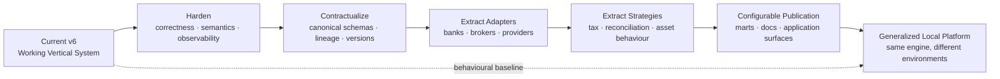
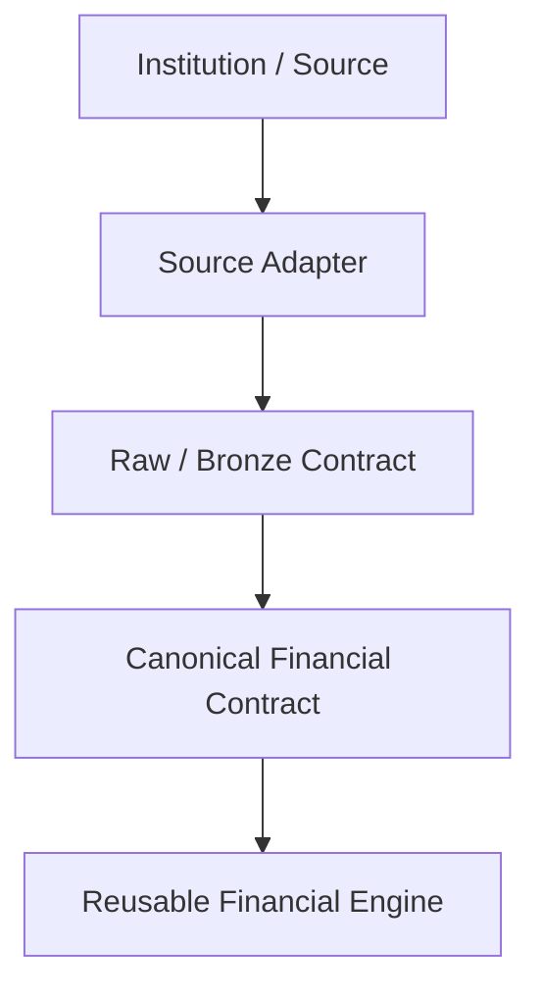
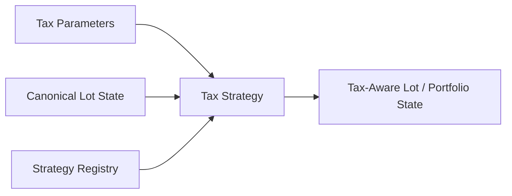
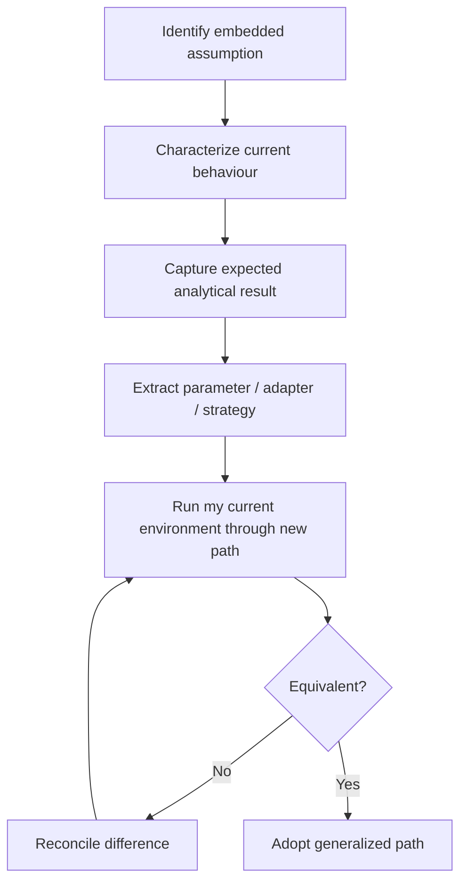

# Roadmap

Personal Finance ETL is already a working vertical financial platform.

My roadmap is **not** to replace that working system with a speculative generic framework.

The long-term goal is more disciplined:

> **Preserve the financial behaviour I already rely on, then progressively extract source-specific, jurisdiction-specific, and user-specific assumptions behind configuration, canonical contracts, adapters, and strategies.**

The destination is a platform that can reproduce my current results through configuration while becoming substantially easier for another developer to adapt to a different financial environment.

---

## Roadmap at a glance



The current production implementation remains the behavioural reference throughout that evolution.

---

## What I am optimizing for

The roadmap is guided by several priorities.

## Preserve real usefulness

The project exists because it solves my month-end close, investment analysis, cash-flow, wealth, and FIRE planning problems.

Generalization is valuable only if the system remains useful.

## Preserve analytical equivalence

When I extract an assumption into configuration or a strategy, I want my current financial environment to produce equivalent results unless I intentionally change methodology.

## Improve portability honestly

I want another developer to be able to understand what must be configured, what must be adapted, and what is reusable.

I do not want to advertise a turnkey universal finance engine before that is true.

## Reduce hidden assumptions

Source contracts, tax behaviour, thresholds, and policy should become increasingly explicit.

## Keep the architecture local-first

The project does not need cloud infrastructure merely to look more "platform-like."

The local architecture is a deliberate strength for this workload.

---

## Current state: a working vertical system

The current v6 architecture already has substantial reusable structure.

## Reusable infrastructure

- Raw Document Store,
- source registry and synchronization state,
- Bronze persistence patterns,
- orchestration,
- DuckDB warehouse lifecycle,
- deterministic Silver/Gold reconstruction,
- application facade,
- CLI/desktop execution,
- snapshots,
- documentation architecture.

## Reusable analytical foundations

- canonical household modelling,
- investment asset-pipeline seam,
- FIFO tax-lot engine,
- benchmark shadow portfolio,
- return aggregation,
- wealth reconstruction,
- cash-flow reconciliation,
- FIRE simulation.

## Already configurable

- many household classifications,
- cash/non-cash semantics,
- budget allocations,
- cash pools,
- target allocations,
- tax parameters,
- macro assumptions,
- FIRE assumptions,
- stochastic-model parameters,
- file hashing policy.

## Still purpose-built

- bank/broker source contracts,
- source categories,
- statement layouts,
- some mappings and transformations,
- Indian tax behaviour,
- selected reconciliation policy,
- selected thresholds,
- and parts of analytical publication.

That last category defines much of the roadmap.

---

## Phase 1 · Harden the current vertical

Before making the engine broader, I want the current vertical to become even more explicit and robust.

## Worker-failure visibility

Per-ISIN investment workers should not be able to fail silently while the portfolio appears complete.

The future policy should make partial failure explicit:

```text
instrument succeeds
        or
instrument failure is surfaced with identity/context
```

Whether the system ultimately fails fast or supports an explicit partial-result mode should be a deliberate choice.

## Semantic naming cleanup

Fields whose names overstate methodology should be corrected.

Examples identified during the v6 audit include:

```text
Outperformance_Probability
```

which is closer to an outperforming-lot ratio, and:

```text
ISIN_Monthly_Return
```

which is closer to market-value percentage change than a fully cash-flow-adjusted return.

Names are part of the analytical contract.

## Remove residual analytical machinery

Older risk calculations that no longer support the current Gold contract should be removed or simplified where nothing consumes them.

The principle is:

> **Do not pay complexity rent for metrics I deliberately stopped using.**

## Move remaining policy thresholds into the right boundary

For example, the current portfolio rebalance tolerance is still approximately five percentage points in code.

If that threshold is intended to be user policy, it belongs in validated FinancialRules.

Not every constant needs configuration, but policy should not be accidentally hard-coded.

---

## Phase 2 · Strengthen reproducibility

The Raw Store already provides strong recoverability.

The next step is stronger **historical reproducibility context**.

## Version fingerprints

Meta can evolve to capture concepts such as:

```text
application_version
git_commit
schema_version
rules_schema_version
settings_hash
financial_rules_hash
data_contract_version
```

This would make it easier to answer:

> Why does rebuilding the same raw evidence today differ from a historical run?

## Explicit run manifest

A future run manifest could connect:

```text
source artifacts
      +
configuration fingerprint
      +
financial-rules fingerprint
      +
application/schema version
      +
published contracts
```

into one reproducibility record.

## Stronger assumption provenance

Important modelled values could eventually carry provenance such as:

```text
OBSERVED
CONFIGURED
REFERENCE
FALLBACK
RECONCILED
ESTIMATED
SIMULATED
```

That would make analytical interpretation stronger, especially around tax and planning.

---

## Phase 3 · Formalize data contracts

The documentation now describes Silver, Gold, and Meta explicitly.

A future step is to make those contracts first-class in code.

## Shared contract registry

A contract specification could eventually describe:

```yaml
Core_Monthly_Fact:
  layer: gold
  domain: wealth
  grain:
    - MONTH_START_DATE
  producer: WealthPresentationEngine
```

The registry could become useful for:

- publication mapping,
- schema validation,
- Meta lineage,
- row-count registration,
- documentation generation,
- application navigation,
- and contract versioning.

## Why I am not doing this immediately

The physical contracts should stabilize first.

A registry introduced too early becomes another layer that must constantly be synchronized with code.

I want it to become authoritative only when that reduces duplication rather than creating more of it.

---

## Phase 4 · Extract source adapters

This is the largest step toward portability.

The current source implementation knows my bank/broker environment.

The target architecture is:



## Bank adapters

A bank adapter should own:

- institution-specific source parsing,
- statement layout,
- source-specific normalization,
- and mapping into canonical household transactions.

The wealth engine should not know which bank produced the transaction.

## Broker adapters

A broker adapter should own:

- broker statement/order formats,
- holdings/current-state extraction,
- source-specific instrument identifiers,
- and mapping into canonical investment contracts.

The FIFO engine should not know which broker produced the purchase.

## Adapter registry

Once multiple implementations exist, a registry can select the appropriate adapter based on configuration/source identity.

I do not need a plugin marketplace.

I need a clean behavioural seam.

---

## Phase 5 · Generalize asset pipelines

The current asset-pipeline architecture already supports stocks and mutual funds.

Future asset types can extend that seam where the shared investment semantics remain valid.

Potential examples include:

- ETFs,
- bonds,
- pension/retirement instruments,
- or other market-valued investment types.

The key question remains:

> **Can this asset honestly satisfy the existing investment contract?**

If not, I would rather design a new financial model than force it through FIFO because the interface happens to exist.

---

## Phase 6 · Extract market-data providers

Benchmark acquisition is already a natural provider boundary.

The future architecture can make the provider explicit:

```text
MarketDataProvider
        ↓
canonical benchmark observations
        ↓
Raw virtual artifact
        ↓
existing benchmark lifecycle
```

This allows external data acquisition to vary without changing benchmark analytics.

The Raw Store should continue to preserve fetched history for provenance and recovery.

---

## Phase 7 · Extract tax strategies

Tax is one of the clearest areas where parameters alone are insufficient.

The current implementation contains Indian tax semantics.

A future structure could separate:

```text
FinancialRules
rates · thresholds · exemptions
```

from:

```text
TaxStrategy
holding rules · regime dates · behavioural logic
```

Potentially:



This would make jurisdiction-specific behaviour explicit without turning configuration into a programming language.

---

## Phase 8 · Make reconciliation policy explicit

Broker-authoritative reconciliation is currently an important operational policy.

Future architecture can make the policy boundary clearer.

Possible behaviours could include:

```text
strict
→ fail on material mismatch

broker-authoritative
→ reconcile toward reported state

transaction-authoritative
→ preserve reconstructed state and surface mismatch

review-required
→ publish mismatch without automatic adjustment
```

I am not committing to these exact modes yet.

The roadmap point is that reconciliation behaviour should become explicit if multiple environments require different policies.

---

## Phase 9 · Generalize publication

The current Gold model is intentionally curated.

A future generalized platform may allow publication configuration, but only within clear boundaries.

I do **not** want:

```text
arbitrary formulas in YAML
```

to become the analytical engine.

A better model is:

```text
registered analytical mart
        +
validated publication configuration
        ↓
enabled / disabled / extended serving surface
```

Canonical methodology should remain code-owned.

---

## Phase 10 · Integrate documentation into the application

The Markdown under `docs/` is now designed to become the authoritative technical knowledge base.

The future application can consume it directly.

## CLI

Conceptually:

```text
shan-fin --docs

Documentation
├── Getting Started
├── Architecture
├── Finance
├── Configuration
├── Developer
├── Reference
└── About
```

## Desktop

The GUI can expose:

```text
section navigation
        +
rendered Markdown
        +
search / cross-links
```

## Shared documentation manifest

Once the documentation tree stabilizes, a small manifest could define ordering, titles, and application visibility.

The docs remain the content source.

The manifest only describes navigation.

---

## Phase 11 · Build the GitHub Wiki

The Wiki should not become a second copy of `/docs`.

I want:

```text
/docs
→ authoritative version-controlled technical documentation

Wiki
→ navigable knowledge base / encyclopedia built around those concepts
```

The Wiki can provide:

- topic-oriented navigation,
- conceptual walkthroughs,
- architecture journeys,
- deeper cross-linking,
- onboarding paths,
- and selected visual explanations.

Where possible, it should link back to authoritative repository documentation rather than fork definitions.

---

## Phase 12 · Improve self-description and portfolio storytelling

The repository is also a record of how I think about engineering and finance.

Future documentation can include:

- `about-me.md`,
- architecture case studies,
- selected design retrospectives,
- and links to related projects.

The goal is not to turn technical docs into a résumé.

It is to make the engineering philosophy behind the work visible.

---

## Phase 13 · Broader deployability

The long-term deployment goal is:

```text
Reusable engine
      +
source adapters
      +
asset pipelines
      +
tax strategies
      +
validated configuration
      +
canonical contracts
      ↓
different user's financial environment
```

The current project is not there yet.

That is fine.

The roadmap is about reaching that state without pretending the difficult domain-specific work disappears.

---

## Behavioural-equivalence migration strategy

The most important roadmap mechanism is not a technology.

It is the migration discipline.

For each embedded assumption:



This makes the existing production system the specification for generalization.

---

## What I do not want the roadmap to become

## A rewrite

The working engine is an asset, not technical debt simply because it is purpose-built.

## Cloud migration theatre

Cloud architecture is not a maturity badge.

I will adopt it only if the workload requires it.

## Plugin architecture before plugins exist

Extension seams should emerge from real implementations.

## Configuration maximalism

Not everything belongs in TOML/YAML.

## Metric expansion

The project already learned this lesson.

More analytics are not automatically more useful.

## Framework-first design

The goal is a configurable financial platform, not an abstract framework searching for a user.

---

## Possible future milestones

The exact version numbers are intentionally not promised, but the sequence can be thought of as:

```text
Current
v6 vertical platform
    ↓
Hardening
semantic cleanup · failure visibility · residual-code pruning
    ↓
Reproducibility
versions · fingerprints · explicit contract metadata
    ↓
Source portability
bank / broker / market-data adapters
    ↓
Policy portability
tax / reconciliation strategies
    ↓
Publication portability
contract registry · configurable serving
    ↓
Application knowledge
docs browser · Wiki integration
    ↓
Broader deployment
configuration-led user environments
```

I prefer capability milestones over arbitrary release promises.

---

## Success criteria for the generalized platform

I would consider the long-term architecture successful when:

1. My current environment runs through the generalized path.
2. It reproduces the financial outputs I rely on unless methodology was intentionally changed.
3. A new source can be added without modifying downstream financial engines.
4. A new compatible asset type can be added through an explicit pipeline.
5. Jurisdictional tax behaviour can vary through a strategy boundary.
6. Financial policy is primarily configuration-driven.
7. Physical analytical contracts are explicit and versionable.
8. Documentation remains synchronized with those contracts.
9. CLI/GUI consume the same backend and documentation.
10. Another developer can understand exactly what must be customized for their environment.

That is a much stronger definition of "configurable" than simply having a large configuration file.

---

## Near-term priorities

Before broad generalization, the highest-value next steps are:

### 1. Finish documentation modernization

Complete the authoritative docs, cross-document QA, and Wiki design.

### 2. Harden known semantic quirks

Clean up misleading metric names and residual calculations.

### 3. Strengthen failure visibility

Especially per-instrument investment processing.

### 4. Strengthen Meta

Add explicit contract/layer identity and stronger reproducibility fingerprints.

### 5. Extract the first real adapter

Choose one source boundary and prove the adapter architecture against my existing environment.

### 6. Preserve output equivalence

Use current production results as the migration baseline.

That gives the roadmap a concrete next move rather than jumping immediately to "support every bank."

---

## Roadmap principles

I want the roadmap to preserve these ideas.

1. **The current working system is the behavioural baseline.**
2. **Generalization happens by extraction, not blind rewrite.**
3. **Source-specific behaviour moves behind adapters.**
4. **Financial behavioural variation moves behind strategies.**
5. **Parameters remain validated configuration.**
6. **Canonical contracts remain the stable downstream boundary.**
7. **Raw evidence and local-first privacy remain first-class.**
8. **Decision-support publication remains curated.**
9. **Documentation remains part of the architecture.**
10. **Broader deployability does not erase domain complexity.**
11. **Correctness and usefulness outrank architectural fashion.**
12. **The platform should become easier to adapt without becoming harder for me to trust.**

---

## Related documentation

- [Project Overview](project.md)
- [System Architecture](../architecture/system-architecture.md)
- [Design Decisions](../architecture/design-decisions.md)
- [Development Guide](../developer/development-guide.md)
- [Financial Rules](../configuration/financial-rules.md)

[← About Home](README.md) · [← Documentation Home](../README.md)
