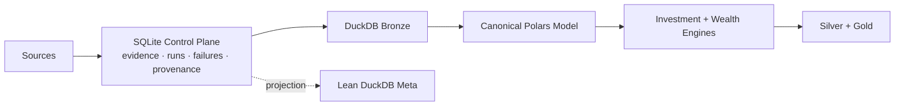

# Architecture

This section explains **how Personal Finance ETL is put together and why those boundaries exist**.

The current architecture separates operational truth from analytical state:



> **SQLite owns operational truth and raw evidence. DuckDB owns analytical state.**

## Production boundary

The Control Plane exposes focused repositories rather than leaking SQLite mechanics into orchestration:

```python
class ControlPlane:
    def __init__(self, base_path: str, db_name: str = "Raw_Documents.sqlite"):
        self.db = SQLiteManager(base_path, db_name)
        self.artifacts = ArtifactRepository(self.db)
        self.runs = RunRepository(self.db)
        self.file_sync = FileSyncService(self.artifacts)
```

That boundary now anchors artifact lifecycle, run lifecycle, configuration provenance, failure history and recovery.

## Read in this order

| Guide | Question |
| --- | --- |
| [System Architecture](system-architecture.md) | What are the major planes, components and dependency directions? |
| [Data Lifecycle](data-lifecycle.md) | How does a source artifact become decision-ready analytical state? |
| [Warehouse Architecture](warehouse-architecture.md) | What belongs in SQLite, Bronze, Silver, Gold and Meta? |
| [Data Model](data-model.md) | What are the canonical financial objects and grains? |
| [Reliability & Recovery](reliability-and-recovery.md) | What happens when processing fails, state disappears or a rebuild is required? |
| [Design Decisions](design-decisions.md) | Why these technologies and boundaries instead of plausible alternatives? |

## Architecture through different lenses

```text
Operational
→ Control Plane · transactions · failures · recovery

Data Engineering
→ discovery · hashing · Bronze synchronization · deterministic rebuild

Software
→ repositories · facade · contracts · strategies · process boundaries

Finance
→ canonical semantics · lot state · household state · analytical grain

BI
→ Silver contracts · Gold marts · Power BI serving
```

The substantive pages show the production code behind those claims.

[← Documentation Home](../README.md)
