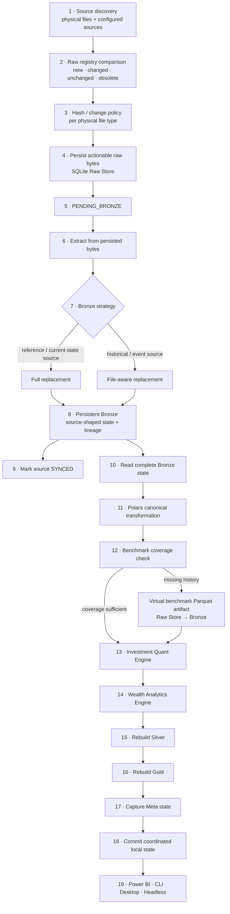
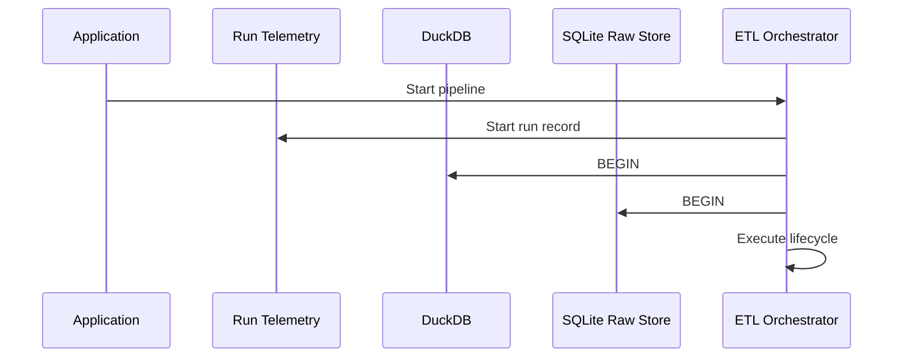
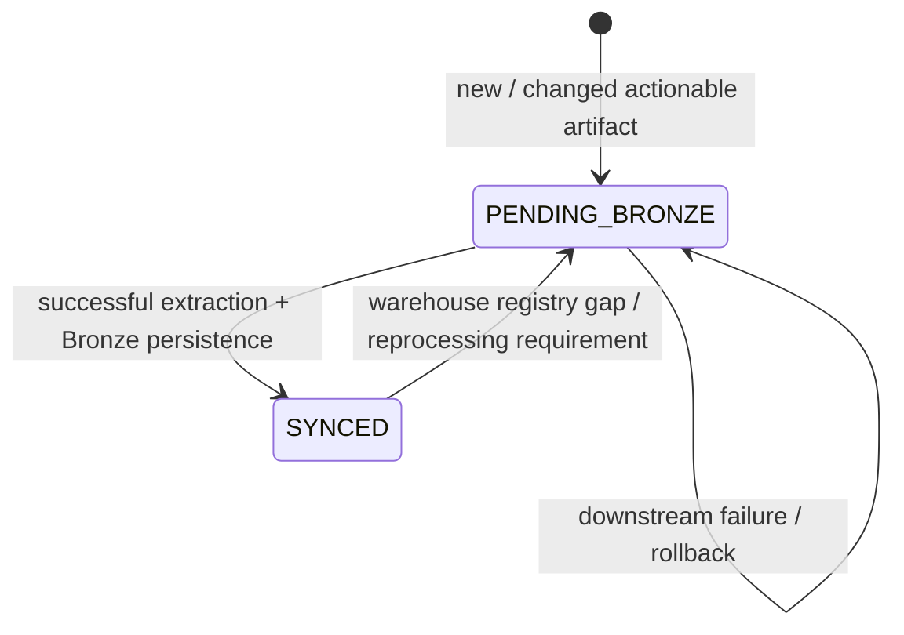
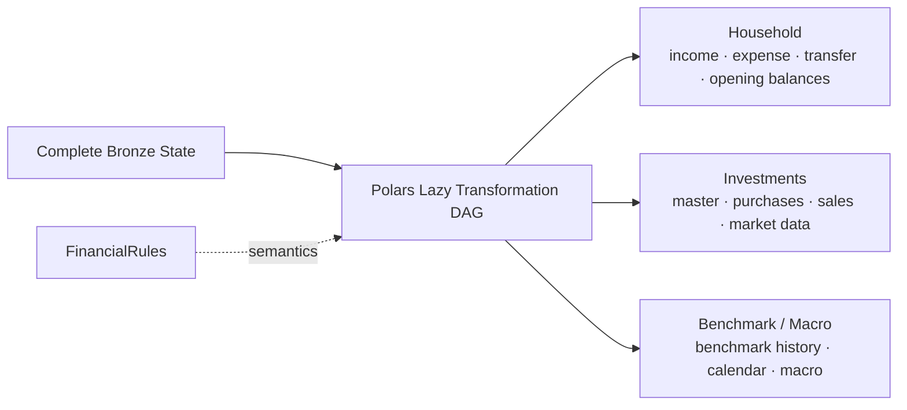
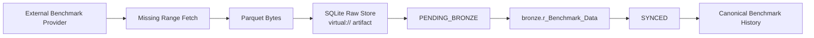
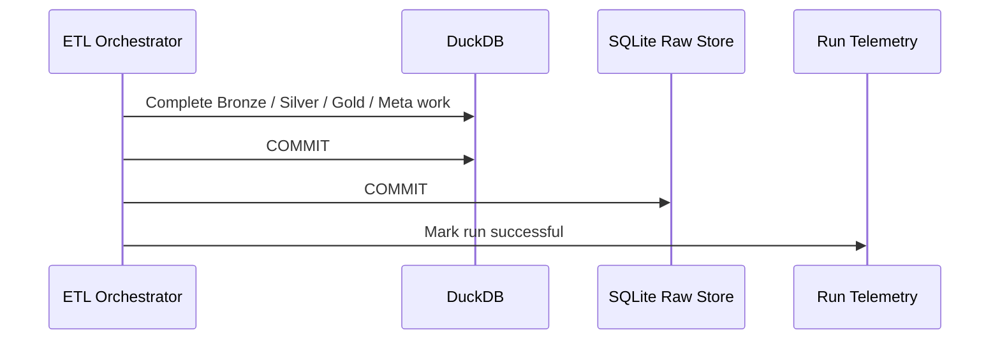
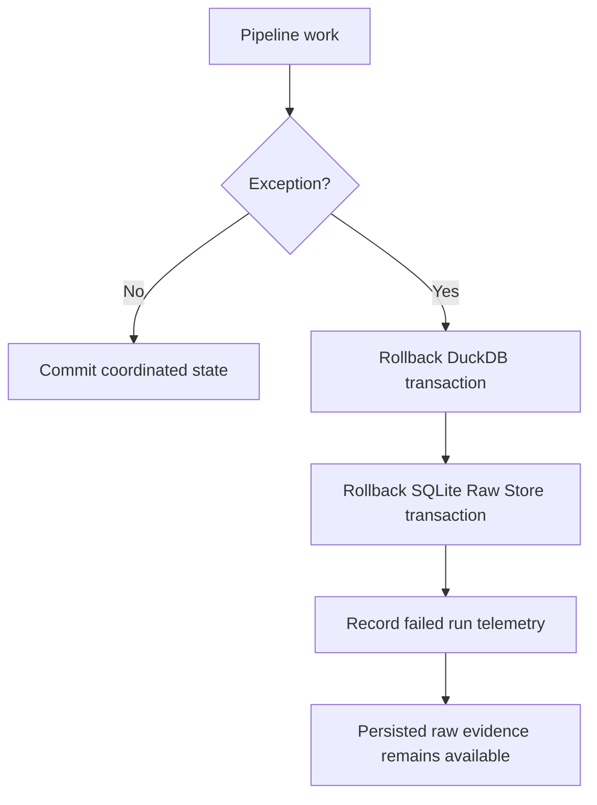
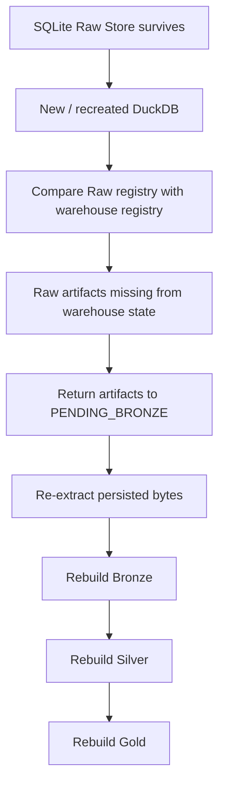

# Data Lifecycle

This document follows financial data through Personal Finance ETL from **source discovery to decision-support consumption**.

Where [System Architecture](system-architecture.md) explains the platform component by component, this page follows the lifecycle of data and state across those components.

The lifecycle is deliberately asymmetric:

- raw evidence is persisted,
- Bronze source history is synchronized incrementally where appropriate,
- canonical and serving state is rebuilt deterministically,
- analytical engines operate on canonical financial concepts,
- and successful publication is coordinated across the local persistence layers.

> The central idea is simple: **preserve what entered the system, make state transitions explicit, and make derived analytics reproducible.**

---

## Lifecycle at a glance



This is the successful path.

The rest of this document explains what each transition means, what state is durable at each point, and what happens when the happy path breaks.

---

## 1. Run initialization

A pipeline run begins before source extraction.

At a high level, the application:

1. loads operational settings,
2. loads financial rules,
3. opens the DuckDB analytical warehouse,
4. opens the SQLite Raw Document Store,
5. starts operational run telemetry,
6. begins the coordinated analytical/raw transaction scope,
7. and then enters source synchronization.

The run record is intentionally useful even when the main analytical transaction fails.

That gives execution telemetry a different lifecycle from the derived warehouse state.



Operational status therefore does not depend on a successful Gold publication before a run can be observed.

---

## 2. Source discovery

The source environment is currently purpose-built around my financial inputs.

Configured source families include combinations of:

- CSV,
- Excel,
- SQLite,
- bank/finance data,
- mutual-fund holdings and orders,
- stock statements/orders,
- mappings and masters,
- opening balances,
- macro parameters,
- and benchmark-related inputs.

Discovery answers:

> **Which configured artifacts are available to participate in this run?**

It does not yet answer:

> **What do these records mean financially?**

That interpretation belongs later.

Keeping those concerns separate prevents filesystem and statement-layout knowledge from leaking directly into the financial engines.

---

## 3. Raw registry reconciliation

Discovered sources are compared against the SQLite Raw Document Store.

The Raw Store maintains a registry containing source identity and state such as:

- file ID,
- file name,
- relative path,
- file category,
- file type,
- file hash,
- file size,
- first ingestion timestamp,
- last ingestion timestamp,
- and synchronization status.

The reconciliation step classifies what the pipeline needs to act on.

Conceptually:

```text
Discovered artifact
       │
       ├── not registered ───────→ new
       │
       ├── registered + changed ─→ changed
       │
       ├── registered + same ────→ unchanged
       │
       └── registered but absent → obsolete / source-policy handling
```

The exact action depends on source category and configured hashing behaviour.

---

## 4. Hashing and change detection

The Raw Store records SHA-256 fingerprints for ingested artifacts.

However, existing files are not blindly re-hashed under one universal policy.

The current configuration supports a per-file-type hash policy.

That distinction matters:

> **Hashing capability and modification-detection policy are separate concerns.**

New artifacts can be registered and fingerprinted, while the decision to re-hash an already known CSV, Excel, or SQLite source can differ by configuration.

This avoids documenting a stronger change-detection guarantee than the implementation actually provides.

---

## 5. Raw payload persistence

Actionable source bytes are persisted in SQLite before downstream analytical processing.

The Raw Store separates registry metadata from the binary payload itself.

Conceptually:

```text
Raw File Registry
       │
       └── file_id
              │
              ▼
        Raw Payload BLOB
```

This changes the ingestion contract in an important way.

The downstream extractor can operate on **persisted raw bytes** rather than depending on the original disk file remaining the authoritative copy throughout the run.

That gives the system:

- source provenance,
- replayability,
- a recovery boundary,
- and a durable representation of the evidence that entered the platform.

---

## 6. The Raw Store state machine

Persisting bytes does not mean Bronze is synchronized.

The Raw Store tracks an explicit lifecycle.



The two important states are:

### `PENDING_BRONZE`

The raw artifact exists, but Bronze is not yet considered synchronized with it.

### `SYNCED`

The artifact has successfully passed through extraction and Bronze persistence and has been registered as synchronized.

This is stronger than assuming:

> "The file was seen, so the warehouse must contain it."

The synchronization state makes that relationship explicit.

---

## 7. Extraction from persisted evidence

Extraction sits between raw persistence and Bronze.

Conceptually:

```text
Raw BLOB
   ↓
Extractor
   ↓
Source-shaped DataFrame / LazyFrame
   ↓
Bronze loader
```

The extractor is source-aware.

It understands how to parse the current statement/source contracts, while the downstream canonical transformation layer is responsible for converting those source shapes into financial concepts.

This is one of the main current portability boundaries.

The **raw-state infrastructure is reusable**, while several **extractor contracts remain tailored to my financial environment**.

---

## 8. Bronze persistence strategy

Bronze is persistent, but not every Bronze source uses the same synchronization strategy.

This is deliberate.

### Full-replacement sources

Reference/configuration-like sources are treated as current-state datasets.

When their source changes, the relevant Bronze representation can be replaced as a whole.

Examples include reference/master-style inputs where the complete current dataset is the useful contract.

Conceptually:

```text
Changed reference artifact
        ↓
Replace Bronze representation
        ↓
Current reference state
```

### File-aware historical sources

Historical/event datasets use source-aware replacement.

Bronze retains source lineage such as `__file_name__`.

When one source artifact changes:

```text
Changed historical artifact
        ↓
Identify old Bronze rows from that artifact
        ↓
DELETE those rows
        ↓
INSERT freshly extracted rows
        ↓
Preserve unrelated historical sources
```

This gives the platform incremental source-history maintenance without requiring row-level change-data-capture infrastructure.

### Why two strategies?

Because the meaning of the sources differs.

I prefer matching persistence semantics to source semantics over pretending every input is the same kind of dataset.

---

## 9. Bronze lineage

Source lineage is retained directly in persistent Bronze data.

The current mechanism includes source identity such as:

```text
__file_name__
```

This supports both:

- traceability,
- and file-partition replacement.

For the current local workload, filename-level lineage is a pragmatic contract.

A future generalized platform could evolve this into richer identifiers such as:

```text
source_file_id
source_adapter
source_record_id
ingestion_run_id
```

but those are future design possibilities, not current v6 behaviour.

---

## 10. Transition from Raw to `SYNCED`

Once extraction and Bronze persistence complete successfully for an artifact, the source can move from:

```text
PENDING_BRONZE
      ↓
   SYNCED
```

This transition is important because the Raw Store is treated as the source-state authority.

A raw payload and a Bronze representation therefore have an explicit synchronization relationship.

If downstream work later fails, the coordinated transaction scope prevents the run from being treated as successfully published.

---

## 11. Reading complete Bronze state

Downstream transformation does not operate only on the files changed in the current run.

After Bronze synchronization, the transformation layer works from the **complete persistent Bronze state**.

That distinction is critical.

```text
Changed sources this run
        ↓
Incrementally synchronize Bronze
        ↓
Complete Bronze history/state
        ↓
Reconstruct canonical model
```

This is the bridge between incremental ingestion and deterministic downstream reconstruction.

The system does not need to maintain an incremental dependency graph across every Silver and Gold calculation.

---

## 12. Canonical transformation

Polars transforms persistent Bronze state into canonical financial contracts.

This is where the vocabulary changes from:

> source columns and statement layouts

to:

> financial concepts.

The canonical model includes household, investment, benchmark, calendar, and macro concepts.



`FinancialRules` participates as financial policy.

It influences how canonical and analytical state should be interpreted without being confused with source discovery or filesystem configuration.

---

## 13. Investment asset pipelines

Investment source paths can differ substantially upstream.

The transformation architecture already uses asset-specific pipelines to normalize those differences.

Current implementations include:

- stock processing,
- and mutual-fund processing.

They converge toward common downstream investment contracts.

Conceptually:

```text
Stock-specific source state ──────┐
                                  │
                                  ▼
                         Canonical investment
                                  contracts
                                  ▲
                                  │
Mutual-fund-specific source state ┘
```

This is one of the strongest existing extension seams.

A future asset type should ideally satisfy the same downstream contract rather than force changes throughout the investment engine.

---

## 14. Benchmark coverage and delta ingestion

Benchmark history has a specialized lifecycle because it can be acquired externally and may need to expand as investment history grows.

The benchmark pipeline determines the required historical range from investment activity.

Conceptually:

```text
Earliest relevant investment date
              ↓
        required start

Latest relevant market date
              ↓
         required end
```

The system checks existing cached benchmark coverage before fetching more history.

If coverage is incomplete, only the missing range is acquired.

This is **delta benchmark ingestion**.

---

## 15. Virtual benchmark artifacts

New benchmark history does not bypass the Raw Store.

Fetched benchmark chunks are serialized into Parquet bytes and registered as virtual artifacts under synthetic identities such as:

```text
virtual://benchmark_history/...
```

They then participate in the same lifecycle:



This is an important provenance decision.

Externally acquired market history is preserved as an input artifact rather than existing only as an ephemeral API response.

---

## 16. Investment Quant Engine lifecycle

Canonical investment state then enters the investment analytical engine.

The processing grain becomes much deeper.

At a high level:

```text
Canonical instrument state
        ↓
Per-ISIN processing
        ↓
FIFO tax-lot reconstruction
        ↓
Broker reconciliation
        ↓
Shadow benchmark inventory
        ↓
Historical market snapshots
        ↓
Return + tax state
        ↓
Portfolio-level post-processing
```

### Per-instrument execution

Investment data is partitioned by ISIN before worker execution.

Per-instrument workloads can run through a process pool rather than repeatedly filtering the complete portfolio inside each worker.

This is both an execution and architecture decision:

- the instrument is a natural parallel unit,
- and the lot engine owns instrument-specific state.

### FIFO state evolution

Purchases add lots.

Sales consume the oldest available inventory first.

Market observations advance the portfolio through time, applying purchases and sales up to the observation date before generating the next snapshot.

### Reconciliation

Reconstructed quantity and cost state are compared against broker-reported state.

Where they differ, the engine reconciles the lot inventory so the analytical position reflects current reported reality.

### Shadow benchmark state

Each purchase also establishes benchmark-equivalent exposure.

That shadow inventory evolves with the actual investment inventory.

### Analytical snapshots

Snapshots can contain:

- lot state,
- holding period,
- market value,
- book value,
- tax state,
- after-tax value,
- XIRR context,
- benchmark-relative state,
- and realized/unrealized outcomes.

The deepest persistent analytical grain is the lot-level Silver investment analytics fact.

---

## 17. Investment post-processing

Per-instrument results are not simply concatenated and averaged.

Post-processing creates portfolio analytics across multiple grains.

```text
ISIN
 ↓
Subtype
 ↓
Class
 ↓
Instrument Type
 ↓
Sector
 ↓
Industry
 ↓
Portfolio
```

Cash-flow-aware measures such as portfolio XIRR are calculated using portfolio cash-flow context rather than by averaging security-level XIRRs.

This distinction matters because return aggregation is a financial methodology problem, not merely a group-by operation.

---

## 18. Wealth Analytics Engine lifecycle

Canonical household state and investment analytics then feed the wealth model.

The flow is approximately:

```text
Household facts
      +
Investment analytical state
      ↓
Unified ledger
      ↓
Asset-month balances
      ↓
Book net worth
      ↓
Market investment overlay
      ↓
Market / after-tax wealth
      ↓
Cash-flow reconciliation
      ↓
Budget + tax + portfolio planning
      ↓
FIRE
```

The important architectural point is integration.

Investment state is not a separate analytical island.

It influences household market wealth and therefore long-range planning.

---

## 19. Unified ledger

The ledger normalizes:

- opening balances,
- income,
- expenses,
- and transfers

into a common financial activity model.

It distinguishes concepts such as:

- cash income,
- non-cash income,
- cash expenses,
- non-cash expenses,
- core expenses,
- and transfers.

That ledger becomes the basis for reconstructing asset balances over time.

---

## 20. Net-worth reconstruction

Asset-month balances are derived from opening state and subsequent financial activity.

The wealth model can then distinguish:

```text
Book / ledger value
        ↓
Investment market overlay
        ↓
Market-adjusted value
        ↓
After-tax market wealth
```

This allows savings and transaction-driven growth to remain conceptually distinct from market-driven appreciation.

The resulting household state feeds both BI outputs and FIRE planning.

---

## 21. Cash-flow reconciliation

Cash-flow modelling uses configured cash-pool assets and activity classifications.

Financial movement is organized into:

- operating,
- investing,
- financing,
- and internal-transfer activity.

Calculated cash movement is then compared with actual opening and closing cash balances.

Conceptually:

```text
Opening cash
    +
classified cash activity
    =
calculated closing cash

calculated closing cash
    vs
actual closing cash
    ↓
unreconciled difference
```

This makes the cash-flow model a reconciliation layer rather than simply another expense aggregation.

---

## 22. Planning, tax, and portfolio management

The wealth/presentation layer also builds planning-oriented state such as:

- budget variance,
- tax liability forecasts,
- savings and investment rates,
- liquidity measures,
- allocation weights,
- allocation drift,
- rebalance flags,
- harvestable losses,
- and harvesting priority.

These outputs are decision-support models built on the same underlying financial state.

---

## 23. FIRE lifecycle

FIRE analytics build progressively from current state.

```text
Current after-tax market wealth
          +
Trailing spending / savings
          +
Configured assumptions
          ↓
Current-state FIRE measures
          ↓
Deterministic planning
          ↓
Monte Carlo scenario engine
          ↓
Curated stochastic outputs
```

The deterministic layer calculates concepts such as:

- Target FI,
- Lean FI,
- Coast FI,
- FI coverage,
- FI gap,
- runway,
- withdrawal rate,
- required savings rate,
- and linear time-to-FI.

The stochastic engine then models a distribution of possible paths under configured assumptions.

Gold exposes a curated subset such as:

- P10/P50/P90 months to FI,
- modelled probability of success,
- stressed/base runway,
- projected median FI date,
- and P50 nominal terminal wealth.

The lifecycle therefore moves from **observed financial state** to **assumption-driven planning state**.

That boundary should remain explicit.

---

## 24. Silver reconstruction

Silver is rebuilt from the current canonical state.

The schema is recreated and populated in dependency-aware order, with dimensions/reference models loaded before dependent facts.

The current Silver contract contains 20 physical tables.

Silver represents the canonical financial and analytical model rather than source-specific ingestion history.

That means a successful run effectively says:

> Given the current Bronze evidence and current financial semantics, this is the canonical financial state.

---

## 25. Gold reconstruction

Gold is also rebuilt from current analytical state.

The current contract contains 17 physical marts across:

- wealth,
- cash flow,
- planning,
- portfolio management,
- and investment analytics.

Gold is deliberately consumption-oriented.

It does not publish every intermediate calculation.

The publication rule is effectively:

> **A calculation existing in code is not enough. It must earn a place in the decision-support contract.**

That philosophy is why the current serving model is more focused than earlier metric-heavy versions.

---

## 26. Meta capture

Meta captures operational context around the run.

Current Meta tables cover concepts such as:

- source registry state,
- run telemetry,
- table row counts,
- financial rules,
- and application settings.

This provides the beginnings of a reproducibility catalog:

```text
What entered?
What ran?
What was produced?
Under which rules?
Under which settings?
```

The current implementation still has opportunities to strengthen this layer, such as more explicit dataset-layer mapping and version/configuration fingerprints.

Those are future hardening opportunities rather than claims about current behaviour.

---

## 27. Commit lifecycle

After analytical state has been built successfully, the pipeline coordinates local persistence commits.

The conceptual successful ending is:



This is application-coordinated transaction handling.

It is not a distributed two-phase commit protocol.

That distinction is important because the stores commit sequentially.

---

## 28. Consumption lifecycle

After a successful run, analytical state can be consumed through several surfaces.

### Power BI

Power BI consumes curated DuckDB analytical state, especially Gold decision marts and supporting Silver contracts where appropriate.

### CLI

The Rich CLI provides an interactive local application surface.

### Desktop

The CustomTkinter desktop application provides graphical access while heavy pipeline execution remains isolated from the UI process.

### Headless / scheduled execution

The application supports unattended workflows such as automatic or scheduled runs.

### Documentation

The documentation itself is packaged with the project and can be surfaced through application interfaces.

The long-term goal is for the Markdown under `docs/` to remain the single maintained documentation source across GitHub, CLI, desktop, package distribution, and the project Wiki.

---

### Failure lifecycle

The successful path is only half the architecture.

When downstream processing fails, the run should not masquerade as a successful analytical publication.



The Raw Store is important here.

A failed derived-state build does not erase the underlying financial evidence that had already been durably captured outside the analytical warehouse lifecycle.

---

### Warehouse-loss recovery lifecycle

A particularly useful recovery path exists when the Raw Store survives but the DuckDB analytical warehouse is recreated.

Conceptually:



This is why the Raw Store is a recoverability boundary rather than a transient cache.

The exact reconstructed result still depends on the current code, rules, and configuration, so recovery should not be confused with immutable historical replay across arbitrary future software versions.

---

## State ownership by layer

The lifecycle becomes easier to reason about when state ownership is explicit.

| Layer | Owns | Persistence behaviour |
| --- | --- | --- |
| Source environment | Original institution/user artifacts | External to the analytical platform |
| Raw Store | Persisted source bytes + registry/sync state | Durable SQLite state |
| Bronze | Source-shaped analytical history/current reference state | Persistent, synchronized incrementally by source semantics |
| Canonical transformation | In-memory canonical financial state | Recomputed |
| Investment / Wealth engines | Analytical intermediate state | Recomputed |
| Silver | Canonical financial and analytical contracts | Deterministically rebuilt |
| Gold | Decision-support marts | Deterministically rebuilt |
| Meta | Operational/control context | Captured around runs |
| Power BI / CLI / GUI | Consumption | Reads published analytical state |

This ownership model is one of the main reasons the system can mix incremental ingestion with deterministic analytical reconstruction without becoming ambiguous about where truth lives.

---

## Source of truth hierarchy

There is not one universal "source of truth" for every question.

Different layers are authoritative for different concerns.

### Original financial evidence

The persisted Raw Store payload represents the artifact that entered the system.

### Ingestion synchronization

The Raw Store registry/sync state is authoritative for whether an artifact still needs Bronze processing.

### Source-shaped analytical history

Bronze is authoritative for the persistent extracted source state used by downstream transformations.

### Canonical financial meaning

Silver represents the published canonical financial/analytical contract for the current run.

### Decision-support analytics

Gold represents the published decision-oriented analytical state.

### External current investment position

Where historical reconstruction conflicts with broker-reported current position, the investment reconciliation policy treats broker state as the current anchor.

This layered authority is deliberate.

---

## Current lifecycle boundaries

Several parts of the lifecycle are highly reusable.

### Reusable infrastructure

- raw payload persistence,
- registry state,
- change detection mechanism,
- Bronze synchronization pattern,
- orchestration,
- deterministic reconstruction,
- analytical persistence,
- and application execution.

### Configurable semantics

Many financial classifications and planning assumptions are already represented through validated configuration.

### Purpose-built boundaries

Current source discovery categories, extractors, mappings, some transformations, jurisdictional tax behaviour, and selected policies remain tailored to my environment.

The long-term generalization effort should move those assumptions behind explicit configuration, adapters, or strategies without changing the core lifecycle unnecessarily.

---

## Lifecycle invariants

I want future changes to preserve these properties unless I intentionally redesign the architecture.

1. **A discovered artifact is not equivalent to a synchronized artifact.**
2. **Raw evidence should be persisted before it becomes derived analytical state.**
3. **Bronze synchronization should preserve unrelated historical source state.**
4. **Downstream reconstruction should operate from complete Bronze state, not only the current run's deltas.**
5. **Source-specific structure should terminate before analytical engines.**
6. **External benchmark data should participate in provenance rather than bypass it.**
7. **Investment state should flow into household wealth and planning rather than remain isolated.**
8. **Scenario-model outputs should remain distinguishable from observed financial state.**
9. **A failed run should not be presented as successfully published analytical state.**
10. **The Raw Store should remain capable of supporting analytical reconstruction.**

---

## Related documentation

Continue with:

- [Warehouse Architecture](warehouse-architecture.md) — persistence semantics and responsibilities of Bronze, Silver, Gold, and Meta.
- [Data Model](data-model.md) — canonical tables, relationships, and analytical grains.
- [Reliability & Recovery](reliability-and-recovery.md) — transactions, failure handling, and reconstruction in greater depth.
- [Design Decisions](design-decisions.md) — why the lifecycle is intentionally asymmetric.
- [Adding a Data Source](../developer/adding-data-sources.md) — how a new source enters this lifecycle.
- [Investment Analytics](../finance/investment-analytics.md) — financial methodology inside the investment-engine portion of the lifecycle.
- [FIRE Methodology](../finance/fire-methodology.md) — methodology inside the planning portion of the lifecycle.

[← Architecture Home](README.md) · [← Documentation Home](../README.md)
