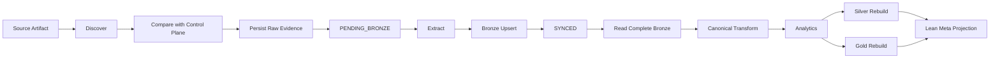

# Data Lifecycle

This document follows one source artifact from discovery to decision-ready analytical state.

The lifecycle is intentionally asymmetric:

> **Raw/Bronze preserve and synchronize evidence incrementally. Silver/Gold reconstruct derived financial state deterministically.**

That split is what lets the system handle a growing source history without making downstream finance depend on fragile incremental patches.

---

## Lifecycle at a glance



---

## 1. A run starts before data processing

The Control Plane creates a durable run identity before the main analytical transaction:

```python
run_id = cp.runs.start_run(
    cfg_json=self.cfg.model_dump_json(),
    rules_json=self.rules.model_dump_json() if self.rules else None,
)
```

That call also snapshots Settings and FinancialRules by content hash.

The run initially exists as:

```text
STARTED
```

Then both local persistence transactions begin:

```python
self.db_manager.conn.execute("BEGIN TRANSACTION")
cp.begin_transaction()

cp.runs.update_run_status(run_id, "RUNNING")
```

A failed analytical run therefore still has an operational identity.

---

## 2. Source discovery describes the current filesystem

The orchestrator discovers statement files and then adds explicit configured sources:

```python
discovered_files = categorize_statement_files(
    self.cfg.STATEMENTS_FOLDER,
    strict=True,
)

discovered_files["sqlite_source"] = [
    SQLiteExtractor(self.cfg.SOURCE_DB_FOLDER).get_latest_sqlite_backup()
]
discovered_files["mf_isin"] = [self.cfg.MF_ISIN_CSV_PATH]
discovered_files["benchmark_mapping"] = [self.cfg.BENCHMARK_MAPPING_CSV_PATH]
discovered_files["opening_balances"] = [self.cfg.OPENING_BALANCE_CSV_PATH]
```

Discovery answers:

> **What source artifacts exist now?**

It does not answer:

> **Which ones need processing?**

That belongs to synchronization state.

---

## 3. The Control Plane decides what changed

`FileSyncService` compares discovered paths with the artifact registry:

```python
registry = self.artifact_repo.get_registry()

for category, filepaths in discovered_files.items():
    file_type = FILE_TYPE_MAP.get(category, "csv")
    should_check_hash = getattr(hash_policy, file_type, False)

    for filepath in filepaths:
        rel_path = filepath.replace("\\", "/")

        if rel_path not in registry:
            new_files[category].append(filepath)
        elif should_check_hash:
            disk_hash = compute_file_hash(filepath)
            if disk_hash != registry[rel_path]:
                changed_files[category].append(filepath)
```

This separates:

```text
discovered
from
actionable
```

With 1,608 artifacts in the production source environment, that distinction is fundamental.

---

## 4. Hash policy is configurable by physical type

Not every file type needs the same change-detection cost.

The synchronization service asks:

```python
should_check_hash = getattr(hash_policy, file_type, False)
```

That allows the application to choose when an existing artifact should be rehashed.

The lifecycle therefore distinguishes:

```text
path identity
+
optional content identity
```

rather than blindly hashing every artifact on every run.

---

## 5. Raw evidence is persisted before Bronze

Actionable files are stored as binary evidence:

```python
with open(filepath, "rb") as file:
    raw_bytes = file.read()

self.db.conn.execute(
    """
    INSERT INTO cp_file_payloads (file_id, file_bytes)
    VALUES (?, ?)
    ON CONFLICT(file_id)
    DO UPDATE SET file_bytes = excluded.file_bytes
    """,
    (file_id, raw_bytes),
)
```

The registry stores:

```text
file_id
relative_path
category
physical type
SHA-256
size
first_ingested
last_ingested
sync_status
```

New or changed artifacts become:

```text
PENDING_BRONZE
```

Raw evidence therefore exists before analytical persistence succeeds.

---

## 6. Full-replace sources prune obsolete evidence

Some source categories represent current reference state rather than historical event history.

For those categories, the synchronizer prunes artifacts no longer present:

```python
if category in full_replace_categories:
    self.artifact_repo.prune_category(
        category,
        filepaths,
    )
```

That behaviour follows source semantics.

A current mapping/master is not necessarily useful as an indefinitely accumulating sequence of historical files.

---

## 7. Extraction operates on the actionable subset

The orchestrator constructs:

```python
actionable_all = {
    key: new_files.get(key, []) + changed_files.get(key, [])
    for key in discovered_files.keys()
}
```

Then:

```python
extracted_data = self._extract(
    cp,
    actionable_files=actionable_all,
)
```

The extractor does not need to parse every unchanged historical source on every run.

That is one of the main reasons persistent Bronze and the Control Plane exist.

---

## 8. Bronze synchronization follows source semantics

Bronze has two broad persistence behaviours.

### Historical/event sources

Replace only the partition owned by the changed source artifact:

```text
changed file
    ↓
delete old Bronze rows with that source identity
    ↓
insert replacement rows
    ↓
leave all unrelated history untouched
```

### Reference/current-state sources

Replace the complete current representation.

The code chooses that behaviour from `BronzeLayer.TABLE_MAPPINGS`.

This is more precise than describing Bronze as simply "incremental."

---

## 9. Source identity survives into Bronze

Historical Bronze rows carry source context such as:

```text
__file_name__
```

That identity allows changed source partitions to be replaced without rebuilding unrelated history.

The Control Plane remains the authoritative artifact registry; Bronze keeps enough source identity to support analytical synchronization.

This is **artifact/partition lineage**, not row-level enterprise lineage.

---

## 10. Successful Bronze persistence closes the sync loop

After a source has been persisted successfully:

```python
self.cp.artifacts.mark_synced([filepath])
```

The registry transitions:

```text
PENDING_BRONZE
      ↓
SYNCED
```

DuckDB Meta also receives a current-state registry projection for analytical consumers.

The distinction is important:

```text
artifact discovered
≠
artifact persisted as Bronze
```

---

## 11. The complete Bronze dataset is then read

After synchronizing only what changed, the pipeline deliberately reads complete Bronze state:

```python
full_dataset = bronze.get_full_dataset(
    extracted_data.mappings,
)
```

The returned `ExtractionResult` reconstructs the complete input surface:

```python
return ExtractionResult(
    zcategory=_get_lf("bronze.r_SQLite_ZCategory"),
    assetgroup=_get_lf("bronze.r_SQLite_AssetGroup"),
    assets=_get_lf("bronze.r_SQLite_Assets"),
    mf_market_data_raw=_get_lf("bronze.r_MF_Market_Data"),
    mf_transactions_raw=_get_lf("bronze.r_MF_Transactions"),
    stock_market_data_raw=_get_lf("bronze.r_Stock_Market_Data"),
    stock_transactions_raw=_get_lf("bronze.r_Stock_Transactions"),
    ...
)
```

This is the pivot point in the lifecycle:

```text
incremental synchronization
        ↓
complete analytical state
```

---

## 12. Canonical transformation starts from complete state

The orchestrator passes complete Bronze into the transformation DAG:

```python
self._transform(full_dataset)
```

The DAG standardizes source-shaped data into canonical financial contracts.

This means downstream engines do not need to reason about:

```text
which files changed today?
```

They reason about:

```text
what is the complete current financial state?
```

That simplifies analytical correctness.

---

## 13. Benchmark history uses virtual raw artifacts

External benchmark data follows the same evidence philosophy even though it is not discovered as a normal local file.

Fetched history is serialized and injected as a virtual artifact.

The hardened identity convention is:

```text
virtual://<category>/<filename>
```

The virtual artifact receives:

- deterministic identity,
- SHA-256,
- payload bytes,
- synchronization state.

So external acquisition does not bypass provenance merely because it originated from an API/provider.

---

## 14. Analytics consume canonical state

The canonical frames feed:

```text
Investment Quant Engine
        +
Wealth Analytics Engine
```

The investment engine reconstructs:

- FIFO lots,
- realized/unrealized state,
- broker reconciliation,
- benchmark state,
- tax-aware values,
- cash-flow-aware returns.

The wealth engine reconstructs:

- household ledger,
- book/market/after-tax wealth,
- cash-flow reconciliation,
- budget/tax planning,
- FIRE.

The two engines meet through shared financial state.

---

## 15. Independent presentation graphs are collected together

The wealth engine returns LazyFrames.

The orchestrator executes them together:

```python
lazy_frames = [presentation_lazy[key] for key in keys]

results = pl.collect_all(
    lazy_frames,
    engine="streaming",
)
```

This keeps the presentation model composable while allowing Polars to execute independent graphs efficiently.

---

## 16. Silver and Gold rebuild from the complete run state

The serving layers are not incrementally patched:

```python
SilverLayer(self.db_manager).load(self.dfs)
GoldLayer(self.db_manager).load(self.dfs)
```

The lifecycle therefore ends with:

```text
complete Bronze
      ↓
complete canonical state
      ↓
complete analytical state
      ↓
replace Silver / Gold
```

This is a deliberate correctness trade-off.

Incrementalizing source history gives a large performance benefit.

Incrementalizing every financial dependency would add complexity where the current workload does not require it.

---

## 17. Publication identity comes from the contract registry

The hardened loaders use `DATA_CONTRACT_REGISTRY` and `publication_order`.

Conceptually:

```python
contracts = sorted(
    (c for c in DATA_CONTRACT_REGISTRY if c.layer == "gold"),
    key=lambda c: c.publication_order,
)
```

That makes publication explicit rather than inferred from internal DataFrame names.

Meta row-count tracking uses the same registry identity.

---

## 18. Run success happens after publication

The run moves to:

```text
COMMITTING
```

only after Silver, Gold and Meta have been prepared.

Then:

```python
self.db_manager.conn.execute("COMMIT")
cp.commit()

cp.runs.finish_run(run_id, "SUCCESS")
```

The run lifecycle therefore reflects the execution lifecycle rather than merely logging a start/end timestamp.

---

## 19. Failure reverses analytical work but preserves failure history

If any phase raises:

```python
self.db_manager.conn.execute("ROLLBACK")
cp.rollback()
```

Then structured failure context is written:

```python
cp.runs.log_run_failure(
    run_id=run_id,
    failed_isin=None,
    stage="Pipeline",
    error_type=type(exc).__name__,
    error_message=str(exc),
    traceback_log=traceback.format_exc(),
)
```

Finally:

```python
cp.runs.finish_run(run_id, "FAILED")
```

A failed run therefore does not disappear merely because its analytical transaction was rolled back.

---

## 20. Per-ISIN failure is intentionally fatal

Investment processing uses per-instrument isolation, but a failed ISIN cannot silently vanish from a successful portfolio.

The worker error propagates through:

```text
ISIN worker
    ↓
ISIN pipeline
    ↓
Investment Quant Engine
    ↓
ETLOrchestrator
    ↓
rollback + cp_run_failures
```

For this financial workload, an incomplete portfolio is worse than a failed run.

That is a correctness decision, not just an exception-handling preference.

---

## 21. Recovery starts from authoritative evidence

If DuckDB analytical state is lost or inconsistent while the Control Plane survives:

```text
Raw artifacts + payloads
        ↓
requeue missing Bronze state
        ↓
rebuild Bronze
        ↓
rebuild Silver
        ↓
rebuild Gold
```

`MetaLayer.heal_duckdb_registry()` compares Control Plane artifacts with DuckDB's current registry and returns missing analytical artifacts to `PENDING_BRONZE`.

The direction of authority is one-way:

```text
Control Plane → analytical recovery
```

not the reverse.

---

## 22. What the lifecycle does not claim

The current lifecycle provides strong operational provenance, but it is not a full normalized lineage graph.

There are not yet dedicated structures such as:

```text
run_artifacts
run_stages
run_outputs
lineage_edges
```

linking every run to every downstream contract.

The current system can answer a great deal through artifact state, run history, logs, snapshots and publication contracts.

It should not be documented as row-level or graph-complete lineage.

---

## Lifecycle invariants

1. Raw evidence exists before derived analytical state.
2. New/changed source artifacts become actionable; unchanged history is preserved.
3. Bronze synchronization follows source semantics.
4. `PENDING_BRONZE` and `SYNCED` are different operational states.
5. Complete Bronze feeds deterministic downstream reconstruction.
6. Canonical finance hides source-specific structure.
7. Silver/Gold publication is contract-driven.
8. A failed ISIN cannot silently disappear.
9. Failed analytical work rolls back.
10. Failure history survives.
11. SQLite is authoritative for operational state.
12. DuckDB Meta is a current-state projection.

---

## Go deeper

- [System Architecture](system-architecture.md)
- [Warehouse Architecture](warehouse-architecture.md)
- [Reliability & Recovery](reliability-and-recovery.md)
- [Adding a Data Source](../developer/adding-data-sources.md)

[← Architecture Home](README.md) · [← Documentation Home](../README.md)
