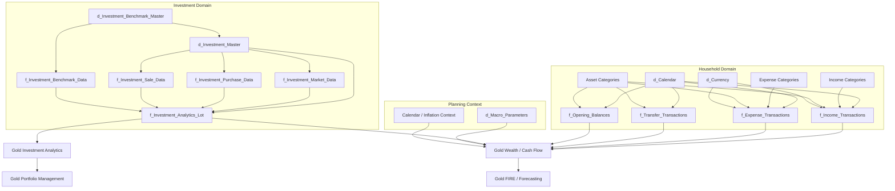
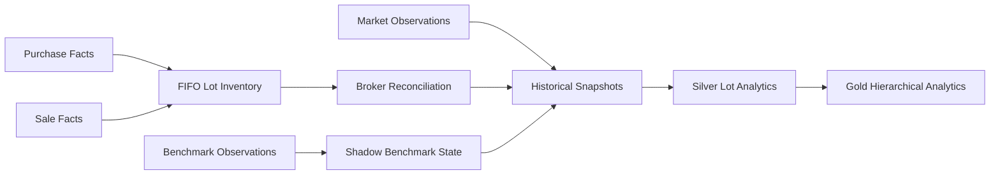
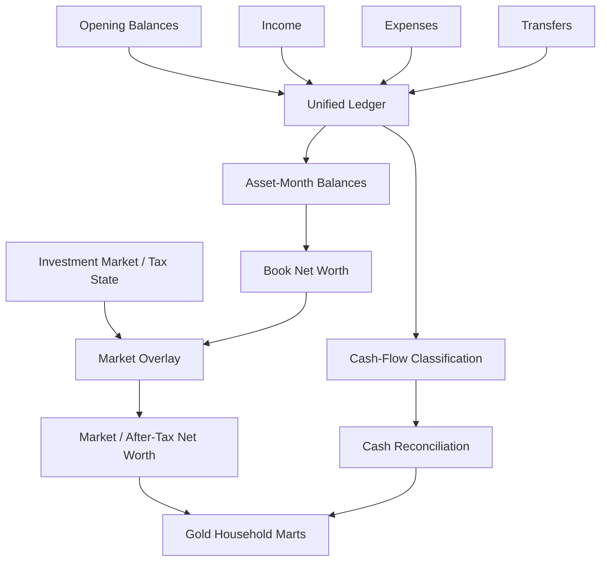
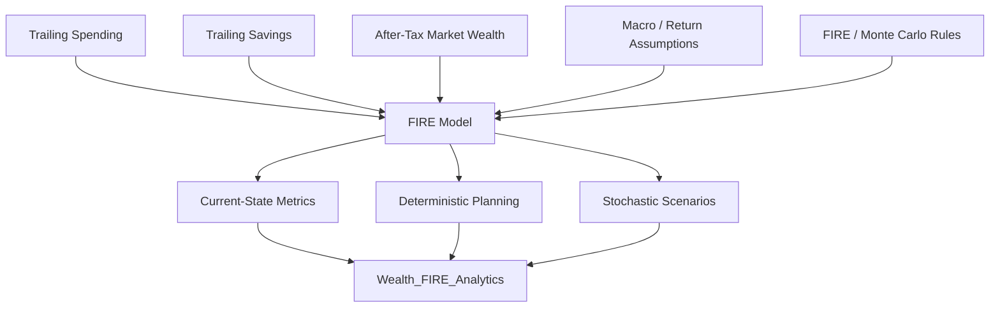
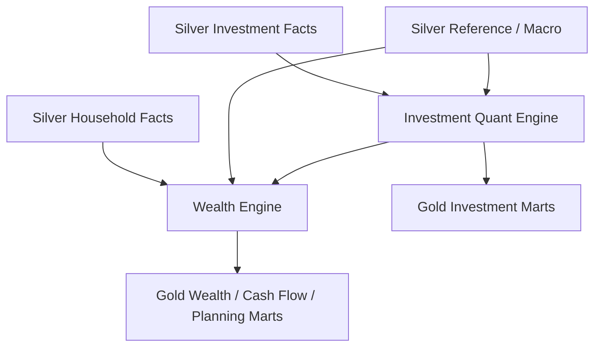

# Data Model

Personal Finance ETL models one connected financial state across household accounting, investments, tax, wealth, cash flow, planning, and BI.

I do not treat the data model as a mirror of source files. Source layouts belong upstream. The canonical model exists so downstream analytics can reason about stable financial concepts even when the original statements, institutions, or extraction paths differ.

The model has three published analytical surfaces:

```text
Silver
Canonical financial & analytical contracts
        ↓
Gold
Decision-support marts
        +
Meta
Operational / reproducibility context
```

This document focuses on the **conceptual model, relationships, and analytical grains**. For physical field-level definitions, use the [Silver](../reference/silver-data-contracts.md), [Gold](../reference/gold-data-contracts.md), and [Meta](../reference/meta-data-contracts.md) contract references.

---

## Model at a glance



This diagram is conceptual rather than a literal foreign-key ERD. The physical schemas are documented separately.

---

## Modelling principles

### Canonical concepts over source layouts

A broker worksheet column is not a durable business concept.

The canonical model uses concepts such as:

- income,
- expense,
- transfer,
- asset,
- investment,
- purchase,
- sale,
- market observation,
- benchmark observation,
- tax lot,
- and financial month.

That keeps downstream analytics from depending on institution-specific file shapes.

### Grain before measure

Before I publish a dataset, I want to know what one row represents.

Examples include:

```text
Transaction
Asset × Month
ISIN × Date
ISIN × Date × Tax Lot
Class × Date
Portfolio × Date
Household × Month
```

A measure is only meaningful in the context of its grain.

### Household and investment state are connected

Investment analytics are not a separate reporting universe.

Market and after-tax investment state flow into household wealth and long-range planning.

### Financial policy is part of semantics

`FinancialRules` affects how transactions, assets, tax treatment, budgets, and FIRE assumptions are interpreted.

The data model therefore consists of both **physical contracts** and **validated financial policy**.

---

## Silver model

Silver contains **20 physical tables** in the current v6 architecture.

I use Silver as the canonical financial and analytical boundary.

## Household dimensions and references

### `d_Calendar`

The calendar dimension provides the shared temporal vocabulary for the analytical model.

It supports concepts such as:

- calendar dates,
- month boundaries,
- year/fiscal-year context,
- and planning/reporting period attributes.

Time semantics belong here rather than being recreated independently in every Gold mart.

### Income dimensions

```text
d_Income_Category
d_Income_Subcategory
```

These provide canonical income classification.

Financial rules can additionally distinguish concepts such as active, dividend, interest, and non-cash income.

### Expense dimensions

```text
d_Expense_Category
d_Expense_Subcategory
```

These provide canonical expense classification.

Financial policy can further identify core expenses and cash/non-cash treatment.

### Asset dimensions

```text
d_Asset_Category
d_Asset_SubCategory
```

These define the household asset vocabulary used by balances, transfers, liquidity, and cash-flow modelling.

### `d_Currency`

Currency is modelled explicitly rather than being treated as an implicit property of every source.

---

## Household facts

### `f_Income_Transactions`

**Conceptual grain:** income transaction.

This fact represents canonical income activity after source-specific structure has been resolved.

It participates in:

- household ledger construction,
- cash/non-cash income analysis,
- savings calculations,
- cash-flow modelling,
- and Gold income breakdowns.

### `f_Expense_Transactions`

**Conceptual grain:** expense transaction.

It supports:

- core/non-core expense treatment,
- cash/non-cash expense treatment,
- spend analysis,
- cash-flow reconciliation,
- budget analytics,
- and FIRE spending inputs.

### `f_Transfer_Transactions`

**Conceptual grain:** transfer transaction.

Transfers are important because moving money between assets is not the same as earning income or incurring expense.

The transfer fact allows the wealth and cash-flow models to preserve that distinction.

### `f_Opening_Balances`

**Conceptual grain:** opening balance by relevant asset/period context.

Opening state allows the system to reconstruct balances even when the complete lifetime transaction history is not represented as transactional activity.

---

## Investment reference model

## `d_Investment_Master`

This is the canonical instrument reference.

It connects investment identity to analytical classifications such as:

- ISIN,
- instrument type,
- subtype,
- class,
- sector,
- industry,
- benchmark mapping,
- and tax treatment.

It is one of the most important semantic contracts in the investment model.

The load path treats missing critical identity/tax fields as serious quality issues rather than harmless nulls.

## `d_Investment_Benchmark_Master`

This provides the canonical benchmark reference used by the investment engine.

The benchmark relationship is not merely decorative metadata. It participates directly in shadow-benchmark construction and benchmark-relative return analysis.

## `d_Macro_Parameters`

Macro parameters provide analytical/planning context such as inflation or other configured macro assumptions used downstream.

They should not be confused with `FinancialRules`: one is a persisted reference model, while the other is validated policy/configuration used by the application.

---

## Investment facts

## `f_Investment_Market_Data`

**Conceptual grain:** instrument × market observation date.

This fact represents market observations used to value reconstructed investment state over time.

## `f_Investment_Purchase_Data`

**Conceptual grain:** investment purchase transaction.

Purchases become inputs to FIFO lot creation and shadow benchmark exposure.

## `f_Investment_Sale_Data`

**Conceptual grain:** investment sale transaction.

Sales consume FIFO inventory and create realized gain/loss events according to sale-date holding classification.

## `f_Investment_Benchmark_Data`

**Conceptual grain:** benchmark × observation date.

Benchmark history is incrementally acquired upstream, persisted through the Raw Store, and published canonically here.

## `f_Investment_Analytics_Lot`

**Conceptual grain:** closing/observation date × ISIN × active tax lot.

This is the deepest published analytical fact in the investment model.

It can carry concepts such as:

- lot identity/state,
- quantity,
- purchase value,
- market value,
- holding age,
- days to long-term classification,
- holding type,
- lot return context,
- ISIN XIRR,
- after-tax XIRR,
- benchmark context,
- active return,
- max drawdown context,
- unrealized gains/losses,
- realized financial-year gains/losses,
- estimated tax if sold,
- after-tax value,
- and tax-action classification.

Not every intermediate field in this fact is promoted to Gold.

That is intentional.

---

## Investment state model

The investment model is best understood as a state reconstruction problem.



## Transaction-derived state

Purchases and sales reconstruct the historical lot inventory.

## Broker-authoritative current state

Where transaction-derived quantity/cost differs from broker-reported state, reconciliation adjusts the analytical inventory.

The model therefore distinguishes:

> **history reconstructed from transactions**  
> from  
> **current state anchored to broker reporting**.

## Benchmark state

Each purchase creates benchmark-equivalent exposure, allowing actual and benchmark capital deployment to evolve together.

---

## Household state model

The household model begins with canonical activity rather than Gold measures.



This creates a coherent bridge between transactions and household financial state.

---

## Book value, market value, and after-tax value

These are distinct concepts.

## Book / ledger value

Derived from opening state and subsequent financial activity.

It answers:

> What balance does the reconstructed ledger imply?

## Market value

Investment book values can be replaced/overlaid with current market-derived values.

It answers:

> What is the household balance sheet worth at market state?

## After-tax market value

Investment tax exposure can reduce the economically realizable value used by downstream planning.

It answers:

> What wealth remains after applying the modelled tax treatment to investment state?

These distinctions are especially important when market appreciation is large relative to contributed savings.

---

## Cash-flow model

Cash-flow modelling uses asset and activity semantics rather than treating every transfer as income or expense.

Configured cash pools and counterparty classifications support:

```text
Operating activity
Investing activity
Financing activity
Internal transfers
```

The model can then reconcile:

```text
Opening cash
 + classified cash activity
 = calculated closing cash

calculated closing cash
 vs actual closing cash
 = unreconciled difference
```

This is a financial-statement-style reconciliation model adapted to the household domain.

---

## Gold model

Gold contains **17 physical decision-support marts**.

The marts are organized by analytical question rather than by one universal schema.

## Wealth domain

### `Core_Monthly_Fact`

**Grain:** Month.

This is the household-level monthly analytical spine.

It brings together major measures across:

- income,
- expenses,
- cash flow,
- assets,
- investment state,
- liquidity,
- liabilities,
- net worth,
- inflation,
- and macro context.

### `Wealth_Asset_Breakdown`

**Grain:** Month × Asset.

This provides asset-level drill-down beneath the household monthly state.

It supports concepts such as:

- opening/closing balance,
- market balance,
- asset flows,
- savings contribution,
- organic growth,
- liquidity,
- and runway context.

---

## Cash-flow domain

### `Cashflow_Expense_Breakdown`

**Grain:** Month × expense category context.

Answers:

> Where did spending occur?

### `Cashflow_Income_Breakdown`

**Grain:** Month × income category context.

Answers:

> Where did income originate and what kind of income was it?

### `Cashflow_Efficiency_Analytics`

**Grain:** Month.

Answers:

> How efficiently is household income being converted into savings, investment, liquidity, and wealth?

### `Cashflow_Activity_Summary`

**Grain:** Month.

Answers:

> How did actual cash move across operating, investing, financing, and internal-transfer activity, and does that movement reconcile?

---

## Planning domain

### `Wealth_FIRE_Analytics`

**Grain:** Month.

Carries current-state, deterministic, and selected stochastic planning outputs.

### `Forecast_Tax_Liability`

**Grain:** Month / planning period context.

Carries realized tax state, taxable income components, exemption usage, projected liability, and harvesting capacity.

### `Forecast_Budget_Variance`

**Grain:** Month / budget context.

Carries budget and forecast state used for household planning.

---

## Portfolio-management domain

### `Investment_Portfolio_Summary`

**Grain:** Month × ISIN.

This is distinct from the deeper investment-performance marts.

It supports management questions such as:

- portfolio weight,
- class weight,
- target weight,
- drift,
- rebalance requirement,
- sector weight,
- harvestable loss,
- and harvesting priority.

The separation is intentional:

> **performance analytics** and **portfolio-management decisions** are related, but they are not the same analytical contract.

---

## Investment-analytics domain

The seven hierarchical investment marts are:

```text
Investment_By_ISIN
Investment_By_Subtype
Investment_By_Class
Investment_By_Instrument_Type
Investment_By_Sector
Investment_By_Industry
Investment_By_Portfolio
```

Their grains move from security-level analysis toward total-portfolio state.


The aggregation hierarchy is conceptual. Different classifications can represent parallel analytical views rather than a strict natural hierarchy in every financial sense.

---

## Return aggregation is methodological

Return metrics cannot always be aggregated with `SUM`, `AVG`, or weighted averages.

For example:

```text
Lot CAGR
≠ ISIN XIRR
≠ Portfolio XIRR
```

Portfolio XIRR is derived from portfolio cash-flow context.

That is why the data model separates:

- additive state,
- ratio/weight state,
- and cash-flow-derived return state.

The aggregation method is part of the metric definition.

---

## Tax grain matters

Tax state exists at multiple levels.

### Lot level

Holding period, unrealized gain/loss, estimated tax if sold, and tax-action classification.

### Instrument level

Aggregated realized/unrealized state by ISIN.

### Financial-year context

Realized LTCG/STCG and realized losses are tracked in financial-year-aware analytical state.

### Household planning

Tax forecasting combines realized investment state with other taxable components and configured tax assumptions.

A tax measure should therefore never be interpreted without understanding its grain and period context.

---

## FIRE model relationships

FIRE does not begin from an isolated manually entered portfolio value.

It consumes household analytical state.

Conceptually:



This is one of the main benefits of the connected model: long-range planning inherits the same financial state used for month-end analysis.

---

## Meta model

Meta contains five current control contracts:

```text
m_File_Registry
m_Run_Log
m_Table_Row_Counts
m_Financial_Rules
m_Settings
```

These are not household finance facts.

They describe the analytical system itself.

Conceptually:

```text
Source participation
Run execution
Output volume
Financial policy
Operational configuration
```

This separation keeps operational metadata out of business marts while still making it available for observability and reproducibility.

---

## Grain catalog

The current analytical model uses several important grains.

| Grain | Example contract | Typical use |
| --- | --- | --- |
| File / artifact | Raw registry | Ingestion state and provenance |
| Transaction | Silver household/investment facts | Canonical financial activity |
| Date × benchmark | `f_Investment_Benchmark_Data` | Benchmark history |
| Date × ISIN | `Investment_By_ISIN` | Instrument analytics |
| Date × ISIN × tax lot | `f_Investment_Analytics_Lot` | Tax-lot state |
| Date × classification | Class/sector/industry marts | Portfolio attribution/view |
| Date × portfolio | `Investment_By_Portfolio` | Total investment state |
| Month | `Core_Monthly_Fact` | Household financial state |
| Month × Asset | `Wealth_Asset_Breakdown` | Wealth drill-down |
| Month × category | Income/expense breakdowns | Cash-flow composition |
| Month × ISIN | `Investment_Portfolio_Summary` | Allocation/rebalancing |

This catalog is more important than a generic statement that the project uses dimensional modelling.

It tells the reader what one row actually means.

---

## Relationship between Silver and Gold

Silver and Gold do not have a one-table-to-one-table relationship.

Gold marts can combine:

- multiple Silver facts,
- investment-engine outputs,
- wealth-engine state,
- financial rules,
- and macro context.

Conceptually:



This is why Gold is better understood as a **decision-support publication layer** than as a simple denormalized copy of Silver.

---

## Keys and identifiers

The exact physical keys are documented in the contract reference pages.

Conceptually, the model relies on stable business identifiers such as:

- dates,
- asset identities,
- category identities,
- ISIN/instrument identities,
- benchmark identities,
- and source identities.

The important design rule is that a key should reflect the grain of the contract.

For example:

```text
Month
```

is enough to identify a household monthly fact row, while:

```text
Date + ISIN + Tax Lot
```

is required to identify a lot-level analytical state.

---

## Data model boundaries

## What belongs upstream of Silver

- file layout,
- worksheet structure,
- institution-specific columns,
- source parsing,
- source-specific normalization,
- and ingestion mechanics.

## What belongs in Silver

- canonical financial identity,
- canonical transactions,
- canonical investment state,
- benchmark/macro reference state,
- and deep analytical facts required by downstream models.

## What belongs in Gold

- decision-oriented household analytics,
- planning outputs,
- portfolio-management outputs,
- and curated investment analytics.

## What belongs in configuration

- financial classifications,
- policy parameters,
- target allocations,
- tax assumptions,
- FIRE assumptions,
- and stochastic-model parameters.

Keeping those boundaries clear reduces semantic leakage across the system.

---

## Model quality and caveats

The model intentionally represents real-world financial compromises.

### Broker reconciliation

Current broker state can override transaction-derived inventory where they disagree.

That improves operational usefulness but means reconstructed lots can contain reconciliation adjustments.

### Opening balances

Opening state can compensate for incomplete historical transaction coverage.

That is useful, but it means not every balance is necessarily derivable from lifetime transaction history alone.

### Tax methodology

Current tax behaviour contains jurisdiction-specific assumptions.

The model should not be treated as jurisdiction-neutral.

### Market data

Market and benchmark analytics depend on the quality and availability of the external observations entering the platform.

### Scenario modelling

FIRE and Monte Carlo outputs are conditional model results, not observed financial facts.

These caveats belong in the model documentation because they affect interpretation.

---

## Future data-model direction

The long-term generalized platform should preserve the canonical boundary while making upstream and policy behaviour more pluggable.

Conceptually:

```text
Arbitrary Source
      ↓
Adapter
      ↓
Versioned Canonical Contract
      ↓
Reusable Financial / Analytical Engine
      ↓
Explicit Published Mart
```

Potential future improvements include:

- formal versioning of canonical contracts,
- a shared data-contract registry,
- richer source/run identifiers,
- configurable publication specifications,
- and strategy boundaries for jurisdiction-specific behaviour.

The goal is not to make the model abstract for its own sake.

The goal is to let different environments satisfy the same downstream financial contracts where that is genuinely valid.

---

## Data-model invariants

I want future changes to preserve these principles unless I intentionally change the methodology.

1. **Source layouts do not become downstream financial contracts.**
2. **Every published dataset has an explicit grain.**
3. **Household and investment state remain connected.**
4. **Book, market, and after-tax wealth remain distinguishable.**
5. **Transfers remain distinct from income and expense.**
6. **Tax-lot state remains available below portfolio aggregation.**
7. **Return aggregation uses financial methodology rather than generic averaging.**
8. **Scenario outputs remain distinguishable from observed/canonical state.**
9. **Gold remains curated around decisions rather than intermediate calculations.**
10. **Financial policy remains explicit rather than hidden inside report logic.**

---

## Related documentation

Continue with:

- [Silver Data Contracts](../reference/silver-data-contracts.md) — field-level canonical contracts.
- [Gold Data Contracts](../reference/gold-data-contracts.md) — field-level decision-support contracts.
- [Financial Model](../finance/financial-model.md) — deeper household financial semantics.
- [Investment Analytics](../finance/investment-analytics.md) — FIFO, benchmarks, returns, and tax-lot methodology.
- [Cash Flow & Wealth](../finance/cashflow-and-wealth.md) — household balance and cash-flow methodology.
- [Tax Methodology](../finance/tax-methodology.md) — tax-state interpretation.
- [FIRE Methodology](../finance/fire-methodology.md) — planning model interpretation.

[← Architecture Home](README.md) · [← Documentation Home](../README.md)
