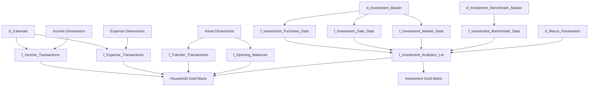
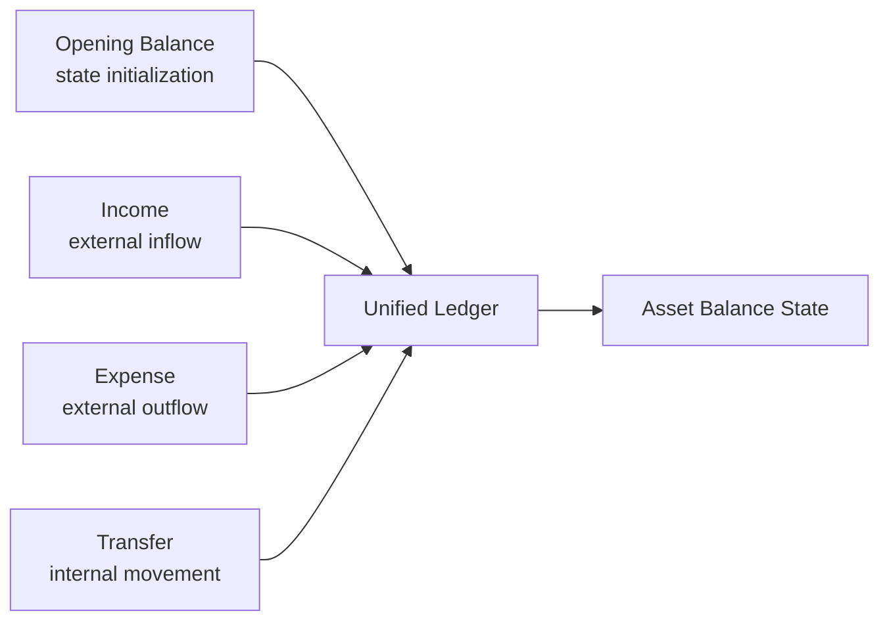
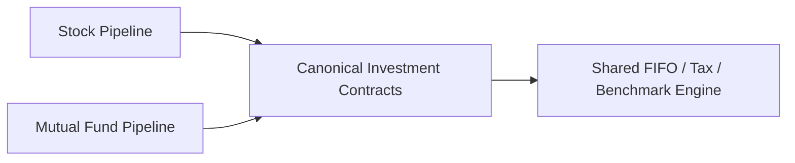

# Data Model

The data model is built around **financial meaning and analytical grain**, not around the shape of source files.

The central modelling boundary is:

```text
Source-shaped Bronze
        ↓
Canonical Silver
        ↓
Decision-oriented Gold
```

A bank column, broker worksheet or vendor label should disappear before it becomes a permanent downstream financial concept.

---

## Model overview



This is a conceptual relationship map, not a claim that every relationship is enforced as a physical foreign key.

---

## Grain is a first-class contract

The registry encodes grain explicitly:

```python
@dataclass
class DataContract:
    contract_id: str
    layer: str
    physical_table: str
    domain: str
    grain: str
    producer: str
    publication_order: int
```

Examples in the hardened registry include:

```python
DataContract(
    "df_p_tf_net_worth_monthly_summary",
    "gold",
    "gold.Wealth_Asset_Breakdown",
    "Wealth",
    "Month-Asset",
    "WealthPresentationEngine",
    110,
)

DataContract(
    "df_f_investment_analytics_isin",
    "gold",
    "gold.Investment_By_ISIN",
    "Investments",
    "Date-ISIN",
    "InvestmentQuantEngine",
    200,
)
```

That matters because:

```text
Month
≠ Month × Asset

Date × ISIN
≠ Date × Class

Date × ISIN × Lot
≠ Date × Portfolio
```

A correct formula over the wrong grain is still the wrong financial answer.

---

## Silver: canonical identity and activity

The current Silver surface contains **20 contracts**.

### Reference / dimensions

```text
d_Calendar
d_Income_Category
d_Income_Subcategory
d_Expense_Category
d_Expense_Subcategory
d_Asset_Category
d_Asset_SubCategory
d_Currency
d_Investment_Benchmark_Master
d_Investment_Master
d_Macro_Parameters
```

### Facts

```text
f_Income_Transactions
f_Expense_Transactions
f_Transfer_Transactions
f_Opening_Balances
f_Investment_Market_Data
f_Investment_Purchase_Data
f_Investment_Sale_Data
f_Investment_Benchmark_Data
f_Investment_Analytics_Lot
```

Silver is where source vocabulary becomes stable financial vocabulary.

---

## Household model

The household model distinguishes four fundamental activity/state types:



These concepts are intentionally separate.

### Opening balance

Initializes state when complete lifetime history is unavailable.

It is not income.

### Income

Represents household inflow under canonical classification.

FinancialRules can further distinguish:

```text
cash
non-cash
active
dividend
interest
```

### Expense

Represents household outflow/consumption.

FinancialRules can classify:

```text
cash
non-cash
core
non-core
```

### Transfer

Moves value between household-controlled assets.

It must not manufacture income or expense.

---

## Investment master is semantic infrastructure

`d_Investment_Master` provides stable instrument identity and analytical classification.

Important concepts include:

```text
ISIN
instrument name
instrument type
subtype
class
sector
industry
benchmark
tax type
```

The Silver loader performs quality checks for fields that downstream financial methodology requires.

For example:

```python
if table_name == "silver.d_Investment_Master":
    if "ISIN" in df.columns:
        missing_isin = df.filter(
            pl.col("ISIN").is_null()
        )

    if "TAX_TYPE" in df.columns:
        missing_tax = df.filter(
            pl.col("TAX_TYPE").is_null()
        )
```

Those are not cosmetic dimensions.

Missing identity or tax classification can invalidate downstream lot/tax analytics.

---

## Investment transaction model

The shared investment engine consumes canonical:

```text
Investment Master
Purchase Data
Sale Data
Market Data
Benchmark Data
Macro / Tax Context
```

That lets stocks and mutual funds converge into one analytical model after asset-specific upstream transformation.



The asset pipeline boundary absorbs source/asset variation.

The investment engine should not need to know which source worksheet produced a purchase.

---

## Lot-level state is the deepest Silver analytical grain

`f_Investment_Analytics_Lot` is the deepest persistent investment analytical fact.

Conceptually:

```text
Date × ISIN × Active Tax Lot
```

It carries state needed for:

- acquisition context,
- quantity,
- cost basis,
- market value,
- holding period,
- tax classification,
- benchmark state,
- realized/unrealized state,
- estimated tax,
- after-tax value,
- return context.

Gold aggregates from this deeper state where appropriate.

---

## Why lot grain matters

Suppose one ISIN has three purchases:

```text
Lot A → 2022
Lot B → 2024
Lot C → 2026
```

At one observation date, those lots can simultaneously have different:

- holding periods,
- tax classifications,
- cost bases,
- unrealized gains/losses,
- benchmark exposure.

Collapsing them too early would destroy information required for tax-aware analytics.

So:

```text
transaction history
      ↓
lot inventory
      ↓
lot analytical state
      ↓
ISIN / class / portfolio aggregation
```

not:

```text
transactions
      ↓
immediate security total
```

---

## Gold is intentionally multi-grain

The 17 Gold marts answer different decision questions.

### Wealth

```text
Core_Monthly_Fact
→ Month

Wealth_Asset_Breakdown
→ Month × Asset
```

### Cash Flow

```text
Cashflow_Expense_Breakdown
→ Month × Expense Category

Cashflow_Income_Breakdown
→ Month × Income Category

Cashflow_Efficiency_Analytics
→ Month

Cashflow_Activity_Summary
→ Month
```

### Planning

```text
Wealth_FIRE_Analytics
→ Month

Forecast_Tax_Liability
→ Month / planning context

Forecast_Budget_Variance
→ Month / budget context
```

### Portfolio management

```text
Investment_Portfolio_Summary
→ Month × ISIN
```

### Investment analytics

```text
Investment_By_ISIN
→ Date × ISIN

Investment_By_Subtype
→ Date × Subtype

Investment_By_Class
→ Date × Class

Investment_By_Instrument_Type
→ Date × Instrument Type

Investment_By_Sector
→ Date × Sector

Investment_By_Industry
→ Date × Industry

Investment_By_Portfolio
→ Date
```

---

## Additivity follows grain

Not every numeric field can be summed.

### Additive

Often valid across compatible dimensions:

```text
income
expense
current value
realized gain/loss
```

### Semi-additive

Balances can aggregate across assets but generally not across time:

```text
cash balance
market value
net worth
```

### Non-additive

Require target-grain methodology:

```text
XIRR
CAGR
max drawdown
allocation weight
rates / ratios
```

For example:

```text
Portfolio XIRR
≠ average(ISIN XIRR)
```

The portfolio cash-flow series must be reconstructed at portfolio grain.

---

## Observed, reconstructed and modelled state

The data model intentionally contains several epistemic categories.

| State | Example |
| --- | --- |
| **Observed** | Broker-reported quantity, market price |
| **Reconstructed** | FIFO lot inventory, household book balance |
| **Derived** | XIRR, savings rate, active return |
| **Estimated** | Tax if sold |
| **Modelled** | FI target |
| **Simulated** | P50 months to FI |

Those values can coexist in one analytical system without pretending they carry the same certainty.

---

## Book, market and after-tax wealth are different states


The distinctions matter for planning.

A book balance can be internally coherent while differing from market value.

Market value can be observable while after-tax liquidation value remains modelled.

---

## Cash flow has its own reconciliation grain

Cash-flow classification is not inferred from net-worth movement.

The system separately reconstructs:

```text
operating
investing
financing
internal transfers
```

and compares calculated movement against actual configured cash-pool movement.

That gives a monthly reconciliation signal rather than merely another categorized expense report.

---

## Canonical model vs source model

A source may call the same concept:

```text
Txn Type
Nature
Movement
Debit/Credit
Order Type
```

The downstream model should not care.

Source adapters/mappings resolve those fields before canonical finance.

This is the main reason the project can support multiple upstream shapes without forcing every analytical engine to become source-aware.

---

## Contract evolution

Changing a canonical or Gold contract can affect:

```text
transformation
engine builders
DataContract registry
DuckDB DDL
Meta row counts
Power BI
documentation
```

That is why physical schemas are treated as interfaces inside the project.

A column rename is not merely cosmetic when external BI consumes it.

---

## Data-model invariants

1. Source vocabulary terminates upstream of canonical finance.
2. Every important analytical dataset has a defined grain.
3. Transfers do not become income/expense.
4. Opening balances initialize state rather than create activity.
5. Tax-lot detail survives until tax-aware aggregation no longer requires it.
6. Non-additive metrics are recomputed at target grain.
7. Observed and modelled values remain distinguishable.
8. Gold marts exist for decisions, not because intermediate frames exist.
9. Physical contract changes are treated as interface changes.

---

## Go deeper

- [Silver Data Contracts](../reference/silver-data-contracts.md)
- [Gold Data Contracts](../reference/gold-data-contracts.md)
- [Financial Model](../finance/financial-model.md)
- [Investment Analytics](../finance/investment-analytics.md)
- [Metrics & Methodology](../finance/metrics-and-methodology.md)

[← Architecture Home](README.md) · [← Documentation Home](../README.md)
