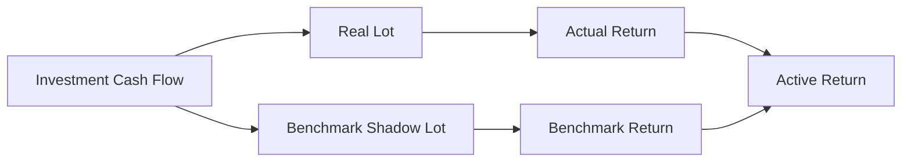

# Design Decisions

This page documents the architectural choices that are easiest to misunderstand when viewed only from the final code.

The pattern is:

```text
Problem
→ decision
→ production evidence
→ benefit
→ trade-off
```

These are not claims that the chosen architecture is universally superior.

They are the choices that fit this workload.

---

## 1. SQLite for the Control Plane

### Problem

The system needs durable local ownership of:

- raw evidence,
- artifact identity,
- hashes,
- synchronization state,
- runs,
- failures,
- configuration provenance,
- execution logs.

This is operational state, not analytical fact modelling.

### Decision

Use SQLite as the authoritative Control Plane.

### Production evidence

```python
class ControlPlane:
    def __init__(self, base_path: str, db_name: str = "Raw_Documents.sqlite"):
        self.db = SQLiteManager(base_path, db_name)
        self.artifacts = ArtifactRepository(self.db)
        self.runs = RunRepository(self.db)
        self.file_sync = FileSyncService(self.artifacts)
```

### Benefit

One local transactional system owns operational truth.

### Trade-off

The application now coordinates two databases.

That creates a small cross-database commit window that does not exist in a single-database design.

---

## 2. DuckDB for analytical state

### Problem

The system needs persistent local columnar analytics, SQL inspection, fast rebuilds, and Power BI serving.

### Decision

Use one embedded DuckDB file for:

```text
Bronze
Silver
Gold
Meta
```

### Production evidence

```python
self._conn = duckdb.connect(self.db_path)

self._conn.execute(
    f"PRAGMA memory_limit='{mem_gb}GB'"
)
self._conn.execute("PRAGMA threads=4")
```

### Benefit

No database server is required for a single-user analytical workload.

### Trade-off

This is not designed as a multi-user transactional warehouse.

That is acceptable because the workload is local-first by design.

---

## 3. Separate operational truth from analytical truth

### Problem

Before the Control Plane existed, Meta naturally accumulated responsibilities because DuckDB was the only database.

Once durable raw state was introduced, that ownership became ambiguous.

### Decision

Move historical operational authority into SQLite and keep DuckDB Meta lean.


### Benefit

There is one answer to:

> Which system owns run history?

SQLite.

### Trade-off

Operational-history queries no longer live beside analytical marts in one database.

That is a good trade for clearer ownership.

---

## 4. Persist raw payload bytes

### Problem

A filesystem path can disappear or mutate after ingestion.

### Decision

Persist actionable source bytes in `cp_file_payloads`.

```sql
CREATE TABLE IF NOT EXISTS cp_file_payloads (
    file_id TEXT PRIMARY KEY,
    file_bytes BLOB,
    FOREIGN KEY(file_id)
        REFERENCES cp_file_registry(file_id)
        ON DELETE CASCADE
);
```

### Benefit

Raw evidence survives independently from source-folder availability.

### Trade-off

Storage is duplicated.

For personal financial evidence, recoverability is worth more to me than minimizing disk usage.

---

## 5. Content-address configuration snapshots

### Problem

A run needs reproducibility context, but copying the same configuration payload every run creates unnecessary duplication.

### Decision

Hash canonical Settings and FinancialRules payloads.

```python
rules_hash = hashlib.sha256(
    rules_json.encode("utf-8")
).hexdigest()

rules_id = f"snap_rule_{rules_hash[:12]}"
```

### Benefit

Identical policy maps to identical snapshot identity.

### Trade-off

The snapshot proves configuration identity, not full historical replay if code/schema later changes.

---

## 6. Persistent Bronze, rebuilt Silver/Gold

### Problem

The production source population is large and continuously growing:

```text
1,608 artifacts as of 24 Sep 2026
+ ~2 broker snapshots/day
```

Reparsing everything every run wastes work.

But incremental propagation through every downstream financial dependency increases correctness complexity.

### Decision

Use:

```text
incremental Raw/Bronze
+
deterministic Silver/Gold rebuild
```

### Benefit

The expensive/growing source side is incrementalized while downstream financial state remains simple to reason about.

### Trade-off

Derived analytics recompute every run.

At the current workload, the full pipeline still completes in roughly **14–17 seconds**, so the correctness trade remains attractive.

---

## 7. Source semantics decide Bronze replacement

### Problem

Not all sources mean the same thing.

A daily broker snapshot is historical evidence.

A current mapping/master can represent only the latest valid reference state.

### Decision

Support both:

```text
file-aware historical replacement
and
full replacement
```

### Benefit

Persistence semantics match source semantics.

### Trade-off

Bronze loading is slightly more complex than one universal append strategy.

That complexity is justified because the alternatives would either duplicate history or destroy it.

---

## 8. Canonical finance before analytics

### Problem

Bank/broker/source schemas change and differ.

Financial engines should not encode every source vocabulary.

### Decision

Resolve source structure into canonical financial contracts before downstream analytics.

```text
source adapter / mapping
        ↓
canonical finance
        ↓
shared engine
```

### Benefit

Investment/wealth engines depend on stable concepts.

### Trade-off

The transformation layer must carry the burden of semantic normalization.

That is exactly where I want that complexity to live.

---

## 9. Polars LazyFrames for dataframe work

### Problem

The pipeline performs many composable transformations and presentation calculations.

### Decision

Use Polars LazyFrames where transformations can remain declarative.

Independent presentation graphs are collected together:

```python
results = pl.collect_all(
    lazy_frames,
    engine="streaming",
)
```

### Benefit

Vectorized expressions, optimizer visibility, streaming execution, and reduced Python row iteration.

### Trade-off

Lazy execution can make debugging less immediate than eager step-by-step dataframes.

I materialize at persistence/algorithm boundaries where explicit state matters.

---

## 10. Do not force FIFO into dataframe vectorization

### Problem

Tax-lot disposal is stateful.

Each sale changes the inventory available to the next sale.

### Decision

Use explicit stateful lot objects/queues.

```text
purchase
→ create lot

sale
→ consume oldest active lot
→ possibly retain remainder
```

### Benefit

The implementation maps directly to the financial methodology.

### Trade-off

This part is less naturally vectorized.

Correct state semantics matter more than forcing every workload into the same compute style.

---

## 11. Per-ISIN multiprocessing

### Problem

Instrument calculations are naturally separable, but each instrument has stateful lot history.

### Decision

Use ISIN as a process-isolation boundary.

### Benefit

Parallelism without sharing mutable lot inventory across instruments.

### Trade-off

Worker inputs/results must remain serializable and failures need explicit propagation.

The latter is now enforced: a failed ISIN fails the analytical stage.

---

## 12. Broker state anchors current truth

### Problem

Transaction history can be incomplete while the broker still reports authoritative current position state.

### Decision

Reconcile reconstructed inventory against broker-reported current quantity/cost.

> **Transactions explain history; broker state anchors current truth.**

### Benefit

Current portfolio state can reconcile even when source history has gaps.

### Trade-off

Adjustment/reconciliation inventory can complicate historical tax interpretation.

The docs therefore distinguish reconstructed history from reconciled current state.

---

## 13. Shadow benchmark portfolios

### Problem

Comparing an investment return with an unrelated index CAGR ignores the timing of actual capital deployment.

### Decision

Create benchmark-equivalent exposure when real capital is invested and reduce it proportionally when real lots are disposed.



### Benefit

Benchmark comparison respects cash-flow timing.

### Trade-off

Benchmark state becomes another lot-like state machine to maintain.

That complexity buys a financially better comparison.

---

## 14. XIRR is recomputed at target grain

### Problem

Returns are non-additive.

### Decision

Reconstruct cash flows at ISIN/class/portfolio grain rather than averaging child XIRRs.

```text
Portfolio XIRR
≠ average(ISIN XIRR)
```

### Benefit

Return methodology matches the analytical object.

### Trade-off

Aggregation is more expensive than a simple group-by average.

Correct finance wins.

---

## 15. Financial policy belongs in `FinancialRules`

### Problem

Thresholds and classifications that affect financial meaning become invisible if scattered through analytical code.

### Decision

Use validated Pydantic policy.

```python
class PortfolioManagementRules(BaseModel):
    rebalance_tolerance_pct_points: float = Field(
        default=5.0,
        ge=0.0,
    )
```

### Benefit

Policy is inspectable, validated and snapshot-able.

### Trade-off

Configuration grows.

The guardrail is:

> **Parameters belong in configuration. Different behaviour belongs behind strategies.**

---

## 16. Explicit Data Contract Registry

### Problem

Layer/table identity becomes brittle if inferred from internal DataFrame names.

### Decision

Register analytical contracts explicitly.

```python
@dataclass
class DataContract:
    contract_id: str
    layer: str
    physical_table: str
    domain: str
    grain: str
    producer: str
    publication_order: int
```

### Benefit

One compact source describes publication identity.

### Trade-off

Registry metadata must be maintained accurately.

That is still preferable to hidden naming conventions.

---

## 17. Curated Gold instead of metric accumulation

### Problem

A calculation can be mathematically interesting while providing no useful decision support.

Earlier versions accumulated more institutional-style risk metrics than the personal decision workflow needed.

### Decision

Remove unused metrics and their processing.

The current serving model retains measures such as:

```text
XIRR
After-Tax XIRR
Benchmark XIRR
Active Return
Max Drawdown
tax-aware state
```

### Benefit

Smaller conceptual surface and less compute.

The production-hardening cycle reduced the current end-to-end runtime from roughly **23 seconds** to **14–17 seconds** on my workload while preserving financial outputs.

### Trade-off

The platform intentionally does not attempt to be a general institutional quant library.

Good.

---

## 18. Application-coordinated transactions instead of distributed 2PC

### Problem

SQLite and DuckDB are independent embedded databases.

### Decision

Coordinate begin/commit/rollback from the orchestrator.

### Benefit

Simple local operational model.

### Trade-off

No formal atomic commit across both databases.

The docs say exactly that.

Adding distributed transaction infrastructure would be disproportionate to the current single-user local workload.

---

## 19. Documentation is manifest-driven

### Problem

Hard-coded guide lists became brittle once the documentation tree grew.

### Decision

Use:

```text
manifest.json
→ DocsCatalog
→ DocsRenderer
→ CLI / GUI
```

### Benefit

One authoritative documentation tree can serve several application surfaces.

### Trade-off

The manifest becomes another small contract to maintain.

That is preferable to hard-coded UI navigation.

---

## 20. Local-first by default

### Problem

Financial data is sensitive, and the workload does not require cloud-scale infrastructure.

### Decision

Keep ingestion, persistence, analytics, simulation and application surfaces local.

### Benefit

Privacy, portability, low operational overhead, direct access to local business tools.

### Trade-off

The system does not gain cloud-native multi-user scalability by default.

I do not consider that a missing feature for this workload.

---

## Decision filter

When considering a new abstraction or dependency, I ask:

```text
Does the current workload require it?
Does it make financial behaviour clearer?
Does it reduce hidden assumptions?
Does it improve recovery / correctness?
Does it preserve a useful boundary?
```

If not, it probably does not belong yet.

---

## Related documentation

- [System Architecture](system-architecture.md)
- [Data Lifecycle](data-lifecycle.md)
- [Warehouse Architecture](warehouse-architecture.md)
- [Reliability & Recovery](reliability-and-recovery.md)
- [Roadmap](../about/roadmap.md)

[← Architecture Home](README.md) · [← Documentation Home](../README.md)
