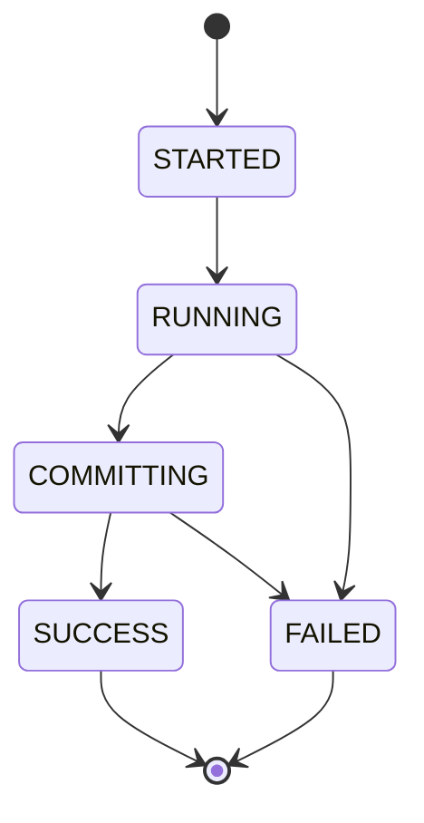
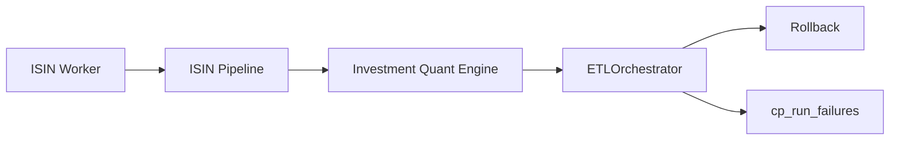
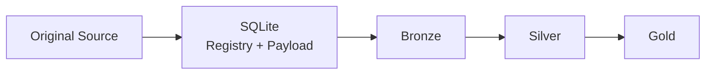

# Reliability & Recovery

Financial analytics can fail in two dangerous ways:

```text
obviously
→ pipeline crashes

quietly
→ pipeline succeeds with incomplete or inconsistent state
```

The second failure mode is worse.

The reliability architecture therefore focuses on explicit run state, fatal analytical failures, coordinated rollback, durable evidence, and deterministic recovery.

---

## Reliability model



The run lifecycle lives in the SQLite Control Plane.

---

## Run creation survives analytical failure

A run is registered before the main transaction begins:

```python
run_id = cp.runs.start_run(
    cfg_json=self.cfg.model_dump_json(),
    rules_json=self.rules.model_dump_json() if self.rules else None,
)
```

`start_run()` also records:

```text
application version
schema version
Settings snapshot
FinancialRules snapshot
started_at
status = STARTED
```

The run therefore has an identity even if later analytical work is rolled back.

---

## Configuration provenance is immutable by content

Settings and FinancialRules are hashed:

```python
cfg_hash = hashlib.sha256(
    cfg_json.encode("utf-8")
).hexdigest()

settings_id = f"snap_set_{cfg_hash[:12]}"
```

Then persisted with:

```sql
INSERT OR IGNORE
```

The same configuration payload does not need a new duplicate snapshot every run.

A run references the snapshot identity instead.

This improves both deduplication and reproducibility context.

---

## Coordinated local transactions

The orchestrator begins both transactions:

```python
self.db_manager.conn.execute("BEGIN TRANSACTION")
cp.begin_transaction()
```

On success:

```python
cp.runs.update_run_status(
    run_id,
    "COMMITTING",
)

self.db_manager.conn.execute("COMMIT")
cp.commit()

cp.runs.finish_run(
    run_id,
    "SUCCESS",
)
```

This gives the application a coherent local commit protocol.

But the boundary is important:

> **This is application-coordinated transaction management across SQLite and DuckDB, not distributed two-phase commit.**

There remains a narrow theoretical failure window between independent commits.

For the current local workload, I accept that trade-off rather than introducing distributed transaction machinery.

---

## Rollback path

Any exception enters the rollback path:

```python
try:
    self.db_manager.conn.execute("ROLLBACK")
except Exception as rollback_err:
    logger.error(
        f"Failed to rollback DuckDB transaction: {rollback_err}"
    )

try:
    cp.rollback()
except Exception as rollback_err:
    logger.error(
        f"Failed to rollback SQLite Raw Store transaction: {rollback_err}"
    )
```

Rollback failures are themselves logged.

The system does not assume rollback is infallible.

---

## Failure history is written after rollback

The pipeline then records structured failure context:

```python
cp.runs.log_run_failure(
    run_id=run_id,
    failed_isin=None,
    stage="Pipeline",
    error_type=type(exc).__name__,
    error_message=str(exc),
    traceback_log=traceback.format_exc(),
)
```

And closes the lifecycle:

```python
cp.runs.finish_run(
    run_id,
    "FAILED",
)
```

The analytical transaction can disappear while the operational fact that it failed survives.

That is the key reliability property.

---

## Per-ISIN failure is not tolerated silently

Investment analytics run across instrument boundaries.

A worker failure is propagated rather than converted into an empty result.



The failure record can carry:

```text
failed_isin
stage
error_type
error_message
traceback
```

The production rule is:

> **An incomplete portfolio must not look like a successful portfolio.**

---

## Execution logs become run evidence

The complete execution log is stored against the run.

This complements structured failure fields.

Structured fields answer:

```text
what failed?
where?
which ISIN?
what exception?
```

The execution log answers:

```text
what happened around it?
```

Both are useful.

---

## Raw evidence creates a recovery boundary

The strongest recovery property is independent raw persistence.



If derived analytical state is lost while the Control Plane survives, the system still has the source evidence needed to reconstruct it.

That is fundamentally different from a pipeline whose only copy of the input is a transient filesystem location.

---

## Self-healing DuckDB registry

Before normal processing, Meta compares the DuckDB file registry with authoritative Control Plane state.

If an artifact exists in SQLite but not analytically:

```python
cp.artifacts.db.conn.execute(
    """
    UPDATE cp_file_registry
    SET sync_status = 'PENDING_BRONZE'
    WHERE relative_path = ?
    """,
    [path],
)
```

The artifact is reintroduced into the Bronze synchronization path.

This is a small mechanism with an important ownership implication:

```text
SQLite can repair DuckDB state
DuckDB does not redefine SQLite truth
```

---

## Deterministic rebuild reduces recovery complexity

Once Bronze is complete:

```text
Bronze
→ canonical transform
→ investment / wealth engines
→ Silver
→ Gold
```

Silver and Gold are rebuilt rather than incrementally repaired.

That means recovery does not need a separate algorithm for every downstream mart.

The normal production path is also the rebuild path.

That is valuable.

---

## `PENDING_BRONZE` is an operational invariant

Artifact state distinguishes:

```text
persisted raw evidence
```

from:

```text
successfully represented in Bronze
```

The lifecycle is:

```text
new / changed artifact
        ↓
PENDING_BRONZE
        ↓
successful extraction + Bronze write
        ↓
SYNCED
```

If synchronization is incomplete, the artifact remains actionable.

---

## What recovery does not guarantee

### Immutable historical replay

Rebuilding old raw evidence today can use newer:

- code,
- schema,
- FinancialRules,
- tax logic.

Configuration snapshots improve provenance, but the current system is not an immutable historical build system.

### Distributed atomicity

SQLite and DuckDB do not share one physical transaction manager.

### Complete lineage graph

The Control Plane does not yet normalize every:

```text
run → artifact → Bronze partition → Silver contract → Gold contract
```

edge into dedicated lineage tables.

### Complete system snapshots

The current DuckDB snapshot utility protects the analytical database.

Now that SQLite is authoritative for operational history, the stronger future backup model is a coordinated bundle containing both databases.

These are known boundaries.

---

## Snapshot architecture: current vs stronger future model

### Current

```text
DuckDB snapshot
→ analytical state protected
```

### Stronger future model

```text
Snapshot Bundle
├── Personal_Finance_DB.duckdb
└── Raw_Documents.sqlite
```

The second model better matches current ownership.

It is a future hardening opportunity rather than a requirement for the current pipeline to operate correctly.

---

## Data quality and reliability meet in Silver

Some failures are not infrastructure failures.

For example, missing investment identity/tax classification is a financial-contract problem.

The Silver loader explicitly checks important fields:

```python
if table_name == "silver.d_Investment_Master":
    if "ISIN" in df.columns:
        missing_isin = df.filter(
            pl.col("ISIN").is_null()
        )

    if "TAX_TYPE" in df.columns:
        missing_tax = df.filter(
            pl.col("TAX_TYPE").is_null()
        )
```

A pipeline can be technically healthy while its financial contract is incomplete.

Reliability therefore includes semantic quality, not just process uptime.

---

## Failure classes

| Failure | Example | Expected behaviour |
| --- | --- | --- |
| Source | unreadable file | fail actionable ingestion |
| Contract | missing critical identity | surface financial data-quality problem |
| Worker | ISIN analytics exception | fail investment stage/run |
| Persistence | DuckDB write failure | rollback |
| Control Plane | SQLite write failure | fail run / surface operational error |
| Simulation | invalid configured assumptions | validation or analytical failure |
| Frontend | UI rendering issue | should not redefine backend financial state |

---

## Reliability principles

1. Runs have explicit lifecycle state.
2. Failure history survives rollback.
3. Worker failures cannot silently reduce the portfolio.
4. Raw evidence survives independently from derived analytics.
5. Recovery flows from authoritative Control Plane state.
6. Complete Bronze enables deterministic rebuild.
7. Rollback errors are observable.
8. Configuration provenance is content-addressed.
9. Semantic data quality is part of reliability.
10. Cross-database atomicity is described honestly.

---

## Go deeper

- [System Architecture](system-architecture.md)
- [Data Lifecycle](data-lifecycle.md)
- [Warehouse Architecture](warehouse-architecture.md)
- [Meta Data Contracts](../reference/meta-data-contracts.md)

[← Architecture Home](README.md) · [← Documentation Home](../README.md)
