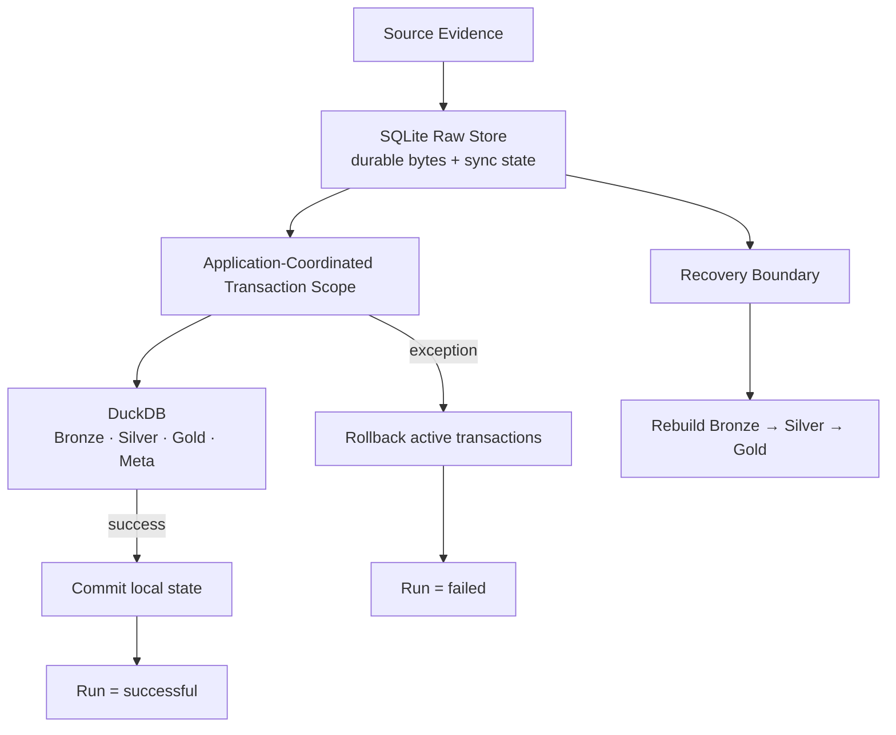
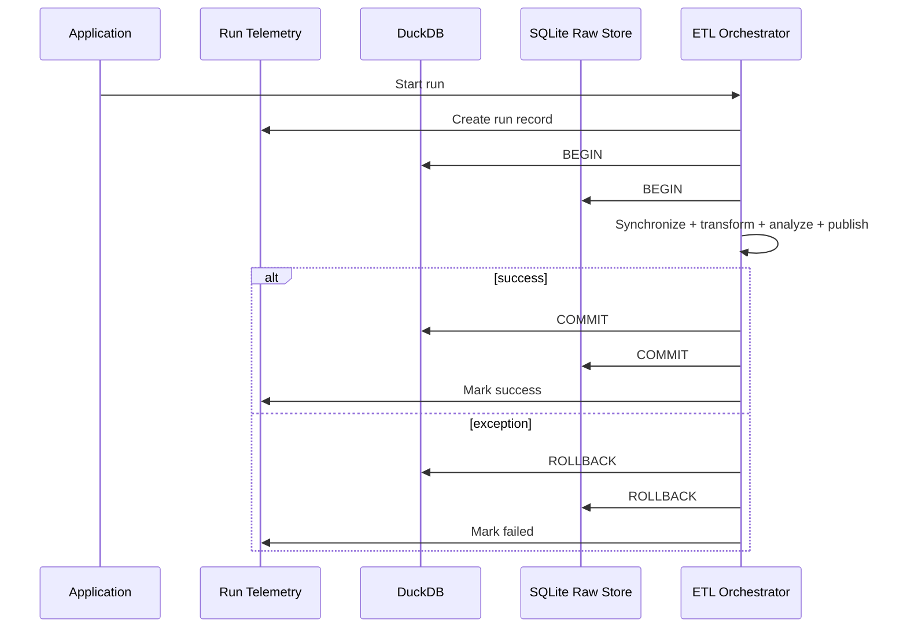
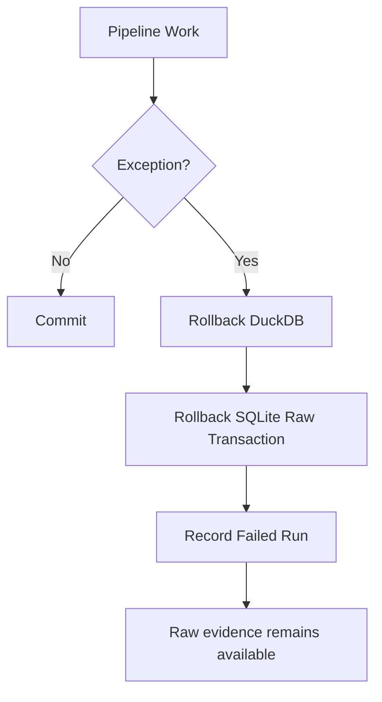
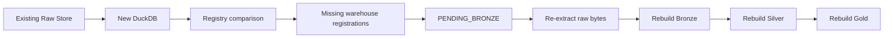
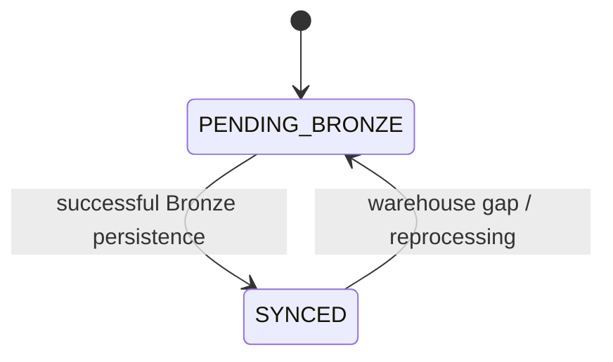
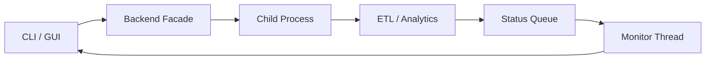

# Reliability & Recovery

Personal Finance ETL is a local analytical system, but I still want failure behaviour to be explicit.

Financial analytics are only useful when I can distinguish:

- durable source evidence,
- synchronized ingestion state,
- successfully published analytical state,
- failed execution,
- and recoverable derived state.

This document explains the reliability model across SQLite, DuckDB, orchestration, run telemetry, snapshots, and reconstruction.

> The goal is not to pretend a local application has distributed-systems guarantees it does not have. The goal is to make the guarantees it *does* provide precise.

---

## Reliability model at a glance



The architecture separates **durability of evidence** from **success of analytical publication**.

---

## Reliability objectives

## Preserve source evidence

A downstream analytical failure should not require the original source file to be re-created from memory.

The Raw Store persists the artifact that entered the platform.

## Avoid partial analytical publication where possible

The orchestrator coordinates DuckDB and SQLite transaction scopes so failed work is rolled back rather than intentionally published as successful state.

## Keep failures observable

Run telemetry should survive long enough to show that a run failed.

## Make derived state reconstructable

Bronze, Silver, and Gold have different recovery roles, with Raw providing the strongest upstream reconstruction boundary.

## Be precise about guarantees

The system does **not** implement a distributed two-phase commit coordinator.

That matters because overstating transactional guarantees is worse than having a simpler but accurately documented model.

---

## Transaction architecture

The pipeline coordinates a DuckDB analytical transaction with a SQLite Raw Store transaction.

Conceptually:



This is **application-coordinated transactional consistency**.

It is not formal distributed two-phase commit.

---

## Why this is not two-phase commit

A true distributed two-phase commit protocol has an explicit prepare phase and transaction coordinator capable of ensuring a coordinated distributed outcome.

The current architecture instead performs local database transactions under application orchestration.

The commits occur sequentially.

Therefore a narrow theoretical failure window exists where one local commit could succeed and a later commit fail.

Documenting the system as "Two-Phase ACID" would overstate the guarantee.

The correct description is:

> **Application-coordinated transactions across two local persistence engines.**

For the current local workload, this provides useful rollback behaviour without introducing a distributed transaction coordinator.

---

## Run telemetry lifecycle

Run telemetry has a slightly different lifecycle from the analytical transaction.

A run record is started before the main analytical work completes.

That is useful because failure should remain observable even when analytical changes are rolled back.

Conceptually:

```text
Create run telemetry
        ↓
Begin analytical/raw transactions
        ↓
Execute pipeline
        ↓
success? ── no ─→ rollback → mark failed
   │
  yes
   ↓
commit state
   ↓
mark successful
```

Operational history therefore does not disappear simply because the analytical transaction failed.

---

## Raw Store durability

The SQLite Raw Store is the strongest upstream recovery boundary.

It persists:

- source registry state,
- fingerprints,
- synchronization status,
- and source payload bytes.

This means the platform can retain the evidence that entered the system independently from the current DuckDB warehouse.

## SQLite workload tuning

The Raw Store uses SQLite features/settings appropriate to local transactional metadata/BLOB persistence, including WAL-oriented operation and local performance pragmas.

Those settings support the workload; they are not a substitute for backup.

---

## DuckDB analytical durability

DuckDB owns:

- Bronze,
- Silver,
- Gold,
- and Meta.

The database is configured as the local analytical runtime rather than the raw artifact archive.

Runtime settings can account for local machine resources such as memory and thread availability.

On normal shutdown, maintenance operations such as checkpointing/compaction can help leave the analytical file in a clean local state.

---

## Failure lifecycle

When an exception escapes the pipeline, the intended lifecycle is:



The key distinction is:

> **A failed analytical build is not equivalent to lost financial evidence.**

That is one of the main reasons Raw is separate from the warehouse.

---

## Recovery from analytical warehouse loss

If DuckDB is recreated while the Raw Store survives, the system can detect that persisted raw artifacts are not represented in the new warehouse registry/state.

Those artifacts can be returned to the Bronze synchronization path.



This gives the architecture a useful reconstruction property.

---

## Recovery is not immutable historical replay

This distinction is important.

Reprocessing old raw evidence later can use:

- newer application code,
- newer transformation logic,
- newer financial rules,
- newer configuration,
- or newer schema contracts.

Therefore:

> **Recoverability means I can reconstruct analytical state from preserved evidence. It does not automatically mean I can reproduce the exact historical output of an arbitrary old software version.**

Stronger historical reproducibility would require explicit version/configuration fingerprints and potentially versioned transformation contracts.

That is a future hardening opportunity.

---

## Deterministic rebuilds as a reliability strategy

Silver and Gold are rebuilt rather than incrementally patched across every dependency.

This reduces several failure classes.

Without deterministic reconstruction, the system would need to reason about:

- stale rolling metrics,
- partially invalidated portfolio aggregates,
- historical FIRE periods affected by rule changes,
- configuration-driven restatements,
- and dependency-specific incremental repair.

Instead:

```text
Complete Bronze state
      +
Current rules/configuration
      +
Current analytical code
      ↓
Rebuild Silver
      ↓
Rebuild Gold
```

The cost is compute.

The reliability benefit is simpler state semantics.

---

## Source synchronization reliability

The Raw Store state machine prevents "seen" from being confused with "synchronized."



A source can therefore remain pending until the Bronze side of the contract is satisfied.

This is a small state model with an important operational effect.

---

## Source lineage and repair

Historical Bronze records retain source identity such as `__file_name__`.

That allows changed-file repair to be localized:

```text
changed file
   ↓
remove old Bronze partition
   ↓
insert replacement partition
```

Unrelated source history remains intact.

This is simpler than rebuilding all Bronze history and safer than blindly appending duplicate versions of the same source.

---

## Reference-source replacement

Reference datasets use a different repair model.

When the current reference source changes, replacing the complete Bronze representation can be more correct than retaining historical file partitions.

This is another reliability choice based on source semantics.

The architecture does not use incrementality as an ideology.

---

## Benchmark-data reliability

External benchmark data has its own failure/recovery considerations.

Fetched history is serialized into virtual Parquet artifacts and persisted through the Raw Store before becoming Bronze benchmark state.

That provides:

- provenance,
- replayability,
- and protection from treating an external API response as ephemeral analytical truth.

If benchmark coverage is already present, the pipeline avoids unnecessary refetching.

---

## Data-quality safeguards

Reliability is not only database durability.

Financial correctness also depends on domain validity.

The production path contains explicit checks around important canonical fields, including critical investment identity/tax information.

The analytical models also contain reconciliation concepts such as:

- broker quantity/cost reconciliation,
- cash-flow unreconciled difference,
- and source-to-Bronze synchronization state.

These are domain-specific quality mechanisms.

I prefer strengthening financial contracts where meaning is known rather than relying only on generic null/duplicate checks.

---

## Broker reconciliation as reliability

The investment engine treats current broker-reported position state as an anchor when reconstructed transaction state disagrees.

This is a reliability policy for messy real-world financial history.

It acknowledges that:

- historical transactions can be incomplete,
- corporate actions can complicate reconstruction,
- imported opening positions can exist,
- and broker corrections can occur.

The trade-off is that reconciliation adjustments can affect lot interpretation.

That policy should therefore remain explicit and documented.

---

## Cash-flow reconciliation as reliability

The household model independently checks whether classified financial activity explains actual cash movement.

Conceptually:

```text
Opening cash
 + operating activity
 + investing activity
 + financing activity
 + internal-transfer treatment
 = calculated closing cash
```

The model compares this with actual closing cash and surfaces an unreconciled difference.

This is a financial reliability mechanism rather than an infrastructure one.

---

## Application process isolation

The desktop/interactive application does not run the entire ETL workload directly in the GUI event loop.

Heavy pipeline execution occurs in a child process.



This provides:

- UI responsiveness,
- cleaner failure isolation,
- and a clearer boundary between presentation and analytical execution.

---

## Snapshots

The backend facade supports database snapshot workflows.

Snapshots provide an additional operational safety mechanism around the analytical DuckDB state.

They should be treated as complementary to the Raw Store:

- **Raw Store** protects source evidence and supports reconstruction.
- **Snapshots** protect a point-in-time analytical database state.

Those solve different recovery problems.

---

## Observability

Current observability is primarily local and operational.

Meta provides:

- run logging,
- file registry state,
- table row counts,
- settings snapshots,
- and financial-rules snapshots.

The application also emits execution status for interactive surfaces.

This is sufficient for the current personal workload, but it is not a full distributed observability stack.

That is intentional.

---

## Current reliability gaps and hardening opportunities

The archaeology phase identified several areas worth hardening.

## Per-ISIN worker failures

Worker-level investment exceptions should be surfaced with enough context that an instrument cannot silently disappear from otherwise successful analytics.

For financial computation, I prefer explicit partial-failure policy or fail-fast behaviour over silent omission.

## Meta layer identity

Meta should eventually use explicit dataset/layer mappings rather than infer physical layer identity from internal DataFrame naming conventions.

## Configuration/version fingerprints

Capturing values such as:

```text
application_version
schema_version
settings_hash
financial_rules_hash
git_commit
```

would improve historical reproducibility.

## Semantic naming

Fields whose names overstate their methodology should be renamed or clarified.

Examples discovered during archaeology include monthly market-value change being named as a return and lot-outperformance rate being labelled as probability.

These are semantic reliability issues.

## Residual computation

Older risk machinery that no longer survives into the serving contract should be removed or simplified if nothing still consumes it.

Dead analytical work increases complexity without improving decisions.

---

## Backup and disaster-recovery perspective

The current architecture improves recoverability, but it does not remove the need for backups.

A robust personal operating practice should consider protecting:

- the Raw SQLite store,
- configuration and financial-rules files,
- source/reference inputs,
- and optionally DuckDB snapshots.

Because the project is local-first, backup responsibility also remains local unless I deliberately integrate another storage strategy.

The software architecture can make reconstruction possible; it cannot recover a disk that lost every copy of the evidence.

---

## Reliability boundaries

It is useful to state what the system does and does not guarantee.

## The architecture does provide

- durable local raw artifact persistence,
- explicit source synchronization state,
- local database transactions,
- application-coordinated rollback,
- failed-run telemetry,
- deterministic Silver/Gold reconstruction,
- warehouse-loss reconstruction from surviving Raw state,
- financial reconciliation mechanisms,
- and process isolation for heavy execution.

## The architecture does not currently claim

- distributed two-phase commit,
- immutable historical replay across arbitrary software versions,
- multi-node high availability,
- remote disaster recovery,
- exactly-once distributed event processing,
- or universal source correctness.

Those are different problem classes.

---

## Reliability invariants

I want future changes to preserve these properties unless I intentionally redesign them.

1. **Failed analytical publication does not imply lost raw evidence.**
2. **Source synchronization state remains explicit.**
3. **A run is not marked successful before persistence commits complete.**
4. **Silver and Gold remain reconstructable from valid upstream state.**
5. **Operational failure remains observable.**
6. **Financial reconciliation differences remain visible rather than silently hidden.**
7. **Frontends remain isolated from heavy analytical execution.**
8. **Transactional guarantees are documented precisely rather than overstated.**
9. **Recovery and historical reproducibility remain distinct concepts.**
10. **Financial correctness is treated as part of reliability, not only database durability.**

---

## Related documentation

Continue with:

- [Data Lifecycle](data-lifecycle.md) — the normal and failure paths through the platform.
- [Warehouse Architecture](warehouse-architecture.md) — persistence semantics by layer.
- [Design Decisions](design-decisions.md) — the trade-offs behind the reliability model.
- [Meta Data Contracts](../reference/meta-data-contracts.md) — operational/control tables.
- [Running the Pipeline](../getting-started/running-the-pipeline.md) — operational execution.
- [Investment Analytics](../finance/investment-analytics.md) — broker reconciliation and investment methodology.
- [Cash Flow & Wealth](../finance/cashflow-and-wealth.md) — household reconciliation methodology.

[← Architecture Home](README.md) · [← Documentation Home](../README.md)
