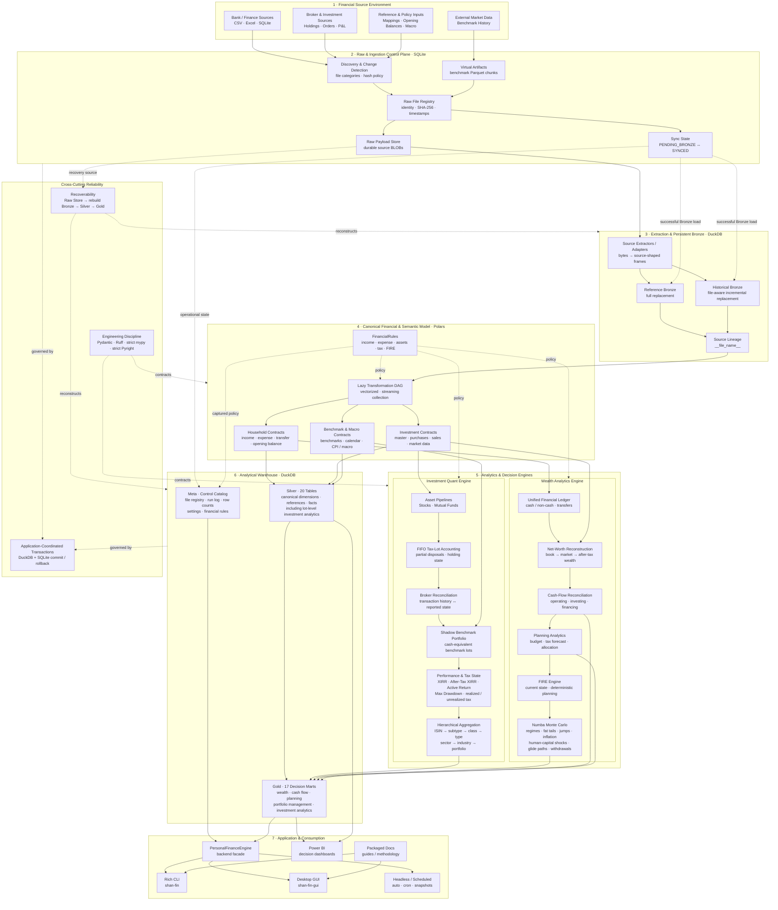
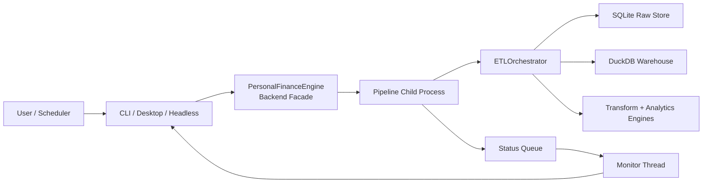
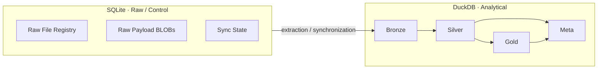
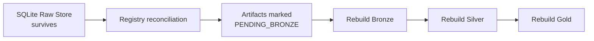
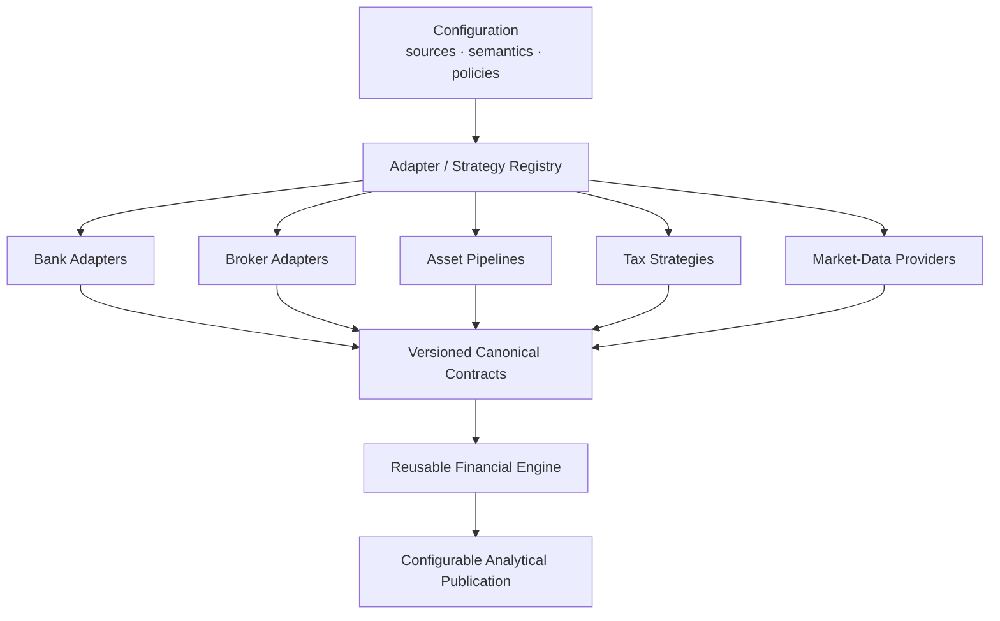

# System Architecture

Personal Finance ETL is a **local-first financial data and decision-support platform** built around one end-to-end financial lineage.

I designed the system so raw financial evidence is preserved independently from derived analytics, source-specific formats are resolved before downstream computation, financial meaning is represented explicitly, and decision-support outputs can be rebuilt from canonical state.

This document explains the system as a whole: its architectural planes, runtime boundaries, persistence model, analytical engines, technology roles, control flow, extension seams, and current portability boundary.

> **If you only read one architecture document, read this one.**  
> For the record-by-record journey through the pipeline, continue with [Data Lifecycle](data-lifecycle.md).

---

### Architecture at a glance



#### How to read the diagram

The solid path represents the primary financial-data lineage.

Dotted paths represent cross-cutting concerns such as:

- financial policy,
- synchronization state,
- transaction coordination,
- recoverability,
- and engineering contracts.

The system deliberately separates **source persistence**, **canonical financial semantics**, **analytical computation**, **serving contracts**, and **application surfaces**.

---

### Architectural goals

The architecture grew against a real financial workload rather than a synthetic reference application.

I optimize for several properties.

#### Local-first operation

Financial data is intended to remain on the machine.

The core analytical stack does not require a cloud warehouse or hosted application backend.

#### Reproducibility

Derived financial state should be reconstructable from persisted evidence and explicit rules.

#### Traceability

I want to know which source artifact contributed to persistent source-shaped data and which configuration/rules governed a run.

#### Financial semantic consistency

The household ledger, investment engine, tax model, cash-flow model, wealth model, and FIRE engine should operate on compatible financial concepts rather than independently interpreting raw files.

#### Decision-oriented analytics

The serving model should expose metrics and grains that support real decisions rather than publishing every intermediate calculation.

#### Extensibility without premature generalization

The current system solves my financial environment first.

Where behaviour genuinely varies, I introduce seams such as asset pipelines, configuration models, or future adapter/strategy boundaries. I do not try to encode every possible financial institution or jurisdiction before I have a real workload that needs it.

---

## The architectural planes

### 1. Financial source environment

The platform begins with heterogeneous financial evidence.

Current source families include:

- CSV,
- Excel,
- SQLite,
- broker/investment statements,
- mapping and reference files,
- opening balances,
- macro parameters,
- and externally acquired benchmark history.

The source environment is intentionally treated as **evidence**, not as the financial model itself.

A broker column name, worksheet layout, or bank-specific record shape should not leak deep into the analytical engines.

That separation is one of the most important boundaries in the architecture.

---

### 2. Raw & ingestion control plane

The Raw Document Store is a dedicated SQLite database.

It is responsible for more than staging files.

Conceptually, it owns three things:

```text
Raw source persistence
        +
Change / registry state
        +
Bronze synchronization state
```

#### Raw file registry

The registry tracks information such as:

- file identity,
- relative path,
- category,
- physical type,
- SHA-256 fingerprint,
- file size,
- first ingestion,
- last ingestion,
- and synchronization status.

#### Raw payload persistence

The source bytes themselves are stored as BLOBs.

This creates an important boundary:

> The analytical warehouse does not need the original source file to remain unchanged forever in order to preserve the evidence that entered the system.

#### Synchronization state

The Raw Store tracks whether an artifact is waiting for Bronze synchronization or has been successfully processed.

Conceptually:

```text
Raw artifact
    │
    ▼
PENDING_BRONZE
    │
    │ successful extraction + Bronze persistence
    ▼
SYNCED
```

This turns ingestion into an explicit state transition rather than "the script ran, therefore the file must be loaded."

#### Virtual artifacts

Not every raw artifact originates as a physical file.

Incrementally fetched benchmark history can be serialized as Parquet bytes and registered under a synthetic `virtual://...` identity.

That allows externally acquired market data to participate in the same persistence, provenance, and recovery model as local financial sources.

#### Why SQLite?

The Raw Store workload consists primarily of:

- small registry operations,
- transactionally consistent state changes,
- binary payload persistence,
- and local metadata access.

SQLite fits that role well.

It is not being used as a second analytical warehouse.

---

### 3. Extraction & persistent Bronze

Extraction operates downstream of the Raw Store.

Source-specific extractors convert persisted source bytes into source-shaped analytical frames.

This means the conceptual boundary is:

```text
Physical / virtual artifact
          ↓
Raw Store bytes
          ↓
Source extractor
          ↓
Bronze-compatible frame
```

#### Two Bronze persistence strategies

The system does not force all sources into one incremental model.

##### Reference and configuration sources

Reference-like datasets can be fully replaced when their source changes.

Examples include mappings, masters, macro/reference data, and other datasets whose current complete state is more meaningful than preserving multiple file versions inside Bronze.

##### Historical and event sources

Historical sources use file-aware replacement.

Conceptually:

```text
Changed source artifact
        ↓
Delete Bronze rows for that source
        ↓
Insert newly extracted rows
```

Bronze records retain source lineage such as `__file_name__`, allowing the loader to replace the affected source partition without rebuilding all source history.

#### Why the asymmetry?

Because source semantics differ.

I use incrementality where it preserves history efficiently, and replacement where a complete reference state is the cleaner contract.

Trying to make every source behave identically would simplify the loader API while making the data model less honest.

---

### 4. Canonical financial & semantic model

Bronze preserves source-shaped state.

The transformation layer converts that state into financial concepts that downstream engines can rely on.

This is where source-specific structure stops being the dominant vocabulary.

#### Polars transformation graph

The transformation layer uses Polars LazyFrames and a code-defined dependency graph.

Independent branches can be collected together using streaming/lazy execution rather than materializing every intermediate step eagerly.

The transformation layer produces canonical concepts such as:

#### Household contracts

- income transactions,
- expense transactions,
- transfer transactions,
- opening balances,
- categories,
- subcategories,
- assets,
- and currencies.

#### Investment contracts

- investment master,
- purchases,
- sales,
- market data,
- and instrument/reference state.

#### Benchmark and macro contracts

- benchmark master,
- benchmark history,
- calendar,
- macro parameters,
- CPI/inflation context,
- and related reference state.

#### FinancialRules

Operational settings answer questions such as:

> Where are the files and databases?

`FinancialRules` answers a different question:

> What does this financial activity mean?

Rules can express concepts such as:

- active/passive/non-cash income,
- core expenses,
- budget allocations,
- cash pools,
- operating/investing/financing activity,
- asset classifications,
- investment classifications,
- target allocations,
- tax parameters,
- macro assumptions,
- FIRE assumptions,
- market regimes,
- human-capital shocks,
- glide paths,
- dynamic withdrawals,
- and stochastic inflation.

This distinction matters because **configuration is part of the financial semantic model**.

---

## Analytics engines

The platform contains two major analytical subsystems.

They share canonical financial state but solve different problems.

### Investment Quant Engine

The investment engine reconstructs and evaluates investment state at a much deeper grain than household-level finance.

Its conceptual pipeline is:

```text
Canonical investment transactions
        ↓
Asset-specific pipeline
        ↓
FIFO tax-lot inventory
        ↓
Broker reconciliation
        ↓
Shadow benchmark state
        ↓
Historical lot snapshots
        ↓
Performance + tax state
        ↓
Hierarchical aggregation
```

#### Asset pipelines

The transformation architecture already contains a reusable asset-pipeline boundary.

Current implementations cover stocks and mutual funds.

Each pipeline produces common downstream contracts for concepts such as:

- market data,
- purchases,
- sales,
- and instrument master/reference state.

This is an important extension seam.

A future asset type should ideally satisfy the canonical contract rather than teach every downstream analytical component about another source format.

#### FIFO tax-lot accounting

Purchases create individual lots.

Sales consume the oldest available lots first, including partial disposals.

The lot state carries concepts such as:

- quantity,
- cost basis,
- holding age,
- holding classification,
- realized gain/loss,
- unrealized gain/loss,
- estimated tax state,
- and after-tax value.

#### Broker reconciliation

Transaction history reconstructs what the position should be.

Broker-reported state represents the current external position.

The engine reconciles differences rather than assuming historical transaction data is permanently perfect.

The design philosophy is:

> **Transactions explain history; broker state anchors current truth.**

That is a deliberate real-world compromise.

#### Shadow benchmark portfolio

Investment purchases create cash-equivalent benchmark exposure.

The benchmark shadow inventory evolves alongside the actual investment inventory, including proportional reduction when a real position is partially disposed.

This allows benchmark-relative performance to reflect actual capital deployment more meaningfully than simply comparing two unrelated point-to-point returns.

#### Performance and tax state

The current serving model focuses on decision-useful measures such as:

- CAGR,
- XIRR,
- after-tax XIRR,
- benchmark CAGR,
- benchmark XIRR,
- active return,
- max drawdown,
- realized gains/losses,
- unrealized gains/losses,
- and tax-aware valuation.

#### Hierarchical aggregation

Investment analytics are published at multiple grains:

```text
Tax Lot
   ↓
ISIN
   ↓
Subtype
   ↓
Class
   ↓
Instrument Type
   ↓
Sector
   ↓
Industry
   ↓
Portfolio
```

Returns such as portfolio XIRR are calculated from portfolio cash-flow context rather than naively averaging instrument returns.

---

### Wealth Analytics Engine

The wealth engine turns canonical household and investment state into a household-level financial model.

Its conceptual flow is:

```text
Canonical household transactions
        ↓
Unified financial ledger
        ↓
Asset-month balances
        ↓
Book net worth
        ↓
Investment market overlay
        ↓
Market / after-tax wealth
        ↓
Cash-flow reconciliation
        ↓
Budget + tax + planning
        ↓
FIRE
        ↓
Monte Carlo
```

#### Unified financial ledger

Income, expenses, transfers, and opening balances are normalized into a common financial activity model.

The system distinguishes concepts such as:

- cash income,
- non-cash income,
- cash expenses,
- non-cash expenses,
- core expenses,
- transfers,
- and opening balances.

This creates a semantic bridge between heterogeneous transaction facts and household-level financial state.

#### Net-worth reconstruction

Balances are reconstructed asset by asset over time.

The model can distinguish:

- ledger/book value,
- investment market value,
- market-adjusted net worth,
- after-tax market wealth,
- liquid assets,
- illiquid assets,
- liabilities,
- savings contribution,
- and organic growth.

Investment market state therefore flows into household wealth rather than living in an isolated portfolio dashboard.

#### Cash-flow reconciliation

Configured cash-pool assets allow actual cash movement to be classified into:

- operating activity,
- investing activity,
- financing activity,
- and internal transfers.

Calculated movement is reconciled against opening and closing cash balances.

This makes the cash-flow model a reconciliation system, not merely an expense categorization view.

#### Planning analytics

The wealth engine also produces decision context for:

- budgets,
- savings,
- liquidity,
- tax exposure,
- portfolio allocation,
- and long-range planning.

#### FIRE engine

FIRE modelling has three conceptual levels:

```text
Current financial state
        ↓
Deterministic planning
        ↓
Stochastic scenario modelling
```

The deterministic layer calculates concepts such as:

- FI targets,
- FI coverage,
- FI gap,
- runway,
- linear time-to-FI,
- required savings rate,
- and withdrawal rate.

The stochastic layer can model:

- Bull/Bear/Stagflation regimes,
- Markov transitions,
- fat-tailed return shocks,
- jump/crash events,
- stochastic inflation,
- human-capital shocks,
- unemployment periods,
- glide paths,
- portfolio drag,
- dynamic withdrawal rules,
- and sequence-of-returns effects.

The simulation kernel uses NumPy/Numba for the computationally intensive path.

These are scenario outputs under configured assumptions, not predictions.

---

## Analytical warehouse

The analytical warehouse lives in DuckDB and contains four conceptual layers.

### Bronze

Persistent source-shaped ingestion state.

Bronze preserves the result of source extraction and supports incremental/file-aware synchronization.

### Silver

Silver is rebuilt deterministically from current Bronze state.

It contains the **canonical financial and analytical model**.

The current v6 architecture contains **20 Silver tables** spanning:

- dimensions,
- reference models,
- household transaction facts,
- investment transaction facts,
- market/benchmark facts,
- and lot-level investment analytics.

Silver is the stable semantic boundary between source-specific data and downstream decision models.

### Gold

Gold is also rebuilt deterministically.

It contains **17 decision-support marts** across:

- wealth,
- cash flow,
- planning,
- portfolio management,
- and investment analytics.

Gold deliberately contains multiple analytical grains.

It is not one giant universal star schema.

A household month, Month × Asset, Month × ISIN, Date × ISIN, investment class, and portfolio each answer different questions.

### Meta

Meta is the beginning of the operational/control catalog.

It captures concepts such as:

- source registry state,
- run telemetry,
- output row counts,
- application settings,
- and financial-rules snapshots.

The long-term opportunity is to make this layer an even stronger reproducibility catalog through explicit schema/application versions and configuration fingerprints.

For the physical warehouse contracts, see:

- [Silver Data Contracts](../reference/silver-data-contracts.md)
- [Gold Data Contracts](../reference/gold-data-contracts.md)
- [Meta Data Contracts](../reference/meta-data-contracts.md)

---

## Runtime architecture

The data architecture is only one half of the system.

The application also separates presentation from pipeline execution.



### Backend facade

`PersonalFinanceEngine` provides the application-facing boundary.

It handles responsibilities such as:

- configuration validation,
- recent configuration/rules state,
- database snapshots,
- pipeline launch,
- and communication with frontends.

The frontends do not need to understand the full ETL/analytics implementation.

### Process isolation

Heavy pipeline execution runs in a child process.

This prevents long-running Polars, DuckDB, or Numba workloads from living directly inside the desktop UI event loop.

Status messages are communicated back through a queue and monitor thread.

This gives the application a cleaner failure and responsiveness boundary.

### Application surfaces

The package exposes:

```text
shan-fin
shan-fin-gui
```

and supports:

- CLI operation,
- desktop GUI operation,
- automated execution,
- scheduled/headless execution,
- snapshots,
- and packaged documentation access.

Power BI consumes the analytical warehouse independently of the interactive application surfaces.

---

## Persistence architecture

The system intentionally uses two database engines.



### Why SQLite?

SQLite is optimized here for durable local control-plane state and binary source persistence.

The Raw Store uses database settings appropriate to that workload, including WAL-oriented local operation.

### Why DuckDB?

DuckDB is used for columnar analytical persistence, transformations, warehouse schemas, and BI consumption.

The runtime configures analytical resources such as memory and thread usage for the local machine.

### Why not one database?

Because the responsibilities are different.

Combining them would reduce the number of technologies while weakening the conceptual boundary between:

- raw evidence/control state,
- and analytical serving state.

I prefer explicit role separation over storage-engine minimalism.

---

## Transaction boundaries

The pipeline coordinates transactions across SQLite and DuckDB at the application layer.

Conceptually:

```text
Start run telemetry
        ↓
BEGIN DuckDB
BEGIN SQLite
        ↓
Pipeline work
        ↓
Commit analytical state
Commit raw/control state
        ↓
Mark run successful
```

On failure, the orchestrator rolls back both active transactions and records failed-run telemetry.

This is **application-coordinated transactional consistency**, not a formal distributed two-phase commit protocol.

That wording matters.

The two databases commit sequentially, so the architecture should not claim guarantees provided by a distributed transaction coordinator that does not exist.

---

## Recoverability model

Persisting raw artifacts independently from DuckDB gives the system an important recovery property.



If the analytical warehouse is recreated while the Raw Store survives, registry reconciliation can identify source artifacts that are absent from the new warehouse state and return them to the Bronze synchronization path.

Because Silver and Gold are deterministic rebuilds, the architecture can reconstruct a large portion of analytical state from persisted raw evidence.

This is one of the strongest reasons the Raw Store is a first-class architectural component rather than a temporary staging cache.

For the detailed recovery lifecycle, see [Reliability & Recovery](reliability-and-recovery.md).

---

## Dependency direction

The intended dependency direction is generally downward toward canonical contracts and domain services.

```text
CLI / Desktop / Automation
           ↓
    Backend Facade
           ↓
      Orchestration
           ↓
 ┌─────────┼──────────┐
 ↓         ↓          ↓
Load    Transform   Analytics
           ↓
   Canonical Contracts
           ↓
 Configuration / Domain Rules
```

A few principles guide this structure.

#### Frontends should not own business logic

CLI and GUI code should invoke backend capabilities rather than calculate financial results themselves.

#### Source adapters should not define downstream finance

Source-specific parsing should terminate at canonical contracts.

#### Analytical engines should depend on financial concepts

The investment and wealth engines should reason about purchases, sales, assets, tax lots, market values, and financial rules rather than raw worksheet columns.

#### Publication should be explicit

Gold marts represent deliberate analytical contracts rather than every intermediate DataFrame produced during computation.

---

## Extension seams

The current architecture is purpose-built, but several extension boundaries already exist or are emerging.

### Source adapters

Future source generalization should move institution-specific parsing behind explicit adapters.

```text
Bank / Broker Source
        ↓
Source Adapter
        ↓
Canonical Contract
```

### Asset pipelines

The current investment architecture already supports asset-specific pipelines behind a common result contract.

Current implementations include stocks and mutual funds.

Future examples could include:

- ETFs,
- bonds,
- pensions,
- or other investment types.

### Market-data providers

Benchmark acquisition is a natural provider boundary.

The downstream benchmark contract should not need to care which external service supplied the history.

### Tax strategies

Tax behaviour is more than a set of numeric parameters.

Jurisdiction-specific rules, regime changes, holding-period behaviour, and exceptions are natural candidates for strategy-style implementations.

Configuration should provide rates and thresholds where appropriate; behavioural differences should remain code.

### Analytical marts

New Gold outputs should be added through an explicit sequence:

```text
Business question
      ↓
Grain
      ↓
Dependencies
      ↓
Builder / computation
      ↓
Output contract
      ↓
DDL
      ↓
Gold publication
```

See [Adding a Gold Mart](../developer/adding-gold-marts.md).

---

## Current portability boundary

The architecture is not yet a universal personal-finance framework.

### Reusable engine components

Substantial reusable areas include:

- Raw Store infrastructure,
- state management,
- orchestration,
- Bronze synchronization patterns,
- deterministic warehouse reconstruction,
- canonical modelling patterns,
- investment analytical primitives,
- wealth analytics,
- FIRE simulation,
- and application architecture.

### Already configurable

Many semantics already live in validated configuration, including:

- income and expense treatment,
- asset classifications,
- cash-flow policy,
- budget allocations,
- investment classifications,
- target allocations,
- macro assumptions,
- tax parameters,
- FIRE assumptions,
- and stochastic-model parameters.

### Still purpose-built

Important areas remain tailored to my environment:

- source categories,
- broker/bank statement contracts,
- mapping inputs,
- some source transformations,
- Indian tax behaviour,
- reconciliation policy,
- and selected analytical thresholds.

This is the main architectural frontier for future generalization.

---

## Future architecture direction

I do not want to replace the working vertical system with a speculative generic framework.

The goal is to progressively extract assumptions while preserving behaviour.



The migration contract is:

```text
Current engine + my environment
             ↓
      Expected results
             ↑
Future generic engine + my configuration
```

A generalization is successful only if it preserves the analytical behaviour I rely on, unless I intentionally change the methodology.

---

## Technology responsibility matrix

| Technology / Component | Primary responsibility | Why it exists |
| --- | --- | --- |
| SQLite | Raw/control persistence | Durable local BLOBs, registry state, transactional metadata |
| DuckDB | Analytical warehouse | Columnar local analytics and BI-serving persistence |
| Polars | Transformation and analytics | Lazy/vectorized computation and streaming collection |
| NumPy / Numba | Simulation | High-throughput numerical Monte Carlo workloads |
| Pydantic | Configuration contracts | Validation and explicit operational/financial semantics |
| PyXIRR | Return calculation | Irregular dated cash-flow return methodology |
| multiprocessing | Execution isolation / parallelism | UI separation and per-instrument compute |
| Rich | CLI | Interactive terminal experience |
| CustomTkinter | Desktop UI | Local graphical application surface |
| Power BI | BI consumption | Decision dashboards over curated analytical marts |

The stack is intentionally heterogeneous.

Each technology earns its place through a distinct workload.

---

## Architectural invariants

These are the principles I want future changes to preserve unless there is a deliberate architectural decision to change them.

1. **Raw evidence survives independently from derived analytical state.**
2. **Source-specific structure should terminate before downstream analytical engines.**
3. **Financial semantics should be explicit and validated.**
4. **Bronze preserves source-shaped state; Silver represents canonical state; Gold represents decision-support state.**
5. **Analytical grain must be defined before a mart is published.**
6. **Frontends should not own financial business logic.**
7. **Scenario outputs must remain distinguishable from predictions.**
8. **Configuration should carry parameters; adapters/strategies should carry materially different behaviour.**
9. **Generalization should preserve current analytical behaviour unless methodology is intentionally changed.**
10. **Decision usefulness matters more than metric count.**

---

## Related documentation

Continue with:

- [Data Lifecycle](data-lifecycle.md) — trace data through every stage in detail.
- [Warehouse Architecture](warehouse-architecture.md) — understand Bronze, Silver, Gold, and Meta.
- [Data Model](data-model.md) — understand canonical facts, dimensions, and analytical grains.
- [Reliability & Recovery](reliability-and-recovery.md) — understand transactions, failure behaviour, and reconstruction.
- [Design Decisions](design-decisions.md) — understand the trade-offs behind the architecture.
- [Financial Model](../finance/financial-model.md) — understand the financial semantics carried by the architecture.

[← Architecture Home](README.md) · [← Documentation Home](../README.md)
