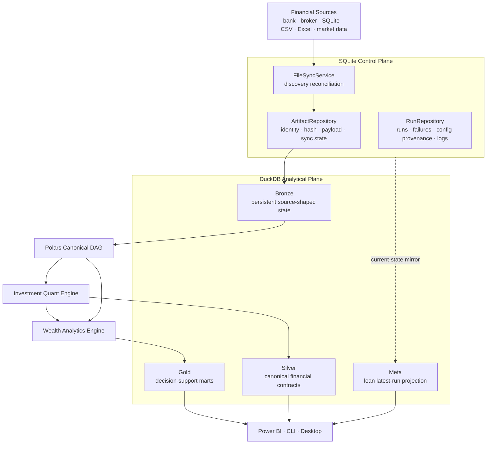
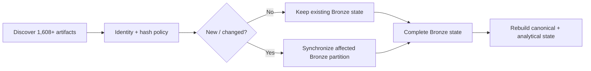
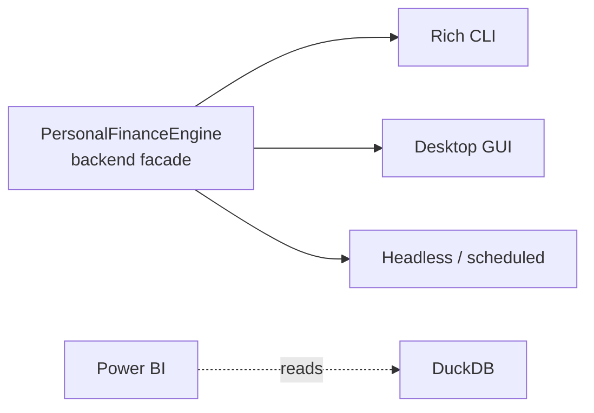
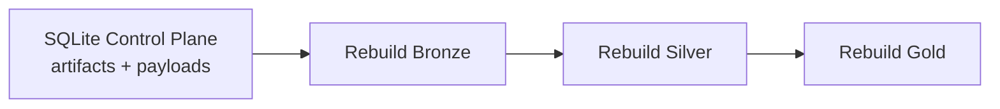
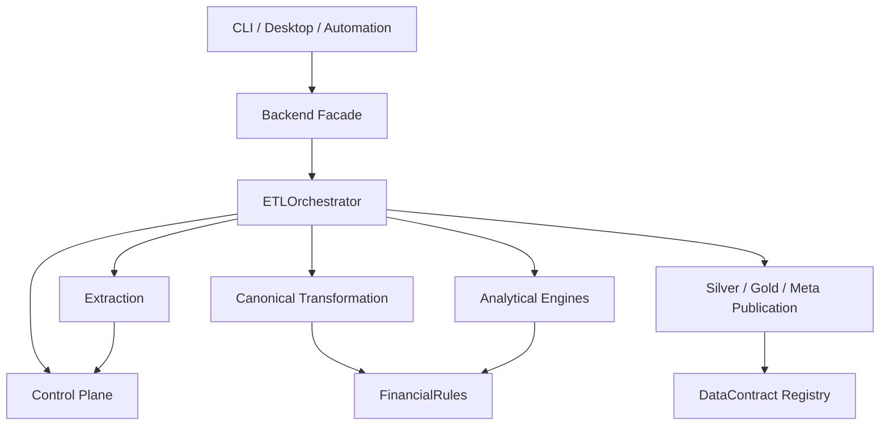

# System Architecture

Personal Finance ETL is a local-first financial platform with two deliberately different persistence planes:

> **SQLite owns operational truth and raw evidence. DuckDB owns analytical state.**

Everything else follows from that boundary.



---

## The production problem shaped the architecture

As of **24 September 2026**, my production environment contains **1,608 source artifacts**.

The source population includes daily stock and mutual-fund broker snapshots, transaction/history files, financial masters, mappings, reference inputs, opening state, and my personal-finance SQLite database.

Broker history alone grows by approximately:

```text
1 stock snapshot / day
+
1 mutual-fund snapshot / day
=
~2 additional source artifacts / day
```

That creates two different engineering problems:

```text
Source synchronization
→ avoid reparsing unchanged evidence

Analytical reconstruction
→ keep downstream financial state coherent
```

The architecture therefore uses different persistence strategies for different layers.



The principle is:

> **Incrementalize expensive source synchronization. Rebuild derived financial truth from complete state.**

---

## 1. Application surfaces stay thin

The application exposes several ways to run or consume the system:



The frontends do not own financial methodology.

They invoke the backend and present state.

This keeps:

```text
CLI logic
GUI logic
automation logic
```

from becoming three competing implementations of the pipeline.

---

## 2. `ETLOrchestrator` coordinates the run

The orchestrator opens both persistence planes and creates the authoritative run record before analytical work begins:

```python
self.db_manager.open()
self.db_manager.ensure_schemas()

cp = ControlPlane(
    self.cfg.TARGET_DB_BASE_PATH,
    self.cfg.RAW_DOCUMENT_STORE_NAME,
)
cp.open()
cp.ensure_schema()

run_id = cp.runs.start_run(
    cfg_json=self.cfg.model_dump_json(),
    rules_json=self.rules.model_dump_json() if self.rules else None,
)
```

It then starts coordinated local transactions:

```python
self.db_manager.conn.execute("BEGIN TRANSACTION")
cp.begin_transaction()

cp.runs.update_run_status(run_id, "RUNNING")
```

The orchestrator owns **coordination**.

It does not own:

- SQLite repository SQL,
- source-specific extraction,
- financial transformation formulas,
- FIFO state,
- Gold business logic,
- or frontend rendering.

That separation is one of the most important boundaries in the application.

---

## 3. The Control Plane is a facade over focused services

The production facade is intentionally small:

```python
class ControlPlane:
    def __init__(self, base_path: str, db_name: str = "Raw_Documents.sqlite"):
        self.db = SQLiteManager(base_path, db_name)
        self.artifacts = ArtifactRepository(self.db)
        self.runs = RunRepository(self.db)
        self.file_sync = FileSyncService(self.artifacts)

    def begin_transaction(self) -> None:
        self.db.begin_transaction()

    def commit(self) -> None:
        self.db.commit()

    def rollback(self) -> None:
        self.db.rollback()
```

The structure is:

```text
ControlPlane
├── SQLiteManager
├── ArtifactRepository
├── RunRepository
└── FileSyncService
```

### `ArtifactRepository`

Owns:

- artifact registry,
- raw payload BLOBs,
- hashes,
- file sizes,
- synchronization state,
- virtual artifacts.

### `RunRepository`

Owns:

- run identity,
- run status,
- application/schema version,
- Settings snapshots,
- FinancialRules snapshots,
- failures,
- tracebacks,
- execution logs.

### `FileSyncService`

Owns:

- comparison between discovered files and registered evidence,
- configurable rehash policy,
- new/changed classification,
- full-replace pruning,
- binary ingestion of actionable artifacts.

This keeps operational persistence behind one subsystem rather than spreading SQLite statements through the pipeline.

---

## 4. Control Plane physical state

The SQLite schema makes the ownership explicit:

```sql
CREATE TABLE IF NOT EXISTS cp_file_registry (
    file_id TEXT PRIMARY KEY,
    file_name TEXT NOT NULL,
    relative_path TEXT NOT NULL UNIQUE,
    file_category TEXT NOT NULL,
    file_type TEXT,
    file_hash TEXT NOT NULL,
    file_size_bytes BIGINT,
    sync_status TEXT DEFAULT 'PENDING_BRONZE',
    first_ingested TIMESTAMP NOT NULL,
    last_ingested TIMESTAMP NOT NULL
);
```

Raw bytes are separate from registry state:

```sql
CREATE TABLE IF NOT EXISTS cp_file_payloads (
    file_id TEXT PRIMARY KEY,
    file_bytes BLOB,
    FOREIGN KEY(file_id)
        REFERENCES cp_file_registry(file_id)
        ON DELETE CASCADE
);
```

Run provenance is also first-class:

```sql
CREATE TABLE IF NOT EXISTS cp_runs (
    run_id TEXT PRIMARY KEY,
    started_at TIMESTAMP NOT NULL,
    finished_at TIMESTAMP,
    status TEXT,
    application_version TEXT,
    schema_version TEXT,
    settings_snapshot_id TEXT,
    rules_snapshot_id TEXT,
    execution_log TEXT
);
```

And failures survive as structured history:

```sql
CREATE TABLE IF NOT EXISTS cp_run_failures (
    id INTEGER PRIMARY KEY AUTOINCREMENT,
    run_id TEXT NOT NULL,
    failed_isin TEXT,
    stage TEXT,
    error_type TEXT,
    error_message TEXT,
    traceback_log TEXT,
    created_at TIMESTAMP NOT NULL
);
```

The Control Plane is therefore more than a raw-file cache.

It is the system's operational memory.

---

## 5. Configuration provenance is content-addressed

Runs reference immutable configuration snapshots by content identity.

`RunRepository` hashes the serialized Settings payload:

```python
cfg_hash = hashlib.sha256(cfg_json.encode("utf-8")).hexdigest()
settings_id = f"snap_set_{cfg_hash[:12]}"

self.db.conn.execute(
    """
    INSERT OR IGNORE INTO cp_settings_snapshots
    (snapshot_id, content_hash, canonical_payload, created_at)
    VALUES (?, ?, ?, ?)
    """,
    (settings_id, cfg_hash, cfg_json, now),
)
```

FinancialRules use the same pattern.

This gives:

```text
same configuration
      ↓
same content hash
      ↓
same snapshot identity
      ↓
many runs can reference one immutable payload
```

The purpose is not deduplication alone.

It lets a run answer:

> **Which operational configuration and financial policy produced this execution?**

---

## 6. Ingestion reads from durable evidence

The pipeline first discovers physical sources, then asks the Control Plane which ones are actionable:

```python
new_files, changed_files, _ = cp.file_sync.sync_with_disk(
    discovered_files,
    self.cfg.FILE_HASH_POLICY,
    full_replace_categories,
)

actionable_all = {
    key: new_files.get(key, []) + changed_files.get(key, [])
    for key in discovered_files.keys()
}
```

Only new or changed artifacts are persisted again.

Extraction then works through the Control Plane rather than treating the filesystem as the only source of truth.

That separation matters for recovery and reproducibility.

---

## 7. Bronze is persistent source-shaped state

Bronze is where extracted source state becomes analytically persistent without pretending to be canonical finance.

For historical sources, the upsert boundary is file-aware.

Conceptually:

```text
changed artifact
      ↓
delete rows owned by that artifact
      ↓
insert replacement rows
      ↓
preserve unrelated history
```

For current/reference sources, complete replacement can be the correct semantic operation.

The decision is driven by source meaning, not by a universal "incremental is always better" rule.

After synchronization, the pipeline reads **complete Bronze state**:

```python
full_dataset = bronze.get_full_dataset(extracted_data.mappings)
```

That complete state feeds deterministic transformation.

---

## 8. Canonical transformation is Polars-first

The transformation layer converts source-shaped Bronze into canonical financial contracts.

```python
transformer = TransformationDAG(
    self.cfg,
    self.status_queue,
    self.rules,
)
self.dfs = transformer.run(extracted_data)
```

The transformation plane uses Polars LazyFrames where possible so expressions remain composable before materialization.

The canonical boundary hides source vocabulary from downstream engines.

```text
source-specific field names
        ↓
canonical financial concepts
        ↓
shared analytics
```

Examples include:

- income,
- expense,
- transfer,
- opening balance,
- investment master,
- purchase,
- sale,
- market observation,
- benchmark observation.

---

## 9. Stateful investment analytics use a different compute model

Not every workload belongs in a vectorized dataframe expression.

FIFO tax-lot accounting is stateful.

Per-instrument analytics therefore use instrument identity as a natural isolation boundary.

```text
Canonical investment contracts
        ↓
partition by ISIN
        ↓
FIFO / tax / broker / benchmark state
        ↓
lot analytics
        ↓
hierarchical portfolio analytics
```

This is an example of a broader design rule:

> **Use the compute model that matches the problem rather than forcing one abstraction across the entire system.**

Polars handles dataframe transformations.

Stateful Python objects handle FIFO.

NumPy/Numba handle simulation.

---

## 10. Presentation analytics return lazy graphs

The wealth/presentation engine builds independent LazyFrame outputs.

The orchestrator collects them together:

```python
keys = list(presentation_lazy.keys())
lazy_frames = [presentation_lazy[key] for key in keys]

results = pl.collect_all(
    lazy_frames,
    engine="streaming",
)

for key, result in zip(keys, results, strict=True):
    self.dfs[key] = result
```

This lets independent analytical graphs execute together while preserving a clear builder boundary.

The production-hardening cycle also removed presentation computations that no longer supported a serving decision.

That reduced both conceptual and runtime cost.

---

## 11. Publication is contract-driven

Silver and Gold publication use an explicit registry:

```python
@dataclass
class DataContract:
    contract_id: str
    layer: str
    physical_table: str
    domain: str
    grain: str
    producer: str
    publication_order: int
```

The current hardened publication path sorts contracts by declared order:

```python
contracts = sorted(
    (c for c in DATA_CONTRACT_REGISTRY if c.layer == "gold"),
    key=lambda c: c.publication_order,
)
```

Then writes only registered outputs:

```python
for contract in contracts:
    if contract.contract_id in dfs:
        self._write(
            dfs[contract.contract_id],
            contract.physical_table,
        )
```

This replaces inference with explicit analytical identity.

The registry tells the system:

```text
what the dataset is
where it lives
what layer owns it
what one row means
who produces it
when it publishes
```

---

## 12. Silver and Gold are rebuilt, not patched

After the complete analytical state has been computed:

```python
SilverLayer(self.db_manager).load(self.dfs)
GoldLayer(self.db_manager).load(self.dfs)
```

Silver and Gold are full-replace serving layers.

That is intentional.

The system already paid the complexity cost of maintaining incremental source history in Raw/Bronze.

Trying to incrementally patch every downstream analytical dependency would make financial correctness harder to reason about.

The architecture instead chooses:

```text
incremental evidence synchronization
        +
deterministic derived-state reconstruction
```

---

## 13. DuckDB Meta is a projection, not authority

DuckDB Meta is intentionally lean:

```text
m_File_Registry
m_Table_Row_Counts
m_Financial_Rules
m_Settings
```

It exists beside the analytical warehouse because those current-state values are useful to BI/query consumers.

Historical run truth belongs to SQLite.

The hardened Meta row-count path uses the Data Contract Registry for layer/table identity rather than guessing from internal frame names.

That distinction matters:

```text
Control Plane
→ authoritative operational history

DuckDB Meta
→ current analytical context
```

---

## 14. Reliability is part of the architecture

A successful run transitions to `COMMITTING` before persistence is finalized:

```python
cp.runs.update_run_status(run_id, "COMMITTING")

self.db_manager.conn.execute("COMMIT")
cp.commit()

cp.runs.finish_run(run_id, "SUCCESS")
```

Failure triggers rollback of both local persistence planes:

```python
self.db_manager.conn.execute("ROLLBACK")
cp.rollback()
```

Then failure details are persisted:

```python
cp.runs.log_run_failure(
    run_id=run_id,
    failed_isin=None,
    stage="Pipeline",
    error_type=type(exc).__name__,
    error_message=str(exc),
    traceback_log=traceback.format_exc(),
)
```

The system deliberately calls this **application-coordinated transactional consistency**.

It is not distributed two-phase commit.

That trade-off is documented rather than hidden.

---

## 15. Recovery flows from ownership

Because raw evidence survives independently from DuckDB analytical state:



The Meta layer also performs a self-healing check.

If an artifact exists in the Control Plane but is missing from the DuckDB registry, it is returned to `PENDING_BRONZE`.

The Control Plane therefore anchors recovery.

---

## 16. Documentation is an application subsystem

The same architecture philosophy extends to documentation.

```text
docs/*.md
   ↓
manifest.json
   ↓
DocsCatalog
   ↓
DocsRenderer
   ↓
CLI + Desktop
```

The application does not maintain a hard-coded list of guide files.

Documentation navigation is data-driven and packaged with the application.

That means the technical knowledge base is part of the product surface rather than a separate repository afterthought.

---

## Dependency direction

The major dependency direction is:



Stable downstream finance should depend on canonical concepts, not source formats.

That is the architectural test I use when deciding where new behaviour belongs.

---

## What this architecture optimizes for

### Correctness

Financial state can be rebuilt from durable evidence and complete Bronze state.

### Traceability

Runs, failures, configuration snapshots and source synchronization have explicit ownership.

### Performance

Unchanged source history is not reparsed, while Polars and per-instrument parallelism handle downstream computation.

### Maintainability

Repositories, engines, loaders and frontends have different responsibilities.

### Extensibility

New sources and assets can converge into stable canonical contracts.

### Local-first operation

The entire stack remains viable on a local workstation without requiring cloud infrastructure to coordinate the workload.

---

## Current boundaries

The architecture is intentionally not described as more general than it is.

Current limitations include:

- source adapters remain tailored to my financial environment,
- tax behaviour remains jurisdiction-specific,
- cross-database commits are coordinated by the application rather than distributed 2PC,
- the Control Plane provides strong operational provenance but is not yet a normalized row-level lineage graph,
- a complete backup story should ultimately protect both DuckDB and the authoritative Control Plane together.

Those are architectural boundaries, not footnotes to hide.

---

## Go deeper

- [Data Lifecycle](data-lifecycle.md)
- [Warehouse Architecture](warehouse-architecture.md)
- [Data Model](data-model.md)
- [Reliability & Recovery](reliability-and-recovery.md)
- [Design Decisions](design-decisions.md)

[← Architecture Home](README.md) · [← Documentation Home](../README.md)
