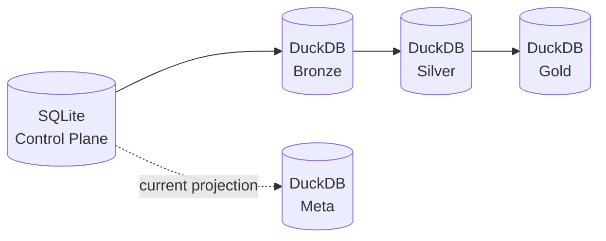
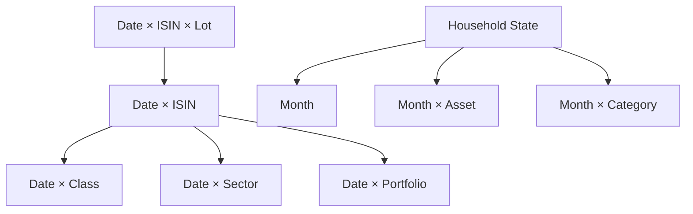
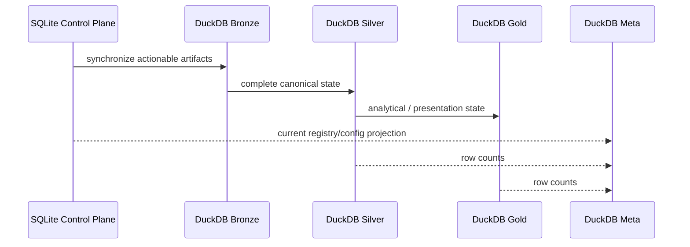

# Warehouse Architecture

Personal Finance ETL does not use one database for every responsibility.

The storage architecture is:

```text
SQLite Control Plane
→ evidence + operational history

DuckDB Bronze
→ persistent source-shaped analytical state

DuckDB Silver
→ canonical financial contracts

DuckDB Gold
→ decision-support serving marts

DuckDB Meta
→ lean current-state analytical telemetry
```

The important design decision is not "Medallion architecture."

It is **ownership**.

---

## Storage ownership

| Plane / layer | Technology | Owns |
| --- | --- | --- |
| Control Plane | SQLite | Raw artifacts, payloads, sync state, runs, failures, config/rules provenance, logs |
| Bronze | DuckDB | Persistent source-shaped state |
| Silver | DuckDB | Canonical financial/reference facts and dimensions |
| Gold | DuckDB | Decision-support marts |
| Meta | DuckDB | Latest/current analytical telemetry |



---

## Why SQLite owns the Control Plane

Operational state is relational, compact and transaction-oriented.

The Control Plane needs to answer questions such as:

```text
Have I seen this artifact before?
What hash did it have?
Do I still have its bytes?
Has it reached Bronze?
Which configuration did this run use?
Did the run fail?
Where?
What did the execution log say?
```

SQLite is a natural fit for that local control workload.

The schema separates artifact metadata from payload bytes:

```sql
CREATE TABLE IF NOT EXISTS cp_file_registry (
    file_id TEXT PRIMARY KEY,
    relative_path TEXT NOT NULL UNIQUE,
    file_category TEXT NOT NULL,
    file_hash TEXT NOT NULL,
    sync_status TEXT DEFAULT 'PENDING_BRONZE',
    first_ingested TIMESTAMP NOT NULL,
    last_ingested TIMESTAMP NOT NULL
);

CREATE TABLE IF NOT EXISTS cp_file_payloads (
    file_id TEXT PRIMARY KEY,
    file_bytes BLOB,
    FOREIGN KEY(file_id)
        REFERENCES cp_file_registry(file_id)
        ON DELETE CASCADE
);
```

This creates a durable evidence boundary independent from the analytical warehouse.

---

## Why raw payloads are stored

A file path is not evidence if the file later disappears or changes.

Persisting bytes gives the system a stronger recovery position:

```text
filesystem artifact
      ↓
Control Plane registry + payload
      ↓
derived analytical state
```

The trade-off is storage duplication.

For this local financial workload, I prefer paying that storage cost in exchange for recoverability and provenance.

---

## Why DuckDB owns analytics

DuckDB is optimized for local analytical SQL over columnar data.

The warehouse needs:

- persistent Bronze history,
- canonical Silver contracts,
- Gold serving marts,
- SQL inspection,
- Power BI consumption,
- fast local rebuilds.

The manager owns one persistent connection:

```python
self._conn = duckdb.connect(self.db_path)

mem_gb = max(
    4,
    int(psutil.virtual_memory().total / (1024**3) * 0.75),
)

self._conn.execute(
    f"PRAGMA memory_limit='{mem_gb}GB'"
)
self._conn.execute("PRAGMA threads=4")
```

The application therefore uses DuckDB as an embedded analytical engine rather than running a separate database server.

---

## Bronze: persistent source-shaped state

Bronze is intentionally not canonical.

It preserves the analytical representation of source data so unchanged history does not need to be reparsed.

Historical sources use file-aware replacement.

Reference sources can use complete replacement.

The layer is dynamic because source schemas are not all identical.

```text
Raw artifact
     ↓
extractor
     ↓
source-shaped DataFrame
     ↓
Bronze table
```

The canonical financial model starts later.

---

## Silver: canonical financial contracts

Silver is the stable downstream vocabulary.

The current architecture publishes **20 Silver contracts**:

```text
11 dimensions / reference models
 9 facts
```

Examples include:

```text
d_Calendar
d_Investment_Master
f_Income_Transactions
f_Expense_Transactions
f_Investment_Purchase_Data
f_Investment_Sale_Data
f_Investment_Analytics_Lot
```

Silver is rebuilt each successful run.

The loader recreates the schema and writes registered contracts in publication order.

Conceptually:

```python
contracts = sorted(
    (c for c in DATA_CONTRACT_REGISTRY if c.layer == "silver"),
    key=lambda c: c.publication_order,
)

for contract in contracts:
    if contract.contract_id in dfs:
        self._write(
            dfs[contract.contract_id],
            contract.physical_table,
        )
```

The exact hardened implementation uses the registry as the publication authority.

---

## Gold: decision-support contracts

Gold publishes **17 marts**.

These are not "all useful intermediate frames."

They are datasets with an explicit decision purpose and grain.

Examples:

```text
Core_Monthly_Fact
Wealth_Asset_Breakdown
Cashflow_Activity_Summary
Wealth_FIRE_Analytics
Investment_Portfolio_Summary
Investment_By_ISIN
Investment_By_Class
Investment_By_Portfolio
```

Gold is deliberately multi-grain.



Different grains answer different questions.

---

## The Data Contract Registry connects logical and physical state

The registry is intentionally lightweight:

```python
@dataclass
class DataContract:
    contract_id: str
    layer: str
    physical_table: str
    domain: str
    grain: str
    producer: str
    publication_order: int
```

A contract such as:

```python
DataContract(
    "df_f_investment_analytics_isin",
    "gold",
    "gold.Investment_By_ISIN",
    "Investments",
    "Date-ISIN",
    "InvestmentQuantEngine",
    200,
)
```

connects:

```text
in-memory output
      ↓
logical identity
      ↓
physical table
      ↓
domain
      ↓
grain
      ↓
producer
```

That same identity can support publication, Meta row counts, documentation and future lineage improvements.

---

## Meta is intentionally lean

The current DuckDB Meta schema contains:

```text
m_File_Registry
m_Table_Row_Counts
m_Financial_Rules
m_Settings
```

For example:

```sql
CREATE TABLE IF NOT EXISTS meta.m_Table_Row_Counts (
    schema_name TEXT NOT NULL,
    table_name  TEXT NOT NULL,
    row_count   BIGINT,
    generated_at TIMESTAMP
);
```

The hardened implementation uses the contract registry for schema/table identity rather than guessing layer from internal frame naming.

Meta answers:

> **What current analytical state is useful beside the warehouse?**

It no longer tries to answer:

> **What happened across every historical execution?**

That belongs to the Control Plane.

---

## Control Plane vs Meta

This distinction is central enough to state explicitly.

| Question | Authority |
| --- | --- |
| What raw artifacts exist? | SQLite Control Plane |
| What bytes were persisted? | SQLite Control Plane |
| What is their sync state? | SQLite Control Plane |
| What runs occurred? | SQLite Control Plane |
| What failed? | SQLite Control Plane |
| Which Settings/Rules snapshot did a run use? | SQLite Control Plane |
| What source files currently back Bronze? | DuckDB Meta projection |
| What are current table row counts? | DuckDB Meta |
| What current Settings/Rules are useful to BI? | DuckDB Meta |

DuckDB Meta is not a second control database.

---

## Why Silver and Gold are full-replace

The system could attempt incremental propagation through every derived table.

I deliberately do not do that.

Once complete Bronze is available, deterministic rebuild gives:

- simpler dependency reasoning,
- fewer partial-state failure modes,
- easier reconciliation,
- cleaner schema evolution,
- less incremental bookkeeping.

The workload is small enough after source synchronization that rebuilding derived state remains practical.

On my current production environment, the entire end-to-end pipeline is roughly **14–17 seconds**.

That benchmark is environment-specific, but it demonstrates that deterministic serving-layer rebuild is currently an affordable correctness choice.

---

## Why Bronze persists

If Silver and Gold rebuild, why not rebuild Bronze too?

Because the source population is the expensive/growing side of the problem.

As of 24 September 2026:

```text
1,608 source artifacts
+ ~2 broker files/day
```

Persistent Bronze avoids repeatedly extracting unchanged historical evidence.

So:

```text
Raw/Bronze
→ optimize source synchronization

Silver/Gold
→ optimize analytical correctness
```

Different layers optimize different things.

---

## Self-healing analytical state

`MetaLayer.heal_duckdb_registry()` compares DuckDB's current file registry with Control Plane artifact state.

If an authoritative artifact is missing analytically:

```python
cp.artifacts.db.conn.execute(
    """
    UPDATE cp_file_registry
    SET sync_status = 'PENDING_BRONZE'
    WHERE relative_path = ?
    """,
    [path],
)
```

The next synchronization path can rebuild it.

Authority flows from SQLite to DuckDB.

---

## Physical rebuild sequence



This is conceptual dependency flow rather than literal table-to-table copying.

---

## Trade-offs

### Raw BLOB persistence

**Gain:** recoverability and evidence durability.  
**Cost:** storage duplication.

### Persistent Bronze

**Gain:** avoid reparsing growing source history.  
**Cost:** another stateful layer to manage.

### Full-replace Silver/Gold

**Gain:** simpler correctness and schema evolution.  
**Cost:** recomputation every run.

### Embedded DuckDB

**Gain:** fast local analytics without infrastructure.  
**Cost:** not a multi-user server architecture.

### Lean Meta

**Gain:** one clear operational authority.  
**Cost:** historical run queries must use SQLite rather than DuckDB.

These are deliberate trade-offs.

---

## Go deeper

- [Data Lifecycle](data-lifecycle.md)
- [Data Model](data-model.md)
- [Reliability & Recovery](reliability-and-recovery.md)
- [Silver Data Contracts](../reference/silver-data-contracts.md)
- [Gold Data Contracts](../reference/gold-data-contracts.md)
- [Meta Data Contracts](../reference/meta-data-contracts.md)

[← Architecture Home](README.md) · [← Documentation Home](../README.md)
