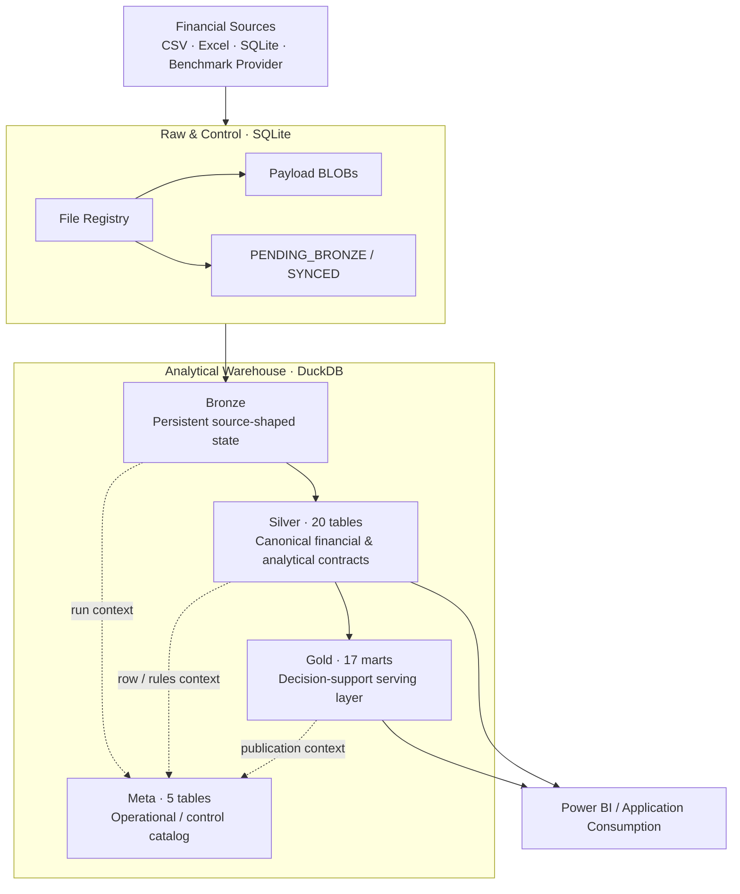
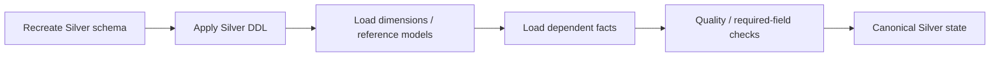
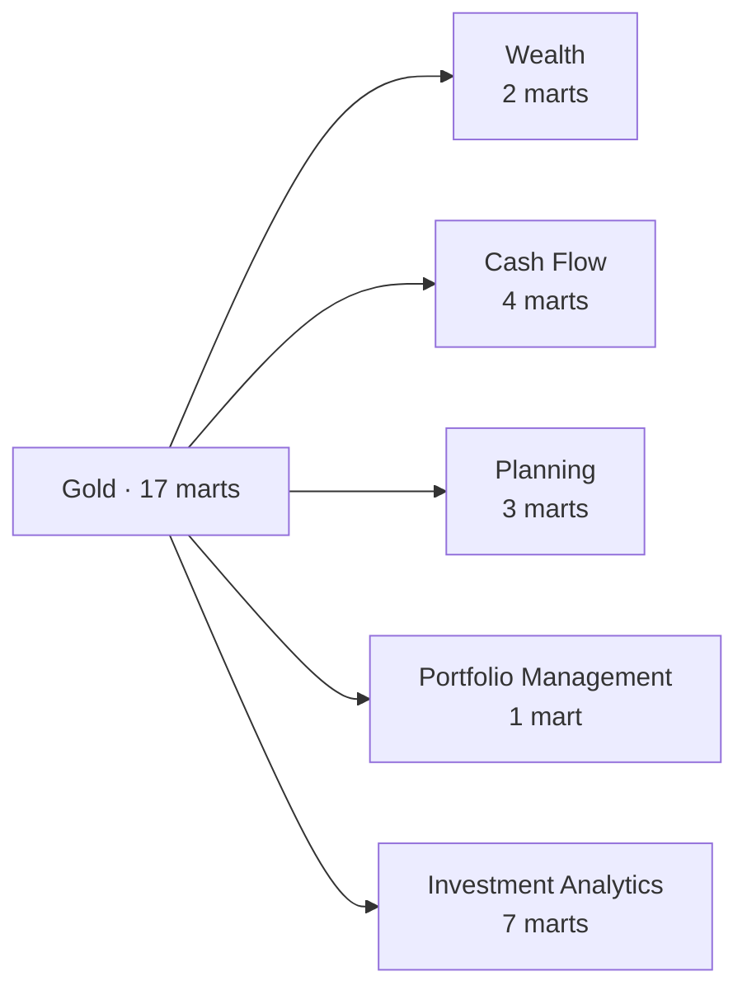
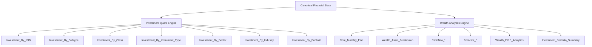
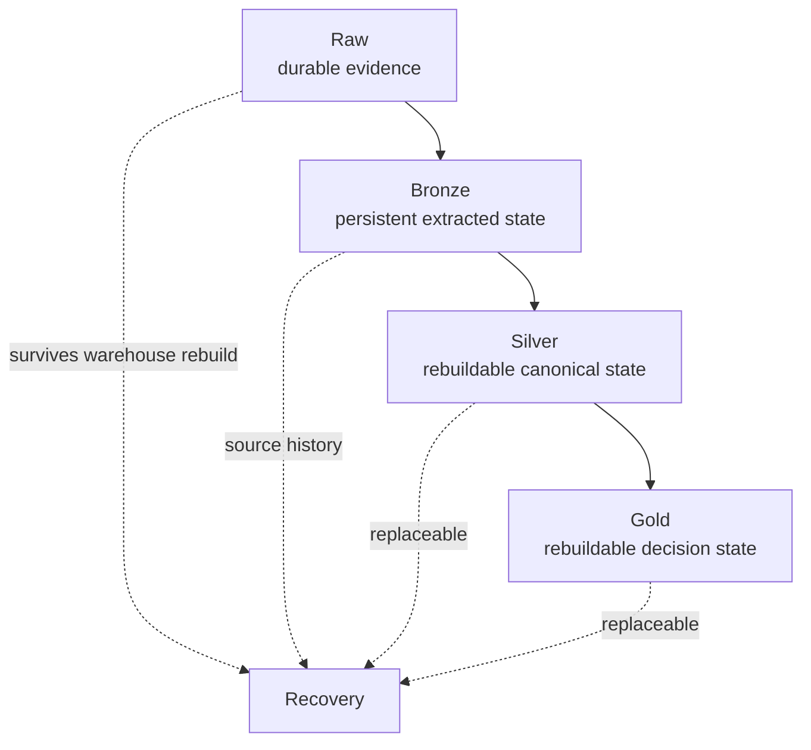

# Warehouse Architecture

Personal Finance ETL uses a layered local warehouse, but I do not treat the layers as interchangeable copies of the same data at different levels of cleanliness.

Each layer has a distinct responsibility, persistence model, grain philosophy, and recovery role.

The core warehouse model is:

```text
Raw Store
    ↓
Bronze
    ↓
Canonical transformation + analytical engines
    ↓
Silver
    ↓
Gold

Meta observes and records the operational context around the lifecycle.
```

The most important distinction is this:

> **Raw preserves evidence. Bronze preserves extracted source state. Silver publishes canonical financial state. Gold publishes decision-support state. Meta records operational context.**

This document explains those responsibilities in depth.

For the record-by-record journey across these layers, see [Data Lifecycle](data-lifecycle.md).

---

## Warehouse at a glance



This is Medallion-inspired, but the architecture is more specific than simply saying "Bronze, Silver, Gold."

The Raw Store and Meta layer are first-class architectural components, and the persistence semantics differ intentionally across layers.

---

## Layer responsibility matrix

| Layer | Storage | Primary responsibility | Persistence model | Typical grain |
| --- | --- | --- | --- | --- |
| Raw | SQLite | Preserve source evidence and ingestion/control state | Durable artifact + registry state | File / artifact |
| Bronze | DuckDB | Preserve extracted source-shaped analytical state | Persistent; synchronized by source semantics | Source-dependent |
| Silver | DuckDB | Publish canonical financial and analytical contracts | Deterministically rebuilt | Canonical business grains |
| Gold | DuckDB | Publish decision-support marts | Deterministically rebuilt | Decision-specific analytical grains |
| Meta | DuckDB | Record operational and reproducibility context | Run/control state | Run / table / setting / rule |

The architecture therefore has two different ideas of persistence:

1. **Evidence and source state are retained.**
2. **Derived analytical state is reproducible and replaceable.**

That distinction is central to the warehouse design.

---

## Raw: evidence before analytics

The Raw Document Store lives outside DuckDB in SQLite.

Although it sits upstream of the analytical warehouse, I treat it as part of the overall data architecture because it defines what evidence is available for reconstruction.

### What Raw owns

The Raw Store owns concepts such as:

- file identity,
- relative path,
- category,
- physical type,
- SHA-256 fingerprint,
- size,
- first/last ingestion timestamps,
- synchronization status,
- and persisted binary payload.

It also stores virtual source artifacts such as fetched benchmark-history chunks.

### What Raw does not own

Raw does not define:

- canonical income,
- canonical expenses,
- investment tax lots,
- net worth,
- Gold metrics,
- or financial planning state.

It preserves evidence and control state.

That separation prevents the source archive from becoming another accidental analytical model.

### Why Raw is outside DuckDB

I use SQLite because this workload is transactional and metadata-oriented:

- small registry updates,
- state transitions,
- local BLOB persistence,
- and durable control-plane access.

DuckDB is optimized for a different workload.

The two databases are therefore complementary rather than redundant.

---

## Bronze: persistent source-shaped state

Bronze is the first analytical layer inside DuckDB.

Its job is to retain the extracted representation of source data with enough lineage to support downstream reconstruction and incremental synchronization.

### Bronze is intentionally source-shaped

Bronze is not where I try to force every source into the final financial model.

Source-specific structure can still exist here.

That is useful because Bronze acts as the durable boundary between:

```text
source extraction
      ↓
source-shaped analytical state
      ↓
canonical financial transformation
```

If a canonical transformation changes, I can rebuild downstream state without needing to re-interpret the original source file every time, provided the required Bronze state is already present.

### Persistent, but not universally incremental

Bronze persistence depends on source semantics.

### Reference/current-state sources

Reference-style datasets can use full replacement.

Their useful contract is the current complete state.

### Historical/event sources

Historical datasets use file-aware replacement.

Changed source partitions are removed and reinserted while unrelated history remains intact.

This gives Bronze an incremental property without introducing row-level CDC machinery.

### Source lineage

Bronze retains source identity such as:

```text
__file_name__
```

That supports:

- traceability,
- changed-file replacement,
- and source-partition ownership.

### Bronze as the reconstruction boundary

Once Bronze has been synchronized, downstream processing works from the complete Bronze state.

That is why Silver and Gold do not need to maintain complex incremental dependency state.

Conceptually:

```text
Run delta
   ↓
Synchronize Bronze
   ↓
Complete persistent Bronze
   ↓
Reconstruct derived state
```

---

## Silver: canonical financial and analytical state

Silver is the semantic heart of the warehouse.

It is rebuilt deterministically from current Bronze/canonical analytical state.

The current v6 architecture contains **20 physical Silver tables**.

### Silver is not merely "cleaned Bronze"

That description would undersell the layer.

Silver represents stable financial concepts that downstream consumers and analytical engines can reason about.

The source vocabulary has largely disappeared.

Instead, Silver expresses concepts such as:

- calendar,
- income categories,
- expense categories,
- assets,
- currencies,
- investment master,
- benchmark master,
- macro parameters,
- income transactions,
- expense transactions,
- transfers,
- opening balances,
- investment purchases,
- investment sales,
- market history,
- benchmark history,
- and lot-level investment analytics.

Silver is therefore the **canonical contract boundary**.

### Current Silver surface

### Dimensions and reference models

```text
d_Calendar
d_Income_Category
d_Income_Subcategory
d_Expense_Category
d_Expense_Subcategory
d_Asset_Category
d_Asset_SubCategory
d_Currency
d_Investment_Benchmark_Master
d_Investment_Master
d_Macro_Parameters
```

### Facts

```text
f_Income_Transactions
f_Expense_Transactions
f_Transfer_Transactions
f_Opening_Balances
f_Investment_Market_Data
f_Investment_Purchase_Data
f_Investment_Sale_Data
f_Investment_Benchmark_Data
f_Investment_Analytics_Lot
```

For field-level contracts, see [Silver Data Contracts](../reference/silver-data-contracts.md).

---

### Silver loading order

Silver is recreated and loaded in dependency-aware order.

Conceptually:



Dimensions and reference models are loaded before dependent facts.

This keeps the physical warehouse consistent with the semantic dependency direction.

### Quality gates

The load path contains explicit validation for important investment-master fields.

For example, missing critical investment identity/tax fields are treated as serious data-quality issues rather than silently accepted as harmless nulls.

The warehouse therefore contains quality checks in the production load path, not only in tests.

### Why rebuild Silver?

For my workload, deterministic reconstruction is simpler and safer than maintaining incremental state across every canonical dependency.

The trade-off is additional compute.

The benefit is that Silver represents:

> **the canonical financial state implied by the complete current Bronze evidence and current financial semantics.**

That is a strong contract.

---

## Gold: decision-support publication

Gold is the serving layer.

It is also rebuilt deterministically.

The current v6 architecture contains **17 physical Gold marts**.

Gold does not attempt to preserve every intermediate analytical frame.

Its job is to publish the datasets that support actual financial decisions and BI consumption.

### Gold domains



### Wealth

```text
Core_Monthly_Fact
Wealth_Asset_Breakdown
```

### Cash flow

```text
Cashflow_Expense_Breakdown
Cashflow_Income_Breakdown
Cashflow_Efficiency_Analytics
Cashflow_Activity_Summary
```

### Planning

```text
Wealth_FIRE_Analytics
Forecast_Tax_Liability
Forecast_Budget_Variance
```

### Portfolio management

```text
Investment_Portfolio_Summary
```

### Investment analytics

```text
Investment_By_ISIN
Investment_By_Subtype
Investment_By_Class
Investment_By_Instrument_Type
Investment_By_Sector
Investment_By_Industry
Investment_By_Portfolio
```

For the physical contracts, see [Gold Data Contracts](../reference/gold-data-contracts.md).

---

### Gold is multi-grain by design

Gold is not one universal star schema.

The marts answer different questions at different grains.

Examples include:

| Mart | Grain | Question |
| --- | --- | --- |
| `Core_Monthly_Fact` | Month | What is the household financial state this month? |
| `Wealth_Asset_Breakdown` | Month × Asset | How did each asset contribute to wealth and cash movement? |
| `Cashflow_Expense_Breakdown` | Month × Expense Category | Where did spending occur? |
| `Investment_Portfolio_Summary` | Month × ISIN | How is the portfolio allocated and drifting? |
| `Investment_By_ISIN` | Date × ISIN | How is each instrument performing and taxed? |
| `Investment_By_Class` | Date × Class | How is performance distributed by asset class? |
| `Investment_By_Portfolio` | Date | What is the portfolio-level investment state? |

This is a BI design decision.

A single grain cannot answer all of those questions cleanly.

### `Core_Monthly_Fact` as the household spine

`Core_Monthly_Fact` is one of the most important Gold contracts.

At monthly grain it brings together major household measures across:

- income,
- cash/non-cash income,
- expenses,
- core expenses,
- cash/non-cash expenses,
- net cash flow,
- assets,
- investment book/market state,
- liquidity,
- liabilities,
- book net worth,
- market net worth,
- CPI,
- and inflation.

It acts as a monthly household state vector for BI consumption.

`Wealth_Asset_Breakdown` complements it at Month × Asset grain.

---

### Two producer families feed Gold

Gold is not produced by one monolithic presentation function.

There are two major analytical producer paths.



The investment engine publishes performance/tax/portfolio analytical marts.

The wealth engine publishes household, cash-flow, planning, and portfolio-management marts.

This separation mirrors the computational architecture.

---

## Meta: operational and reproducibility context

Meta is not a financial-analysis layer.

It is the beginning of the warehouse control catalog.

The current v6 architecture contains **5 Meta tables**:

```text
m_File_Registry
m_Run_Log
m_Table_Row_Counts
m_Financial_Rules
m_Settings
```

For physical contracts, see [Meta Data Contracts](../reference/meta-data-contracts.md).

### What Meta answers

Conceptually:

```text
m_File_Registry
→ What source artifacts participated?

m_Run_Log
→ What execution happened?

m_Table_Row_Counts
→ What did the run produce?

m_Financial_Rules
→ Under what financial semantics?

m_Settings
→ Under what operational configuration?
```

This is the beginning of analytical reproducibility.

### Current limitations

Meta is useful, but I do not treat it as a perfect lineage catalog yet.

Current hardening opportunities include:

- explicit physical-layer/table mapping instead of inferring layer identity from internal frame names,
- application/schema version capture,
- financial-rules/configuration fingerprints,
- and stronger run-to-contract lineage.

Those are roadmap opportunities, not current guarantees.

---

## Persistence semantics by layer

The layers differ intentionally.



### Durable evidence

Raw is designed to survive independently from the analytical warehouse.

### Persistent source state

Bronze persists extracted source-shaped state and supports source-aware synchronization.

### Rebuildable canonical state

Silver can be recreated from current upstream evidence and semantics.

### Rebuildable decision state

Gold can be recreated from current canonical/analytical state.

This is why deleting Gold is conceptually very different from losing Raw.

---

## Why Silver and Gold are rebuilt

Making every derived layer incremental would be possible, but it would introduce substantially more state complexity.

An incremental derived warehouse must answer questions such as:

- Which downstream facts depend on this changed source?
- Which rolling calculations need recomputation?
- Which FIRE periods are affected?
- Which investment aggregates need restatement?
- Which Gold marts contain stale derived state?
- How should configuration changes invalidate previous calculations?

For a local personal-finance workload, deterministic rebuilds provide a cleaner answer:

```text
Persistent Bronze
      +
Current financial rules
      +
Current analytical code
      ↓
Rebuild canonical state
      ↓
Rebuild decision state
```

The trade-off is compute time.

The benefit is simpler correctness and fewer stale-state failure modes.

I consider that a good trade for the current scale of the system.

---

## Warehouse truth model

The word "truth" means different things at different layers.

| Question | Authoritative layer |
| --- | --- |
| What artifact entered the system? | Raw |
| Has this artifact synchronized to Bronze? | Raw registry/sync state |
| What extracted source state is available downstream? | Bronze |
| What is the current canonical financial state? | Silver |
| What analytical state should BI consume? | Gold |
| What happened operationally during the run? | Meta |

This prevents one table from being treated as universally authoritative for questions it was not designed to answer.

---

## Analytical grain as a warehouse contract

Grain is not merely a modelling detail.

It defines what one row *means*.

Examples:

```text
Month
Month × Asset
Month × Category
Month × ISIN
Date × ISIN
Date × Class
Date × Sector
Date × Portfolio
Date × ISIN × Tax Lot
```

Before adding a new analytical mart, the grain should be explicit.

A measure that is valid at tax-lot grain may not be meaningful at portfolio grain without a specific aggregation methodology.

This is especially important for:

- returns,
- tax state,
- benchmark comparisons,
- allocations,
- and cash-flow measures.

The warehouse architecture therefore treats grain as part of the data contract.

---

## Physical publication boundary

Gold publication is explicit.

The loader maps analytical outputs to physical Gold tables rather than publishing every intermediate DataFrame automatically.

That creates a useful boundary:

```text
Intermediate analytical computation
            ↓
Does this belong in the serving contract?
            ↓
          yes
            ↓
Explicit Gold mapping + DDL
            ↓
Physical decision-support mart
```

This is one reason the v6 serving model can remain focused even when richer calculations still exist internally.

**Compute richly. Publish selectively.**

---

## Warehouse and Power BI

Power BI is a consumer of the analytical model, not the place where the financial model is invented.

The goal is to push stable semantics and reusable analytical state into the warehouse so BI focuses on:

- exploration,
- slicing,
- comparison,
- presentation,
- and decision support.

This reduces the risk of having important financial logic exist only inside report-specific expressions.

The strongest BI contract is therefore upstream of the dashboard.

---

## Warehouse quality philosophy

The warehouse should fail or surface issues when important financial contracts are violated.

Examples include required investment identity/tax fields and cash-flow reconciliation differences.

The current system is not a complete generic data-quality framework, but the production load/analytical paths already contain domain-specific validation and reconciliation.

Long term, I would rather strengthen those explicit contracts than build a generic quality layer that knows nothing about financial meaning.

---

## Future warehouse evolution

Several future improvements fit naturally into the current design.

### Data contract registry

A shared registry could describe each published dataset:

```yaml
Core_Monthly_Fact:
  layer: gold
  domain: wealth
  grain:
    - MONTH_START_DATE
  producer: WealthPresentationEngine
  description: Monthly household financial state
```

The same registry could eventually support:

- Gold/Silver loading,
- Meta lineage,
- schema validation,
- documentation generation,
- and application navigation.

### Explicit schema versioning

A future Meta contract could capture:

```text
application_version
schema_version
rules_schema_version
configuration_hash
financial_rules_hash
git_commit
```

That would strengthen reproducibility across software evolution.

### Configurable publication

The long-term generalized platform may allow selected analytical marts to be enabled or extended through explicit publication specifications.

That should remain downstream of canonical semantics rather than allowing arbitrary report configuration to redefine the financial model.

---

## Warehouse invariants

I want future warehouse changes to preserve these principles unless I intentionally redesign them.

1. **Raw evidence and analytical state remain separate concerns.**
2. **Bronze remains the persistent extracted-source boundary.**
3. **Silver represents canonical financial meaning, not source layout.**
4. **Gold represents decision-support publication, not every available calculation.**
5. **Meta remains operational/control context rather than business analytics.**
6. **Grain is explicit for every published analytical contract.**
7. **Source-specific lineage remains available far enough upstream to support traceability and replacement.**
8. **Derived-state rebuilds remain deterministic for the same code, rules, configuration, and upstream evidence.**
9. **BI should consume financial semantics rather than reinvent them report by report.**
10. **Decision usefulness remains more important than metric count.**

---

## Related documentation

Continue with:

- [Data Model](data-model.md) — canonical dimensions, facts, relationships, and grains.
- [Reliability & Recovery](reliability-and-recovery.md) — transactions, rollback, reconstruction, and failure handling.
- [Design Decisions](design-decisions.md) — why the warehouse uses asymmetric persistence.
- [Silver Data Contracts](../reference/silver-data-contracts.md) — physical Silver reference.
- [Gold Data Contracts](../reference/gold-data-contracts.md) — physical Gold reference.
- [Meta Data Contracts](../reference/meta-data-contracts.md) — physical Meta reference.
- [Adding a Gold Mart](../developer/adding-gold-marts.md) — extending the serving layer.

[← Architecture Home](README.md) · [← Documentation Home](../README.md)
