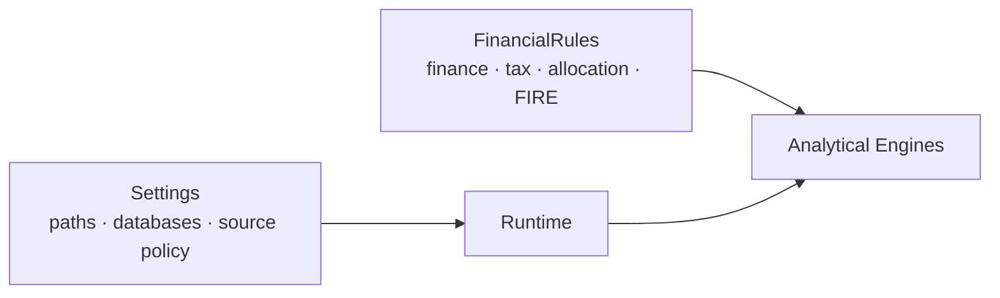

# Configuration

Configuration in Personal Finance ETL has two jobs:

```text
Settings
→ where and how the application runs

FinancialRules
→ what financial activity means
```

The second category is part of the financial model.



## Validated policy

Financial policy is represented through Pydantic rather than hidden constants.

For example, portfolio-management tolerance is explicit policy:

```python
class PortfolioManagementRules(BaseModel):
    rebalance_tolerance_pct_points: float = Field(
        default=5.0,
        ge=0.0,
    )
```

The analytical engine consumes the configured value rather than embedding the threshold in presentation logic.

## Guides

| Guide | Focus |
| --- | --- |
| [Financial Rules](financial-rules.md) | Household semantics, cash pools, classifications, tax parameters, target allocations and policy boundaries |
| [FIRE Configuration](fire-configuration.md) | Returns, regimes, transitions, inflation, shocks, glide paths and withdrawal behaviour |

## Configuration principle

> **Parameters belong in configuration. Genuinely different behaviour belongs behind adapters or strategies.**

A YAML/TOML/Pydantic model should not become a programming language merely to avoid introducing a proper behavioural boundary.

[← Documentation Home](../README.md)
