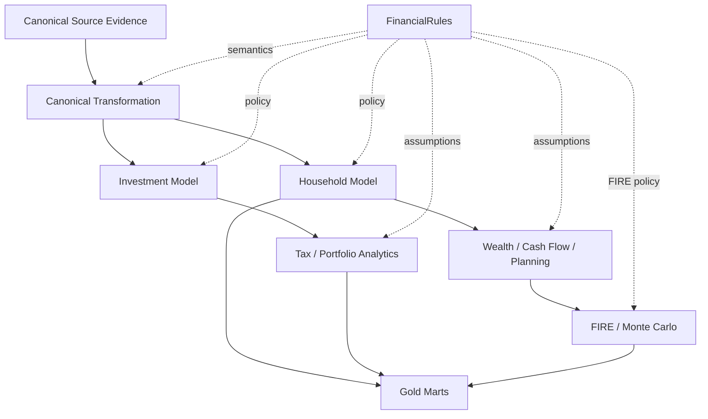

# Financial Rules

`FinancialRules` is the policy layer of Personal Finance ETL.

Operational settings tell the application **where and how to run**.

Financial rules tell the analytical system **what financial activity means**.

That distinction is fundamental.

```text
Operational Settings
paths · databases · source locations · hash policy
                    │
                    ▼
              Application Runtime
                    ▲
                    │
FinancialRules
income · expenses · assets · tax · allocation · FIRE
```

I use validated financial rules so important household and investment semantics are explicit rather than scattered through report logic or hard-coded transformations.

> This guide documents the configuration model and how its major rule families influence analytics. It does not prescribe personal financial, tax, or investment choices.

---

## Where FinancialRules fits



Rules therefore participate in both semantic interpretation and downstream planning.

---

## Why financial policy is separate from operational settings

A setting such as:

```text
STATEMENTS_FOLDER
```

answers:

> Where is a source located?

A rule such as:

```text
which expense categories are core?
```

answers:

> What does this financial activity mean?

Combining those into one undifferentiated settings object would blur infrastructure and finance.

I keep them separate so:

- operational configuration can change without redefining finance,
- financial methodology can change without moving files,
- policy can be validated independently,
- and Meta can capture both contexts separately.

---

## Rule families

The current financial-policy surface spans several domains.

At a conceptual level:

```text
Income semantics
Expense semantics
Budget allocation
Cash pools
Cash-flow activity
Asset semantics
Investment classification
Target allocation
Tax parameters
Macro / planning assumptions
FIRE assumptions
Monte Carlo assumptions
```

The exact Pydantic field names are the implementation contract; this guide explains their financial role.

---

## Income semantics

Income rules determine how canonical income activity is interpreted.

The model can distinguish concepts such as:

- active income,
- dividend income,
- interest income,
- non-cash income,
- and broader cash/non-cash treatment.

## Why this matters

The same income record can participate differently in:

- accounting income,
- cash-flow analysis,
- savings,
- taxable-income modelling,
- and FIRE contribution capacity.

For example:

```text
Total Income
    ≠
Cash Income
```

when non-cash income exists.

## Design principle

Income classification belongs in policy rather than Power BI expressions.

That keeps the same financial meaning available to:

- household analytics,
- cash-flow models,
- tax forecasting,
- and planning.

---

## Expense semantics

Expense rules determine which canonical expenses belong to financial categories such as:

- core expenses,
- cash expenses,
- non-cash expenses,
- and other configured planning classifications.

## Core expenses

Core expenses provide a baseline spending perspective.

They can support:

- household resilience analysis,
- Lean-FI calculations,
- and budget/planning views.

## Cash versus non-cash expense

This distinction is important for cash reconciliation.

A non-cash expense can affect accounting/financial interpretation without creating equivalent current cash movement.

---

## Budget allocation rules

Budget rules define how household resources are allocated across configured planning categories.

These allocations feed budget forecasting and variance analysis.

The purpose is not to force all spending into one universal budgeting philosophy.

The purpose is to make *my chosen planning policy* explicit and machine-readable.

## Configuration versus methodology

A percentage allocation is a parameter.

The logic that computes rolling budget state is analytical behaviour.

That is the broader architectural rule:

> **Parameters belong in configuration. Behaviour belongs in code.**

---

## Cash-pool rules

Cash-pool configuration identifies assets that represent household cash/liquid accounts for direct cash-flow reconciliation.

This is a powerful semantic rule.

It tells the model which asset balances should anchor:

```text
Opening Cash
Closing Cash
Actual Net Cash Movement
```

Without explicit cash-pool semantics, cash-flow reconciliation would have no trustworthy balance boundary.

---

## Cash-flow activity rules

Transfers and counterparties can be classified into:

```text
Operating
Investing
Financing
Internal
```

These rules allow household cash flow to behave more like a financial statement than a spending-category report.

## Operating activity

Recurring household economic activity.

## Investing activity

Movement associated with building or liquidating investment assets.

## Financing activity

Configured financing-related movement.

## Internal transfers

Movement within household-controlled assets that should not create external household cash generation.

---

## Asset semantics

Asset rules can classify assets by financial role.

Examples include:

- liquid assets,
- illiquid assets,
- cash pools,
- investment assets,
- and other household balance-sheet categories.

These classifications feed:

- liquidity,
- net worth,
- emergency-fund coverage,
- cash-flow reconciliation,
- and FIRE.

A source account name is not enough.

The model needs to know what the asset *means* financially.

---

## Investment classification rules

Investment rules provide semantic classifications such as:

- asset class,
- subtype,
- instrument type,
- sector,
- industry,
- and tax type

where those concepts are not already fully determined by canonical reference data.

These classifications support both performance analytics and portfolio-management views.

---

## Target allocation rules

Target allocation expresses the desired portfolio allocation by the configured classification level.

The portfolio-management model compares:

```text
Actual Weight
      vs
Target Weight
```

to derive allocation drift and rebalancing context.

## Current hardening opportunity

During the v6 audit, the rebalance tolerance remained approximately **5 percentage points** in code rather than being fully represented in `FinancialRules`.

Moving that threshold into validated policy would improve configurability.

This guide does not pretend that hardening has already happened.

---

## Tax parameters

Tax rules provide parameters used by the lot and household tax models.

Conceptual families include:

- equity LTCG rate,
- equity STCG rate,
- long-term holding thresholds,
- LTCG exemption,
- debt mutual-fund tax treatment,
- and related tax assumptions.

## Rates versus behaviour

A rate belongs naturally in configuration.

A jurisdictional tax regime with date-sensitive branching belongs more naturally behind code/strategy.

The current implementation still contains jurisdiction-specific behavioural logic.

That is why `FinancialRules` should not be described as making the tax engine universally portable.

---

## Debt mutual-fund regime parameters

The current tax model includes pre/post-cutoff debt-MF concepts around the implemented regime transition.

Conceptual configuration includes rates corresponding to:

```text
Debt_MF_Pre_Cutoff_LTCG
Debt_MF_Pre_Cutoff_STCG

Debt_MF_Post_Cutoff_LTCG
Debt_MF_Post_Cutoff_STCG
```

The behavioural cutoff itself is part of the tax methodology/code path.

See [Tax Methodology](../finance/tax-methodology.md).

---

## LTCG exemption

The configured LTCG exemption participates in:

- realized tax state,
- exemption-used/remaining calculations,
- projected tax liability,
- and tax-aware harvesting actions.

This is a planning parameter.

It should be maintained in line with the tax regime being modelled.

---

## Tax-harvesting policy

The lot engine can classify tax-aware actions such as:

```text
HARVEST_LOSS
HARVEST_LTCG_EXEMPT
WAIT_FOR_LTCG
HOLD
```

Financial rules include policy inputs such as the waiting threshold for approaching long-term classification.

The current harvesting model is deterministic decision support.

It is not an autonomous trade engine.

---

## Macro and planning assumptions

The platform uses macro context in household and FIRE analytics.

Some macro values exist as persisted reference data, while planning/simulation assumptions live in financial rules.

This distinction is useful:

```text
Observed / persisted macro context
        vs
Planning assumption
```

Those should not be conflated.

---

## FIRE policy

FinancialRules contains the assumptions that define FIRE methodology.

Conceptual inputs include:

- withdrawal assumptions,
- return assumptions,
- planning horizon,
- simulation count,
- market regimes,
- transition probabilities,
- inflation behaviour,
- human-capital shocks,
- glide paths,
- jump events,
- portfolio drag,
- and dynamic withdrawal policy.

These are documented in detail in [FIRE Configuration](fire-configuration.md).

---

## Pydantic validation

FinancialRules is validated through Pydantic models.

That gives the policy layer an explicit contract.

Validation can enforce:

- required sections,
- expected types,
- nested structures,
- and value-shape correctness.

The goal is to fail early when the policy document cannot support a valid analytical run.

---

## Validation is not financial correctness

A Pydantic-valid rules file can still encode poor financial assumptions.

For example:

```text
syntactically valid target allocation
```

does not imply:

```text
appropriate target allocation
```

Likewise:

```text
valid Monte Carlo transition matrix shape
```

does not automatically imply:

```text
credible economic assumptions
```

Schema validation protects structure.

Financial interpretation still requires judgment.

---

## Rules and deterministic rebuilds

Silver and Gold are rebuilt using the current financial policy.

That means changing FinancialRules can restate historical analytical outputs even when the source evidence is unchanged.

Conceptually:

```text
Same Bronze evidence
      +
New FinancialRules
      ↓
New canonical / analytical interpretation
      ↓
Rebuilt Silver / Gold
```

This is expected behaviour.

It is one reason configuration provenance matters.

---

## Rules and Meta

The Meta layer captures financial-rules context.

Conceptually, this helps answer:

> Under which financial policy was this run produced?

The current architecture can be strengthened further with:

```text
financial_rules_hash
rules_schema_version
application_version
git_commit
```

Those are future reproducibility improvements.

---

## Rule changes as methodology changes

Some configuration edits are not cosmetic.

Changing any of the following can materially change historical analytics:

- core-expense classification,
- cash/non-cash classification,
- cash pools,
- investment class,
- target allocation,
- tax rates,
- holding thresholds,
- FIRE withdrawal assumptions,
- return assumptions,
- or Monte Carlo behaviour.

Such changes should be treated as methodology changes.

---

## Recommended rules workflow

```text
Start with canonical source mappings
        ↓
Define household semantics
        ↓
Define asset / cash-pool semantics
        ↓
Define investment classification
        ↓
Define tax policy
        ↓
Validate household analytics
        ↓
Define FIRE assumptions
        ↓
Validate deterministic planning
        ↓
Validate stochastic behaviour
```

I deliberately put FIRE last.

A sophisticated simulation should not sit on top of unresolved household semantics.

---

## Designing good financial rules

## Prefer semantic names

A rule should describe financial meaning rather than source implementation.

Good:

```text
core expense category
cash-pool asset
target allocation
```

Less useful:

```text
column G flag
broker sheet type 2
```

Source-specific details belong upstream.

## Keep categories mutually understandable

If one category can simultaneously mean several incompatible things, downstream interpretation becomes ambiguous.

## Make assumptions reviewable

Tax and FIRE assumptions should be understandable by reading the rules file.

## Avoid hidden fallbacks where possible

Fallbacks can improve robustness, but important financial assumptions should ideally expose their provenance.

---

## What should not become FinancialRules

Not every variation belongs in configuration.

## Source parsing algorithms

A broker's unusual statement layout is behavioural code.

## Complex jurisdictional tax logic

Rates can be parameters.

Legislative behaviour with dates/exceptions is strategy logic.

## Asset accounting algorithms

FIFO versus another accounting method is methodology, not a user-friendly scalar parameter.

## Arbitrary report formulas

Gold publication should remain an explicit analytical contract.

Otherwise the rules file becomes an untyped programming language.

---

## Current portability boundary

FinancialRules already makes a large portion of the model configurable.

But portability still depends on:

```text
source adapters
canonical transformations
tax behaviour
asset pipelines
reconciliation policy
```

The future architecture should combine:

```text
Validated Configuration
        +
Adapters / Strategies
        +
Canonical Contracts
```

rather than expecting configuration alone to solve every variation.

---

## Sensitive information

FinancialRules can reveal meaningful information about:

- household financial structure,
- tax assumptions,
- investment strategy,
- target allocations,
- and long-term planning.

Treat real rules files as sensitive configuration.

Do not publish personal production values merely because the schema is open source.

---

## Rule-family checklist

Before trusting analytical outputs, review:

### Household

- income semantics
- non-cash income
- core expenses
- cash/non-cash expense
- budget allocation

### Assets and cash flow

- cash pools
- liquid/illiquid classification
- operating/investing/financing mappings
- internal-transfer treatment

### Investments

- class/subtype semantics
- target allocations
- tax type
- benchmark mappings/reference data

### Tax

- rates
- exemptions
- holding thresholds
- harvesting thresholds
- jurisdiction-specific regime assumptions

### FIRE

- spending basis
- withdrawal assumptions
- returns
- inflation
- regimes
- human-capital shocks
- glide path
- jumps
- portfolio drag
- withdrawal policy

---

## FinancialRules invariants

I want future configuration changes to preserve these principles unless I intentionally redesign the policy model.

1. **Operational settings and financial semantics remain separate.**
2. **Financial meaning is explicit rather than report-specific.**
3. **Cash/non-cash semantics remain configurable and visible.**
4. **Asset/cash-pool semantics remain explicit.**
5. **Tax parameters remain distinguishable from tax behaviour.**
6. **Target allocations remain policy rather than hard-coded report logic.**
7. **FIRE assumptions remain explicit and reviewable.**
8. **Configuration validation is not confused with financial correctness.**
9. **Rule changes are recognized as potential methodology changes.**
10. **Complex behaviour does not get forced into configuration merely to avoid writing an adapter/strategy.**

---

## Related documentation

- [Operational Configuration](../getting-started/configuration.md)
- [FIRE Configuration](fire-configuration.md)
- [Financial Model](../finance/financial-model.md)
- [Tax Methodology](../finance/tax-methodology.md)
- [FIRE Methodology](../finance/fire-methodology.md)
- [Design Decisions](../architecture/design-decisions.md)

[← Configuration Home](README.md) · [← Documentation Home](../README.md)
