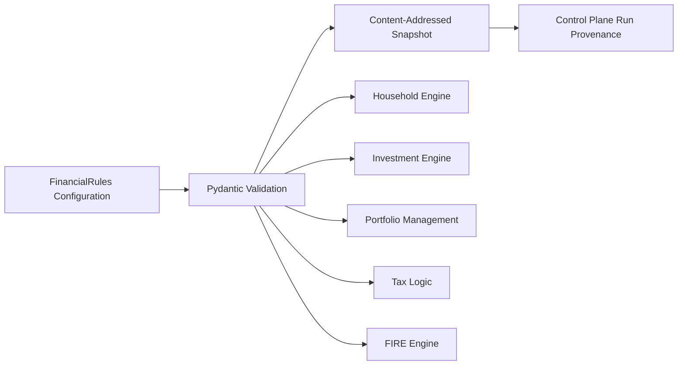
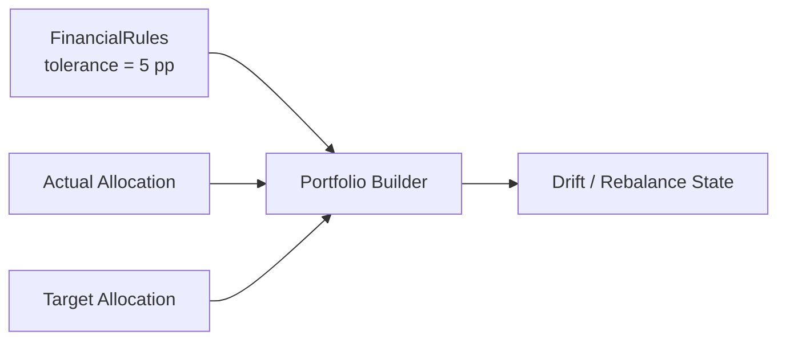
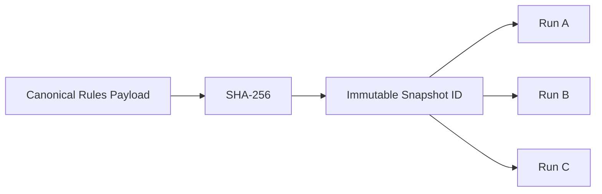

# Financial Rules

`FinancialRules` is the policy plane of Personal Finance ETL.

Operational Settings answer:

```text
Where are the files?
Which databases should I open?
How should ingestion behave?
```

`FinancialRules` answers:

```text
What counts as income?
Which expenses are core?
Which assets are cash?
How should investments be classified?
What tax policy applies?
What allocation is targeted?
What does FIRE assume?
```

That distinction keeps financial meaning out of scattered builder constants.

> **Parameters belong in configuration. Genuinely different behaviour belongs behind adapters or strategies.**

---

## 1. Configuration architecture



The same validated policy object is shared across the analytical system.

That matters because otherwise one definition of "cash" could reach wealth analytics while another reaches FIRE.

---

## 2. Financial policy is typed

A small example is portfolio-management tolerance:

```python
class PortfolioManagementRules(BaseModel):
    rebalance_tolerance_pct_points: float = Field(
        default=5.0,
        ge=0.0,
    )
```

The value is:

- typed,
- validated,
- inspectable,
- serializable,
- snapshot-able.

It is no longer a hidden literal inside a presentation expression.

---

## 3. Policy and behaviour are different things

Consider rebalancing.

The rule:

```text
rebalance_tolerance_pct_points = 5.0
```

is a parameter.

The behaviour:

```text
calculate actual weight
compare with target weight
calculate drift
classify action state
```

belongs in analytical code.

That gives a clean split:



Putting the whole algorithm into configuration would make configuration a programming language.

Putting the threshold into code would hide policy.

Neither is desirable.

---

## 4. Income semantics

Income is not treated as one homogeneous category.

FinancialRules can define distinctions needed downstream, such as:

```text
cash income
non-cash income
active income
dividend income
interest income
```

Why?

Because different analyses ask different questions.

```text
Household economics
→ What income was earned?

Cash flow
→ What cash entered the household?

FIRE
→ What income/savings state supports accumulation?

Investment analytics
→ What investment-generated income exists?
```

One source classification cannot safely answer all of those without a semantic policy layer.

---

## 5. Expense semantics

Expenses can similarly carry policy such as:

```text
cash vs non-cash
core vs non-core
activity classification
```

The distinction between **core** and broader spending is particularly important for FIRE.

A deterministic FI target based on every historical outflow can answer a very different question from one based on sustainable/core household consumption.

The model therefore does not bury expense scope inside the FIRE engine.

---

## 6. Cash-pool policy

Cash-flow reconciliation requires a definition of cash.

That is not equivalent to:

```text
all assets
```

FinancialRules identifies which asset classes/accounts belong to the reconciliation pool.


Changing cash-pool membership can change reconciliation results even when transaction data is unchanged.

That is exactly why the definition belongs in policy.

---

## 7. Cash-flow activity policy

Canonical transactions can be mapped into:

```text
Operating
Investing
Financing
Internal Transfer
```

This classification drives cash-flow reconstruction.

The mapping is financial semantics, not a property of the raw file.

For example, a source may label an investment purchase simply as:

```text
Debit
```

The financial model needs to understand:

```text
Investing cash outflow
```

FinancialRules helps bridge that gap after source normalization.

---

## 8. Asset and investment classification

FinancialRules also participates in analytical classification such as:

```text
asset groups
liquid / illiquid treatment
investment classes
portfolio targets
```

The important boundary is:

```text
source label
      ↓
canonical identity
      ↓
configured financial classification
      ↓
analytics
```

This avoids encoding personal portfolio taxonomy into generic transformation mechanics.

---

## 9. Target allocation is policy

Portfolio allocation analytics require two different states:

```text
actual allocation
target allocation
```

Actual allocation comes from market state.

Target allocation comes from policy.

Then:

```text
Drift_i = Actual Weight_i - Target Weight_i
```

The action threshold is also policy.

This lets the portfolio-management mart answer:

```text
Where am I?
Where do I want to be?
How far apart are they?
Is the difference large enough to act on?
```

without hard-coding the answers.

---

## 10. Tax parameters belong in the financial policy plane

Tax treatment can depend on:

```text
asset tax type
asset tax subtype
holding period
financial year
rates
exemptions
```

Not every part of that state necessarily lives in one Pydantic class; some rules can come from reference tables.

But the architecture treats tax behaviour as **financial policy/reference state**, not presentation logic.

```text
Investment Master
+
Tax Reference / FinancialRules
+
Lot Dates
        ↓
Tax Methodology
```

This keeps tax assumptions inspectable.

---

## 11. FIRE assumptions are financial policy

The FIRE engine depends on assumptions around:

```text
withdrawal rate
inflation
market regimes
returns
volatility
human-capital shocks
glide paths
portfolio drag
withdrawal behaviour
```

Those assumptions do not belong inside the simulation kernel.

The kernel should execute policy.

It should not secretly invent it.

The detailed stochastic configuration is documented in [FIRE Configuration](fire-configuration.md).

---

## 12. Validation prevents impossible policy

Pydantic fields can enforce basic admissibility.

For example:

```python
rebalance_tolerance_pct_points: float = Field(
    default=5.0,
    ge=0.0,
)
```

prevents a negative tolerance from silently entering portfolio logic.

The same principle applies across configuration:

```text
type validation
range validation
required values
structured nested models
```

Validation does not prove that an assumption is financially wise.

It proves that the configuration satisfies the software contract.

That distinction matters.

---

## 13. Configuration snapshots are part of run provenance

The Control Plane stores FinancialRules by content identity.

Conceptually:

```python
rules_hash = hashlib.sha256(
    rules_json.encode("utf-8")
).hexdigest()

rules_id = f"snap_rule_{rules_hash[:12]}"
```

Then:

```text
Run
  └── rules_snapshot_id
```

So the system can identify which policy payload was active for a run.



Identical policy can be referenced by multiple runs without storing duplicate payloads.

---

## 14. Settings and FinancialRules are deliberately separate

This is one of the most important configuration boundaries.

### Settings

Operational concerns such as:

```text
source folders
database paths
reference-file paths
hash policy
application locations
```

### FinancialRules

Financial semantics such as:

```text
income policy
expense policy
cash pools
activity classifications
tax assumptions
target allocation
FIRE assumptions
```

A change to a path should not imply a change to financial methodology.

A change to a withdrawal rule should.

Keeping the models separate makes that distinction visible.

---

## 15. Configuration is not universalization

Moving a value into configuration does not automatically make the platform generic.

For example:

```text
bank source parser
broker source contract
tax jurisdiction behaviour
```

can represent genuinely different behaviour.

Those belong behind:

```text
adapters
pipelines
strategies
```

rather than increasingly complicated configuration switches.

This is the guardrail against configuration maximalism.

---

## 16. A practical decision test

When I find a hard-coded assumption, I ask:

```text
Is this only a value?
→ configuration

Does the algorithm stay the same?
→ configuration

Does the behaviour fundamentally differ?
→ adapter / strategy / pipeline

Is this actually canonical finance?
→ keep it in the domain model
```

That test is more useful than trying to make everything configurable.

---

## 17. Configuration change implications

A FinancialRules change can affect:

```text
canonical classifications
cash-flow reconciliation
portfolio allocation
tax state
wealth
FIRE
Gold marts
```

So configuration should be treated with similar discipline to code.

The content-addressed snapshots help preserve that provenance.

---

## 18. What configuration does not guarantee

Configuration snapshots do not make historical runs perfectly replayable forever.

A future rerun can still use different:

- application code,
- database schema,
- external market data,
- tax implementation.

The snapshot answers:

> **What policy/configuration payload was used?**

It does not independently recreate the entire historical software environment.

---

## 19. FinancialRules design principles

1. Financial meaning should not hide in presentation literals.
2. Operational Settings and financial policy remain separate.
3. Parameters belong in configuration.
4. Different behaviour belongs behind proper code boundaries.
5. Rules are validated before engines consume them.
6. Policy is snapshot-able and linked to run history.
7. Configuration should not become a programming language.
8. Source-specific behaviour should terminate before canonical finance.
9. FinancialRules should preserve existing financial behaviour when refactored.

---

## Go deeper

- [FIRE Configuration](fire-configuration.md)
- [Financial Model](../finance/financial-model.md)
- [Tax Methodology](../finance/tax-methodology.md)
- [Design Decisions](../architecture/design-decisions.md)
- [Roadmap](../about/roadmap.md)

[← Configuration Home](README.md) · [← Documentation Home](../README.md)
