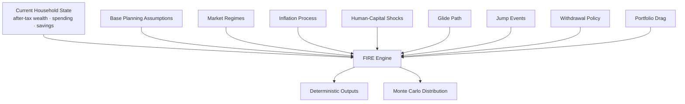

# FIRE Configuration

The FIRE configuration controls how Personal Finance ETL turns current household state into deterministic and stochastic planning scenarios.

This is not a list of "best" values.

The purpose of this guide is to explain:

- what each parameter family controls,
- which direction it pushes the model,
- how parameters interact,
- and what assumptions a reader should understand before changing them.

> FIRE configuration defines a scenario model. It does not encode a guaranteed future or a universally correct retirement strategy.

For the calculation methodology, read [FIRE Methodology](../finance/fire-methodology.md) first.

---

## Configuration architecture



Configuration determines the scenario environment in which the financial state is evaluated.

---

## Start with methodology, not tuning

Before changing FIRE parameters, establish that the upstream model is trustworthy.

Recommended order:

```text
Household transactions
      ↓
Cash / non-cash semantics
      ↓
Asset balances
      ↓
Investment market / tax state
      ↓
After-tax wealth
      ↓
Spending / savings bases
      ↓
FIRE configuration
```

A perfectly tuned Monte Carlo model on top of incorrect household state is still incorrect.

---

## Parameter families

The current FIRE policy spans several conceptual groups:

```text
Core FIRE assumptions
Simulation controls
Market regimes
Regime transitions
Return distributions
Jump / crash process
Inflation process
Human-capital shocks
Glide path
Portfolio drag
Withdrawal rules
```

These families interact.

Changing one number in isolation can have effects that depend strongly on the rest of the configuration.

---

## Core FIRE assumptions

Core assumptions define the deterministic planning baseline.

They can include concepts such as:

- sustainable withdrawal rate,
- expected/real return assumptions,
- planning horizon,
- and FI target behaviour.

---

## Sustainable withdrawal assumption

A withdrawal-rate assumption influences the capital required to support spending.

Conceptually:

```text
FI Target
    ≈
Annual Spending
    /
Withdrawal Rate
```

All else equal:

```text
lower withdrawal rate
→ higher FI target

higher withdrawal rate
→ lower FI target
```

That does not mean a higher configured rate is "better."

It means the model is assuming less capital is required per unit of spending.

---

## Return assumptions

Expected return assumptions influence:

- Coast FI,
- deterministic FI timing,
- future wealth,
- and stochastic scenario outcomes.

All else equal:

```text
higher assumed return
→ faster modelled wealth growth

lower assumed return
→ slower modelled wealth growth
```

But expected return should not be tuned merely to obtain a desired FI date.

---

## Real versus nominal assumptions

The model uses both nominal and inflation-aware concepts.

When configuring returns and inflation, ensure they are economically compatible.

A nominal return assumption should not be interpreted as a real return without accounting for inflation.

Long-range FIRE is ultimately about purchasing power.

---

## Simulation controls

Simulation controls define the computational experiment.

Conceptual parameters include:

- number of simulation paths,
- horizon,
- time-step behaviour,
- and random-process configuration.

## Number of simulations

More paths generally provide a more stable empirical distribution at the cost of compute time.

They do **not** make incorrect assumptions more correct.

```text
more simulations
→ less Monte Carlo sampling noise

not
→ less model risk
```

---

## Simulation horizon

The horizon determines how long paths are evolved.

It should be long enough to represent the planning question.

A horizon that ends too early can make survival/terminal-wealth outputs misleading.

---

## Market regimes

The current stochastic model supports regimes such as:

```text
Bull
Bear
Stagflation
```

Each regime can have different return/volatility behaviour.

This is more expressive than assuming one stationary return distribution for the entire horizon.

---

## Regime return assumptions

Each regime can define its own expected return and volatility characteristics.

Conceptually:

```text
Bull
→ stronger expected growth / regime-specific volatility

Bear
→ weaker or negative expected growth / regime-specific volatility

Stagflation
→ weaker real-growth environment with inflation interaction
```

The exact production values belong in the rules file.

This guide deliberately does not prescribe "correct" market numbers.

---

## Markov transition matrix

Regime changes follow configured transition probabilities.

A transition matrix conceptually looks like:

```text
             Next Regime
Current      Bull   Bear   Stagflation
Bull          p      p          p
Bear          p      p          p
Stagflation   p      p          p
```

Each row should represent a valid probability distribution.

Conceptually:

```text
row probabilities sum to 1
```

The matrix controls regime persistence and switching behaviour.

---

## Why transition assumptions matter

A model where Bear regimes almost always immediately return to Bull behaves very differently from one where adverse regimes persist.

The transition matrix therefore affects:

- drawdown persistence,
- FI timing,
- runway,
- and sequence risk.

It should be reviewed as an economic assumption, not merely a technical matrix.

---

## Fat-tailed shocks

The model can use Student-t-style return shocks.

A degrees-of-freedom parameter controls tail heaviness.

Conceptually:

```text
lower degrees of freedom
→ heavier tails / more extreme shocks

higher degrees of freedom
→ distribution approaches Gaussian behaviour
```

This parameter changes the shape of scenario risk.

It does not "predict" extreme events.

---

## Jump / crash process

The model can include discrete jump events beyond ordinary return shocks.

Conceptual parameters can include:

- event probability,
- negative jump magnitude/distribution,
- positive jump behaviour,
- and regime interaction.

All else equal:

```text
higher negative-jump probability
→ more adverse tail scenarios
```

but the impact depends on timing and portfolio state.

---

## Why jump timing matters

A crash early in accumulation and a crash immediately after retirement can have very different consequences.

The model's pathwise evolution allows timing to affect outcomes rather than only changing average return.

This is one way the simulation captures sequence risk.

---

## Stochastic inflation

Inflation can evolve as a stochastic process rather than one fixed constant.

Conceptual parameters can control:

- long-run inflation level,
- persistence,
- volatility,
- and shock behaviour.

---

## Inflation mean reversion

A mean-reverting inflation process conceptually pulls inflation toward a long-run level over time.

Stronger mean reversion:

```text
→ inflation shocks dissipate faster
```

Weaker mean reversion:

```text
→ inflation shocks persist longer
```

---

## Inflation volatility

Higher inflation volatility widens the range of future spending and purchasing-power outcomes.

This can materially affect FI targets and withdrawal sustainability.

---

## Human-capital shocks

The model can represent uncertainty in future earning capacity.

This is especially important before FI.

Conceptual parameters can describe:

- unemployment probability,
- unemployment duration,
- income shock severity,
- recovery behaviour,
- and related human-capital state.

---

## Why human capital belongs in FIRE

Pre-FI wealth depends on both:

```text
portfolio returns
```

and:

```text
continued ability to save
```

A market-only model ignores one of the largest risks during accumulation.

---

## Unemployment probability

Higher unemployment probability generally increases the frequency of simulated income interruptions.

The effect on FI timing depends on:

- current wealth,
- savings rate,
- duration,
- recovery,
- and market state.

---

## Unemployment duration

Longer unemployment episodes reduce cumulative savings and can require additional withdrawals from liquid assets.

This can create path dependence even before retirement.

---

## Glide path

The model can evolve asset allocation over time.

A glide path can define how exposure changes as:

- FI approaches,
- retirement begins,
- or time advances.

Conceptually:

```text
Current allocation
        ↓
transition through configured path
        ↓
later allocation
```

---

## Glide-path interaction with sequence risk

Reducing risky-asset exposure can reduce some downside paths but can also reduce expected growth.

The effect is not unidirectional.

That is exactly why the parameter belongs in scenario analysis rather than being labelled automatically conservative or aggressive.

---

## Portfolio drag

Portfolio drag represents recurring costs/expenses that reduce investment returns.

Conceptually:

```text
Gross Return
   -
Portfolio Drag
   =
Net Modelled Return
```

Small annual differences can compound materially over long horizons.

---

## Dynamic withdrawal policy

The model supports dynamic withdrawal behaviour rather than only a fixed inflation-adjusted withdrawal.

Current methodology includes Guyton-Klinger-style concepts.

Dynamic withdrawal rules can adjust spending based on portfolio state.

---

## Why dynamic withdrawals matter

A fixed withdrawal rule assumes household spending never responds to financial conditions.

A dynamic rule can model behavioural adaptation.

That can materially change:

- survival probability,
- terminal wealth,
- and stressed runway.

---

## Withdrawal guardrails

Dynamic withdrawal systems can use thresholds/guardrails to determine when spending is increased, frozen, or reduced.

The exact parameters should be interpreted as policy assumptions.

They are not universal retirement rules.

---

## Spending scope

The FIRE model supports more than one spending perspective.

The current Gold contract includes paired total-spend variants for several measures.

This means configuration should be reviewed together with the financial model's definitions of:

- core/lean spending,
- broader total spending,
- and cash/non-cash expense treatment.

---

## Savings scope

Likewise, the model can distinguish:

- cash-oriented savings,
- broader total savings.

A simulation funded by deployable savings should not silently use a savings concept dominated by non-cash accounting activity.

---

## Tax-aware wealth basis

FIRE uses tax-aware household wealth where appropriate.

This connects FIRE assumptions with tax configuration.

Changing tax rates or holding treatment can therefore change:

- after-tax wealth,
- FI coverage,
- FI gap,
- runway,
- and simulated outcomes.

Configuration families are not independent islands.

---

## Configuration interactions

Several important interactions deserve explicit attention.

## Returns × inflation

High nominal return with high inflation may produce weak real progress.

## Market regimes × transition matrix

Regime assumptions mean little without understanding persistence/switching probabilities.

## Returns × portfolio drag

Gross expected return should not be interpreted as net return if drag is modelled separately.

## Human capital × savings

Income shocks matter more when the plan depends heavily on continued contributions.

## Glide path × sequence risk

Allocation changes alter both expected growth and downside sensitivity.

## Withdrawal policy × terminal wealth

More adaptive spending can preserve capital at the cost of consumption variability.

## Tax × wealth basis

Tax assumptions can change the capital considered available to FIRE.

---

## Direction-of-effect map

This table describes broad model tendencies, not guaranteed outcomes.

| Parameter change | Typical model effect, all else equal |
| --- | --- |
| Higher spending | Higher FI target, lower runway, later FI |
| Higher savings | Faster accumulation, earlier FI |
| Higher expected return | Faster modelled growth, but not necessarily lower path risk |
| Higher inflation | Higher future spending needs, weaker real outcomes |
| Higher negative-jump frequency | Worse tail outcomes |
| Heavier return tails | Wider/extremer scenario distribution |
| Higher unemployment risk | Slower accumulation / wider FI timing |
| Longer unemployment duration | Greater savings interruption |
| Higher portfolio drag | Lower long-run wealth |
| Lower withdrawal rate | Higher FI target, potentially stronger retirement resilience |
| More flexible withdrawals | Potentially stronger survival with more spending variability |

Real outcomes can differ because parameters interact.

---

## Parameter validation

Pydantic validation can ensure configuration structure is valid.

For example:

- numeric fields are numeric,
- nested sections exist,
- lists/matrices have expected structure.

The model should also validate logical constraints where implemented, such as probability shapes.

But schema validity is only the first level.

---

## Economic validation

Before trusting a rules file, ask:

### Are probabilities coherent?

Transition rows should represent valid distributions.

### Are return and inflation assumptions internally compatible?

Do not mix real and nominal concepts casually.

### Are shocks plausible for the scenario purpose?

Extreme assumptions can be useful for stress testing, but should be labelled as such.

### Does the horizon match the planning question?

### Are savings/spending bases the intended financial definitions?

### Does the tax-aware wealth basis match the planning intent?

---

## Behavioural validation

A useful FIRE configuration should produce directionally sensible responses.

Examples:

```text
increase spending
→ FI generally becomes harder

increase savings
→ FI generally becomes easier

increase portfolio drag
→ long-run wealth generally falls

increase adverse shocks
→ tail outcomes generally worsen
```

If those relationships fail unexpectedly, investigate the model before tuning parameters further.

---

## Sensitivity analysis mindset

I prefer comparing scenarios over declaring one parameter set "correct."

For example:

```text
Base assumptions
vs
Lower-return assumptions
vs
Higher-inflation assumptions
vs
Employment-shock assumptions
```

The purpose is to understand what drives the plan.

A model is more useful when it reveals sensitivity than when it produces one beautifully precise date.

---

## Avoid false precision

A P50 FI date with day-level formatting can look more certain than the model deserves.

Interpret the output as:

> median timing under the configured simulation

not:

> scheduled retirement appointment.

The same caution applies to terminal wealth and probability-of-success percentages.

---

## Scenario profiles

It can be useful to maintain multiple named configuration profiles for analysis.

For example:

```text
base
stress-return
stress-inflation
stress-employment
```

Those names should describe the assumption being changed rather than label one profile "safe" or "optimal."

The purpose is comparison.

---

## What not to do

## Do not tune until the answer looks comforting

That converts scenario analysis into confirmation bias.

## Do not copy market assumptions without understanding units

Real versus nominal mistakes can dominate long-horizon results.

## Do not treat probability of success as objective truth

It is conditional on the model.

## Do not hide extreme assumptions behind neutral names

A stress scenario should look like a stress scenario.

## Do not compensate for bad upstream data with FIRE parameters

Fix the financial state first.

---

## Recommended FIRE configuration workflow

```text
1. Validate household state
        ↓
2. Validate after-tax wealth
        ↓
3. Validate trailing spending / savings
        ↓
4. Set deterministic FIRE assumptions
        ↓
5. Validate deterministic outputs
        ↓
6. Configure market regimes
        ↓
7. Configure inflation
        ↓
8. Configure human-capital shocks
        ↓
9. Configure jumps / tails
        ↓
10. Configure glide path / drag
        ↓
11. Configure withdrawal policy
        ↓
12. Run scenario comparisons
        ↓
13. Review sensitivity, not just headline P50
```

---

## Configuration provenance

FIRE outputs can change materially when the rules change.

For strong reproducibility, a future Meta model should capture:

```text
financial_rules_hash
rules_schema_version
application_version
simulation configuration fingerprint
```

The current Meta layer captures rules context, but this is an area worth hardening further.

---

## Current model boundaries

The FIRE configuration is sophisticated, but it remains a model.

It does not fully represent:

- every future tax-law change,
- every household behaviour change,
- every asset class,
- every macroeconomic regime,
- every employment event,
- every medical/family shock,
- or every market structure change.

The purpose is not completeness.

The purpose is structured uncertainty.

---

## FIRE configuration invariants

1. **Configuration describes assumptions, not predictions.**
2. **Real and nominal quantities remain distinguishable.**
3. **Transition probabilities remain coherent.**
4. **Market and human-capital risk remain separate concepts.**
5. **Inflation remains part of long-range interpretation.**
6. **Tax-aware wealth remains connected to tax policy.**
7. **Spending and savings scopes remain explicit.**
8. **Simulation count reduces sampling noise, not model risk.**
9. **Scenario profiles remain descriptive rather than prescriptive.**
10. **Sensitivity matters more than false precision.**
11. **Complex behaviour remains in code rather than exploding configuration.**
12. **Upstream financial correctness comes before stochastic sophistication.**

---

## Related documentation

- [FIRE Methodology](../finance/fire-methodology.md)
- [Financial Rules](financial-rules.md)
- [Financial Model](../finance/financial-model.md)
- [Tax Methodology](../finance/tax-methodology.md)
- [Metrics & Methodology](../finance/metrics-and-methodology.md)

[← Configuration Home](README.md) · [← Documentation Home](../README.md)
