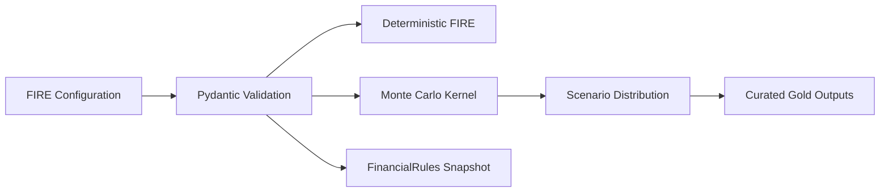
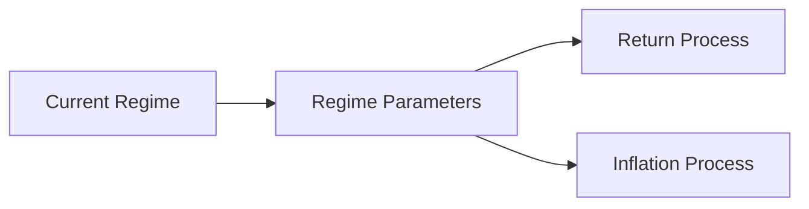
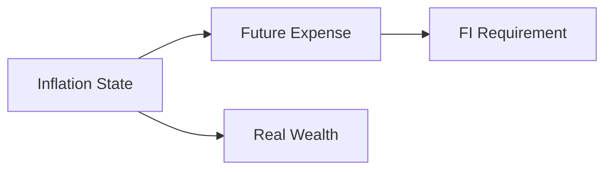
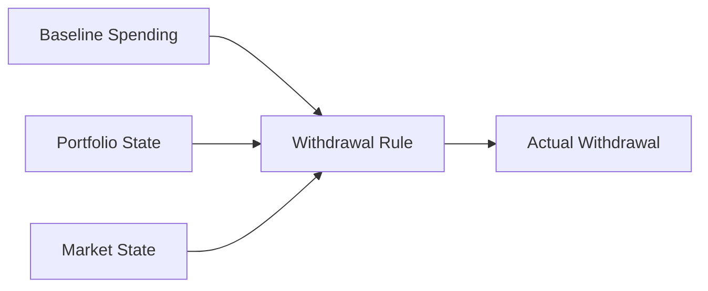

# FIRE Configuration

The FIRE engine separates **simulation mechanics** from **financial assumptions**.

That is the entire point of this configuration layer.

```text
Simulation kernel
→ how paths are generated

FIRE configuration
→ what financial world those paths represent
```

The kernel should not contain hidden opinions about expected returns, inflation, employment shocks, or withdrawal behaviour.

---

## 1. Configuration flow



The same validated assumptions are therefore:

- consumed by the engine,
- persisted in run provenance,
- explainable in documentation.

---

## 2. Configuration families

The FIRE policy surface can be understood as several families:

```text
Current-State Policy
Market Regimes
Regime Transitions
Inflation
Jump / Tail Behaviour
Human Capital
Glide Path
Portfolio Drag
Withdrawal Policy
Simulation Controls
```

Each family changes a different part of the state transition.

---

## 3. Current-state policy

Before simulation begins, the model needs to know how to interpret current finances.

Important assumptions include:

```text
eligible wealth
core spending
withdrawal rate
savings/contribution behaviour
tax-aware vs pre-tax wealth basis
```

For a deterministic target:

```text
FI Target = Annual Core Expense / Withdrawal Rate
```

Changing the withdrawal rate changes the target even if current wealth is unchanged.

That is policy.

---

## 4. Market regimes

The simulation can represent states such as:

```text
Bull
Bear
Stagflation
```

A regime can define a bundle of assumptions:

```text
expected return
volatility
inflation tendency
```

Conceptually:



This is more expressive than assuming one stationary market distribution forever.

---

## 5. Regime transition matrix

Regimes evolve according to configured transition probabilities.

Conceptually:

```text
P_ij = P(next regime = j | current regime = i)
```

Each row should represent a valid probability distribution:

```text
For each current regime i:

Σ_j P_ij = 1
```

A conceptual matrix:

| From \ To | Bull | Bear | Stagflation |
| --- | ---: | ---: | ---: |
| Bull | \(p_{BB}\) | \(p_{BBe}\) | \(p_{BS}\) |
| Bear | \(p_{BeB}\) | \(p_{BeBe}\) | \(p_{BeS}\) |
| Stagflation | \(p_{SB}\) | \(p_{SBe}\) | \(p_{SS}\) |

The exact values belong in configuration.

The simulation kernel only consumes them.

---

## 6. Why transitions matter

Without transition state:

```text
every period
→ independent regime draw
```

With a Markov transition model:

```text
current regime
→ influences next-regime probabilities
```

That allows persistence:

```text
bull markets can remain bull
bear markets can cluster
stagflation can persist
```

without deterministically scripting a future path.

---

## 7. Return assumptions

Each regime can carry assumptions around:

```text
expected return
volatility
```

The simulation then adds stochastic shocks around the configured regime state.

The values are model inputs.

They are not forecasts generated by the ETL pipeline.

That distinction should remain explicit whenever FIRE results are interpreted.

---

## 8. Fat-tail configuration

The stochastic process can use heavier-tailed shocks.

A tail parameter controls how much probability mass the model places away from the center relative to a Gaussian assumption.

Conceptually:

```text
lower degrees of freedom
→ heavier tails
→ more extreme simulated shocks
```

The parameter should be chosen deliberately because it materially changes stress behaviour.

---

## 9. Jump-event configuration

Jump/crash behaviour can be configured separately from ordinary volatility.

Conceptually:

```text
jump probability
jump magnitude distribution
```

The period return process becomes:

```text
regime return
+
ordinary stochastic shock
+
optional jump shock
```

This avoids asking one volatility parameter to represent every form of market stress.

---

## 10. Inflation configuration

Inflation affects both:

```text
future spending
and
real purchasing power
```

The configuration can describe inflation dynamics rather than fixing one scalar forever.



The relationship is important because a high nominal terminal value can still represent weak real purchasing power.

---

## 11. Human-capital configuration

During accumulation, the ability to keep contributing matters.

The model can configure events such as:

```text
employment shock probability
income reduction
shock duration
recovery behaviour
```

Conceptually:

```text
employed
   ↓ shock
reduced / lost contribution
   ↓ recovery
normal contribution state
```

This lets FIRE modelling include household earning capacity rather than modelling only financial capital.

---

## 12. Contribution assumptions

Savings/contributions can depend on:

```text
income
expense
inflation
employment state
```

That means contribution policy is not merely:

```text
add fixed ₹X every month forever
```

unless that is intentionally the configured scenario.

---

## 13. Glide-path configuration

A glide path describes how target asset allocation changes through time or FI proximity.

Conceptually:

```text
Accumulation Allocation
        ↓
Transition
        ↓
Near-FI Allocation
        ↓
Post-FI Allocation
```

This can reduce reliance on one fixed allocation assumption across decades.

The path is policy, not market prediction.

---

## 14. Portfolio drag

Portfolio drag can represent recurring implementation friction such as:

```text
fees
costs
other return drag assumptions
```

The simulation should distinguish:

```text
gross market process
from
net investor process
```

That keeps the model interpretable.

---

## 15. Withdrawal policy

Post-FI spending behaviour can be configured separately from the market process.

A simple policy might use inflation-adjusted withdrawals.

A dynamic policy can use guardrails.

Conceptually:



The kernel executes the configured policy.

---

## 16. Dynamic withdrawal guardrails

A guardrail policy can reduce/increase withdrawals when portfolio state crosses configured conditions.

The important architecture is:

```text
thresholds
→ configuration

decision algorithm
→ strategy / simulation code
```

If a future withdrawal methodology is fundamentally different, it should become a strategy rather than an explosion of boolean configuration flags.

---

## 17. Simulation controls

Not every configuration value is financial policy.

Some values control execution:

```text
number of simulations
time horizon
random seed / reproducibility controls
```

These affect numerical execution rather than household finance.

They should still be validated and documented because they affect the output distribution and runtime.

---

## 18. Number of paths

More paths can reduce Monte Carlo sampling noise, but they also increase compute.

```text
more paths
→ more numerical work
→ generally smoother estimated distribution
```

There is no universally correct number independent of model complexity and decision use.

The configured value is a numerical trade-off.

---

## 19. Horizon

The simulation horizon must be long enough to answer the planning question.

Too short:

```text
successful path may simply outlive the simulation window
```

Too long:

```text
more compute
+
greater dependence on assumptions far beyond what can be meaningfully calibrated
```

Again, configuration expresses the scenario.

---

## 20. Reproducibility controls

Where a random seed is configurable, it can help distinguish:

```text
model change
from
different random draw
```

That is useful during development and comparison.

But one seed is not evidence that the model is correct.

It is an execution reproducibility tool.

---

## 21. Validation

Pydantic is the first line of defence against structurally invalid configuration.

Examples of useful validation classes include:

```text
probabilities within [0, 1]
positive horizons
non-negative volatility
valid allocation ranges
valid transition rows
valid withdrawal rates
```

Validation answers:

> **Can the engine safely interpret this configuration?**

It does not answer:

> **Are these assumptions economically correct?**

That remains a modelling judgement.

---

## 22. Configuration provenance

FIRE assumptions live inside the broader FinancialRules payload.

That payload is content-addressed by the Control Plane.

```text
FIRE assumptions
      ↓
FinancialRules serialization
      ↓
SHA-256 snapshot
      ↓
run_id
```

So a run can identify which stochastic policy produced its outputs.

That is particularly important for simulation because small assumption changes can materially alter the distribution.

---

## 23. Sensitivity matters more than false precision

A stochastic model can produce many decimal places.

That does not mean the assumptions deserve that precision.

For planning, I care more about:

```text
How does the conclusion move when assumptions change?
```

than:

```text
What is the 8th decimal place of one scenario output?
```

The configuration architecture makes sensitivity analysis possible because assumptions are explicit.

---

## 24. Gold intentionally curates simulation output

The engine can generate more internal state than Power BI needs.

The Gold contract exposes selected planning measures such as:

```text
P10 / P50 / P90 months to FI
modelled probability of success
P50 FI date
base runway
stressed runway
P50 nominal terminal wealth
```

That keeps the serving layer decision-oriented.

---

## 25. Configuration example: conceptual only

The exact production model should remain the source of truth, but conceptually the structure resembles:

```yaml
# Conceptual example, not a verbatim production file.
fire:
  withdrawal_rate: ...
  simulation:
    paths: ...
    horizon_months: ...
  regimes:
    bull:
      expected_return: ...
      volatility: ...
    bear:
      expected_return: ...
      volatility: ...
  human_capital:
    shock_probability: ...
  glide_path:
    enabled: ...
```

This example is deliberately labelled conceptual.

Production configuration fields should be taken from the current Pydantic models.

---

## 26. FIRE configuration invariants

1. Assumptions do not hide inside numerical kernels.
2. Financial policy and simulation controls remain distinguishable.
3. Transition probabilities must form valid distributions.
4. Model parameters are assumptions, not forecasts.
5. Human capital belongs in accumulation modelling.
6. Inflation affects spending and real wealth.
7. Withdrawal policy is independent from market-return generation.
8. Fundamentally different behaviour should become a strategy, not configuration spaghetti.
9. FinancialRules snapshots preserve assumption provenance.
10. Simulation output remains conditional on the configured model.

---

## Go deeper

- [FIRE Methodology](../finance/fire-methodology.md)
- [Financial Rules](financial-rules.md)
- [Metrics & Methodology](../finance/metrics-and-methodology.md)
- [Reliability & Recovery](../architecture/reliability-and-recovery.md)

[← Configuration Home](README.md) · [← Documentation Home](../README.md)
