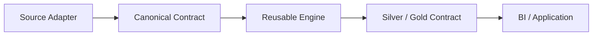

# Developer

This section is for changing the system without dissolving its boundaries.

The central extension rule is:

> **Source-specific behaviour should terminate before canonical finance. Decision-specific behaviour should not leak back into ingestion.**



## The publication seam

A lightweight registry makes analytical publication explicit:

```python
@dataclass
class DataContract:
    contract_id: str
    layer: str
    physical_table: str
    domain: str
    grain: str
    producer: str
    publication_order: int
```

A developer adding analytical state should know the **grain, producer and publication contract** before deciding where to save a DataFrame.

## Read in this order

| Guide | Use it when... |
| --- | --- |
| [Development Guide](development-guide.md) | You need package boundaries, engineering conventions and development workflow |
| [Adding a Data Source](adding-data-sources.md) | A new institution/file/provider must enter the ingestion lifecycle |
| [Adding an Asset Pipeline](adding-asset-pipelines.md) | A new investment type can converge into the shared investment engine |
| [Adding a Gold Mart](adding-gold-marts.md) | A new decision-support question deserves a physical serving contract |

## Extension test

A good extension should usually look like:

```text
new variation
      ↓
appropriate adapter / pipeline / strategy
      ↓
existing canonical boundary
      ↓
existing downstream engine
```

If adding a new broker requires rewriting portfolio XIRR, the boundary is probably leaking.

[← Documentation Home](../README.md)
