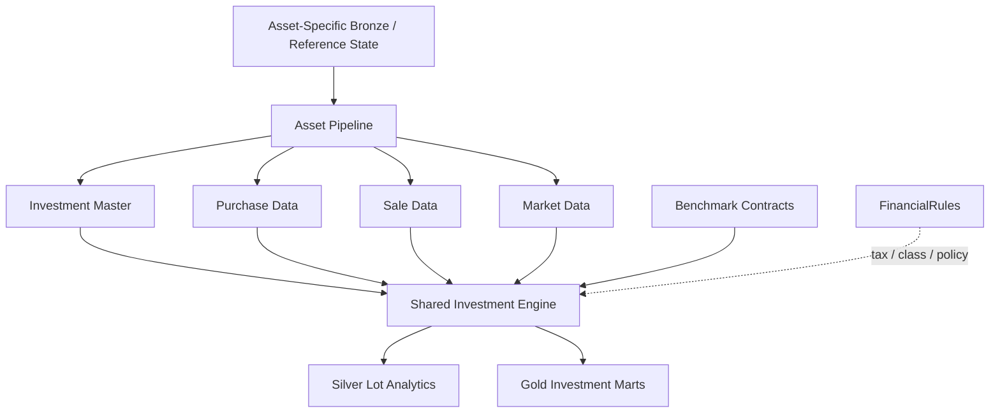
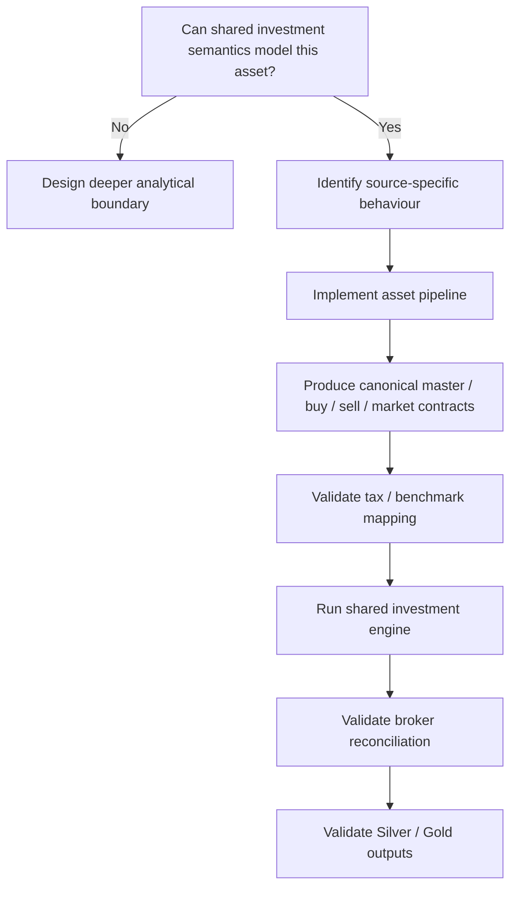

# Adding an Asset Pipeline

Asset pipelines are the primary extension seam for investment types that require different upstream processing but should converge into the same downstream investment engine.

The current v6 implementation includes pipelines for:

- stocks,
- mutual funds.

The architectural objective is:

```text
asset-specific source behaviour
        ↓
asset pipeline
        ↓
canonical investment contracts
        ↓
shared FIFO / tax / benchmark / portfolio engine
```

A new asset type should not require every downstream calculation to learn another source format.

---

## Asset-pipeline architecture



The pipeline boundary exists to absorb asset-specific upstream differences.

---

## When to add an asset pipeline

Add a new asset pipeline when:

- the asset has materially different source/extraction/transformation behaviour,
- but it can still satisfy the shared investment analytical concepts.

Examples could include future support for:

- ETFs,
- bonds,
- pensions,
- or other instrument types.

Do not create a new pipeline merely because an existing asset has another broker.

A broker/source difference is usually a source-adapter problem.

---

## First question: can the shared engine model it?

Before implementing a pipeline, determine whether the asset can meaningfully support the downstream contract.

The current investment engine expects concepts around:

- instrument identity,
- purchases,
- sales,
- market valuation,
- benchmark mapping,
- tax treatment,
- and quantity/cost state.

If an asset fundamentally does not behave like this, forcing it through the current contract may be worse than introducing a new analytical model.

---

## Canonical result contract

An asset pipeline should converge toward common downstream outputs.

Conceptually:

```text
Investment Master
Purchase Data
Sale Data
Market Data
```

These outputs allow the shared engine to reconstruct and value investment state.

The exact Python result structures should be taken from the live codebase when implementing the extension.

This documentation intentionally describes the semantic contract rather than inventing class signatures that may drift.

---

## Investment master requirements

The master should provide stable instrument identity and analytical classification.

Important concepts include:

- ISIN or equivalent stable instrument identity,
- instrument type,
- subtype,
- class,
- sector,
- industry,
- benchmark mapping,
- and tax type.

Not every asset will use every classification equally.

But downstream analytics require enough identity to group and interpret the instrument correctly.

---

## Purchase contract

Purchase data should provide the information needed to create tax lots.

Conceptually:

```text
instrument identity
purchase date
quantity
purchase value / cost basis
```

Additional source fields can exist upstream, but the lot engine needs stable economic meaning.

---

## Sale contract

Sale data should provide the information needed to consume FIFO inventory.

Conceptually:

```text
instrument identity
sale date
quantity
sale proceeds / value
```

The engine determines lot matching and realized tax state.

The source adapter should not precompute a competing lot methodology unless that is an intentional architecture change.

---

## Market-data contract

Market data provides dated valuation state.

Conceptually:

```text
instrument identity
observation date
market price / value basis
```

The historical snapshot engine uses market observations to value active lots through time.

---

## Benchmark relationship

The asset should map to an appropriate benchmark if benchmark-relative analytics are expected.

The benchmark pipeline is shared.

The asset pipeline should provide/reference the benchmark identity rather than implement another benchmark-history subsystem.

---

## Tax classification

The investment master needs enough tax classification for the shared tax engine.

Current methodology contains jurisdiction-specific equity/debt treatment.

If a new asset introduces genuinely new tax behaviour, decide whether:

```text
new parameter
```

is sufficient or whether:

```text
new tax strategy
```

is required.

Do not encode complex behavioural differences as arbitrary strings and giant `if` blocks.

---

## FIFO compatibility

The current engine uses FIFO tax-lot accounting.

A new asset pipeline should not silently implement average cost or another disposal method while publishing into the same downstream contract.

If the asset requires another accounting methodology, that is a deeper investment-engine design decision.

---

## Broker/current-state reconciliation

The shared investment engine can reconcile transaction-derived state with broker-reported current state.

For a new asset type, determine:

- what quantity represents,
- what current cost/buy value represents,
- whether the external provider reports authoritative current state,
- and whether reconciliation is financially meaningful.

Not every asset source will have identical reconciliation semantics.

---

## Partial disposals

If the asset supports partial sale/redemption, the canonical sale contract should allow the FIFO engine to consume part of a lot while retaining the remaining inventory.

This behaviour already exists in the shared lot engine.

---

## Historical snapshots

Once the canonical contract is satisfied, the shared engine can evolve state through market observations.

A new asset pipeline should not need to recreate the snapshot engine.

That is the benefit of the boundary.

---

## Return methodology

The shared engine calculates measures such as:

- CAGR,
- XIRR,
- after-tax XIRR,
- benchmark XIRR,
- active return,
- and max drawdown.

A new asset type should inherit those methodologies only if they are financially meaningful for that asset.

Do not publish XIRR merely because the engine can calculate it.

---

## Hierarchical classification

The current Gold model supports analytical views such as:

```text
ISIN
Subtype
Class
Instrument Type
Sector
Industry
Portfolio
```

A new asset pipeline should populate classifications that are meaningful.

For example, sector may be meaningful for equities but less useful for another asset type.

Missing semantics should be handled intentionally rather than populated with misleading placeholders.

---

## Process-pool execution

The investment engine partitions work by instrument identity.

A new asset pipeline should preserve stable instrument keys so per-instrument worker execution remains valid.

Avoid pipeline output that requires global mutable asset state inside worker processes.

---

## Adding a new asset: workflow



---

## Step 1 · Define the asset semantics

Document:

- what one instrument is,
- what quantity means,
- what a purchase means,
- what a sale/redemption means,
- how market value is observed,
- and how tax treatment works.

Do this before coding.

---

## Step 2 · Identify source inputs

List the Bronze/reference datasets needed.

Do not mix source discovery with the asset-pipeline contract.

If the asset comes from a new source format, complete [Adding a Data Source](adding-data-sources.md) first.

---

## Step 3 · Build canonical master

Produce stable instrument identity and classifications.

Validate required downstream fields.

The current production load path already treats important investment identity/tax fields as critical quality requirements.

---

## Step 4 · Build purchases

Normalize purchase/acquisition events into the shared economic contract.

Check:

- dates,
- quantities,
- values,
- duplicates,
- and instrument identity.

---

## Step 5 · Build sales

Normalize disposals/redemptions.

Check:

- dates,
- quantities,
- proceeds,
- and identity.

The shared engine should own FIFO matching.

---

## Step 6 · Build market data

Normalize dated valuation observations.

Check that market dates and instrument identities align with transaction state.

---

## Step 7 · Configure benchmark mapping

Map the asset/instrument to the appropriate benchmark if benchmark-relative analytics are desired.

Validate required benchmark coverage.

---

## Step 8 · Configure tax type

Map the instrument to the appropriate current tax methodology.

If existing tax types are insufficient, stop and design the tax extension explicitly.

Do not fake a new tax regime by choosing the closest existing label.

---

## Step 9 · Run lot reconstruction

Validate:

- lot creation,
- FIFO consumption,
- partial sales,
- remaining quantity,
- realized state,
- and unrealized state.

Use simple hand-checkable examples before trusting portfolio-scale output.

---

## Step 10 · Validate reconciliation

Compare reconstructed state with external current state.

Investigate any adjustment inventory or cost scaling.

A reconciliation that "makes the totals match" can still hide incorrect financial interpretation.

---

## Step 11 · Validate benchmark shadow state

Confirm that:

- purchases create benchmark-equivalent exposure,
- partial disposals reduce shadow exposure,
- and benchmark history covers the required dates.

---

## Step 12 · Validate returns

Check:

- XIRR cash-flow construction,
- after-tax terminal state,
- benchmark cash-flow construction,
- and portfolio aggregation.

Do not validate returns only by comparing them with another opaque application number.

Use small transparent examples too.

---

## Step 13 · Validate publication

Confirm that the new asset appears correctly in:

- Silver lot analytics,
- ISIN analytics,
- classification marts,
- portfolio analytics,
- and portfolio-management outputs

where those contracts are applicable.

---

## Step 14 · Validate household integration

The asset should also flow into:

- market net worth,
- after-tax wealth,
- portfolio allocation,
- and FIRE

if it belongs in those household concepts.

This catches a common architecture mistake: adding an investment type that exists in the investment dashboard but disappears from household wealth.

---

## Data-quality checklist

```text
[ ] Stable instrument identity
[ ] Purchase dates valid
[ ] Sale dates valid
[ ] Quantities valid
[ ] Cost/proceeds semantics understood
[ ] Market history available
[ ] Benchmark mapping valid
[ ] Tax type valid
[ ] FIFO behaviour verified
[ ] Partial disposal verified
[ ] Broker reconciliation reviewed
[ ] XIRR cash flows reviewed
[ ] After-tax state reviewed
[ ] Classification marts reviewed
[ ] Household wealth integration reviewed
```

---

## What not to put in an asset pipeline

## Gold calculations

The pipeline should not build Power BI marts.

## FIRE logic

FIRE consumes household state downstream.

## Source discovery

Source discovery belongs in ingestion.

## Universal tax logic

The pipeline can supply tax classification; the shared tax methodology belongs downstream.

## Report formatting

Presentation is not part of the asset contract.

---

## When the shared engine is not enough

A new asset may require deeper architecture if it has fundamentally different economics.

Examples could include instruments where:

- quantity is not a meaningful state,
- valuation is not market-observation driven,
- cash flows are contractual rather than trade-based,
- or disposal accounting cannot use FIFO.

In that case, do not contort the existing pipeline.

Document the new financial model first.

---

## Documentation updates

A new asset pipeline can require updates to:

- [Financial Model](../finance/financial-model.md)
- [Investment Analytics](../finance/investment-analytics.md)
- [Tax Methodology](../finance/tax-methodology.md)
- [Data Model](../architecture/data-model.md)
- Silver/Gold contract reference
- configuration docs

depending on whether the canonical or serving contracts change.

---

## Asset-pipeline invariants

1. **Asset-specific behaviour remains upstream of the shared engine.**
2. **Canonical investment contracts remain stable where financially valid.**
3. **FIFO methodology is not silently changed per asset.**
4. **Tax classification remains explicit.**
5. **Benchmark semantics remain explicit.**
6. **Per-instrument identity remains stable.**
7. **Return methodology remains appropriate to the asset.**
8. **Broker reconciliation is reviewed rather than blindly accepted.**
9. **New assets flow into household wealth where applicable.**
10. **A fundamentally different asset model gets a deliberate new boundary rather than a forced fit.**

---

## Related documentation

- [Development Guide](development-guide.md)
- [Adding a Data Source](adding-data-sources.md)
- [Investment Analytics](../finance/investment-analytics.md)
- [Tax Methodology](../finance/tax-methodology.md)
- [Data Model](../architecture/data-model.md)

[← Developer Home](README.md) · [← Documentation Home](../README.md)
