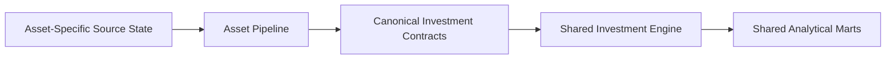
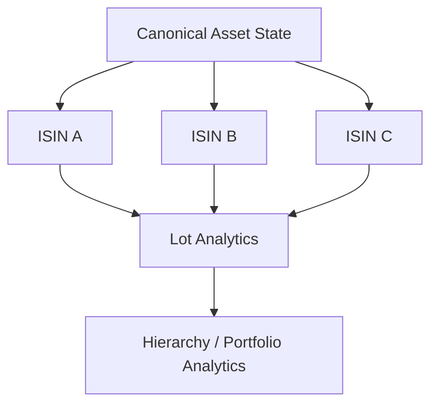

# Adding an Asset Pipeline

An asset pipeline exists to absorb **asset-specific upstream behaviour** before data enters the shared investment engine.

The target architecture is:



If a new asset type can produce the canonical contracts, FIFO/benchmark/tax/aggregation should remain reusable where the financial methodology is compatible.

---

## 1. Decide whether you need a new asset pipeline

A new label is not automatically a new pipeline.

Ask:

```text
Does the source shape differ?
Does transaction normalization differ?
Does market-data preparation differ?
Does instrument identity differ?
Does tax behaviour differ only by policy?
Does the downstream investment state machine remain valid?
```

If only values/classifications differ, configuration may be enough.

If upstream behaviour differs materially, an asset pipeline is appropriate.

---

## 2. The pipeline's job

An asset pipeline should translate asset-specific inputs into shared contracts.

Conceptually:

```text
asset-specific transactions
asset-specific market data
asset master/reference
        ↓
Asset Pipeline
        ↓
canonical purchases
canonical sales
canonical market observations
canonical investment master context
```

The shared engine should not know whether those contracts came from stocks, mutual funds, or a future asset family.

---

## 3. Keep tax policy separate where possible

A different tax rate or holding threshold does not necessarily require a new analytical engine.

The investment engine already receives tax classification context.

The production sale path asks the tax table:

```python
holding_type = self.fy_table.get_holding_type(
    age_sale,
    self.tax_type,
    self.tax_subtype,
    lot.date,
    sell_date,
)
```

So:

```text
different tax parameters
→ policy/reference data

different transaction/market behaviour
→ asset pipeline

different lot accounting methodology
→ potentially new strategy/engine behaviour
```

This distinction prevents unnecessary engine forks.

---

## 4. Preserve canonical grain

The shared investment engine expects meaningful grains.

Typical contracts include:

```text
purchase
→ transaction / lot-creation event

sale
→ disposal event

market data
→ Date × ISIN observation

investment master
→ ISIN identity / classification
```

Do not silently aggregate away acquisition history before FIFO receives it.

---

## 5. Canonical purchase contract

A purchase must provide enough information to create economic lot state.

Conceptually:

```text
ISIN
purchase date
quantity
purchase price / capital
instrument context
```

If the source expresses this differently, the asset pipeline normalizes it.

Do not make FIFO parse provider-specific fields.

---

## 6. Canonical sale contract

A sale must provide enough information to consume inventory.

Conceptually:

```text
ISIN
sale date
quantity
sale price / proceeds
```

The shared engine determines which historical lots are consumed.

The source should not pre-assign average-cost history if the project methodology is FIFO.

---

## 7. Canonical market contract

Market observations provide valuation state:

```text
Date × ISIN
→ market price / value context
```

The engine uses those observations to mark active lots and construct historical analytical state.

A new asset pipeline must ensure dates and identity align with transaction state.

---

## 8. Benchmark mapping

If the asset participates in benchmark-relative analytics, it needs benchmark identity/context.

```text
Investment Master
      ↓
benchmark mapping
      ↓
benchmark market history
      ↓
shadow benchmark lots
```

The asset pipeline should not implement its own unrelated benchmark methodology if the existing shadow-portfolio model applies.

---

## 9. Shared FIFO should remain shared

The core sale algorithm consumes active lots:

```python
while rem > 0 and self._active_lots:
    lot = self._active_lots[0]
    consumed = min(rem, lot.qty)

    # holding classification
    # realized state
    # remaining lot state
```

A new asset pipeline is successful when this engine can remain unchanged.

If the new asset genuinely does not use FIFO, that is a behavioural difference and should be modelled explicitly rather than hidden in pipeline conditionals.

---

## 10. Broker/current-state reconciliation

If the new asset provider exposes authoritative current quantity/cost state, decide whether the existing reconciliation methodology applies.

The current principle is:

> **Transactions explain history; broker state anchors current truth.**

If the new asset does not have a comparable authoritative state, do not invent one simply to satisfy the interface.

The pipeline/strategy boundary should reflect the actual evidence.

---

## 11. Shadow benchmark compatibility

The current benchmark model creates benchmark-equivalent exposure when capital is deployed.

```text
real capital
      ↓
real lot
+
shadow benchmark lot
```

A new asset can reuse this if:

- capital deployment is meaningful,
- benchmark price history exists,
- proportional disposal remains meaningful.

If not, benchmark behaviour may need its own strategy.

---

## 12. Output into the shared per-ISIN engine

Once canonical state exists, the common engine can isolate work by ISIN.



This is where asset-specific processing should largely disappear.

---

## 13. Failure propagation is mandatory

A new asset pipeline must not convert analytical failures into empty frames that look successful.

For an investment asset:

```text
one failed ISIN
→ fail analytical stage
→ rollback
→ Control Plane failure history
```

If partial success is ever introduced, it should be an explicit product mode with explicit downstream semantics.

Not an exception-handling accident.

---

## 14. Instrument master quality

The shared model depends on identity/classification.

Important fields can include:

```text
ISIN
instrument name
type
subtype
class
sector
industry
benchmark
tax type
```

The Silver loader already performs quality checks for critical fields such as ISIN/tax classification.

A new asset pipeline must satisfy the downstream contract rather than weakening validation.

---

## 15. Hierarchical analytics

Once the asset reaches shared investment state, the existing engine can publish:

```text
Date × ISIN
Date × Subtype
Date × Class
Date × Instrument Type
Date × Sector
Date × Industry
Date × Portfolio
```

If a hierarchy does not make sense for the new asset, define the semantic treatment explicitly.

Do not fill meaningless categories merely to satisfy a schema.

---

## 16. Portfolio-management integration

The monthly portfolio summary can use:

```text
actual market value
target allocation
allocation drift
rebalance tolerance
```

If the new asset participates in target allocation, update FinancialRules/reference classification accordingly.

That is policy, not asset-pipeline algorithm.

---

## 17. Contract registry implications

A new asset type usually does **not** need a new Gold table if it fits existing analytical contracts.

Ideal path:

```text
new asset
→ canonical contracts
→ existing Investment_By_ISIN / Class / Portfolio
```

Create a new contract only if the decision question/grain is genuinely different.

---

## 18. Validation strategy

Validate at several levels.

### Canonical

```text
transaction counts
quantities
dates
prices
identity
```

### Lot state

```text
active quantity
realized quantity
cost basis
holding classification
```

### Reconciliation

```text
reconstructed vs authoritative current quantity/cost
```

where available.

### Analytics

```text
market value
tax state
XIRR
benchmark state
hierarchical totals
```

### Portfolio

```text
existing asset totals remain coherent
new asset integrates without double counting
```

---

## 19. Asset-pipeline checklist

- [ ] Real behavioural variation identified
- [ ] Source/asset-specific logic isolated upstream
- [ ] Canonical purchase contract produced
- [ ] Canonical sale contract produced
- [ ] Canonical market contract produced
- [ ] Instrument master context produced
- [ ] Tax classification supplied
- [ ] Benchmark behaviour decided
- [ ] FIFO compatibility confirmed or explicit alternative designed
- [ ] Reconciliation policy decided
- [ ] Worker failure propagation preserved
- [ ] Hierarchical semantics defined
- [ ] FinancialRules updated only where policy changes
- [ ] Existing contracts reused where possible
- [ ] Financial outputs reconciled
- [ ] Docs/reference updated

---

## Extension test

The strongest sign that the architecture is working is:

```text
I added a new asset family
and did not rewrite
portfolio XIRR,
cash-flow reconciliation,
FIRE,
or the Control Plane.
```

That is what the canonical boundary is for.

[← Developer Home](README.md) · [← Documentation Home](../README.md)
