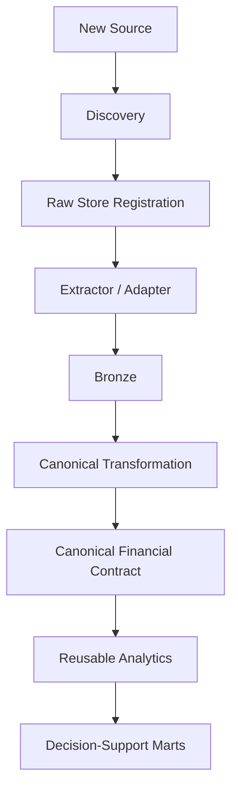
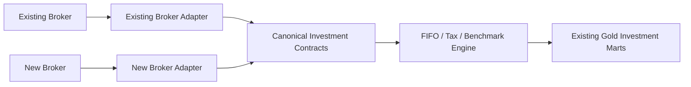

# Adding a Data Source

Adding a data source to Personal Finance ETL is not simply "read another CSV."

A source participates in a lifecycle:

```text
Discovery
   ↓
Raw persistence
   ↓
Change / synchronization state
   ↓
Extraction
   ↓
Bronze persistence
   ↓
Canonical transformation
   ↓
Financial analytics
```

The correct extension point depends on where the new source differs from existing behaviour.

> The goal is to contain source-specific complexity upstream and preserve stable downstream financial contracts.

---

## Extension architecture



A new source should not require the wealth engine to learn a new worksheet name.

---

## Step 1 · Define the financial purpose

Before writing parsing code, answer:

- What financial concept does this source represent?
- Is it reference/current-state data or historical/event data?
- Which canonical contract should it eventually populate?
- Is there already an existing canonical concept for it?
- Is this a new source for an existing concept or a genuinely new domain concept?

Examples:

```text
new broker purchase statement
→ existing investment purchase concept

new bank transaction export
→ existing household transaction concept

new tax authority dataset
→ possibly new canonical/reference concept
```

This distinction determines whether you need a source adapter or a deeper data-model change.

---

## Step 2 · Decide source identity

The Raw Store needs a stable identity for the artifact.

Current source identity includes concepts such as:

- file name,
- relative path,
- category,
- physical type,
- hash,
- size,
- and ingestion timestamps.

For a new source family, define:

```text
source category
physical type
discovery location
identity rules
```

Do not use an unstable temporary path as the only identity if the source lifecycle requires persistence across runs.

---

## Step 3 · Choose physical or virtual artifact

Most local sources are physical artifacts such as:

```text
CSV
Excel
SQLite
```

But the architecture also supports virtual artifacts.

Benchmark history is the current example:

```text
external API response
    ↓
Parquet bytes
    ↓
virtual:// identity
    ↓
Raw Store
```

If the source is acquired dynamically, consider whether persisting a virtual artifact improves provenance and recovery.

---

## Step 4 · Define change-detection policy

The Raw Store can fingerprint artifacts using SHA-256.

Existing-file rehash policy is configurable by physical type.

When adding a source, decide:

- should existing artifacts be rehashed?
- is file identity enough?
- can the source mutate in place?
- is append-only behaviour expected?
- is source modification rare or common?

Change detection is a policy decision.

Do not assume every source should be reprocessed on every run.

---

## Step 5 · Register raw evidence

Actionable source bytes should enter the Raw Store before becoming derived analytical state.

The Raw Store provides:

- durable payload persistence,
- source registry metadata,
- and synchronization state.

The source should become:

```text
PENDING_BRONZE
```

until Bronze persistence succeeds.

---

## Step 6 · Implement extraction

The extractor understands the source format.

Its job is:

```text
persisted source bytes
        ↓
source-aware parsing
        ↓
source-shaped frame
```

The extractor may need to handle:

- worksheet selection,
- column names,
- date parsing,
- numeric parsing,
- source-specific null conventions,
- or embedded database queries.

Keep that knowledge here.

Do not let it leak into the household or investment engines.

---

## Step 7 · Preserve source context

Bronze should retain enough source identity to support traceability and replacement.

The current historical pattern includes:

```text
__file_name__
```

For a future generalized adapter model, richer lineage might include:

```text
source_file_id
source_adapter
source_record_id
ingestion_run_id
```

Those are future possibilities.

Use the current contract unless intentionally evolving the architecture.

---

## Step 8 · Choose Bronze persistence strategy

This is one of the most important decisions.

## Reference / current-state source

Use full replacement when the complete current source state is the useful contract.

Examples can include:

- mappings,
- masters,
- macro/reference data.

Conceptually:

```text
source changed
    ↓
replace Bronze representation
```

## Historical / event source

Use file-aware replacement when multiple source artifacts form persistent history.

Conceptually:

```text
changed source file
    ↓
delete old rows owned by that file
    ↓
insert new extracted rows
    ↓
preserve unrelated history
```

Do not select the strategy based on which implementation is shorter.

Select it based on source semantics.

---

## Step 9 · Define Bronze schema

Bronze can remain source-shaped.

It does not need to be the final canonical model.

Define:

- physical table,
- required source fields,
- lineage field,
- source partition semantics,
- and replacement behaviour.

Avoid unnecessary transformations in Bronze that erase useful source evidence before canonical mapping.

---

## Step 10 · Mark synchronization

Only after successful extraction and Bronze persistence should the Raw artifact transition to:

```text
SYNCED
```

This preserves the distinction between:

```text
source was discovered
```

and:

```text
source is represented in Bronze
```

---

## Step 11 · Map to canonical contracts

Now convert source-shaped Bronze data into stable financial concepts.

Examples:

```text
bank-specific debit record
        ↓
canonical expense / transfer

broker-specific order row
        ↓
canonical investment purchase / sale

provider-specific benchmark row
        ↓
canonical benchmark observation
```

This is the boundary where source vocabulary should disappear.

---

## Step 12 · Use mappings and FinancialRules correctly

Not every transformation belongs in code.

Use reference mappings for source-to-canonical identity where appropriate.

Use `FinancialRules` for financial policy.

Use code for behavioural transformation.

A useful distinction is:

```text
source label → canonical category
= mapping

is this category core?
= FinancialRules

how do I parse this proprietary statement?
= extractor / adapter code
```

---

## Step 13 · Validate canonical grain

Before connecting the source downstream, state the resulting grain.

Examples:

```text
income transaction
expense transaction
investment purchase
investment sale
market observation
benchmark observation
opening balance
```

If you cannot describe one row, the canonical contract is not ready.

---

## Step 14 · Connect downstream dependencies

Once the canonical contract is satisfied, downstream analytics should require minimal or no source-specific change.

That is the success criterion.

For example:

```text
new broker source
        ↓
canonical purchase/sale/master contracts
        ↓
existing FIFO engine
        ↓
existing investment marts
```

If adding a broker requires rewriting XIRR, the source boundary has leaked.

---

## Step 15 · Update Silver publication

If the source feeds an existing canonical Silver fact, update the transformation/loading path appropriately.

If it introduces a genuinely new canonical concept:

1. define the financial meaning,
2. define the grain,
3. define the physical contract,
4. define dependencies,
5. update DDL/loading,
6. update reference documentation.

Do not create a Silver table solely because a source contains a table.

Silver is a financial model, not a source mirror.

---

## Step 16 · Decide whether Gold changes

A new source does **not** automatically require a new Gold mart.

If it populates existing canonical concepts, existing decision-support outputs may already be sufficient.

Add Gold only when the new source enables a new decision/question that deserves a serving contract.

See [Adding a Gold Mart](adding-gold-marts.md).

---

## Source-extension example

Conceptually, a second broker might look like:



The desired change is upstream.

The downstream engine remains stable.

---

## Data-quality responsibilities

A source adapter should validate what it can know.

Examples:

- required source columns,
- parseable dates,
- numeric fields,
- instrument identity availability.

Canonical transformation should validate financial requirements.

Examples:

- valid category mapping,
- required investment master fields,
- tax classification,
- stable identifiers.

Do not push every validation into one generic ingestion layer.

---

## Error handling

If extraction fails:

- surface source identity,
- preserve enough context to diagnose the parser,
- do not mark the artifact `SYNCED`.

If canonical transformation fails:

- treat it as a semantic/data-contract problem,
- not merely a file-read problem.

The stage of failure matters.

---

## Idempotency and replacement

A source extension should preserve the existing lifecycle property:

> Re-running the same unchanged source should not blindly duplicate Bronze history.

Historical replacement should remove the old source-owned partition before reinserting changed data.

Reference replacement should replace the current representation.

---

## External provider sources

For external APIs/providers, consider:

- acquisition range,
- cache coverage,
- retry/failure behaviour,
- persisted virtual artifacts,
- and provider-specific identity.

The benchmark pipeline is the current reference pattern.

---

## Sensitive sources

Financial source adapters can expose:

- account numbers,
- holdings,
- transaction history,
- income,
- spending,
- and tax information.

Do not add real production statements to public fixtures or documentation.

Use sanitized/synthetic examples when documentation requires sample structure.

---

## Documentation changes for a new source

Update:

- [Data Lifecycle](../architecture/data-lifecycle.md) if lifecycle semantics change,
- [Data Model](../architecture/data-model.md) if canonical concepts change,
- Silver contracts if physical canonical schema changes,
- configuration docs if new paths/settings are required,
- and this guide if the extension workflow changes.

A source-specific README can be appropriate if the adapter has substantial operational requirements.

---

## New-source checklist

```text
[ ] Financial purpose defined
[ ] Source category defined
[ ] Stable identity defined
[ ] Physical / virtual artifact decision made
[ ] Change-detection policy defined
[ ] Raw registration implemented
[ ] Extractor / adapter implemented
[ ] Bronze schema defined
[ ] Bronze persistence strategy selected
[ ] Source lineage preserved
[ ] PENDING_BRONZE → SYNCED lifecycle respected
[ ] Canonical mapping implemented
[ ] Canonical grain documented
[ ] FinancialRules / mappings updated where appropriate
[ ] Downstream analytics validated
[ ] Silver contract updated if needed
[ ] Gold impact assessed
[ ] Documentation updated
```

---

## Source-extension invariants

1. **Raw evidence enters before derived state.**
2. **Source-specific parsing remains upstream.**
3. **Bronze strategy follows source semantics.**
4. **Historical replacement preserves unrelated history.**
5. **Synchronization state remains explicit.**
6. **Canonical contracts hide source-specific structure downstream.**
7. **A new source does not automatically imply a new financial concept.**
8. **A new source does not automatically imply a new Gold mart.**
9. **Financial policy remains separate from parsing logic.**
10. **Downstream engines should remain stable when an equivalent new source is added.**

---

## Related documentation

- [Development Guide](development-guide.md)
- [Adding an Asset Pipeline](adding-asset-pipelines.md)
- [Adding a Gold Mart](adding-gold-marts.md)
- [Data Lifecycle](../architecture/data-lifecycle.md)
- [Warehouse Architecture](../architecture/warehouse-architecture.md)
- [Financial Rules](../configuration/financial-rules.md)

[← Developer Home](README.md) · [← Documentation Home](../README.md)
