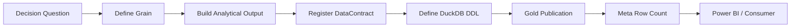

# Adding a Gold Mart

A Gold mart is not created because a useful DataFrame happens to exist.

It is created because a **decision question deserves a stable serving contract**.

The workflow is:



The grain comes before the schema.

---

## 1. Start with the decision

Bad starting point:

> I have a DataFrame. Should I save it?

Better:

> What recurring decision or analysis needs a stable physical contract?

Examples:

```text
How is wealth distributed across assets?
→ Month × Asset

How is the portfolio allocated by ISIN?
→ Month × ISIN

How is investment performance evolving by class?
→ Date × Class
```

Gold exists for consumption.

---

## 2. Write the grain first

Before code, write:

```text
One row represents...
```

Examples:

```text
one month
one month × asset
one month × ISIN
one date × ISIN
one date × portfolio
```

If the sentence is ambiguous, stop.

The mart is not ready.

---

## 3. Decide whether Gold is actually necessary

Ask whether the question can already be answered from:

```text
existing Gold mart
existing Silver contract
Power BI measure
```

Do not create a mart merely to avoid writing a measure.

Likewise, do not force expensive financial methodology into Power BI when it belongs in Python.

The correct layer depends on semantics.

---

## 4. Build the output at the intended grain

A presentation builder should return a frame whose grain already matches the contract.

For example, the current portfolio summary is explicitly:

```text
Month × ISIN
```

and includes descriptive context such as:

```text
ISIN
instrument name
class
type
subtype
sector
industry
```

plus portfolio-management state.

Do not rely on the loader to fix grain.

---

## 5. Recompute non-additive metrics at target grain

If the mart includes:

```text
XIRR
CAGR
drawdown
weights
rates
```

do not blindly aggregate child metrics.

Example:

```text
Portfolio XIRR
≠ average(ISIN XIRR)
```

The builder must construct the correct target-grain methodology.

This is often the most important part of adding a Gold mart.

---

## 6. Register the contract

Add a `DataContract`:

```python
DataContract(
    contract_id="df_f_investment_analytics_isin",
    layer="gold",
    physical_table="gold.Investment_By_ISIN",
    domain="Investments",
    grain="Date-ISIN",
    producer="InvestmentQuantEngine",
    publication_order=200,
)
```

For a new mart, choose values deliberately.

### `contract_id`

Must match the in-memory output key.

### `layer`

`gold`.

### `physical_table`

Fully qualified DuckDB table.

### `domain`

Business/analytical domain.

### `grain`

Human-readable row grain.

### `producer`

Actual component that builds the dataset.

### `publication_order`

Intentional publication sequence.

---

## 7. Do not infer layer/table identity

The hardened publication path uses the registry:

```python
contracts = sorted(
    (c for c in DATA_CONTRACT_REGISTRY if c.layer == "gold"),
    key=lambda c: c.publication_order,
)
```

Then:

```python
for contract in contracts:
    if contract.contract_id in dfs:
        self._write(
            dfs[contract.contract_id],
            contract.physical_table,
        )
```

Do not add a parallel manual mapping dictionary.

That would recreate the duplication the registry was introduced to remove.

---

## 8. Add physical DDL

The Gold schema must match the builder output.

Conceptually:

```sql
CREATE TABLE gold.My_New_Mart (
    MONTH_START_DATE DATE,
    DIMENSION_KEY TEXT,
    METRIC_VALUE DOUBLE
);
```

The actual schema should use the correct names/types for the mart.

Treat DDL as part of the public analytical contract.

---

## 9. Builder output and DDL must agree

Check:

```text
column names
data types
nullable behaviour
grain
descriptive dimensions
metric semantics
```

A column present in DDL but omitted from builder output can quietly become null.

The `INSTRUMENT_SUBTYPE` hardening fix in the portfolio summary is a good example of why this check matters.

---

## 10. Publication order should be meaningful

`publication_order` is not decoration.

The hardened loaders sort by it.

Choose an order that reflects:

- dependency where relevant,
- logical grouping,
- deterministic publication.

Do not assign the same placeholder order to every new contract.

---

## 11. Meta row counts come from contract identity

The hardened Meta path uses `DATA_CONTRACT_REGISTRY` rather than guessing:

```text
gold if name contains "p_tf_"
```

That matters because not every Gold output follows one internal naming pattern.

When the mart is registered correctly, Meta can record:

```text
schema = gold
table = physical table name
row count = published frame height
```

without inference.

---

## 12. Decide what Power BI should consume

A Gold mart should make the downstream semantic model simpler.

Ask:

```text
What dimensions relate to this mart?
Which fields are additive?
Which are non-additive?
What date grain exists?
What measures should Power BI calculate?
What methodology must remain upstream?
```

Do not push Python-only financial methodology into DAX merely because the final consumer is Power BI.

---

## 13. Document metric semantics

For each important measure, capture:

```text
definition
grain
inputs
additivity
interpretation
limitations
```

For example:

```text
Monthly_Market_Value_Change_Pct
```

must not be documented as a cash-flow-adjusted monthly investment return.

Names are part of the contract.

---

## 14. Decide whether historical snapshots are required

Some Gold marts are monthly.

Some are date-grain investment analytics.

The time grain should match the decision.

```text
monthly management view
→ Month × ...

historical investment path
→ Date × ...
```

Do not downsample merely to make every Gold table look alike.

---

## 15. Validate row uniqueness at grain

If grain is:

```text
Month × ISIN
```

then the output should not contain duplicate rows for that key unless the contract explicitly includes another dimension.

Validation can conceptually check:

```python
# Conceptual validation example.
duplicates = (
    df.group_by(["MONTH_START_DATE", "ISIN"])
      .len()
      .filter(pl.col("len") > 1)
)
```

This snippet is conceptual, not a claim that every mart currently runs this exact validation.

---

## 16. Validate reconciliation

Where the mart is an aggregation of deeper state, reconcile totals.

Examples:

```text
sum(ISIN market value)
= portfolio market value

sum(asset balances)
= monthly wealth total

category expense
= total expense
```

Allow for methodology-specific exclusions where documented.

A Gold mart should not become a new source of truth disconnected from its underlying financial state.

---

## 17. Update reference documentation

A new Gold mart should be added to:

```text
reference/gold-data-contracts.md
```

Document at minimum:

```text
purpose
domain
grain
producer
major inputs
key fields
consumers
caveats
```

Under Documentation v2, include the real registry declaration and selected DDL.

---

## 18. Update architecture only if architecture changed

Do not edit `system-architecture.md` because one mart was added.

Architecture docs should change when:

```text
ownership
dependency direction
lifecycle
major contract families
```

change.

Reference docs should absorb routine contract additions.

This keeps architecture documentation stable.

---

## 19. Gold-mart checklist

- [ ] Decision question defined
- [ ] Gold justified over Silver/Power BI
- [ ] Grain written explicitly
- [ ] Builder produces that grain
- [ ] Non-additive metrics recomputed correctly
- [ ] `DataContract` registered
- [ ] Producer metadata accurate
- [ ] `publication_order` intentional
- [ ] DuckDB DDL added
- [ ] Builder columns match DDL
- [ ] Meta row count resolves through registry
- [ ] Row uniqueness checked
- [ ] Aggregated totals reconciled
- [ ] Power BI semantics considered
- [ ] Reference docs updated
- [ ] Packaged docs still render

---

## End-to-end extension path

```text
Decision
   ↓
Grain
   ↓
Builder
   ↓
DataContract
   ↓
DDL
   ↓
GoldLayer
   ↓
Meta
   ↓
Power BI
   ↓
Reference Documentation
```

If any one of those steps is unclear, the contract probably needs more thought before publication.

[← Developer Home](README.md) · [← Documentation Home](../README.md)
