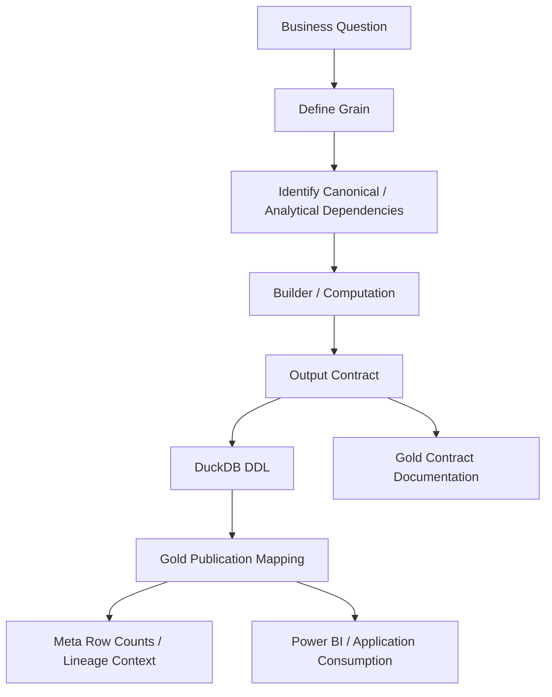

# Adding a Gold Mart

A Gold mart is a **published decision-support contract**.

It is not simply an intermediate DataFrame that happened to be useful while developing a calculation.

Before adding one, I want to be able to answer:

> **What financial or analytical question does this dataset support, and what does one row mean?**

The extension path is:

```text
Business question
      ↓
Grain
      ↓
Dependencies
      ↓
Builder / computation
      ↓
Output contract
      ↓
DDL
      ↓
Publication mapping
      ↓
Meta / documentation / BI
```

This guide walks through that process.

---

## Gold extension architecture



---

## Step 1 · Start with the decision

Do not start with:

> I have a DataFrame; where can I save it?

Start with:

> What question does this mart answer?

Examples from the current model:

```text
Core_Monthly_Fact
→ What is my household financial state this month?

Wealth_Asset_Breakdown
→ How did each asset contribute to wealth?

Cashflow_Activity_Summary
→ Does classified activity reconcile with actual cash movement?

Investment_Portfolio_Summary
→ Where is allocation drifting and what requires attention?

Investment_By_ISIN
→ How is each instrument performing and taxed?
```

A clear question usually leads to a clear grain.

---

## Step 2 · Define grain

Write the grain before writing the builder.

Examples:

```text
Month
Month × Asset
Month × Expense Category
Month × ISIN
Date × ISIN
Date × Class
Date × Portfolio
```

If the grain is ambiguous, the mart is not ready.

---

## Why grain comes first

Grain determines:

- valid keys,
- valid joins,
- aggregation behaviour,
- duplicate interpretation,
- and metric meaning.

For example:

```text
XIRR at ISIN grain
```

and:

```text
XIRR at portfolio grain
```

require different cash-flow construction.

They cannot be treated as the same measure copied upward.

---

## Step 3 · Identify domain ownership

The current Gold domains are:

```text
Wealth
Cash Flow
Planning
Portfolio Management
Investment Analytics
```

Choose the domain that owns the decision.

Do not create a new domain merely to avoid deciding where the mart belongs.

---

## Step 4 · Identify dependencies

Gold should depend on canonical/analytical state, not raw source layouts.

Possible dependencies include:

- Silver household facts,
- Silver investment facts,
- lot analytics,
- investment quant outputs,
- wealth-engine state,
- FinancialRules,
- macro context,
- and other stable analytical builders.

If the mart needs a broker worksheet column directly, the canonical boundary has leaked.

---

## Step 5 · Decide producer ownership

The current Gold surface is produced primarily by two analytical families.

## Investment Quant Engine

Produces the hierarchical investment analytics marts.

## Wealth Analytics Engine

Produces household, cash-flow, planning, and portfolio-management marts.

A new mart should have a clear producer.

Avoid a generic "presentation utils" dumping ground with unclear domain ownership.

---

## Step 6 · Design measures by aggregation type

Classify each measure.

## Additive

Examples:

- income,
- expense,
- current value,
- realized gain/loss.

## Semi-additive

A balance may be additive across assets but not across time.

## Non-additive

Examples:

- XIRR,
- CAGR,
- allocation weight,
- drawdown,
- ratios.

Non-additive measures require explicit methodology at the target grain.

---

## Step 7 · Build the analytical computation

Use the appropriate engine/builder.

The computation should:

- operate on canonical state,
- preserve grain,
- use explicit financial methodology,
- and produce a stable output contract.

Avoid embedding physical DuckDB concerns deeply into the financial calculation if they can remain at the publication boundary.

---

## Step 8 · Define the output contract

Before DDL, define the logical output.

For each field, understand:

```text
name
financial meaning
type
nullability expectation
unit / scale
aggregation behaviour
source methodology
```

This is where semantic naming matters.

A field called `Probability` should actually be probabilistic.

---

## Step 9 · Review naming

Names become part of the public analytical contract.

Avoid names that:

- overstate methodology,
- hide units,
- blur observed and modelled state,
- or imply a different grain.

The v6 audit identified examples such as:

```text
Outperformance_Probability
ISIN_Monthly_Return
```

where future semantic cleanup would improve clarity.

Use those as warnings when naming new fields.

---

## Step 10 · Add DuckDB DDL

Create the physical Gold table with types matching the output contract.

The DDL is not the business definition.

It is the persistence representation of the business definition.

Keep the methodology documented separately.

---

## Step 11 · Add publication mapping

Gold publication is explicit.

Map the analytical output to the physical table.

This boundary is valuable because it prevents every intermediate frame from becoming a persistent mart.

Conceptually:

```text
calculation exists
      ↓
explicit publication decision
      ↓
Gold contract
```

---

## Step 12 · Preserve dependency order

If a new mart depends on another published/derived state, ensure the builder and publication order respect that dependency.

Avoid hidden ordering assumptions.

If the dependency is conceptual rather than physical, prefer passing the required analytical state explicitly.

---

## Step 13 · Integrate Meta

The current Meta layer records table row counts and operational context.

A new Gold mart should participate in row-count/observability mechanisms where applicable.

Long term, an explicit data-contract registry could make layer/domain/producer metadata less dependent on naming conventions.

---

## Step 14 · Update reference documentation

Add the mart to:

```text
reference/gold-data-contracts.md
```

Document:

- purpose,
- layer,
- domain,
- grain,
- producer,
- major inputs,
- key fields,
- downstream consumers,
- assumptions/caveats.

If the mart introduces a new methodology, update the relevant Finance guide too.

---

## Step 15 · Update BI intentionally

A Gold mart exists to be consumed.

When adding it to Power BI, decide:

- relationship direction,
- date relationship,
- grain compatibility,
- measure ownership,
- and drill-down behaviour.

Do not recreate the financial methodology in DAX if the mart already publishes it.

---

## Step 16 · Validate row uniqueness

For the declared grain, verify that the physical output does not contain accidental duplicates.

Examples:

```text
Month
→ one row per month

Month × ISIN
→ one row per month/instrument

Date × Class
→ one row per date/class
```

If duplicates are legitimate, then the stated grain is incomplete.

---

## Step 17 · Validate reconciliation

A mart should reconcile with its upstream state where meaningful.

Examples:

```text
asset breakdown total
→ household total

ISIN current value total
→ portfolio current value

income category total
→ monthly total income
```

Reconciliation is one of the best ways to detect grain or filtering mistakes.

---

## Step 18 · Validate null semantics

A null can mean:

- unavailable,
- not applicable,
- not yet observed,
- calculation failure,
- or missing data.

Those are different states.

Do not replace every null with zero unless zero is financially correct.

---

## Step 19 · Validate time semantics

For time-based marts, decide:

- observation date,
- month start/end convention,
- fiscal-year context,
- trailing-window behaviour,
- and whether values are point-in-time or period flows.

A monthly balance and monthly expense are not the same temporal type.

---

## Step 20 · Validate observed versus modelled fields

A Gold mart can contain both.

For example:

```text
Current Market Value
→ observed/derived from market state

Projected Tax Bill
→ modelled planning output

Probability of Success
→ stochastic model output
```

Naming and documentation should make the distinction clear.

---

## Example: adding a new household mart

Suppose I want a mart answering:

> How resilient is household liquidity by month?

I would first define:

```text
Domain: Wealth / Planning
Grain: Month
```

Then identify dependencies:

```text
cash-pool balances
liquid asset classifications
core spending
total spending
```

Then define measures:

```text
liquid wealth
core-spend runway
total-spend runway
emergency-fund coverage
```

Then decide whether those measures already belong in existing marts.

If `Core_Monthly_Fact` or `Cashflow_Efficiency_Analytics` already answers the question cleanly, I should **not** create another mart.

Avoiding redundant marts is part of good Gold design.

---

## Example: adding a new investment classification mart

Suppose a new meaningful classification becomes necessary.

The path is:

```text
canonical instrument classification
        ↓
lot / ISIN analytical state
        ↓
classification aggregation
        ↓
cash-flow-aware return recomputation
        ↓
Gold mart
```

Do not simply average ISIN XIRR into the new classification.

---

## When to add a field instead of a mart

Add a field to an existing mart when:

- the grain is identical,
- the domain/question is the same,
- and the field belongs naturally to the existing contract.

Add a new mart when:

- the grain differs,
- the decision/question differs,
- or combining the data would create ambiguous duplication.

---

## When not to publish

Do not publish a calculation merely because:

- it was difficult to compute,
- it looks sophisticated,
- it exists in an intermediate builder,
- or another finance application displays it.

The v6 metric pruning is an important precedent.

The serving contract should remain decision-oriented.

---

## Gold quality checklist

```text
[ ] Business question defined
[ ] Domain defined
[ ] Grain defined
[ ] Stable identifiers defined
[ ] Dependencies are canonical / analytical
[ ] Producer ownership defined
[ ] Measures classified as additive / non-additive
[ ] Non-additive methodology defined
[ ] Output names semantically accurate
[ ] Observed vs modelled state clear
[ ] DDL added
[ ] Publication mapping added
[ ] Row uniqueness validated
[ ] Reconciliation validated
[ ] Null semantics reviewed
[ ] Time semantics reviewed
[ ] Meta/row-count integration reviewed
[ ] Gold contract documentation updated
[ ] BI relationship impact reviewed
```

---

## Gold extension anti-patterns

## DataFrame dumping

"I already have the frame" is not a business reason.

## Grain mixing

Do not mix Month and Month × Asset state in one table through duplication.

## Averaging returns

Non-additive financial metrics require methodology.

## Report-specific hidden semantics

If an important financial definition only exists in DAX, consider whether it belongs upstream.

## Metric bloat

Do not recreate the old risk-metric wall.

## Duplicate marts

Prefer extending an existing contract when grain and purpose match.

---

## Future data-contract registry

A future shared registry could describe publication metadata:

```yaml
Core_Monthly_Fact:
  layer: gold
  domain: wealth
  grain:
    - MONTH_START_DATE
  producer: WealthPresentationEngine
```

Such a registry could potentially drive:

- loader mappings,
- Meta lineage,
- schema validation,
- documentation generation,
- and application navigation.

That is an attractive future architecture.

It should be introduced only after the physical contracts are stable enough to justify making the registry authoritative.

---

## Gold-mart invariants

1. **Every mart answers a decision-support question.**
2. **Every mart has an explicit grain.**
3. **Canonical/source boundaries remain intact.**
4. **Non-additive measures use explicit financial methodology.**
5. **Physical publication is deliberate.**
6. **Names describe actual methodology.**
7. **Observed and modelled state remain distinguishable.**
8. **New marts reconcile with upstream state where meaningful.**
9. **Power BI consumes semantics rather than inventing them.**
10. **Decision usefulness matters more than mart count.**

---

## Related documentation

- [Development Guide](development-guide.md)
- [Gold Data Contracts](../reference/gold-data-contracts.md)
- [Warehouse Architecture](../architecture/warehouse-architecture.md)
- [Data Model](../architecture/data-model.md)
- [Metrics & Methodology](../finance/metrics-and-methodology.md)

[← Developer Home](README.md) · [← Documentation Home](../README.md)
