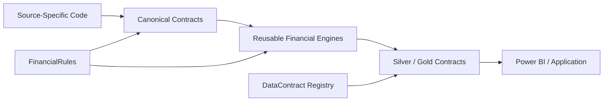
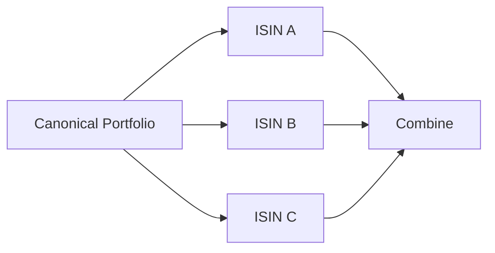
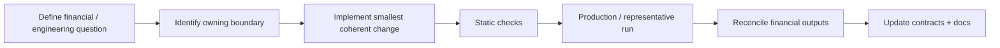

# Development Guide

Personal Finance ETL is a financial application first and a framework second.

The development goal is therefore not maximum abstraction.

It is:

> **Preserve financial behaviour, keep ownership explicit, and introduce extension seams only where real variation exists.**

The main dependency direction is:



Source-specific assumptions should disappear as early as practical.

Decision-specific presentation logic should not leak backward into ingestion.

---

## 1. Package responsibilities

The codebase is organized around responsibilities rather than one giant ETL module.

Conceptually:

```text
backend/
├── load/
│   ├── control_plane/
│   ├── bronze.py
│   ├── silver.py
│   ├── gold.py
│   ├── metadata.py
│   └── registry.py
│
├── transform/
│   └── canonical transformation DAG
│
├── engines/
│   ├── analytics/
│   │   └── investment / FIFO / returns
│   └── presentation/
│       └── wealth / cash flow / planning
│
└── orchestration
    └── ETLOrchestrator
```

The exact package tree can evolve.

The responsibility boundaries matter more than folder aesthetics.

---

## 2. The Control Plane boundary

Operational persistence is hidden behind `ControlPlane`:

```python
class ControlPlane:
    def __init__(self, base_path: str, db_name: str = "Raw_Documents.sqlite"):
        self.db = SQLiteManager(base_path, db_name)
        self.artifacts = ArtifactRepository(self.db)
        self.runs = RunRepository(self.db)
        self.file_sync = FileSyncService(self.artifacts)
```

When adding operational behaviour, first ask which responsibility owns it:

```text
artifact identity / payload / sync
→ ArtifactRepository

run / failure / provenance
→ RunRepository

filesystem reconciliation
→ FileSyncService

cross-system coordination
→ ETLOrchestrator
```

Avoid placing repository SQL directly in the orchestrator unless the boundary genuinely changes.

---

## 3. Canonical contracts are the anti-corruption layer

Source systems are allowed to be messy.

Downstream financial engines should not be.

```text
Broker A vocabulary
Bank B vocabulary
Excel C vocabulary
        ↓
source extraction / mapping
        ↓
canonical financial contracts
        ↓
shared engines
```

If a new source requires adding source-specific `if` statements throughout FIFO, wealth, and FIRE, the source boundary is leaking.

Fix the normalization boundary rather than teaching every engine about the new provider.

---

## 4. FinancialRules is policy, not infrastructure

Financial policy should enter engines through validated rules.

For example:

```python
class PortfolioManagementRules(BaseModel):
    rebalance_tolerance_pct_points: float = Field(
        default=5.0,
        ge=0.0,
    )
```

A developer should distinguish:

```text
value varies
→ configuration

algorithm varies
→ strategy / pipeline / adapter

financial concept is stable
→ canonical model
```

That prevents `FinancialRules` from becoming an enormous switchboard for fundamentally different behaviour.

---

## 5. Data contracts are explicit

Serving-layer identity lives in `DATA_CONTRACT_REGISTRY`.

```python
@dataclass
class DataContract:
    contract_id: str
    layer: str
    physical_table: str
    domain: str
    grain: str
    producer: str
    publication_order: int
```

A new persistent analytical output should define:

```text
What is the dataset?
Which layer owns it?
What physical table receives it?
What does one row mean?
Which component produces it?
When should it publish?
```

before writing the loader code.

---

## 6. Publication follows the registry

Gold publication is intentionally simple:

```python
contracts = sorted(
    (c for c in DATA_CONTRACT_REGISTRY if c.layer == "gold"),
    key=lambda c: c.publication_order,
)

for contract in contracts:
    if contract.contract_id in dfs:
        self._write(
            dfs[contract.contract_id],
            contract.physical_table,
        )
```

The loader should not rediscover analytical identity from naming conventions.

The registry is the publication contract.

---

## 7. Choose the compute model that matches the problem

The project intentionally uses several execution styles.

| Workload | Preferred model |
| --- | --- |
| Tabular transformation | Polars LazyFrames |
| Stateful FIFO inventory | Python state objects |
| Per-instrument isolation | multiprocessing |
| Stochastic simulation | NumPy / Numba |
| Analytical persistence | DuckDB |
| Operational persistence | SQLite |

Do not force a workload into a technology merely for consistency.

Consistency of **semantics and boundaries** matters more.

---

## 8. LazyFrames should remain lazy where useful

Transformation/presentation logic should generally avoid premature collection.

Independent presentation outputs can be executed together:

```python
results = pl.collect_all(
    lazy_frames,
    engine="streaming",
)
```

Materialize where:

- persistence requires it,
- a stateful algorithm requires concrete rows,
- debugging/validation requires explicit state,
- an external API requires eager values.

Do not collect merely because eager dataframes feel easier.

---

## 9. Stateful algorithms should be explicit

FIFO is a good example.

A sale changes the state available to the next sale.

That is naturally represented through state:

```python
while rem > 0 and self._active_lots:
    lot = self._active_lots[0]
    consumed = min(rem, lot.qty)
    # realize consumed quantity
    # retain any remaining inventory
```

Trying to hide that state transition inside increasingly clever dataframe expressions would make the financial methodology harder to inspect.

Readable stateful code is preferable.

---

## 10. Parallelism needs a safe boundary

ISIN is a natural process boundary because one instrument's tax-lot queue does not need mutable state from another instrument.



When adding parallel work, ask:

```text
Is state independent?
Are inputs serializable?
Are outputs deterministic enough to combine?
How do failures propagate?
```

The current investment policy is fail-fast: a failed ISIN fails the analytical stage.

---

## 11. Failure semantics are part of the interface

Do not catch an exception merely to keep the pipeline moving.

Ask whether partial output is financially valid.

For investment analytics:

```text
19 successful instruments
+ 1 missing instrument
≠ successful portfolio
```

The worker error must propagate.

The orchestrator owns rollback and run failure persistence.

---

## 12. Persistence changes require contract thinking

A schema change can affect:

```text
builder output
DataContract registry
DuckDB DDL
Meta row counts
Power BI
documentation
```

Treat persisted schemas as interfaces.

A column rename is not "just refactoring" once a BI model consumes it.

---

## 13. Grain is mandatory

Before adding a mart or analytical frame, write the grain in plain language.

Examples:

```text
Month
Month × Asset
Month × ISIN
Date × ISIN
Date × Class
Date × ISIN × Lot
```

If the grain cannot be stated cleanly, the dataset probably is not ready to become a contract.

---

## 14. Non-additive metrics require target-grain logic

Do not aggregate:

```text
XIRR
CAGR
Max Drawdown
allocation weights
rates
```

by averaging child values unless the methodology explicitly supports it.

For example:

```text
Portfolio XIRR
≠ average(ISIN XIRR)
```

Reconstruct the target-grain cash flows and solve again.

---

## 15. Keep documentation code-grounded

Documentation is packaged application content.

The manifest drives discovery:

```text
docs/*.md
→ manifest.json
→ DocsCatalog
→ DocsRenderer
→ CLI / Desktop
```

When adding a substantive document:

1. create the Markdown file,
2. add it to `manifest.json`,
3. assign intentional order,
4. verify repository links,
5. verify packaged renderer behaviour.

Do not hard-code new filenames in the UI.

---

## 16. Renderer compatibility matters

The current renderer does not provide a MathJax/KaTeX mathematics stage.

Therefore documentation should prefer renderer-safe equations:

```text
FI Target = Annual Core Expense / Withdrawal Rate
```

rather than unsupported LaTeX display blocks.

The docs must render consistently across:

```text
GitHub
packaged application
CLI / GUI docs browser
future Wiki
```

---

## 17. Static quality tools

The project uses strict quality tooling.

Before committing meaningful code changes, run the project's configured checks, including:

```text
Ruff
mypy
Pyright
```

Use the commands configured by the repository rather than maintaining a second undocumented quality workflow.

Typing is especially useful at boundaries:

- configuration models,
- engine interfaces,
- repositories,
- contract registries,
- orchestration.

---

## 18. Financial-output equivalence is a refactoring gate

Infrastructure refactors can be large while financial truth remains stable.

That was the rule during the 6.2.x Control Plane redesign.

For a refactor that is not intentionally changing methodology:

```text
architecture can change
performance can change
observability can improve

but

financial outputs should reconcile
```

This is one of the most important development disciplines in the repository.

---

## 19. Performance work starts by removing useless work

The production-hardening cycle reduced the current end-to-end workload from roughly:

```text
~23 seconds
```

to:

```text
~14–17 seconds
```

on the current production environment while preserving financial outputs.

A meaningful part of that work came from deleting analytics that no longer supported a decision.

Before micro-optimizing a slow computation, ask:

> **Should this computation exist at all?**

---

## 20. Development workflow

A safe change generally follows:



For methodology changes, the reconciliation step becomes an intentional before/after explanation rather than an equivalence check.

---

## 21. Extension checklist

Before merging an extension, ask:

- Does source-specific logic terminate upstream of canonical finance?
- Is the new grain explicit?
- Is policy in FinancialRules rather than hidden literals?
- Does genuinely new behaviour have a proper strategy/pipeline boundary?
- Are failures explicit?
- Is publication registered?
- Does physical DDL match builder output?
- Do Meta row counts use contract identity?
- Do existing financial outputs reconcile where expected?
- Does documentation show the real implementation?
- Does the packaged docs renderer still work?

---

## Go deeper

- [Adding a Data Source](adding-data-sources.md)
- [Adding an Asset Pipeline](adding-asset-pipelines.md)
- [Adding a Gold Mart](adding-gold-marts.md)
- [System Architecture](../architecture/system-architecture.md)
- [Design Decisions](../architecture/design-decisions.md)

[← Developer Home](README.md) · [← Documentation Home](../README.md)
