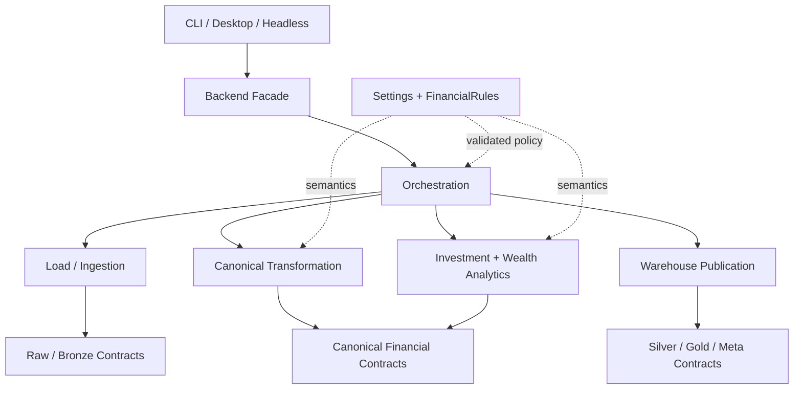

# Development Guide

This guide explains how I approach development inside Personal Finance ETL: package boundaries, dependency direction, typing, analytical contracts, persistence, execution, and the conventions I want extensions to preserve.

The project is a **typed production Python application**, not a notebook collection.

The core development principle is:

> **Extend the system through explicit boundaries without leaking source-specific behaviour into canonical finance or decision-specific behaviour back into ingestion.**

Before changing the codebase, read:

- [System Architecture](../architecture/system-architecture.md)
- [Data Lifecycle](../architecture/data-lifecycle.md)
- [Data Model](../architecture/data-model.md)
- [Design Decisions](../architecture/design-decisions.md)

---

## Development architecture



The dependency direction should move toward stable domain/canonical concepts rather than toward source files or frontends.

---

## Development mindset

## Solve the real behaviour first

The current system grew against a real financial workload.

I prefer extracting reusable abstractions from working behaviour rather than inventing universal frameworks before multiple real implementations require them.

## Preserve behavioural equivalence

When generalizing an existing path:

```text
current implementation
        ↓
characterize behaviour
        ↓
extract assumption
        ↓
introduce configuration / strategy
        ↓
run current environment through new path
        ↓
reconcile outputs
```

A refactor is not successful merely because the new code looks cleaner.

The financial result matters.

## Treat methodology changes explicitly

Changing:

- FIFO logic,
- tax classification,
- cash-flow semantics,
- return aggregation,
- or FIRE methodology

is not an ordinary implementation refactor.

It is a financial-methodology change and should be reviewed/documented accordingly.

---

## Python runtime

The package targets:

```text
Python >= 3.13
```

The project uses modern Python typing and packaging conventions.

For local development, an editable install is appropriate:

```bash
pip install -e .
```

See [Installation](../getting-started/installation.md) for environment setup.

---

## Engineering stack

The core application uses:

| Technology | Development role |
| --- | --- |
| Pydantic | Validated settings and financial-policy contracts |
| Polars | Lazy/vectorized transformations and analytics |
| DuckDB | Analytical persistence |
| SQLite | Raw/control persistence |
| NumPy / Numba | Numerical simulation |
| PyXIRR | Irregular dated return calculations |
| multiprocessing | Process isolation / parallel instrument work |
| Rich | CLI |
| CustomTkinter | Desktop UI |
| Ruff | Linting / code quality |
| mypy | Strict static typing |
| Pyright | Strict static typing for core application |

Each tool has a specific responsibility.

---

## Package-boundary philosophy

I want the codebase to preserve several boundaries.

## Application surfaces

CLI and GUI should invoke backend capabilities.

They should not implement financial calculations.

## Orchestration

The orchestrator coordinates lifecycle and persistence.

It should not become the only place where every domain calculation lives.

## Source extraction

Extractors understand source formats.

They should terminate at source-shaped/canonical boundaries.

## Canonical transformation

Transformations resolve source semantics into financial concepts.

## Analytical engines

Investment and wealth engines should reason about canonical financial state.

## Publication

Silver/Gold publication should be explicit.

Not every intermediate frame deserves a physical table.

---

## Configuration boundaries

Two validated configuration domains matter.

## Operational settings

Examples:

- source locations,
- database locations,
- mapping/reference paths,
- hash policy.

## FinancialRules

Examples:

- income semantics,
- expense semantics,
- asset semantics,
- cash-flow policy,
- target allocation,
- tax parameters,
- FIRE assumptions.

Do not solve a source-parser problem by adding 40 financial-rule keys.

Do not solve a financial-policy problem by hard-coding it in a frontend.

---

## Typed contracts

Typing is used to make important boundaries explicit.

Useful boundaries include:

- configuration models,
- strategy/protocol interfaces,
- analytical result structures,
- and application-facing APIs.

The objective is not type annotation density for its own sake.

The objective is to make invalid boundary assumptions harder to express.

---

## Protocols and strategies

Structural Protocols are useful where multiple implementations share behaviour.

A good extension boundary has:

```text
stable consumer
      ↓
common contract
      ↓
multiple implementations
```

Examples include asset pipelines and future source/tax/provider strategies.

Do not introduce an interface merely because one concrete class exists.

An abstraction earns its place when behaviour genuinely varies.

---

## Builder-based analytics

The analytical code uses builder-style composition for complex presentation/analytical outputs.

This helps separate:

- intermediate financial state,
- domain-specific calculations,
- and final published contracts.

A builder should still have a coherent domain responsibility.

"Builder" is not permission to create one class containing every metric in the project.

---

## Polars development conventions

Polars is the primary dataframe compute engine.

The architecture benefits from:

- lazy execution,
- vectorized expressions,
- streaming collection,
- and reduced Python-row iteration.

## Prefer expression logic

Where possible, financial transformations should be expressed using Polars expressions rather than Python loops over rows.

## Use LazyFrames deliberately

Lazy execution is valuable when transformations can be composed before collection.

## Materialize at meaningful boundaries

Not every intermediate step needs eager collection.

Materialization should happen where:

- a persistence boundary requires it,
- an algorithm requires in-memory state,
- or the execution plan benefits from it.

---

## Stateful algorithms are different

Not every financial algorithm is naturally vectorizable.

FIFO tax-lot accounting is stateful.

Monte Carlo simulation is numerical/pathwise.

Those workloads use different execution strategies than canonical dataframe transformation.

The architecture should not force one compute paradigm onto every problem.

---

## Multiprocessing

The project uses multiprocessing for two different reasons.

## Frontend isolation

The full pipeline can run in a child process so heavy analytical work does not block the desktop UI.

## Instrument parallelism

Per-ISIN investment workloads can execute through a process pool.

The instrument is a natural state boundary for lot accounting.

## Development implication

Code passed to worker processes should have clear serialization/input boundaries.

Avoid hidden global state that behaves differently across process boundaries.

---

## Persistence development

## SQLite

Use SQLite for Raw/control concerns.

Do not casually move analytical marts into the Raw Store because it is convenient.

## DuckDB

Use DuckDB for Bronze/Silver/Gold/Meta analytical persistence.

## Transactions

The orchestrator coordinates local transactions across the two stores.

This is not distributed two-phase commit.

Any changes to commit ordering or exception handling should be reviewed against [Reliability & Recovery](../architecture/reliability-and-recovery.md).

---

## Bronze development rules

Bronze is persistent source-shaped state.

When adding or modifying a Bronze dataset, decide first:

```text
Is this current/reference state?
        or
Is this historical/event state?
```

That determines whether full replacement or file-aware replacement is appropriate.

Do not choose incremental behaviour merely because "incremental sounds scalable."

---

## Silver development rules

Silver represents canonical financial state.

A Silver change should answer:

- What financial concept does this represent?
- What is the grain?
- What are the stable identifiers?
- Which upstream source-specific details have been removed?
- Which downstream engines depend on it?

Source-specific worksheet names should not become permanent Silver semantics.

---

## Gold development rules

Gold represents decision-support publication.

Before adding a Gold mart or field, ask:

1. What decision/question does this support?
2. What is the grain?
3. Is the metric additive?
4. If not, what is the aggregation methodology?
5. Does this already exist at another grain?
6. Is this stable enough to become a public analytical contract?

See [Adding a Gold Mart](adding-gold-marts.md).

---

## Financial methodology changes

Changes to the following deserve explicit methodology review:

```text
XIRR cash-flow construction
FIFO sale matching
holding-period classification
tax rates / regime logic
broker reconciliation
benchmark shadow construction
cash-flow classification
after-tax wealth
FIRE success criteria
Monte Carlo process
```

If the financial meaning changes, update the methodology docs in the same change.

---

## Schema changes

A physical schema change can affect:

- DuckDB DDL,
- builders/transforms,
- publication mapping,
- Power BI,
- reference documentation,
- and Meta row counts.

Treat physical contracts as public interfaces inside the project.

---

## Data contract thinking

For an important dataset, document:

```text
Purpose
Layer
Domain
Grain
Producer
Major inputs
Key fields
Downstream consumers
Assumptions / caveats
```

This format is used in the Reference section.

Long term, a shared data-contract registry could potentially drive both code and documentation.

That is future architecture, not current implementation.

---

## Static analysis

The project uses:

```text
Ruff
strict mypy
strict Pyright
```

Static analysis is part of the engineering discipline.

A change should not introduce type ambiguity merely to make a warning disappear.

Fix the boundary or narrow the type intentionally.

---

## Code-quality principle

Prefer:

```text
clear domain behaviour
```

over:

```text
clever abstraction density
```

The project already solves a complicated domain.

The code should reduce conceptual load, not compete with it.

---

## Logging and observability

Operational work should surface enough context to understand:

- which stage is running,
- which source/instrument failed,
- and whether a run succeeded.

The archaeology phase identified per-ISIN worker failure visibility as an area worth hardening.

Financial workloads should not silently omit a failed instrument and still look complete.

---

## Error handling

Avoid broad exception swallowing around financial calculations.

If a fallback is intentional:

- document it,
- make its scope narrow,
- and preserve enough context to diagnose when it was used.

Fallback behaviour can become methodology.

Treat it accordingly.

---

## Documentation changes

The Markdown under `docs/` is the authoritative technical documentation.

When changing behaviour:

- update the relevant methodology/architecture guide,
- update physical contract reference if schema changes,
- and update extension guides if the developer workflow changes.

The CLI/GUI should eventually consume this documentation rather than maintain separate prose.

---

## Development workflow

A useful workflow is:

```text
Understand current contract
        ↓
Identify change boundary
        ↓
Implement smallest coherent change
        ↓
Run static analysis
        ↓
Validate financial behaviour
        ↓
Validate persistence / schema
        ↓
Reconcile outputs
        ↓
Update docs
```

The exact test suite is outside the scope of this documentation batch, but behavioural verification remains essential.

---

## Adding new behaviour: choose the right seam

## New source format

Use [Adding a Data Source](adding-data-sources.md).

## New investment asset type

Use [Adding an Asset Pipeline](adding-asset-pipelines.md).

## New decision-support dataset

Use [Adding a Gold Mart](adding-gold-marts.md).

## New financial parameter

Add validated FinancialRules only if the difference is genuinely parameteric.

## New financial behaviour

Prefer an explicit strategy/implementation boundary.

---

## Anti-patterns

## Source logic in Gold

Gold should not parse broker statements.

## Financial logic in GUI

The GUI should not calculate XIRR.

## Report logic as canonical semantics

A Power BI measure should not become the only definition of an important financial concept.

## One giant configuration file as programming language

Complex behaviour belongs in code.

## Universal base classes without multiple behaviours

Do not abstract hypothetical variation.

## Silent worker omission

A failed instrument should not quietly vanish.

## Metric accumulation

A calculation does not deserve publication merely because it is mathematically interesting.

---

## Current hardening opportunities

The v6 audit identified several areas where future development can improve robustness.

### Per-ISIN failure surfacing

Make partial worker failure policy explicit.

### Meta lineage

Replace inference from internal names with explicit physical contract metadata.

### Configuration fingerprints

Capture stronger run reproducibility metadata.

### Semantic naming

Rename fields where current names overstate methodology.

### Residual risk code

Remove old risk calculations that no longer support current decisions.

### Rebalance tolerance

Move the remaining hard-coded threshold into validated policy if that behaviour should be user-configurable.

These are improvements, not hidden current capabilities.

---

## Development invariants

1. **Frontends do not own financial business logic.**
2. **Source-specific behaviour terminates upstream of canonical finance.**
3. **Canonical contracts remain stable downstream boundaries.**
4. **Financial methodology changes are treated explicitly.**
5. **Grain is defined before publication.**
6. **Non-additive measures use domain methodology.**
7. **Configuration carries parameters; strategies carry behaviour.**
8. **Abstractions are extracted from real variation.**
9. **Raw/control and analytical persistence remain separate concerns.**
10. **Documentation evolves with production behaviour.**
11. **Static typing supports boundary clarity.**
12. **Decision usefulness matters more than analytical ornamentation.**

---

## Related documentation

- [Adding a Data Source](adding-data-sources.md)
- [Adding an Asset Pipeline](adding-asset-pipelines.md)
- [Adding a Gold Mart](adding-gold-marts.md)
- [System Architecture](../architecture/system-architecture.md)
- [Design Decisions](../architecture/design-decisions.md)
- [Financial Rules](../configuration/financial-rules.md)

[← Developer Home](README.md) · [← Documentation Home](../README.md)
