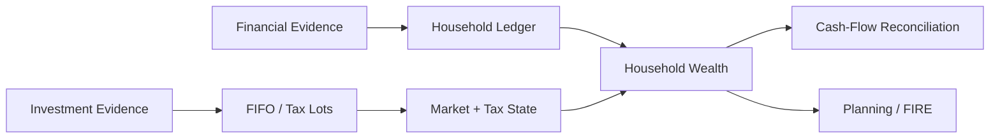

# Finance & Methodology

This section documents the **financial meaning implemented by the software**.

The financial model is not a layer of labels placed on top of ETL. It determines what the data means, at what grain the meaning exists, and which outputs are observed, reconstructed, modelled or simulated.

The current model is production-used decision support. Tax-oriented outputs support planning and filing review; they do not replace final filing due diligence.



## Methodology standard

Finance pages follow:

```text
Financial concept
      ↓
Definition / formula
      ↓
Grain
      ↓
Production implementation
      ↓
Interpretation
      ↓
Limitations
```

A mathematically valid calculation at the wrong grain is still financially wrong.

## Read in this order

| Guide | Focus |
| --- | --- |
| [Financial Model](financial-model.md) | Household ontology, balances, transactions, wealth and planning state |
| [Metrics & Methodology](metrics-and-methodology.md) | Published metric definitions, grain, formulas and interpretation |
| [Investment Analytics](investment-analytics.md) | FIFO, broker reconciliation, shadow benchmarks and return reconstruction |
| [Cash Flow & Wealth](cashflow-and-wealth.md) | Ledger reconstruction, market overlay, liquidity and direct cash reconciliation |
| [Tax Methodology](tax-methodology.md) | Holding periods, realized/unrealized tax state and tax-aware valuation |
| [FIRE Methodology](fire-methodology.md) | Deterministic and stochastic long-range planning |

## One important distinction

```text
Observed
≠ Reconstructed
≠ Modelled
≠ Simulated
```

A broker-reported quantity, reconstructed FIFO lot, estimated portfolio tax exposure and Monte Carlo terminal wealth are all useful financial states, but they are not the same kind of evidence.

The detailed guides keep those boundaries explicit.

[← Documentation Home](../README.md)
