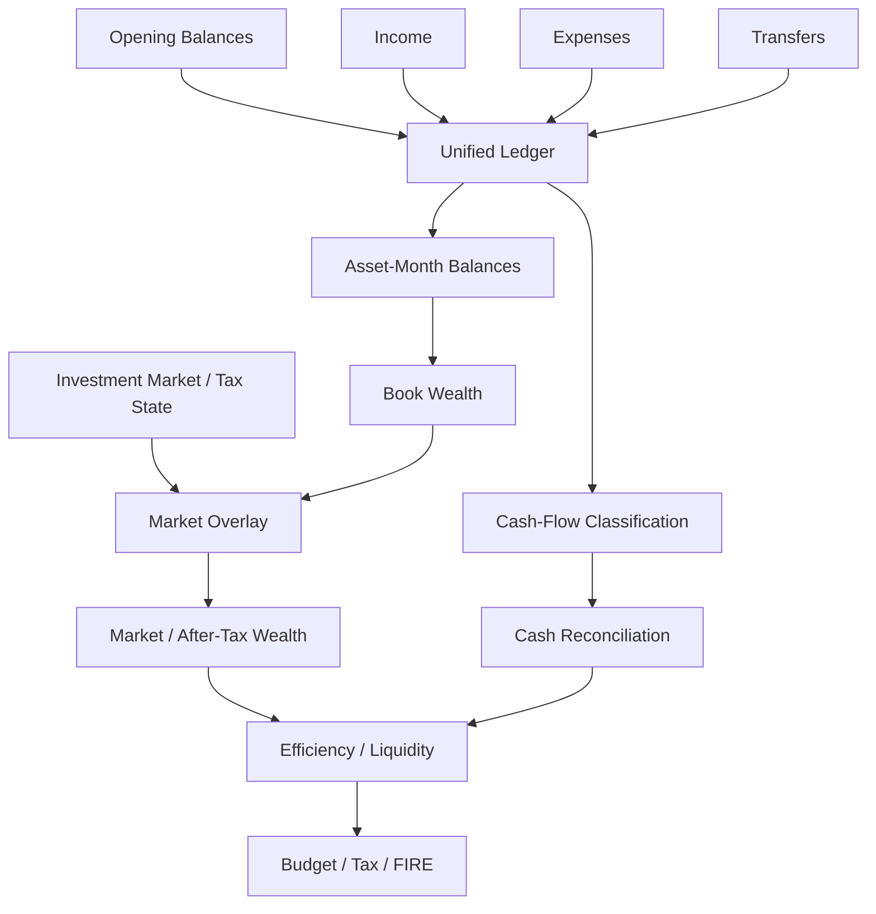
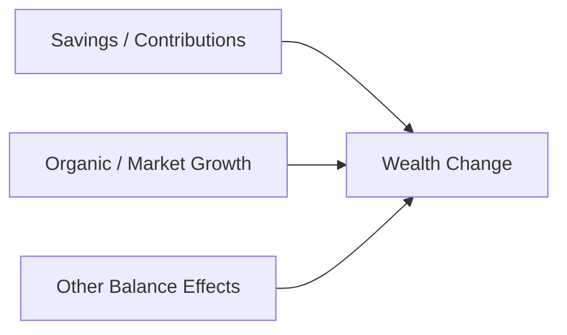

# Cash Flow & Wealth

The household analytics engine connects transaction semantics to balance-sheet state.

Its job is not merely to answer:

> How much did I spend?

It also answers:

- What happened to cash?
- What happened to each asset?
- How much wealth growth came from savings versus market movement?
- What is book wealth versus market wealth?
- How liquid is the household?
- Does classified financial activity reconcile with actual cash movement?
- What household state should planning and FIRE consume?

This document explains that model.

---

## Household analytical flow



---

## Unified household ledger

The ledger normalizes four core financial activity families:

```text
Opening balances
Income
Expenses
Transfers
```

This creates one household activity model before Gold measures are calculated.

---

## Why transfers are separate

A transfer moves value between household assets.

For example:

```text
Cash account
   ↓
Investment account
```

Household wealth does not increase merely because the receiving asset has an inflow.

If transfers were treated as income/expense, the model would manufacture financial performance from internal movement.

Keeping transfers explicit prevents that.

---

## Opening balances

Opening balances initialize asset state when the complete historical transaction chain is not available.

They allow the model to begin from a known balance and apply subsequent activity.

This makes the system practical for real personal-finance history.

It also means balance reconstruction is not always equivalent to lifetime transaction reconstruction.

---

## Asset-month reconstruction

The wealth engine reconstructs balances over time at asset-month grain.

Conceptually:

```text
Opening balance
 + inflows
 - outflows
 ± transfers
 = closing book balance
```

The exact signs depend on transaction semantics and asset role.

The resulting asset-month state can support:

- opening balance,
- closing balance,
- net change,
- cash flow,
- savings contribution,
- investment contribution,
- and organic growth.

---

## Book wealth

Book wealth comes from reconstructed ledger balances.

It answers:

> What balance sheet does recorded financial activity imply?

Book value is useful for understanding:

- contributed capital,
- savings,
- transfers,
- and accounting state.

It is not always the best estimate of current economic value for investments.

---

## Market overlay

Investment analytics provide current market state.

The wealth engine can overlay market investment values on the book balance sheet.

```text
Book asset state
      ↓
replace / overlay investment values
      ↓
Market-adjusted asset state
```

This connects portfolio analytics to household wealth.

---

## After-tax wealth

Investment tax state can further adjust the market perspective.

The result is a modelled after-tax household wealth view.

This is particularly useful for FIRE because gross market wealth can overstate economically realizable capital when large embedded gains exist.

---

## Net worth

Conceptually:

```text
Assets
 -
Liabilities
 =
Net Worth
```

The system can publish both:

- book net worth,
- market net worth,

and use after-tax market state in planning where appropriate.

---

## Wealth decomposition

A useful analytical question is:

> Why did wealth change?

The model distinguishes direct financial contributions from organic/market movement.



This prevents all net-worth growth from being interpreted as investment performance.

---

## Liquid and illiquid wealth

The household model can classify assets by liquidity.

This supports:

- liquidity ratio,
- emergency-fund coverage,
- runway,
- and resilience analysis.

A household can have high net worth and weak liquidity at the same time.

That distinction matters for planning.

---

## Cash pools

Cash-flow reconciliation begins with assets configured as cash pools.

These assets provide the observed cash-balance boundary.

The model compares:

```text
what classified activity says cash should have done
```

with:

```text
what cash-pool balances actually did
```

---

## Direct cash-flow classification

Financial movement is classified into:

```text
Operating
Investing
Financing
Internal Transfer
```

The classification uses configured asset/counterparty semantics.

This adapts financial-statement thinking to household finance.

---

## Operating activity

Operating cash flow represents recurring household economic activity under the configured classification.

Typical concepts can include cash income and household cash spending.

The exact category membership is policy-driven.

---

## Investing activity

Investing cash flow represents movement associated with investment activity.

This helps distinguish:

```text
money spent on consumption
```

from:

```text
cash converted into investment assets
```

Those have very different implications for household wealth.

---

## Financing activity

Financing activity represents configured financing-related cash movement.

This can include liability-related or other financing flows depending on the asset model.

---

## Internal transfers

Internal transfers move cash between household-controlled assets.

They should not create external inflow/outflow when evaluating household cash generation.

---

## Cash reconciliation

The core reconciliation is:

```text
Opening Cash
   +
Classified Cash Activity
   =
Calculated Closing Cash
```

then:

```text
Actual Closing Cash
   -
Calculated Closing Cash
   =
Unreconciled Difference
```

A non-zero unreconciled difference is a financial-quality signal.

---

## Why reconciliation matters

A spending dashboard can look plausible while still failing to explain actual cash movement.

Cash reconciliation provides an independent check.

It can reveal:

- missing transactions,
- classification errors,
- unmodelled transfers,
- source gaps,
- or cash-pool configuration problems.

That makes it one of the most useful financial quality mechanisms in the system.

---

## Cashflow_Activity_Summary

This Gold mart is the household cash-reconciliation contract.

It can expose concepts such as:

- opening cash,
- closing cash,
- net cash movement,
- operating inflow/outflow,
- investing inflow/outflow,
- financing inflow/outflow,
- internal transfers,
- cash expenses,
- non-cash expenses,
- calculated net cash flow,
- and unreconciled difference.

It is a reconciliation mart, not simply a cash-flow visualization.

---

## Income breakdown

`Cashflow_Income_Breakdown` provides category-level income composition.

The model can distinguish:

- total income,
- cash income,
- active income,
- passive/dividend/interest concepts,
- and non-cash income

according to current FinancialRules.

This answers:

> Where did household income come from?

---

## Expense breakdown

`Cashflow_Expense_Breakdown` provides category-level spending composition.

It supports:

- total spend,
- cash spend,
- non-cash spend,
- trailing spend,
- YTD spend,
- and configured expense classifications.

This answers:

> Where did household spending go?

---

## Efficiency analytics

`Cashflow_Efficiency_Analytics` answers a different question:

> How effectively is household income being converted into savings, investment, liquidity, and wealth?

The serving contract can include concepts such as:

- savings rate,
- investment rate,
- income mix,
- expense mix,
- liquidity ratio,
- debt-to-assets,
- nominal/real net-worth growth,
- and emergency-fund coverage.

---

## Savings contribution versus organic growth

Asset-level wealth analytics can distinguish:

```text
Savings / contribution effect
```

from:

```text
Organic growth effect
```

This is particularly useful for investment assets.

A large balance increase caused by new contributions should not be mistaken for market performance.

---

## Wealth_Asset_Breakdown

This Gold mart operates at approximately:

```text
Month × Asset
```

It provides drill-down beneath household monthly state.

It can carry concepts such as:

- opening balance,
- closing balance,
- market balance,
- asset movement,
- income/expense flow,
- transfers,
- savings contribution,
- organic growth,
- liquidity,
- and runway context.

---

## Core_Monthly_Fact

`Core_Monthly_Fact` is the monthly household BI spine.

At Month grain it brings together major state across:

```text
Income
Expenses
Cash Flow
Assets
Investments
Liquidity
Liabilities
Net Worth
Inflation / Macro
```

This is one of the most important Gold contracts because it gives Power BI a coherent household-level monthly state.

---

## Cash versus accounting savings

The model maintains both cash-oriented and broader savings perspectives.

This is important because:

```text
non-cash income / expense
```

can make accounting surplus differ from deployable cash surplus.

FIRE and liquidity analysis should not blindly assume those are identical.

---

## Budget planning

Budget analytics use historical household state and configured allocation rules to create planning context.

The internal builder can compute richer intermediate statistics than the Gold contract publishes.

The serving layer intentionally keeps the decision-useful output focused.

---

## Tax planning integration

Household tax forecasting consumes investment realized state and taxable household income components.

This connects:

```text
investment accounting
      ↓
tax state
      ↓
household planning
```

rather than treating tax as a completely separate calculator.

---

## FIRE integration

FIRE consumes household state such as:

- after-tax market wealth,
- trailing spending,
- trailing savings,
- and macro/planning assumptions.

This means FIRE is downstream of:

- transaction quality,
- investment quality,
- tax methodology,
- and household semantics.

A sophisticated simulation cannot repair a bad financial state upstream.

---

## Runway

Runway translates wealth/liquidity into spending coverage under the relevant model.

The platform can expose:

- deterministic/linear runway,
- stochastic base runway,
- stressed runway,
- and different spending-scope variants.

Interpretation depends on:

- which wealth base is used,
- which spending base is used,
- and whether the result is deterministic or simulated.

---

## Real versus nominal wealth growth

Nominal net-worth growth can overstate economic progress during inflation.

The analytical model therefore supports inflation-aware wealth growth context.

Real net-worth CAGR helps answer:

> Is purchasing-power wealth actually increasing?

---

## Household analytical grains

| Grain | Contract | Purpose |
| --- | --- | --- |
| Transaction | Silver household facts | Canonical activity |
| Month × Asset | `Wealth_Asset_Breakdown` | Asset-level wealth |
| Month × Income Category | `Cashflow_Income_Breakdown` | Income composition |
| Month × Expense Category | `Cashflow_Expense_Breakdown` | Expense composition |
| Month | `Core_Monthly_Fact` | Household state |
| Month | `Cashflow_Efficiency_Analytics` | Household efficiency |
| Month | `Cashflow_Activity_Summary` | Cash reconciliation |
| Month | `Wealth_FIRE_Analytics` | Planning/FIRE |
| Month | `Forecast_Tax_Liability` | Tax planning |
| Month | `Forecast_Budget_Variance` | Budget planning |

Grain is part of the financial meaning.

---

## Household model caveats

## Opening-state dependence

Not every balance necessarily derives from lifetime transaction history.

## Classification dependence

Cash/non-cash, core expense, liquidity, and activity classification depend on FinancialRules.

## Market-data dependence

Market wealth depends on investment valuation quality.

## Tax-model dependence

After-tax wealth depends on current tax methodology.

## Reconciliation dependence

A non-zero cash difference means the financial activity model does not fully explain observed cash movement.

That should remain visible.

---

## Cash-flow and wealth invariants

1. **Transfers do not create fake income/expense.**
2. **Opening balances remain state initialization.**
3. **Cash and non-cash activity remain distinguishable.**
4. **Book and market wealth remain distinguishable.**
5. **After-tax wealth remains modelled rather than observed fact.**
6. **Cash pools anchor reconciliation.**
7. **Internal transfers do not create household cash generation.**
8. **Unreconciled cash differences remain visible.**
9. **Savings contribution and organic growth remain distinguishable.**
10. **Planning consumes the same household state published to BI.**

---

## Related documentation

- [Financial Model](financial-model.md)
- [Metrics & Methodology](metrics-and-methodology.md)
- [Tax Methodology](tax-methodology.md)
- [FIRE Methodology](fire-methodology.md)
- [Gold Data Contracts](../reference/gold-data-contracts.md)

[← Finance Home](README.md) · [← Documentation Home](../README.md)
