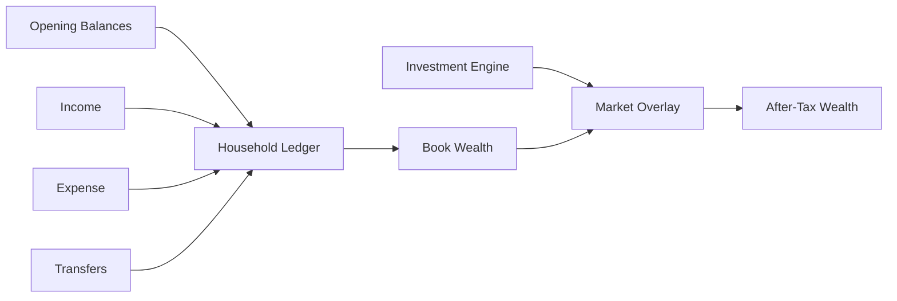
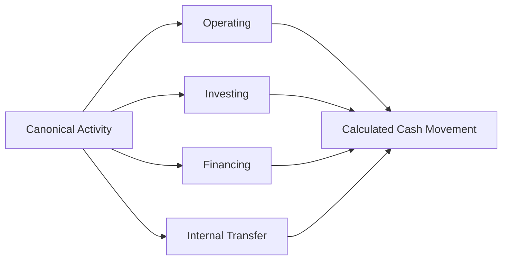

# Cash Flow & Wealth

Wealth and cash flow answer different questions.

```text
Wealth
→ what financial state exists?

Cash Flow
→ what activity explains movement in liquid state?
```

A household can become wealthier while cash falls.

Cash can rise because of financing rather than operating surplus.

The project models both.

---

## 1. Wealth reconstruction



The progression is:

```text
book
→ market
→ after-tax
```

not one universal net-worth number.

---

## 2. Book wealth

Book state is reconstructed from household financial activity.

Conceptually:

\[
ClosingBookBalance =
OpeningBalance
+ Income
- Expense
\pm Transfers
\]

at asset grain.

The actual model uses canonical ledger activity rather than one hard-coded equation for every source.

Book state is especially useful for:

- cash,
- deposits,
- liabilities,
- assets whose accounting balance is the relevant state.

---

## 3. Market wealth

Investment book state is overlaid with current market state.

Conceptually:

```text
non-investment book assets
        +
investment market value
        -
liabilities
        =
market net worth
```

This keeps:

```text
transaction/accounting state
```

separate from:

```text
current economic valuation
```

---

## 4. After-tax wealth

The investment engine estimates tax embedded in active lots.

So the household model can also construct:

```text
after-tax investment value
```

and therefore:

```text
after-tax household wealth
```

This is a planning perspective:

> **If current investment gains/losses were realized under the implemented tax model, what economic value remains?**

It is not a statement that the tax has already been paid.

---

## 5. Asset breakdown is Month × Asset

The Gold contract:

```text
Wealth_Asset_Breakdown
```

has grain:

```text
Month × Asset
```

That matters because monthly household totals and asset-level balances are different analytical objects.

The contract registry now makes that grain explicit.

---

## 6. Organic growth vs savings-driven growth

Wealth can increase because:

```text
new savings
market appreciation
interest/income retained
liability movement
transfers/reclassification
```

Those drivers should not be collapsed into "investment performance."

The model keeps household activity and market movement separate enough to support more meaningful attribution.

---

## 7. Cash flow starts from configured cash pools

FinancialRules determines which assets participate in cash reconciliation.

```text
Asset universe
      ↓
configured cash pool
      ↓
opening / closing cash state
```

This prevents investment market value or illiquid assets from accidentally entering a cash reconciliation merely because they are assets.

---

## 8. Activity classification

Canonical financial activity is classified into:

```text
Operating
Investing
Financing
Internal Transfer
```

Conceptually:



The exact mapping is financial policy.

---

## 9. Calculated cash movement

At monthly grain:

\[
CalculatedClosingCash =
OpeningCash
+ OperatingCashFlow
+ InvestingCashFlow
+ FinancingCashFlow
+ TransferTreatment
\]

The purpose is to reconstruct what closing cash **should** be from classified activity.

---

## 10. Actual cash movement

The system independently reconstructs/observes closing cash-pool state.

Then:

\[
UnreconciledDifference =
ActualClosingCash
-
CalculatedClosingCash
\]

That difference is preserved.

---

## 11. Why unreconciled difference matters

Suppose a dashboard shows:

```text
Income     100
Expense     60
Savings     40
```

It is tempting to conclude:

```text
Cash increased by 40
```

But actual cash might have increased by only 10 because of:

- investment funding,
- debt repayment,
- missing activity,
- transfer classification,
- source gaps.

Direct reconciliation forces the model to explain that difference.

---

## 12. Transfers require careful treatment

An internal transfer can produce:

```text
cash outflow from Asset A
cash inflow to Asset B
```

without changing household wealth.

If both sides are treated as external activity, cash flow becomes distorted.

The model therefore keeps transfer semantics separate from operating income/expense.

---

## 13. Cash flow is not the income statement

The same economic event can have different relevance across:

```text
household income/expense analytics
cash-flow analytics
wealth analytics
```

For example:

```text
non-cash expense
→ affects economic expense
→ does not directly reduce cash
```

That is why the system carries explicit cash/non-cash semantics in FinancialRules.

---

## 14. Savings is also contextual

Conceptually:

\[
Savings = Income - Expense
\]

But different planning questions can require:

```text
economic savings
cash savings
core-expense savings
```

The docs and Gold contracts therefore avoid assuming that one savings measure is universally correct.

---

## 15. Wealth feeds planning

Current wealth state feeds:

```text
budget analysis
tax forecast
portfolio allocation
FIRE
```

The planning layer therefore inherits all upstream distinctions:

```text
book vs market
pre-tax vs after-tax
cash vs non-cash
core vs non-core expense
```

If those semantics are wrong upstream, planning becomes precisely wrong.

---

## 16. Gold serving surface

The wealth/cash-flow Gold domain includes contracts such as:

```text
Core_Monthly_Fact
Wealth_Asset_Breakdown
Cashflow_Expense_Breakdown
Cashflow_Income_Breakdown
Cashflow_Efficiency_Analytics
Cashflow_Activity_Summary
```

Each exists at an explicit grain.

The reference docs contain the physical contract details.

---

## 17. Reconciliation as a data-quality control

Cash reconciliation is one of the places where finance and data engineering become the same problem.

```text
financial expectation
      ↓
independent observed state
      ↓
difference
      ↓
investigate data / classification / timing
```

A non-zero difference can reveal:

- missing source activity,
- incorrect classification,
- timing mismatch,
- incomplete opening state,
- cash-pool configuration issues.

The control is useful because it can falsify the model.

---

## 18. Wealth invariants

1. Transfers do not create wealth.
2. Opening balances do not create income.
3. Market movement is not savings.
4. Market wealth and book wealth remain distinguishable.
5. Estimated tax does not become an observed payment.
6. Cash-flow movement is reconciled against cash-pool state.
7. Unreconciled difference remains visible.
8. Planning consumes explicit financial state rather than duplicated manual totals.

---

## Go deeper

- [Financial Model](financial-model.md)
- [Metrics & Methodology](metrics-and-methodology.md)
- [Tax Methodology](tax-methodology.md)
- [FIRE Methodology](fire-methodology.md)
- [Gold Data Contracts](../reference/gold-data-contracts.md)

[← Finance Home](README.md) · [← Documentation Home](../README.md)
