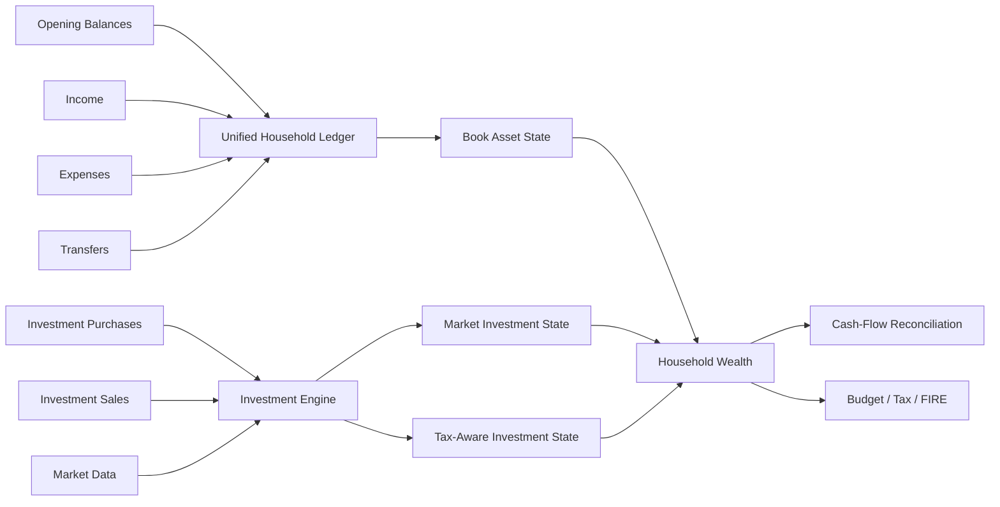
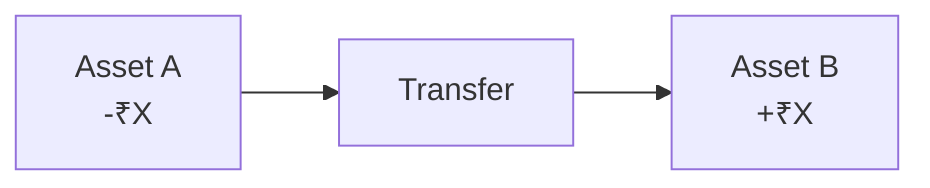

# Financial Model

Personal Finance ETL models a household as a **financial state machine**, not as a collection of dashboard totals.

The model starts with evidence:

```text
Opening Balances
Income
Expenses
Transfers
Investment Transactions
Market State
```

and reconstructs:

```text
Book State
→ Market State
→ After-Tax State
→ Cash-Flow State
→ Planning State
```

The key modelling rule is:

> **Activity, state, market value, tax value, and simulated future value are different financial objects.**

---

## 1. Household financial lineage



This is why the household and investment engines cannot be treated as unrelated calculators.

Investment state eventually changes household wealth.

---

## 2. Opening balances initialize state

An opening balance answers:

> **What financial state existed before the transaction history available to the system begins?**

It is not income.

It is not an adjustment to make a chart look right.

Conceptually:

```text
Opening Asset Balance
        +
Net Canonical Activity
        =
Reconstructed Book Balance
```

Without that distinction, a partial transaction history would manufacture wealth creation or destruction at the start of the model.

---

## 3. Income is canonical activity

Income transactions are standardized before the wealth engine consumes them.

The financial policy layer can classify income into concepts such as:

```text
cash income
non-cash income
active income
dividend income
interest income
```

Those classifications matter because:

```text
economic income
≠ cash received
```

For example, an accounting/economic income item can affect analytical income without increasing the configured cash pool in the same way as salary cash.

The model therefore avoids forcing every inflow into one "income" bucket with identical downstream behaviour.

---

## 4. Expense is also policy-aware

Expense activity is similarly classified.

Important distinctions include:

```text
cash expense
non-cash expense
core expense
non-core expense
```

That lets different questions use different expense concepts.

For example:

```text
Month-end household P&L
→ may care about broad economic expense

Cash-flow reconciliation
→ cares about cash movement

FIRE planning
→ often cares about sustainable/core spending
```

One expense number cannot safely answer all three questions.

---

## 5. Transfers are not income or expense

Internal transfers move value between household-controlled assets.



Household wealth should remain unchanged by the transfer itself.

So:

```text
transfer
≠ income

transfer
≠ expense
```

This sounds obvious until source statements label every credit/debit independently.

Canonical modelling prevents source accounting from becoming household economics.

---

## 6. A unified ledger reconstructs book state

The wealth engine combines canonical activity into one ledger.

Conceptually:

```text
Opening Balance
+ Income
- Expense
± Transfer
= Book Asset Balance
```

The implementation keeps activity type and asset identity explicit so balances can be reconstructed through time rather than inferred only from month-end totals.

That provides the base layer for wealth analytics.

---

## 7. Book wealth is not market wealth

For ordinary cash-like or book-valued assets:

```text
Book Balance
≈ Economic Value
```

For investments:

```text
Book / transaction state
≠ Current Market Value
```

The model therefore overlays investment market state onto reconstructed household balances.


Each state answers a different question.

### Book wealth

What does the reconstructed ledger say I own?

### Market wealth

What is that financial state worth at current market prices?

### After-tax wealth

What would remain after estimated tax consequences embedded in the current investment state?

---

## 8. Investment state enters the household model

The investment engine produces current/historical investment analytics that can be aggregated into household wealth.

The deepest persistent investment state is lot-aware.

That allows the household model to consume not only:

```text
market value
```

but also:

```text
estimated tax
after-tax value
```

This is how tax-lot accounting becomes a household-planning input rather than remaining an isolated investment report.

---

## 9. Cash pools are configured policy

Not every asset belongs in cash-flow reconciliation.

`FinancialRules` defines which assets constitute the household cash pool.

Conceptually:

```text
All Assets
    ↓
FinancialRules.cash_pool
    ↓
Cash Assets Used for Reconciliation
```

That policy boundary matters because:

```text
net worth
≠ cash
```

and:

```text
liquid wealth
≠ every financial asset
```

The exact classification is user policy rather than hard-coded finance logic.

---

## 10. Financial state is layered by certainty

The model contains several epistemic categories:

| State | Example |
| --- | --- |
| **Observed** | Broker-reported quantity, market price |
| **Canonicalized** | Standardized income/expense/transfer |
| **Reconstructed** | Household book balance, FIFO lot inventory |
| **Derived** | Savings rate, XIRR, allocation |
| **Estimated** | Tax if sold |
| **Modelled** | FI target |
| **Simulated** | Monte Carlo terminal wealth |

This distinction is important.

A simulation percentile should never visually acquire the same status as a bank transaction merely because both appear in Gold.

---

## 11. FinancialRules carries semantics

The model does not scatter classification policy across builders.

Validated rules describe concepts such as:

```text
income classifications
expense classifications
cash / non-cash treatment
core expense treatment
cash pools
asset groupings
target allocations
tax parameters
FIRE assumptions
```

The pattern is:

```text
raw/canonical value
      +
FinancialRules
      ↓
financial meaning
```

This keeps policy inspectable and snapshot-able.

---

## 12. Household and investment state meet in planning

The planning layer consumes connected state:

```text
Household Spending
Household Savings
Cash / Liquidity
Market Investment Value
Estimated Tax
Target Allocation
        ↓
Budget / Tax / Portfolio / FIRE Analytics
```

This is more useful than asking separate spreadsheets to agree on "current wealth."

---

## 13. Financial model invariants

1. Opening balances initialize state; they do not create income.
2. Transfers move wealth internally; they do not create household performance.
3. Cash and non-cash activity remain distinguishable.
4. Book value and market value remain distinguishable.
5. Market value and after-tax value remain distinguishable.
6. Investment tax state is lot-aware before aggregation.
7. Financial policy is validated configuration.
8. Observed and simulated state are not presented as equivalent evidence.
9. Planning consumes reconstructed financial state rather than manually duplicated totals.

---

## 14. Where the model becomes physical

Canonical household and investment state is published into Silver contracts.

Decision-oriented aggregates become Gold.

For physical grains and fields:

- [Silver Data Contracts](../reference/silver-data-contracts.md)
- [Gold Data Contracts](../reference/gold-data-contracts.md)

For methodology:

- [Investment Analytics](investment-analytics.md)
- [Cash Flow & Wealth](cashflow-and-wealth.md)
- [Tax Methodology](tax-methodology.md)
- [FIRE Methodology](fire-methodology.md)

[← Finance Home](README.md) · [← Documentation Home](../README.md)
