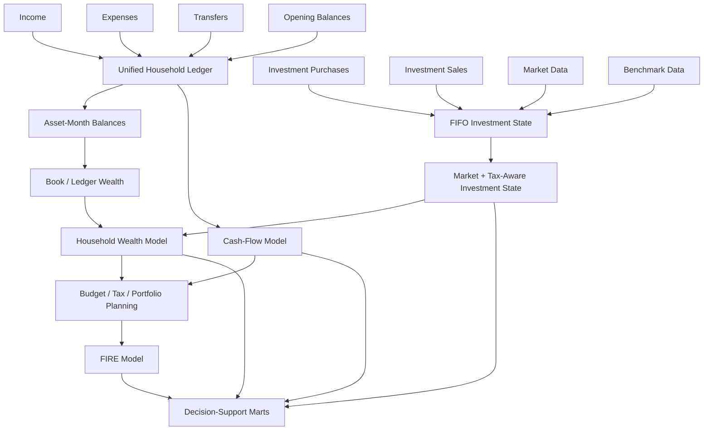
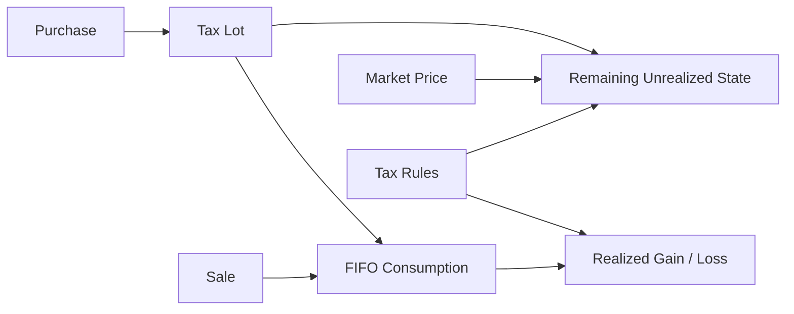
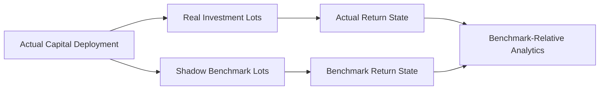
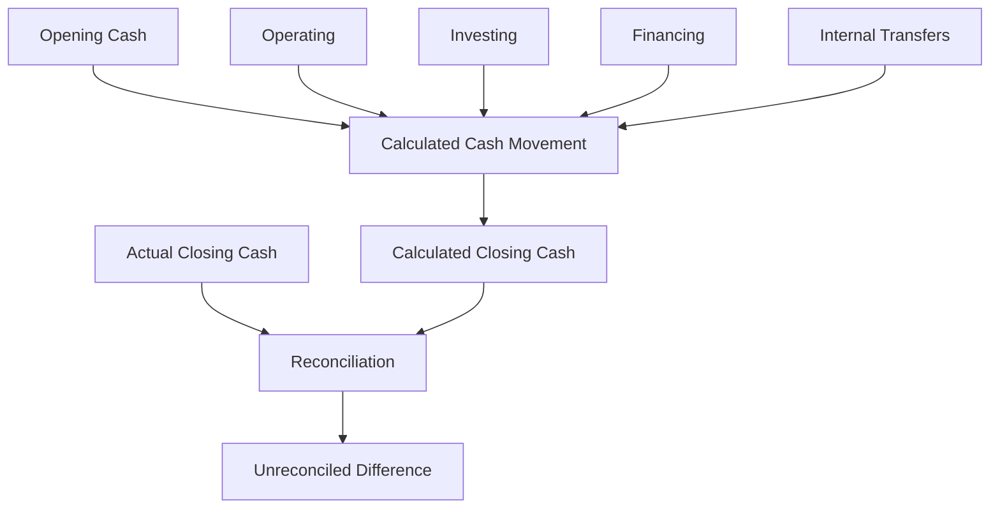
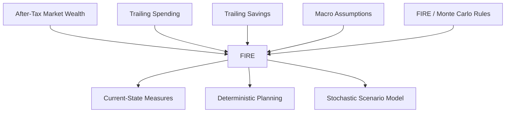

# Financial Model

Personal Finance ETL is built around one connected financial state rather than a collection of independent calculators.

I model household activity, investment state, tax exposure, cash movement, wealth, and planning as related views of the same underlying financial evidence.

The financial model therefore has several layers:

```text
Canonical transactions
        ↓
Household ledger + investment state
        ↓
Book / market / after-tax wealth
        ↓
Cash-flow + tax + portfolio planning
        ↓
FIRE
        ↓
Decision-support marts
```

This document defines the financial concepts that connect those layers.

> This is methodology documentation for my implementation. It is not financial, investment, or tax advice.

---

## Financial model at a glance



The important architectural property is integration: investment state changes household wealth; household wealth changes planning state; planning state feeds FIRE.

---

## Financial evidence versus financial meaning

A source record is evidence.

It does not become financial meaning merely because it contains an amount and a date.

The canonical model distinguishes concepts such as:

- income,
- expense,
- transfer,
- opening balance,
- investment purchase,
- investment sale,
- market observation,
- benchmark observation,
- asset,
- liability,
- and tax lot.

`FinancialRules` then supplies policy around concepts such as:

- cash/non-cash treatment,
- active/passive income,
- core expenses,
- cash pools,
- operating/investing/financing activity,
- investment classes,
- target allocations,
- tax treatment,
- and FIRE assumptions.

That separation is what lets downstream analytics reason about finance instead of statement layouts.

---

## Household accounting model

The household model starts from four canonical activity families:

```text
Opening balances
Income
Expenses
Transfers
```

These are normalized into a unified ledger.

## Opening balances

Opening balances establish the starting state for assets when complete lifetime transaction history is not available inside the platform.

This is a practical modelling choice.

It means:

> current balances can be financially coherent without every historical movement being represented as a transaction in the system.

Opening balances should therefore be interpreted as state initialization, not income.

## Income

Income represents canonical inflows classified by the financial model.

The rules can distinguish:

- cash income,
- non-cash income,
- active income,
- dividend income,
- interest income,
- and other configured income semantics.

These classifications serve different analytical purposes.

For example, accounting income and deployable cash income are not always identical.

## Expenses

Expenses represent canonical outflows/consumption.

The model can distinguish:

- cash expenses,
- non-cash expenses,
- core expenses,
- and other configured expense semantics.

This matters because FIRE spending, household cash movement, and accounting savings can require different expense scopes.

## Transfers

Transfers move financial value between assets.

They are not inherently income or expense.

That distinction is essential.

If I move money from cash into an investment account, household wealth has not increased merely because one asset received an inflow.

Transfers therefore remain their own financial activity class.

---

## Cash versus non-cash semantics

One of the core modelling distinctions is:

```text
Accounting activity
        ≠
Cash activity
```

The system can represent income or expense that affects financial/accounting interpretation without producing an equivalent immediate cash movement.

This supports separate measures such as:

- total income,
- cash income,
- non-cash income,
- total expense,
- cash expense,
- non-cash expense,
- cash-oriented savings,
- and broader accounting savings.

That distinction becomes especially important in:

- cash-flow reconciliation,
- savings rates,
- liquidity analysis,
- and FIRE inputs.

---

## Savings model

Savings is not treated as one universal number.

At a conceptual level, the system distinguishes:

```text
Cash-oriented savings
```

from:

```text
Total / accounting savings
```

because non-cash income and expense can exist.

This distinction also propagates into planning, where trailing savings measures can support different views of FI progress.

The exact published metric definitions belong in [Metrics & Methodology](metrics-and-methodology.md).

---

## Asset model

Assets provide the balance-sheet structure of the household model.

The rules can distinguish concepts such as:

- liquid assets,
- illiquid assets,
- cash pools,
- investment assets,
- and other configured asset semantics.

These classifications drive different calculations.

## Cash pools

Cash-pool assets are particularly important because they anchor direct cash-flow reconciliation.

The system observes actual movement in those assets and compares it with classified financial activity.

## Liquid versus illiquid assets

Liquidity is not equivalent to net worth.

The model preserves this distinction so household planning can reason about:

- total wealth,
- accessible wealth,
- emergency-fund coverage,
- and runway.

## Liabilities

Liabilities are modelled separately from assets so net worth reflects the household balance sheet rather than only gross assets.

---

## Book wealth

Book wealth is reconstructed from financial activity.

Conceptually:

```text
Opening asset state
      +
income / expense / transfer effects
      =
ledger-derived asset state
```

This provides a transaction/accounting perspective on household wealth.

It is useful because it preserves the relationship between contributions, withdrawals, and balances even when market values later diverge.

---

## Investment market overlay

Investment assets require another perspective.

A ledger-derived investment balance is not necessarily the same as current economic value.

The investment engine supplies market-derived state that can replace or overlay the accounting value of investment assets.

Conceptually:

```text
Book investment state
        +
current market valuation
        ↓
Market-adjusted investment state
```

This allows household wealth to incorporate actual market movement rather than treating investments as static contributed capital.

---

## After-tax wealth

The investment engine can estimate tax effects associated with current lot state.

That allows planning to use an after-tax perspective rather than assuming all unrealized investment value is equally realizable.

Conceptually:

```text
Market value
    -
modelled tax exposure
    =
after-tax market value
```

This is still a modelled value.

It depends on:

- current tax rules,
- lot classification,
- unrealized gains/losses,
- and assumptions about realization.

It should not be interpreted as a guaranteed liquidation value.

---

## Net-worth model

The household model can therefore distinguish:

```text
Book Net Worth
      ↓
Market Net Worth
      ↓
After-Tax Market Net Worth
```

These answer different questions.

### Book net worth

What does the reconstructed ledger imply?

### Market net worth

What is the household balance sheet worth after incorporating market investment state?

### After-tax market net worth

What is the modelled wealth after considering current investment tax exposure?

FIRE uses the more economically relevant market/after-tax state rather than a disconnected manually entered portfolio number.

---

## Wealth growth decomposition

The model separates financial contributions from market-driven growth.

At a conceptual level:

```text
Wealth change
    =
Savings / contributions
    +
Organic / market growth
    +
other classified balance effects
```

This is useful because "net worth increased" is not enough to understand why it increased.

A household can grow wealth through:

- saving more,
- investment appreciation,
- debt reduction,
- or a combination of effects.

---

## Investment accounting model

The investment model reconstructs state at tax-lot grain.



Purchases create lots.

Sales consume the oldest available lots first, including partial consumption.

The remaining inventory continues to age and is revalued through later market observations.

---

## Holding-period state

Each active lot can carry holding-period context such as:

- age,
- holding type,
- days until long-term classification,
- and applicable tax treatment.

The classification is time-sensitive.

A sale is evaluated using the holding state at the sale date.

An unsold lot continues to evolve as time advances.

---

## Realized and unrealized state

The model distinguishes:

## Realized

A gain or loss created by an actual disposal.

## Unrealized

A gain or loss implied by current market value while the lot remains active.

Those states feed different analytical questions.

Realized state participates in financial-year tax analysis.

Unrealized state participates in:

- current portfolio P&L,
- estimated tax if sold,
- after-tax value,
- and harvesting analysis.

---

## Broker-authoritative reconciliation

Transaction history reconstructs investment state, but real brokerage history can contain gaps or adjustments.

The current model therefore compares reconstructed position state with broker-reported current state.

When they disagree, the engine reconciles toward the broker position.

The design principle is:

> **Transactions explain history; broker state anchors current truth.**

This improves operational usefulness, but reconciliation adjustments must be considered when interpreting tax-lot history.

---

## Benchmark model

Benchmark analysis uses a shadow investment rather than a simple point-to-point comparison.

Each purchase establishes cash-equivalent benchmark exposure.

Partial disposals reduce shadow benchmark inventory proportionally.



This aligns benchmark comparison more closely with when capital actually entered the portfolio.

---

## Return model

The current serving model emphasizes:

- CAGR,
- XIRR,
- after-tax XIRR,
- benchmark CAGR,
- benchmark XIRR,
- active return,
- and max drawdown.

The model intentionally does not treat every possible quantitative ratio as necessary decision-support output.

## CAGR

CAGR is a point-to-point annualized growth measure.

It is useful when a beginning value, ending value, and elapsed time adequately describe the question.

It does not inherently account for irregular external cash flows.

## XIRR

XIRR is the preferred cash-flow-aware annualized return concept for irregular dated flows.

Conceptually, it solves for \(r\) such that:

```text
Σ CF_i / (1 + r)^((date_i - date_0)/365) = 0
```

where cash flows occur on irregular dates.

For an active investment, terminal market value is included as the closing value in the return cash-flow series.

## After-tax XIRR

After-tax XIRR uses tax-aware terminal state rather than simply multiplying pre-tax XIRR by one minus a tax rate.

That distinction matters because tax exposure is lot-dependent.

## Benchmark XIRR

Benchmark XIRR applies the corresponding cash-flow-aware methodology to shadow benchmark state.

## Active return

Active return expresses investment performance relative to the configured benchmark methodology.

Its interpretation depends on the underlying return measures and grain.

## Max drawdown

Max drawdown captures the largest peak-to-trough decline over the relevant analytical path.

It is the primary risk measure retained in the current serving contract.

---

## Return grain

Return metrics are not additive.

```text
Lot return
≠ ISIN XIRR
≠ Class XIRR
≠ Portfolio XIRR
```

Portfolio XIRR is constructed from portfolio cash-flow context.

It should not be created by averaging security-level XIRRs.

This is a fundamental part of the financial model.

---

## Portfolio aggregation

Investment state is published across several analytical views:

```text
ISIN
Subtype
Class
Instrument Type
Sector
Industry
Portfolio
```

These classifications allow different portfolio questions without changing the underlying instrument state.

The hierarchy should be understood as analytical views, not necessarily as one strict natural hierarchy for every instrument taxonomy.

---

## Portfolio management model

Performance analytics and portfolio-management analytics are separate contracts.

Portfolio management focuses on concepts such as:

- portfolio weight,
- class weight,
- target weight,
- allocation drift,
- rebalance requirement,
- sector concentration,
- harvestable loss,
- and harvesting priority.

This answers:

> **What should I inspect or act on?**

rather than only:

> **What return did I earn?**

---

## Cash-flow model

Cash flow is modelled from actual cash-pool movement and classified financial activity.



This is intentionally closer to a direct cash-flow statement than to a categorized expense report.

---

## Operating, investing, financing, and internal activity

Transfers are classified according to configured asset/counterparty semantics.

The model can distinguish:

- operating inflows/outflows,
- investing inflows/outflows,
- financing inflows/outflows,
- and internal transfers.

Internal movement should not create fake household cash generation.

---

## Budget model

Budget analytics compare household activity against configured allocation/planning rules.

The implementation can use rolling historical context and configured allocation percentages to produce budget variance and planning signals.

The Gold serving contract is intentionally more focused than every intermediate statistic computed internally.

---

## Tax forecasting model

Household tax forecasting combines investment realized state with taxable income components and configured tax assumptions.

The current serving contract can include concepts such as:

- realized STCG,
- realized LTCG,
- realized gains,
- realized STCL,
- realized LTCL,
- realized losses,
- realized net P&L,
- taxable dividends,
- taxable interest,
- LTCG exemption usage,
- projected tax bill,
- effective tax rate,
- remaining harvesting offset,
- and tax harvesting capacity.

For methodology details, see [Tax Methodology](tax-methodology.md).

---

## FIRE model

FIRE operates on household state rather than a separate manual model.



The three layers answer different questions.

### Current state

Where am I now?

### Deterministic planning

What does the current trajectory imply under explicit assumptions?

### Stochastic scenarios

How do uncertain return, inflation, employment, withdrawal, and sequence paths affect the distribution of outcomes?

The stochastic layer is scenario analysis, not prophecy.

---

## Financial model boundaries

## Observed / reconstructed state

Examples:

- canonical transactions,
- reconstructed balances,
- current market observations,
- broker-reported position state.

## Modelled state

Examples:

- estimated tax if sold,
- after-tax market wealth,
- projected tax bill,
- deterministic FI timing,
- Monte Carlo FI distributions.

Keeping these categories conceptually separate prevents model outputs from being mistaken for observed facts.

---

## Financial model invariants

I want future changes to preserve these principles unless I intentionally change the methodology.

1. **Transfers remain distinct from income and expense.**
2. **Cash and non-cash semantics remain distinguishable.**
3. **Book, market, and after-tax wealth remain distinguishable.**
4. **Investment tax lots remain available below portfolio aggregation.**
5. **Broker reconciliation remains explicit.**
6. **Benchmark comparison reflects capital deployment.**
7. **Return aggregation uses financial methodology rather than generic averaging.**
8. **Cash flow reconciles against actual cash-pool movement.**
9. **FIRE consumes connected household state rather than a disconnected manual balance.**
10. **Modelled outputs remain distinguishable from observed/reconstructed state.**
11. **Financial policy remains explicit in validated configuration.**
12. **Decision usefulness remains more important than metric quantity.**

---

## Related documentation

- [Metrics & Methodology](metrics-and-methodology.md)
- [Investment Analytics](investment-analytics.md)
- [Cash Flow & Wealth](cashflow-and-wealth.md)
- [Tax Methodology](tax-methodology.md)
- [FIRE Methodology](fire-methodology.md)
- [Data Model](../architecture/data-model.md)

[← Finance Home](README.md) · [← Documentation Home](../README.md)
