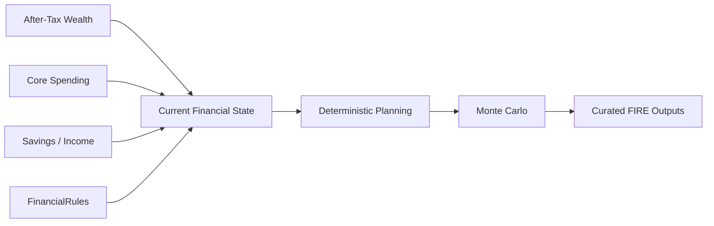
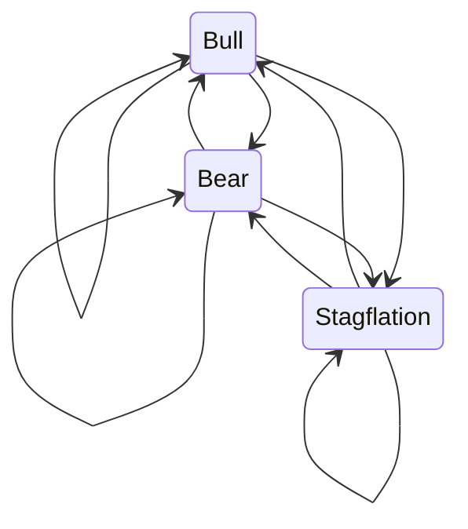
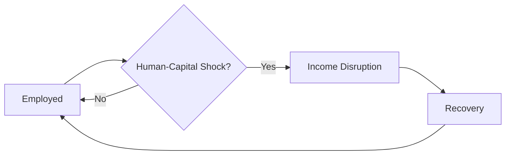

# FIRE Methodology

FIRE in Personal Finance ETL is downstream of reconstructed financial state.

It does not begin with a manually entered portfolio value and a generic withdrawal-rate calculator.



The methodology has three layers:

```text
Current state
→ deterministic planning
→ stochastic scenario modelling
```

---

## 1. Current state comes from the financial model

Inputs can include:

```text
current market wealth
after-tax wealth
core expenses
savings
income
liquidity
allocation
tax state
```

Those values are reconstructed upstream.

FIRE therefore inherits the quality of:

- source evidence,
- household classifications,
- investment valuation,
- tax methodology.

A simulation cannot repair bad financial semantics.

---

## 2. Deterministic FI target

A basic target can be represented as:

```text
FI Target = Annual Core Expense / Withdrawal Rate
```

This is useful as a deterministic planning anchor.

But the meaning depends on:

```text
which expenses are core?
which wealth is investable?
pre-tax or after-tax?
what withdrawal policy?
what inflation assumptions?
```

The model therefore treats the target as configured methodology, not a universal financial constant.

---

## 3. Current coverage and gap

Once target and eligible wealth exist:

```text
FI Coverage = Eligible Wealth / FI Target
FI Gap      = FI Target - Eligible Wealth
```

Those metrics describe current position under deterministic assumptions.

They are not forecasts.

---

## 4. Why deterministic planning is not enough

Two households can have the same:

```text
wealth
spending
savings
expected return
```

and still experience very different outcomes because return paths differ.

Sequence matters.

```text
+20%, -20%
```

and:

```text
-20%, +20%
```

can have different consequences when contributions or withdrawals occur between periods.

That is why the project includes stochastic scenario modelling.

---

## 5. Simulation is a numerical workload

The FIRE engine uses NumPy/Numba rather than trying to express the simulation as a dataframe pipeline.

That follows the same architectural principle used elsewhere:

```text
Polars
→ vectorized data transformation

stateful Python
→ FIFO inventory

NumPy / Numba
→ repeated numerical simulation
```

One compute model does not need to own every workload.

---

## 6. Market regimes

The stochastic model can represent multiple regimes such as:

```text
Bull
Bear
Stagflation
```

Each regime can carry different assumptions for:

```text
expected return
volatility
inflation
```

The simulation state therefore includes the market environment, not only a random return draw.

---

## 7. Regime transitions

Regime movement follows configured transition probabilities.

Conceptually:



This allows persistence and switching rather than assuming every period is independently drawn from one stationary distribution.

---

## 8. Fat-tailed shocks

Market returns are not assumed to be perfectly Gaussian.

The model can use heavier-tailed shocks so extreme outcomes receive more weight than under a simple normal model.

Conceptually:

```text
regime expected return
        +
fat-tailed stochastic shock
        =
period return before other adjustments
```

This is scenario modelling, not a claim that one distribution is the true law of markets.

---

## 9. Jump events

The simulation can also model discrete jump/crash events.

```text
ordinary return process
        +
low-frequency jump process
```

This gives the scenario engine another way to represent discontinuous stress rather than relying only on continuous volatility.

---

## 10. Stochastic inflation

Inflation is modelled as a process rather than one forever-fixed scalar.

That matters because FIRE is fundamentally about:

```text
future purchasing power
```

not only nominal portfolio value.

Inflation affects:

- future spending,
- FI target evolution,
- withdrawal requirements,
- real wealth.

---

## 11. Human-capital shocks

The model can represent employment/income disruption.



This matters during accumulation because FIRE timing depends on both:

```text
investment returns
and
ability to keep contributing
```

A portfolio-only model misses half of the accumulation problem.

---

## 12. Contributions are part of the state transition

Before FI, household savings can continue to enter the portfolio.

Conceptually:

```text
wealth_t
+ contribution_t
+ investment return_t
=
wealth_(t+1)
```

The contribution path can itself be affected by inflation, income growth and human-capital shocks.

---

## 13. Glide paths

Asset allocation can evolve as the household approaches FI.

A glide path lets the model change exposure through time rather than assuming one allocation forever.

```text
current allocation
      ↓
time / FI proximity
      ↓
target allocation path
```

This is configured policy.

---

## 14. Portfolio drag

Real portfolios can experience costs/frictions.

The simulation can model portfolio drag separately from gross market return assumptions.

This keeps:

```text
market return
```

distinct from:

```text
investor net return assumption
```

---

## 15. Dynamic withdrawal rules

Post-FI spending does not need to follow one rigid inflation-adjusted amount forever.

The model can apply configured dynamic withdrawal behaviour.

Conceptually:

```text
baseline withdrawal
        ↓
portfolio / market state
        ↓
guardrail / adjustment
        ↓
actual withdrawal
```

The exact policy belongs in FIRE configuration.

---

## 16. Sequence-of-returns risk

Sequence risk matters most when cash flows interact with market movement.

During accumulation:

```text
poor returns early
+ ongoing contributions
```

can be recoverable.

During withdrawal:

```text
poor returns early
+ forced withdrawals
```

can permanently damage portfolio longevity.

Monte Carlo is therefore useful not because uncertainty is fashionable, but because the order of returns changes the financial path.

---

## 17. Simulation outputs are distributions

The engine produces scenario distributions rather than one forecast.

Examples include:

```text
P10 months to FI
P50 months to FI
P90 months to FI
modelled probability of success
P50 FI date
base runway
stressed runway
P50 nominal terminal wealth
```

These are deliberately curated before Gold publication.

---

## 18. What P10 / P50 / P90 mean

If \(T\) is simulated time to FI:

```text
P10
→ 10th percentile simulated outcome

P50
→ median simulated outcome

P90
→ 90th percentile simulated outcome
```

The direction of "better" depends on the metric.

For time-to-FI:

```text
lower months
→ earlier FI
```

For terminal wealth:

```text
higher value
→ more wealth
```

Percentile labels alone do not imply optimism/pessimism without understanding the metric.

---

## 19. Modelled probability of success

A simulation success rate is:

```text
Modelled Probability of Success
= Successful Simulation Paths / Total Simulation Paths
```

The subscript matters conceptually.

This is probability **inside the configured model**.

It is not an externally calibrated probability that real life will follow the model.

---

## 20. FIRE state is published at planning grain

The Gold contract:

```text
Wealth_FIRE_Analytics
```

is designed for planning consumption rather than exposing every internal simulation vector.

The serving layer therefore keeps the outputs that support the planning workflow.

Again:

> **Compute richly. Publish selectively.**

---

## 21. Why the simulation remains local

Financial data and planning assumptions are sensitive.

The workload is also computationally manageable on a local workstation with Numba acceleration.

So the simulation does not require cloud infrastructure merely to appear more scalable.

That is consistent with the project's broader local-first architecture.

---

## 22. What FIRE does not claim

The model does not know:

- future market regimes,
- future inflation,
- future employment shocks,
- future tax law,
- future spending behaviour,
- future life events.

It explores configured scenarios.

The outputs are **decision support under assumptions**, not prophecy.

---

## 23. FIRE methodology invariants

1. FIRE starts from reconstructed financial state.
2. Core spending policy matters.
3. Eligible wealth and valuation basis matter.
4. Deterministic target and stochastic outcomes are different concepts.
5. Return order matters.
6. Inflation is part of the financial problem.
7. Human capital matters during accumulation.
8. Withdrawal policy matters after FI.
9. Simulation probabilities are model-conditional.
10. Gold publishes selected decision outputs, not every simulated statistic.

---

## Go deeper

- [FIRE Configuration](../configuration/fire-configuration.md)
- [Financial Model](financial-model.md)
- [Cash Flow & Wealth](cashflow-and-wealth.md)
- [Metrics & Methodology](metrics-and-methodology.md)
- [Gold Data Contracts](../reference/gold-data-contracts.md)

[← Finance Home](README.md) · [← Documentation Home](../README.md)
