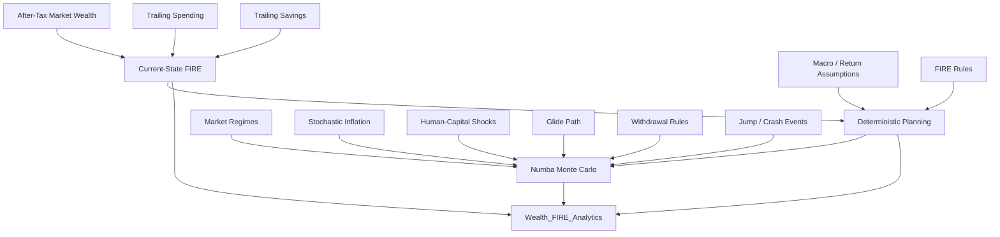
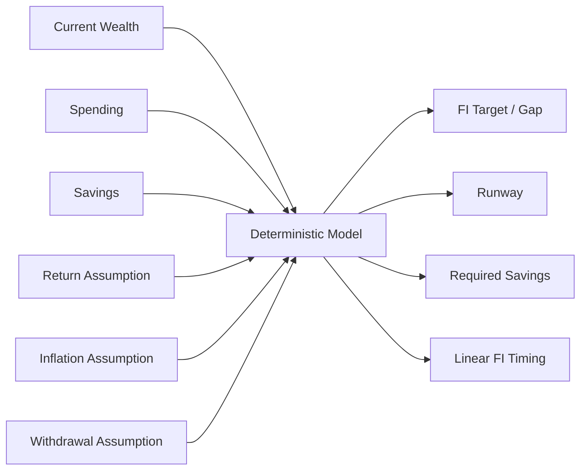
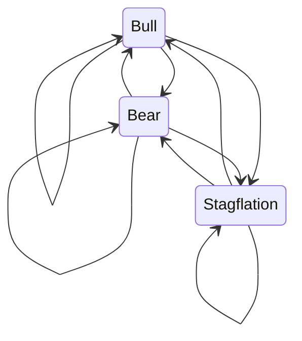
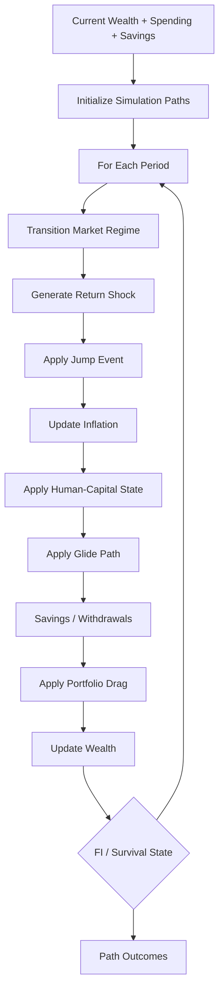

# FIRE Methodology

The FIRE engine turns current household financial state into long-range planning context.

It does not begin from a manually entered "portfolio balance."

It consumes the financial state produced by the rest of the platform:

- market and after-tax wealth,
- trailing spending,
- trailing savings,
- macro assumptions,
- and configured FIRE/Monte Carlo policy.

The model has three conceptual layers:

```text
Current-state FIRE
        ↓
Deterministic planning
        ↓
Stochastic scenario modelling
```

> The outputs are **scenario-based planning measures under explicit assumptions**. They are not predictions, guarantees, or financial advice.

---

## FIRE architecture



---

## Wealth basis

The FIRE model uses connected household wealth rather than a disconnected planning balance.

The current path uses after-tax market wealth as an important wealth basis.

That means:

```text
investment market state
      ↓
investment tax state
      ↓
after-tax household wealth
      ↓
FIRE
```

This integration is one of the strongest parts of the model.

---

## Spending basis

FIRE depends on trailing household spending.

The implementation maintains more than one spending perspective, including primary and broader/total-spend variants.

This can produce paired planning measures such as:

```text
Target_FI_Today
Target_FI_Today_Total

FI_Gap
FI_Gap_Total

Runway_Months_Linear
Runway_Months_Total_Linear

Lean_FI_Today
Lean_FI_Today_Total

Savings_Rate_Required
Savings_Rate_Required_Total
```

These variants should be interpreted according to the spending scope they use.

---

## Savings basis

The system similarly distinguishes cash-oriented and broader savings perspectives.

Trailing measures can include concepts such as:

```text
Trailing_12M_Avg_Savings
Trailing_12M_Avg_Total_Savings
```

This matters because deployable cash savings and accounting savings can differ.

---

## Current-state FIRE

The first layer asks:

> **Where do I stand now?**

Current-state measures can include:

- Target FI,
- Lean FI,
- Coast FI,
- FI coverage,
- FI gap,
- current withdrawal rate,
- savings rate,
- and runway.

These measures are deterministic descriptions of current state under configured methodology.

---

## Target FI

The FI target represents the capital required to support the configured spending base under the model's withdrawal assumptions.

A simple conceptual form is:

```text
FI Target
    ≈
Annual Spending
    /
Sustainable Withdrawal Rate
```

The production model should be interpreted through its configured assumptions rather than assuming a universal 4% rule.

---

## Lean FI

Lean FI uses a lean/core spending perspective.

This provides a lower-spending resilience view distinct from the broader household spending target.

---

## Coast FI

Coast FI estimates the current capital required such that future growth, under configured assumptions and time horizon, can reach the relevant FI target without the same level of additional contributions.

It is assumption-sensitive.

It should not be interpreted as "I can stop saving forever" without understanding the model inputs.

---

## FI coverage

Conceptually:

```text
Relevant Current Wealth
        /
FI Target
        =
FI Coverage
```

It expresses progress toward the target as a coverage ratio.

---

## FI gap

Conceptually:

```text
FI Target
   -
Relevant Current Wealth
   =
FI Gap
```

The model can also track how the gap changes over time.

---

## Current withdrawal rate

Conceptually:

```text
Annualized Spending
        /
Relevant Current Wealth
```

This provides a current-state relationship between spending and wealth.

It is not the same thing as a recommended sustainable withdrawal rate.

---

## Required savings rate

The deterministic planning model can estimate the savings rate required to close the FI gap under configured assumptions.

This is a planning output.

It is sensitive to:

- current wealth,
- spending,
- expected return,
- inflation,
- horizon,
- and other model parameters.

---

## Linear time to FI

A linear estimate provides an interpretable baseline for months to FI.

It is useful precisely because it is simple.

It does not attempt to model:

- market volatility,
- regime shifts,
- inflation uncertainty,
- unemployment,
- or sequence risk.

That is the job of the stochastic layer.

---

## Runway

Runway measures how long current resources can support the relevant spending base.

The serving model can include:

- linear runway,
- base/P50 runway,
- stressed/P10 runway,
- and total-spend variants.

Runway interpretation requires knowing:

- wealth basis,
- spending basis,
- and deterministic versus stochastic methodology.

---

## FI velocity

FI velocity represents the rate of progress toward financial independence under the implemented methodology.

It is a planning trajectory measure, not an investment return.

---

## Wealth velocity and acceleration

The model can track how quickly wealth is changing and whether that rate itself is accelerating/decelerating.

These measures provide trajectory context around net-worth progress.

---

## Real net-worth growth

The serving model includes inflation-aware net-worth growth context such as real multi-year CAGR.

This separates:

```text
nominal balance growth
```

from:

```text
purchasing-power wealth growth
```

---

## Deterministic planning layer

The deterministic layer combines current financial state with configured assumptions.



This layer is useful for explainability.

Before looking at thousands of simulated futures, I still want a simple baseline that says what the current trajectory implies.

---

## Why Monte Carlo exists

A deterministic path hides uncertainty.

Real financial planning faces uncertainty in:

- returns,
- inflation,
- sequence of returns,
- employment/income,
- crash events,
- withdrawal behaviour,
- and asset allocation over time.

Monte Carlo allows the model to ask:

> **How does the planning outcome change across many internally generated paths under explicit assumptions?**

It does not ask:

> **What exact future will happen?**

---

## Simulation engine

The stochastic engine uses NumPy/Numba for the computationally intensive path.

The model can incorporate several uncertainty mechanisms.

---

## Market regimes

The simulation supports market regimes such as:

```text
Bull
Bear
Stagflation
```

Regime-specific assumptions can change expected return/volatility behaviour.

---

## Markov regime transitions

Market regimes can transition according to configured probabilities.

Conceptually:



The next regime depends probabilistically on the current regime rather than being sampled independently every period.

---

## Fat-tailed return shocks

The model can use Student-t-style shocks rather than assuming every return innovation is normally distributed.

This allows heavier tails and more extreme observations than a Gaussian model with the same variance.

That does not make the simulation "predict crashes."

It changes the assumed shape of scenario risk.

---

## Jump / crash events

Jump-diffusion-style events allow discrete negative or positive shocks beyond ordinary period volatility.

These are controlled by configured probabilities/magnitudes.

They provide a way to represent rare discontinuous events inside the scenario model.

---

## Stochastic inflation

Inflation can vary across simulated paths rather than remaining one fixed deterministic number.

This matters because FIRE is fundamentally about future purchasing power, not only nominal portfolio value.

Inflation affects:

- spending,
- FI targets,
- real wealth,
- and withdrawal sustainability.

---

## Human-capital shocks

The model can represent income/employment disruption.

Examples include:

- unemployment periods,
- income shocks,
- and recovery assumptions.

This is important because pre-FI planning depends on the household's ability to continue saving.

Market risk is not the only planning risk.

---

## Glide paths

Asset allocation can evolve over the simulation horizon.

A glide path can reduce or alter risk exposure as FI approaches or as planning state changes.

This allows the simulation to avoid assuming one static portfolio allocation forever.

---

## Portfolio drag

The model can incorporate ongoing drag such as investment costs/expenses.

Small recurring costs can matter materially over long horizons.

---

## Dynamic withdrawal rules

The simulation supports dynamic withdrawal behaviour, including Guyton-Klinger-style policy concepts.

This means retirement spending does not have to be modelled as one blindly inflation-adjusted fixed withdrawal path.

Dynamic rules can react to portfolio state under configured policy.

---

## Sequence-of-returns risk

Two paths with similar average returns can produce very different retirement outcomes if poor returns occur at different times.

This is sequence-of-returns risk.

The Monte Carlo model naturally captures this because wealth evolves path-by-path through time.

---

## Simulation lifecycle



The exact implementation details belong to code and configuration, but this captures the conceptual sequence.

---

## Months-to-FI distribution

The stochastic engine produces a distribution of FI timing.

The serving model publishes selected percentiles:

```text
P10
P50
P90
```

Interpretation:

- P10 represents an earlier part of the simulated distribution,
- P50 is the median simulated timing,
- P90 represents a later part.

These are simulation percentiles.

They are not promises or classical confidence intervals about the real world.

---

## Probability of success

The modelled probability of success is:

```text
successful simulated paths
        /
total simulated paths
```

where "success" is defined by the implemented scenario criteria.

This value is conditional on the complete model.

It can change when I change:

- market assumptions,
- inflation,
- regime transitions,
- human-capital shocks,
- asset allocation,
- withdrawal policy,
- horizon,
- or spending.

Therefore the correct interpretation is:

> **Under these assumptions, this fraction of simulated paths satisfied the model's success criteria.**

Not:

> **There is an objective X% chance my retirement succeeds.**

---

## Projected P50 FI date

The median simulated FI timing can be converted into a projected median date.

This is useful for planning communication.

It is still conditional scenario output.

---

## Terminal wealth

The simulation tracks terminal wealth across paths.

The current Gold contract exposes:

```text
Terminal_Wealth_Nominal_P50
```

the median nominal terminal wealth.

The serving model intentionally avoids publishing every available percentile simply because the simulator can calculate them.

---

## Base and stressed runway

Selected runway percentiles provide scenario-based planning context.

The current serving model includes concepts such as:

```text
P50 base runway
P10 stressed runway
```

These give a more useful planning range than one deterministic runway number.

---

## Nominal versus real outputs

Nominal wealth is not the same as purchasing-power wealth.

Where a metric is nominal, documentation should say so.

Inflation-adjusted interpretation requires either explicit real metrics or conversion using the model's inflation path.

This is especially important for long simulation horizons.

---

## FIRE Gold contract

`Wealth_FIRE_Analytics` is the main serving mart for FIRE and related wealth-planning state.

Current concepts include:

- trailing spending,
- trailing savings,
- assumed real return,
- Target FI,
- Coast FI,
- Lean FI,
- future nominal FI target,
- FI coverage,
- FI gap,
- FI gap trend,
- linear FI estimate,
- P10/P50/P90 months to FI,
- modelled probability of success,
- projected P50 FI date,
- linear/base/stressed runway,
- current withdrawal rate,
- required savings rate,
- actual savings rate,
- FI velocity,
- wealth velocity/acceleration,
- real multi-year net-worth CAGR,
- and P50 nominal terminal wealth.

The exact physical fields are documented in [Gold Data Contracts](../reference/gold-data-contracts.md).

---

## Why the serving contract is curated

The simulator can produce more internal state than Gold exposes.

That is intentional.

A dashboard does not become more useful because it has 40 percentiles.

The current philosophy is:

> **Compute enough to model the problem; publish enough to support the decision.**

---

## Configuration sensitivity

FIRE outputs are highly sensitive to configuration.

Important parameter families include:

- return assumptions,
- regime means/volatilities,
- regime transition matrix,
- inflation process,
- jump-event assumptions,
- human-capital shocks,
- savings behaviour,
- withdrawal policy,
- glide path,
- tax-aware wealth basis,
- and simulation horizon.

See [FIRE Configuration](../configuration/fire-configuration.md).

---

## Model validation mindset

I do not treat a sophisticated simulation as automatically correct because it is complicated.

Useful validation questions include:

- Do deterministic baselines behave sensibly?
- Do worse return assumptions worsen outcomes?
- Does higher spending increase FI requirements?
- Does higher savings generally improve FI timing?
- Do stronger inflation assumptions reduce real purchasing-power outcomes?
- Do crash/unemployment assumptions widen or worsen scenario distributions?
- Do extreme configuration values produce explainable behaviour?

The goal is behavioural coherence, not mathematical theatre.

---

## Current limitations

## Assumption risk

The simulation is only as meaningful as its assumptions.

## Model risk

Regime, inflation, employment, and withdrawal models are simplified representations of reality.

## Tax evolution

Long-range tax rules can change materially.

Current tax-aware wealth is not a guarantee of future tax treatment.

## Behavioural uncertainty

Real household spending/savings behaviour can change in ways not represented by the model.

## External shocks

No finite scenario model contains every possible future event.

## Historical calibration

Historical relationships do not guarantee future relationships.

---

## FIRE methodology invariants

1. **FIRE consumes connected household state.**
2. **After-tax market wealth remains distinguishable from gross wealth.**
3. **Spending scope remains explicit.**
4. **Cash and total savings perspectives remain distinguishable.**
5. **Deterministic and stochastic outputs remain separate.**
6. **Monte Carlo results remain conditional scenario outputs.**
7. **Inflation remains part of long-range interpretation.**
8. **Human-capital risk remains conceptually separate from market risk.**
9. **Serving outputs remain curated rather than exhaustive.**
10. **Complexity never upgrades a model output into a prediction.**

---

## Related documentation

- [Financial Model](financial-model.md)
- [Metrics & Methodology](metrics-and-methodology.md)
- [Cash Flow & Wealth](cashflow-and-wealth.md)
- [Tax Methodology](tax-methodology.md)
- [FIRE Configuration](../configuration/fire-configuration.md)
- [Gold Data Contracts](../reference/gold-data-contracts.md)

[← Finance Home](README.md) · [← Documentation Home](../README.md)
