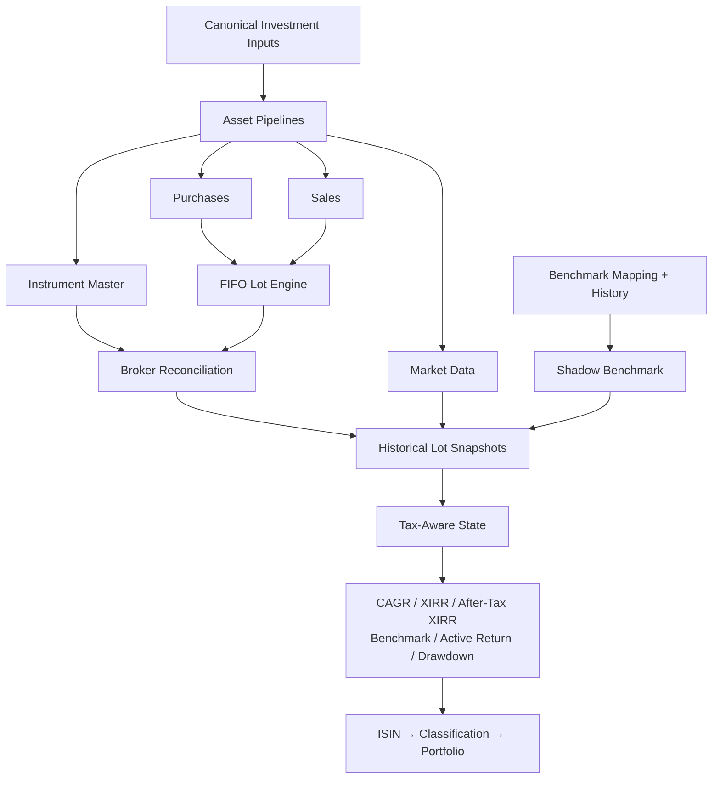
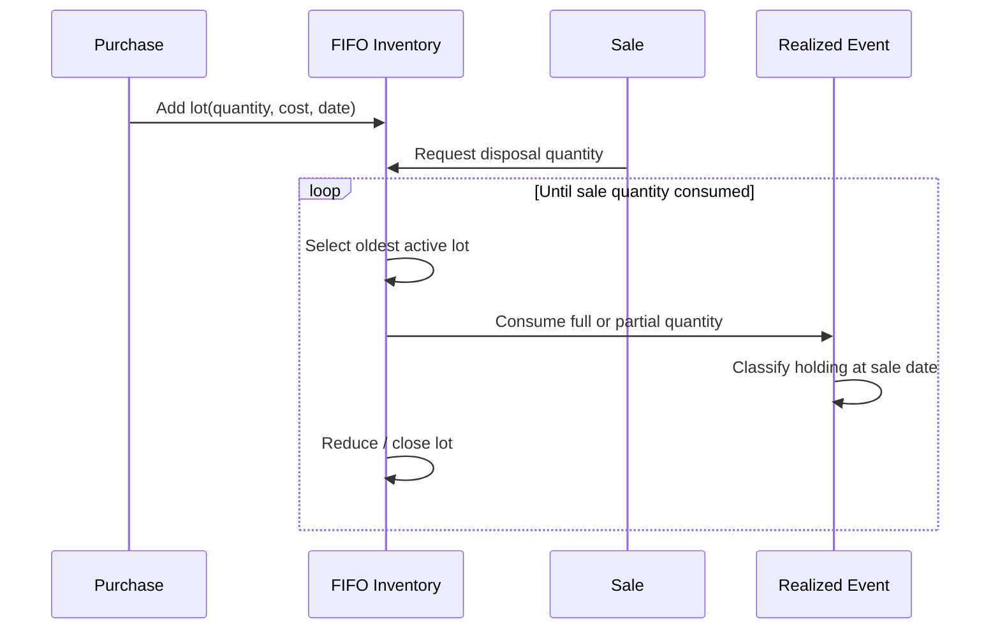
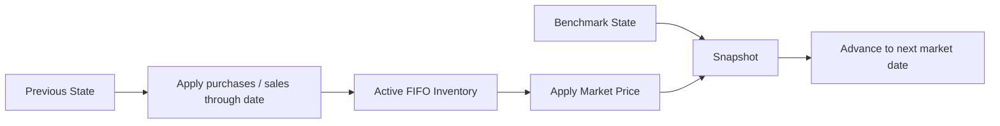
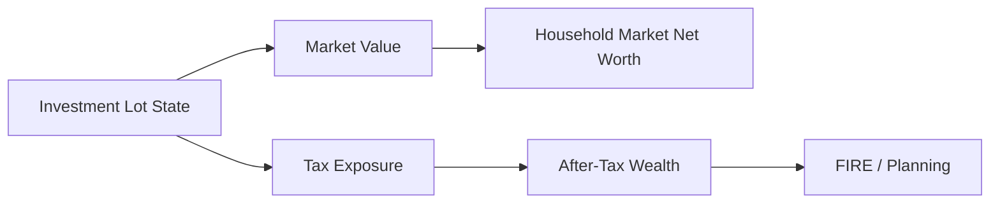

# Investment Analytics

The investment engine reconstructs portfolio state from transactions, reconciles that state against broker reporting, maintains tax-lot inventory, models benchmark-equivalent capital deployment, and publishes tax-aware performance across several portfolio grains.

This is not a single "return calculator."

It is a stateful analytical pipeline.

```text
Canonical investment evidence
        ↓
Asset pipelines
        ↓
FIFO tax lots
        ↓
Broker reconciliation
        ↓
Shadow benchmark inventory
        ↓
Historical market snapshots
        ↓
Tax-aware performance
        ↓
Hierarchical portfolio analytics
```

> This document describes the methodology implemented in the current v6 codebase. It is not investment or tax advice.

---

## Investment architecture



---

## Canonical investment inputs

The quant engine should not need to know the original broker worksheet layout.

Upstream asset pipelines converge toward common concepts:

- instrument master,
- market data,
- purchase data,
- sale data,
- and benchmark/reference state.

This is the investment engine's semantic boundary.

---

## Asset pipelines

Current implementations cover:

- stocks,
- mutual funds.

Each asset pipeline can handle source-specific normalization while producing a common result contract for downstream analytics.

This is an important extension seam.

A future asset type should ideally implement the canonical asset-pipeline contract rather than introduce branches throughout the lot and portfolio engines.

---

## Per-ISIN processing

The instrument is a natural state and parallelization boundary.

Investment data is partitioned by ISIN before worker execution.

Each worker can process the instrument's:

- purchases,
- sales,
- market observations,
- benchmark relationship,
- and current broker state

without repeatedly filtering the full portfolio.

This aligns compute isolation with financial state ownership.

---

## FIFO tax-lot accounting

Purchases create individual lots.

Sales consume active inventory oldest-first.



Partial-lot disposals are supported.

The remaining quantity continues as an active lot with its original acquisition context.

---

## Lot state

An active lot can carry concepts such as:

- purchase date,
- purchase quantity,
- remaining quantity,
- cost basis,
- market value,
- holding age,
- holding classification,
- days until long-term treatment,
- unrealized gain/loss,
- estimated tax if sold,
- after-tax value,
- benchmark purchase context,
- and return state.

This makes tax-lot state much richer than a simple average-cost position.

---

## Sale-date classification

Holding classification for a realized event is determined at the actual sale date.

That matters because the same lot can move from short-term to long-term treatment as time passes.

The lot's current classification and a historical sale's classification are therefore different temporal questions.

---

## Realized events

When FIFO inventory is consumed, the engine creates realized gain/loss state.

The model distinguishes:

```text
Realized LTCG
Realized STCG
Realized Gain

Realized LTCL
Realized STCL
Realized Loss

Realized Net P&L
```

Realized state is aggregated with financial-year awareness.

---

## Unrealized state

Remaining active lots are revalued against market observations.

The model can distinguish:

- unrealized LTCG,
- unrealized STCG,
- unrealized LTCL,
- unrealized STCL,
- estimated tax if sold,
- after-tax P&L,
- and after-tax close value.

These values evolve as:

- market price changes,
- holding age changes,
- and tax classification changes.

---

## Broker reconciliation

Historical transactions are not assumed to be permanently perfect.

The engine compares reconstructed state with broker-reported current state.

## Quantity reconciliation

If broker quantity exceeds reconstructed quantity, the current implementation can create reconciliation inventory to close the gap.

During the v6 audit, this adjustment inventory used zero-cost treatment as a mechanical reconciliation technique.

If broker quantity is below reconstructed quantity, active inventory is reduced until the reported quantity is matched.

## Cost reconciliation

If reconstructed cost state differs from broker-reported buy value, active lot costs can be scaled to reconcile the current cost basis.

## Design rationale

The policy is:

> **Transactions explain history; broker state anchors current truth.**

This makes the engine operationally useful against imperfect real-world history.

## Caveat

Reconciliation adjustments can affect lot-level tax/return interpretation.

They should be understood as a data-reconciliation policy, not as evidence that the historical transactions were complete.

---

## Shadow benchmark portfolio

Benchmark-relative analysis uses a shadow position.

For each real purchase:

```text
actual cash deployed
      ↓
real investment quantity

same economic cash deployment
      ↓
benchmark shadow quantity
```

The benchmark purchase price at the relevant date determines shadow quantity.

---

## Partial sales and benchmark inventory

When a real lot is partially disposed, its shadow benchmark quantity is reduced proportionally.

This keeps benchmark exposure aligned with the economic fraction of the real position that remains active.

The benchmark is therefore stateful.

It is not merely a lookup of "index return over the same date range."

---

## Benchmark-history lifecycle

Benchmark data has its own data-engineering path.

The system:

1. determines required historical coverage from investment dates,
2. checks existing Bronze benchmark coverage,
3. fetches only missing history,
4. serializes new history as Parquet bytes,
5. persists those bytes as `virtual://...` Raw artifacts,
6. synchronizes them to Bronze,
7. and publishes canonical benchmark history.

This gives external market history the same provenance/recovery treatment as local financial artifacts.

---

## Historical snapshot engine

Investment state evolves through market time.

At each relevant market observation, the engine applies transactions that have occurred up to that point and values the resulting active inventory.

Conceptually:



This produces historical lot-level analytical state rather than only a current snapshot.

---

## CAGR

CAGR provides point-to-point annualized growth context.

It is useful for:

- lot growth,
- instrument growth,
- benchmark growth

when irregular intermediate cash flows are not the primary question.

It is not a substitute for XIRR.

---

## XIRR

XIRR is used for irregular dated investment cash flows.

For an active position, the series includes:

- dated investment cash flows,
- relevant realized proceeds,
- and terminal current value.

The return \(r\) solves:

```text
Σ CF_i / (1 + r)^((d_i - d_0)/365) = 0
```

The implementation uses PyXIRR for this methodology.

---

## After-tax XIRR

After-tax XIRR uses tax-aware terminal value.

It is not calculated by simply applying one tax percentage to pre-tax XIRR.

The tax effect depends on active lot state.

That makes after-tax performance sensitive to:

- holding period,
- unrealized gains/losses,
- tax classification,
- and current tax policy.

---

## Benchmark XIRR

Benchmark XIRR applies cash-flow-aware return methodology to the shadow benchmark portfolio.

Because shadow exposure follows actual capital deployment, the comparison is aligned more closely with the investor's actual timing.

---

## Active return

Active return measures performance relative to the configured benchmark methodology.

Its meaning depends on grain.

At portfolio grain, benchmark-relative return should be based on portfolio-level cash-flow context rather than an average of security-level active returns.

---

## Max drawdown

Max drawdown is the main risk metric retained in the current Gold serving contract.

It captures the largest peak-to-trough decline in the relevant analytical path.

The current v6 serving model deliberately does not expose the older broad set of Sharpe/Sortino/Calmar/beta/tracking-error metrics as headline analytics.

---

## Why the risk surface was pruned

Earlier versions calculated a broader set of institutional-style risk metrics.

The current system is used for my actual investment workflow.

Metrics that did not materially improve that workflow were removed from the serving contract.

The current philosophy is:

> **Decision usefulness > metric collecting.**

Residual helper code does not redefine the published analytical contract.

---

## ISIN analytics

`Investment_By_ISIN` is the most detailed Gold investment-performance mart.

It can expose concepts such as:

- invested value,
- current value,
- quantity,
- unrealized P&L,
- absolute return,
- weight,
- CAGR,
- XIRR,
- after-tax XIRR,
- benchmark CAGR,
- benchmark XIRR,
- active return,
- benchmark-lag state,
- max drawdown,
- realized/unrealized tax state,
- and the historically named outperformance field.

---

## Outperformance field caveat

The current `Outperformance_Probability` name is semantically stronger than the implemented methodology.

The v6 audit found it to be closer to:

```text
active lots with lot CAGR > benchmark lot CAGR
        /
active lots
```

That is a **current lot outperformance rate**, not a stochastic probability forecast.

A future rename would improve semantic reliability.

Until then, documentation should interpret the methodology rather than the label.

---

## Hierarchical aggregation

Investment state is published across:

```text
ISIN
Subtype
Class
Instrument Type
Sector
Industry
Portfolio
```

These views allow portfolio analysis through different classifications.

The post-processing layer aggregates additive state and recalculates return state where required.

---

## Additive versus non-additive measures

Some measures aggregate naturally:

- current value,
- invested value,
- quantity where semantically compatible,
- realized gain/loss,
- unrealized gain/loss.

Others do not:

- XIRR,
- CAGR,
- drawdown,
- ratios,
- weights.

Those require methodology appropriate to the target grain.

This is why portfolio analytics are not merely a `group_by().mean()` exercise.

---

## Portfolio XIRR

Portfolio XIRR is built from portfolio cash-flow context.

Conceptually:

```text
all relevant portfolio contributions
+
all relevant portfolio withdrawals / realized proceeds
+
terminal portfolio value
        ↓
dated portfolio cash-flow series
        ↓
XIRR
```

It is not the weighted average of instrument XIRRs.

---

## Portfolio after-tax XIRR

The portfolio after-tax return similarly depends on tax-aware terminal state and relevant realized cash flows at portfolio grain.

---

## Portfolio benchmark XIRR

The portfolio benchmark return uses the corresponding shadow benchmark cash-flow context.

This keeps:

```text
Actual portfolio
vs
Shadow benchmark portfolio
```

on comparable capital-deployment footing.

---

## Portfolio-management analytics

`Investment_Portfolio_Summary` is separate from the quant marts.

It operates at approximately Month × ISIN grain and focuses on management questions.

Current concepts include:

- portfolio weight,
- class weight,
- target weight,
- allocation drift,
- rebalance flag,
- sector weight,
- harvestable loss,
- and harvesting priority.

This is a deliberate separation between:

```text
performance state
```

and:

```text
management / action context
```

---

## Rebalancing

The current implementation compares actual class allocation with configured target allocation.

A rebalance flag is raised when drift exceeds the current tolerance.

During the v6 audit, that tolerance remained hard-coded at approximately 5 percentage points.

Moving it into `FinancialRules` is a natural future hardening step.

---

## Tax-action classification

The lot-level methodology can produce deterministic action categories such as:

```text
HARVEST_LOSS
HARVEST_LTCG_EXEMPT
WAIT_FOR_LTCG
HOLD
```

The logic considers factors including:

- unrealized loss,
- tax type,
- holding classification,
- remaining LTCG exemption,
- days until LTCG,
- and configured waiting threshold.

This is better described as **tax-aware lot action classification** than autonomous optimization.

---

## Financial-year realized state

Realized gain/loss analytics are financial-year aware.

That is important because tax interpretation depends on the relevant tax period rather than only cumulative lifetime P&L.

The model carries realized state forward into higher-level investment and tax analytics.

---

## Current analytical grains

| Grain | Purpose |
| --- | --- |
| Date × ISIN × Tax Lot | Deep tax/holding/performance state |
| Date × ISIN | Security analytics |
| Date × Subtype | Subtype view |
| Date × Class | Asset-class view |
| Date × Instrument Type | Instrument-type view |
| Date × Sector | Sector view |
| Date × Industry | Industry view |
| Date × Portfolio | Total portfolio analytics |
| Month × ISIN | Portfolio-management / allocation state |

Understanding grain is mandatory before interpreting any investment metric.

---

## Investment analytics and household wealth

The investment engine feeds the household model.



This is one of the most important integrations in the platform.

Portfolio analytics are not isolated from household planning.

---

## Investment data-quality dependencies

Reliable investment analytics depend on:

- instrument identity,
- tax classification,
- purchase history,
- sale history,
- market data,
- benchmark mapping,
- benchmark history,
- and broker-reported current state.

Missing or incorrect canonical master data can invalidate downstream methodology even if the code executes successfully.

---

## Current limitations and hardening areas

## Reconciliation adjustments

Zero-cost or scaled-cost reconciliation mechanics can affect lot interpretation.

## Worker failure visibility

Per-ISIN worker failures should be surfaced explicitly enough that an instrument cannot silently disappear from an otherwise successful result.

## Residual risk machinery

Older risk calculations should be removed/simplified if no current contract consumes them.

## Semantic field names

`Outperformance_Probability` and monthly market-value "return" naming deserve future cleanup.

## Jurisdiction-specific tax behaviour

Current tax methodology is tailored to the implemented regime and should not be treated as universal.

---

## Investment invariants

1. **Purchases create lot state.**
2. **Sales consume FIFO inventory.**
3. **Partial lots remain valid state.**
4. **Sale-date holding classification governs realized treatment.**
5. **Broker reconciliation remains explicit.**
6. **Benchmark exposure follows actual capital deployment.**
7. **Cash-flow-aware returns are recalculated at the target grain.**
8. **After-tax return uses tax-aware state, not one blanket tax multiplier.**
9. **Performance analytics remain separate from portfolio-management signals.**
10. **Published metrics remain curated around decision usefulness.**

---

## Related documentation

- [Financial Model](financial-model.md)
- [Metrics & Methodology](metrics-and-methodology.md)
- [Tax Methodology](tax-methodology.md)
- [Gold Data Contracts](../reference/gold-data-contracts.md)
- [Silver Data Contracts](../reference/silver-data-contracts.md)
- [Adding an Asset Pipeline](../developer/adding-asset-pipelines.md)

[← Finance Home](README.md) · [← Documentation Home](../README.md)
