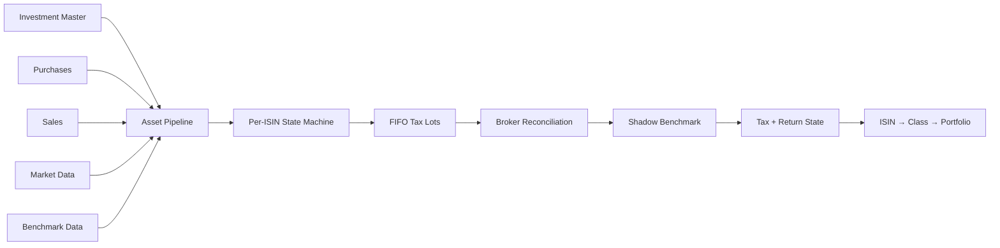
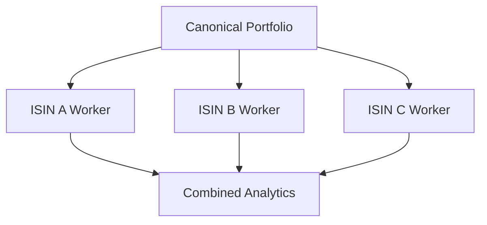
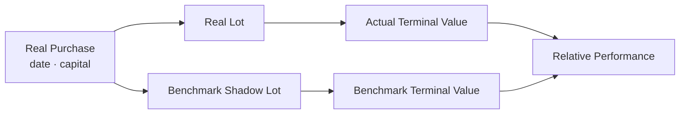
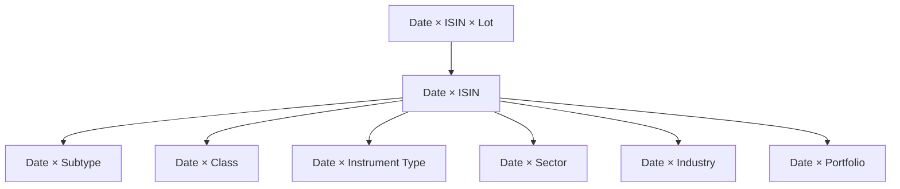

# Investment Analytics

The investment engine reconstructs portfolio state from transaction evidence, market data, broker state, benchmark state, tax policy, and time.

It is not a dashboard ratio calculator.



---

## 1. Asset pipelines normalize upstream variation

Stocks and mutual funds have different upstream source shapes.

They converge into shared canonical investment contracts before the common engine.

```text
Stock-specific transformation
            ↘
             Canonical Investment Contracts
            ↗
MF-specific transformation
```

The shared engine then consumes concepts such as:

```text
ISIN
purchase date
purchase quantity
purchase price
sale date
sale quantity
sale price
market price
benchmark price
tax classification
```

That boundary keeps source-specific logic out of FIFO and portfolio analytics.

---

## 2. Per-ISIN processing is a natural state boundary

Tax-lot inventory for one ISIN does not need mutable state from another ISIN.

The engine therefore partitions work by instrument and can process instruments in parallel.



The boundary provides both:

- state isolation,
- parallelism.

But worker failure is explicit. An instrument cannot silently disappear from the portfolio result.

---

## 3. Purchases create FIFO lots

A purchase becomes an active tax lot containing acquisition state.

Conceptually:

```text
TaxLot
├── acquisition date
├── quantity
├── purchase price
├── benchmark quantity
└── benchmark purchase price
```

The active lot queue is ordered by acquisition time.

A later sale consumes the oldest inventory first.

---

## 4. Sales consume the oldest active lot

The production algorithm is intentionally stateful:

```python
while rem > 0 and self._active_lots:
    lot = self._active_lots[0]
    consumed = min(rem, lot.qty)

    age_sale = max(
        (sell_date - lot.date).days,
        1,
    )

    holding_type = self.fy_table.get_holding_type(
        age_sale,
        self.tax_type,
        self.tax_subtype,
        lot.date,
        sell_date,
    )

    pnl = (
        (price - lot.price) * consumed
        if lot.price > 0
        else 0.0
    )
```

This code simultaneously answers:

```text
Which lot was sold?
How much?
How old was it?
What holding classification applied at sale?
What gain/loss was realized?
```

---

## 5. Partial disposals preserve remaining lot state

If a sale consumes only part of a lot, the remaining inventory survives.

The shadow benchmark position is reduced proportionally:

```python
new_shadow_qty = (
    lot.shadow_qty
    - (lot.shadow_qty * (rem / lot.qty))
    if lot.shadow_qty
    else 0
)

self._active_lots[0] = TaxLot(
    date=lot.date,
    qty=lot.qty - rem,
    price=lot.price,
    shadow_qty=new_shadow_qty,
    bm_buy=lot.bm_buy,
)
```

That proportional treatment matters because the benchmark comparison should continue to represent only the capital still economically active.

---

## 6. Holding period is lot-specific

Holding classification depends on:

```text
asset tax type
asset tax subtype
purchase date
sale / valuation date
holding duration
tax rules applicable to that period
```

Two active lots of the same ISIN can therefore have different tax treatment on the same valuation date.

That is why lot grain survives deep into the analytical model.

---

## 7. Broker reconciliation anchors current state

Historical transactions can be incomplete.

The broker can still report authoritative current quantity/cost.

The engine reconciles reconstructed inventory against reported state.

For quantity:

```python
if broker_qty > current_units + 1e-8:
    diff = broker_qty - current_units

    self.buy(
        market_date,
        diff,
        0.0,
        0.0,
        benchmark_price,
    )
```

If reconstructed quantity is too high, excess inventory is consumed until it matches broker state.

The principle is:

> **Transactions explain history; broker state anchors current truth.**

---

## 8. Reconciliation is not invisible history repair

A reconciliation adjustment has different evidentiary status from an observed historical purchase.

That matters for tax interpretation.

So the model distinguishes:

```text
observed transaction history
from
reconciled current inventory
```

The purpose is to produce a trustworthy current portfolio without pretending missing historical evidence was observed.

---

## 9. Shadow benchmark portfolio

Every real deployment of capital creates benchmark-equivalent exposure.



This preserves cash-flow timing.

A purchase made in 2022 and one made in 2026 should not be benchmarked as if both capital amounts existed for the same period.

---

## 10. Benchmark quantity is economic state

Conceptually:

\[
ShadowQty =
\frac{CapitalDeployed}
{BenchmarkPriceAtDeployment}
\]

Then at valuation date:

\[
BenchmarkValue =
ShadowQty \times BenchmarkPrice_t
\]

Partial real disposal reduces the associated benchmark exposure proportionally.

That keeps the benchmark portfolio aligned with remaining economic capital.

---

## 11. Realized state

A sale creates realized lot state:

```text
purchase cost
sale proceeds
realized P&L
holding classification
tax classification
benchmark result
```

Realized return and tax state are historical facts/derivations tied to the sale event.

They should not be mixed with active-lot unrealized state.

---

## 12. Unrealized state

Active lots are marked to current/historical market prices.

For each active lot:

```text
remaining quantity
× current market price
→ current market value

market value
- remaining cost basis
→ unrealized gain/loss
```

Tax methodology can then estimate:

```text
tax if sold now
```

which produces:

```text
after-tax market value
```

That is a modelled liquidation state, not an observed sale.

---

## 13. XIRR is reconstructed from dated cash flows

The numerical helper is small:

```python
def calculate_xirr(
    dates: list[date],
    amounts: list[float],
) -> float:
    try:
        result = xirr(dates, amounts)
        return (
            float(result)
            if result is not None
            else float("nan")
        )
    except Exception:
        return float("nan")
```

The financial work happens before that call.

At ISIN grain:

```text
purchase cash outflows
sale cash inflows
terminal market value
        ↓
ISIN XIRR
```

At portfolio grain:

```text
all portfolio external investment flows
portfolio terminal value
        ↓
Portfolio XIRR
```

The engine does not average child XIRRs.

---

## 14. After-Tax XIRR

For active positions, the terminal value can be replaced with estimated after-tax liquidation value.

```text
historical external cash flows
        +
after-tax terminal portfolio state
        ↓
After-Tax XIRR
```

This answers a different question from pre-tax XIRR:

> **What is the return profile after accounting for estimated embedded tax at the terminal date?**

---

## 15. Benchmark XIRR

Shadow benchmark cash flows are reconstructed with the same timing principle.

So:

```text
Portfolio XIRR
vs
Benchmark XIRR
```

is a comparison between two capital histories built from aligned deployment timing.

---

## 16. Active return

Once actual and benchmark returns exist at a comparable grain:

\[
ActiveReturn =
ActualReturn - BenchmarkReturn
\]

The metric is descriptive.

It does not claim future alpha.

---

## 17. Max Drawdown

Historical value paths also produce drawdown:

\[
Drawdown_t =
\frac{V_t}{Peak_t} - 1
\]

\[
MaxDrawdown =
\min_t(Drawdown_t)
\]

The current serving model retains Max Drawdown because it describes an experienced path property that is useful in investment review.

---

## 18. Outperforming Lot Ratio

The current metric:

```text
Outperforming_Lot_Ratio
```

describes the proportion of active lots whose benchmark-relative state is positive under the implemented comparison.

It replaced the older name:

```text
Outperformance_Probability
```

because the old name implied probabilistic forecasting that the calculation did not perform.

The rename made the contract more honest without changing the underlying financial truth.

---

## 19. Hierarchical aggregation

The engine publishes several analytical grains:



At each level:

- additive values can be summed,
- weights are recomputed,
- return cash flows are reconstructed,
- non-additive metrics are recalculated.

That is analytics engineering, not merely aggregation.

---

## 20. Monthly portfolio-management view

The presentation engine also publishes:

```text
Investment_Portfolio_Summary
→ Month × ISIN
```

with descriptive instrument context such as:

```text
ISIN
instrument name
class
type
subtype
sector
industry
```

and management state such as allocation/target/drift.

This is a different contract from the date-grain investment analytics marts.

---

## 21. Portfolio policy is configuration

Rebalance tolerance lives in `FinancialRules`:

```python
class PortfolioManagementRules(BaseModel):
    rebalance_tolerance_pct_points: float = Field(
        default=5.0,
        ge=0.0,
    )
```

So the portfolio-management layer can distinguish:

```text
actual allocation
target allocation
drift
configured action threshold
```

without hard-coding the policy into a report.

---

## 22. Why legacy risk metrics were removed

Earlier versions computed measures such as Sharpe/Sortino/Calmar/beta/tracking-error style analytics.

The current production model intentionally removed them when they stopped supporting the actual decision workflow.

That produced two benefits:

```text
smaller analytical contract
+
less processing
```

The serving layer is not intended to become a museum of every metric I have ever implemented.

---

## 23. Investment failure semantics

A failed instrument is a failed analytical stage.

```text
ISIN worker fails
      ↓
error propagates
      ↓
InvestmentQuantEngine fails
      ↓
orchestrator rolls back
      ↓
Control Plane records failure
```

That policy protects the portfolio from silent incompleteness.

---

## 24. What the investment engine does not claim

- Broker reconciliation does not recreate missing historical evidence.
- Estimated tax is not an observed tax payment.
- Benchmark relative performance is not a forecast.
- XIRR can be unstable/undefined for degenerate cash-flow patterns.
- Max Drawdown describes historical path, not future risk.
- The engine is not a general institutional risk library.

Those boundaries are intentional.

---

## Go deeper

- [Tax Methodology](tax-methodology.md)
- [Metrics & Methodology](metrics-and-methodology.md)
- [Gold Data Contracts](../reference/gold-data-contracts.md)
- [Silver Data Contracts](../reference/silver-data-contracts.md)
- [Adding an Asset Pipeline](../developer/adding-asset-pipelines.md)

[← Finance Home](README.md) · [← Documentation Home](../README.md)
