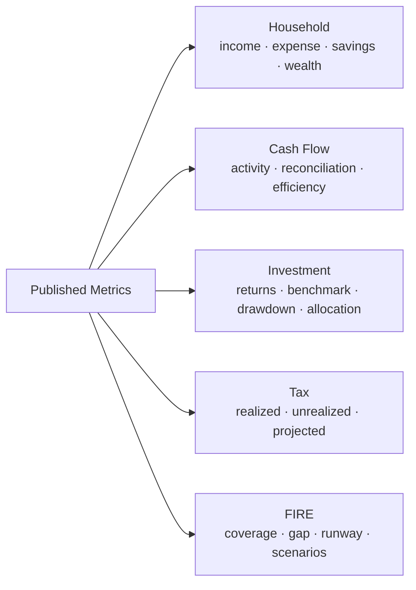

# Metrics & Methodology

This guide defines the major **published financial metrics and analytical concepts** in Personal Finance ETL.

The goal is not to create a dictionary of every intermediate column in the codebase.

The goal is to document the metrics that survive into the current v6 analytical contracts and explain:

```text
Definition
Methodology
Grain
Interpretation
Assumptions
Limitations
Published location
```

Earlier versions of the project exposed a broader collection of risk ratios. The current serving model intentionally focuses on measures I actually use for household, investment, tax, and FIRE decisions.

> **A metric existing in helper code does not make it a current product metric. The published Silver/Gold contract is the documentation boundary.**

---

## Metric families



---

## Household metrics

## Total income

### Definition

Canonical income recognized by the household financial model for the relevant period.

### Grain

Primarily monthly in Gold household marts, with category drill-down available separately.

### Interpretation

Measures total recognized income under current financial classifications.

### Caveat

Total income can include non-cash income depending on configured rules.

It should not automatically be interpreted as deployable cash.

---

## Cash income

### Definition

Income classified as cash-generating under `FinancialRules`.

### Interpretation

Useful for cash-flow and savings analysis where liquidity matters.

### Relationship

```text
Total Income
    =
Cash Income
    +
Non-Cash Income
```

subject to the configured classification model.

---

## Non-cash income

### Definition

Income recognized financially but not treated as equivalent current cash inflow.

### Why it matters

Without this distinction, household cash generation can be overstated.

---

## Total expenses

### Definition

Canonical household expenses recognized for the relevant period.

### Caveat

Total expense can include non-cash expense.

---

## Cash expenses

### Definition

Expenses that consume cash under current financial rules.

These are especially important for cash-flow reconciliation and liquidity analysis.

---

## Non-cash expenses

### Definition

Expense activity recognized by the financial model without equivalent current cash movement.

---

## Core expenses

### Definition

Expenses classified as core under `FinancialRules`.

### Interpretation

Used to separate baseline/essential spending from broader total expenditure.

### Planning use

Core spending can support Lean-FI or resilience-oriented views where the model distinguishes baseline spending from total spending.

---

## Savings metrics

## Cash-oriented savings

### Concept

Savings measured from cash-relevant household activity.

A conceptual representation is:

```text
Cash Income
   -
Cash Expense
   =
Cash-Oriented Savings
```

The exact production field should be interpreted according to its published contract.

### Use

Useful for:

- liquidity,
- deployable surplus,
- and FIRE contribution capacity.

---

## Total / accounting savings

### Concept

Savings measured from the broader income/expense model, including configured non-cash semantics.

### Why both exist

A household can appear to generate accounting surplus without producing equivalent deployable cash.

That difference is financially meaningful.

---

## Savings rate

### Concept

Savings relative to the appropriate income base.

The exact numerator and denominator must be read from the published metric definition because cash-oriented and total savings perspectives can differ.

### Interpretation

Measures how much income is retained rather than consumed.

### Limitation

A savings rate is not automatically an investment rate.

Retained cash can remain liquid rather than being deployed into investments.

---

## Investment rate

### Concept

Investment contribution relative to the relevant household income/cash-flow base.

### Interpretation

Measures the rate at which household resources are being converted into investment assets.

---

## Wealth metrics

## Book net worth

### Definition

Net worth derived from reconstructed ledger/accounting balances.

Conceptually:

```text
Book Assets
   -
Liabilities
   =
Book Net Worth
```

### Interpretation

Represents transaction/accounting-derived household state.

---

## Market net worth

### Definition

Net worth after incorporating market-derived investment values.

Conceptually:

```text
Book household state
with investment book values replaced / overlaid by market values
   -
Liabilities
   =
Market Net Worth
```

### Interpretation

Provides a more economically current household balance sheet.

---

## After-tax market net worth

### Definition

Market wealth adjusted for modelled investment tax exposure where applicable.

### Interpretation

Useful for long-range planning because gross market value is not always fully realizable.

### Limitation

This is modelled tax-aware wealth, not a guaranteed liquidation outcome.

---

## Organic growth

### Concept

The portion of asset/wealth change attributed to growth rather than direct savings/contribution flows.

### Interpretation

Helps separate:

```text
I added more money
```

from:

```text
existing assets appreciated
```

---

## Liquidity ratio

### Concept

Liquid resources relative to the relevant household balance-sheet or spending base.

### Interpretation

Used to understand how much wealth is readily available rather than locked in illiquid assets.

### Caveat

The exact denominator is contract-specific and should be verified in the Gold metric definition.

---

## Emergency-fund coverage

### Concept

Liquid/cash resources expressed in terms of spending coverage.

### Interpretation

Answers approximately:

> How many months of the configured spending base can current liquid resources cover?

---

## Cash-flow metrics

## Operating cash flow

Cash movement classified as operating activity under configured asset/counterparty semantics.

## Investing cash flow

Cash movement associated with investing activity.

## Financing cash flow

Cash movement associated with financing activity.

## Internal transfers

Movement between household assets that should not be interpreted as external cash generation or consumption.

---

## Net cash movement

### Concept

The actual change in configured cash-pool balances over the period.

Conceptually:

```text
Closing Cash
  -
Opening Cash
  =
Net Cash Movement
```

---

## Calculated net cash flow

### Concept

Cash movement implied by classified operating, investing, financing, and transfer activity.

---

## Unreconciled difference

### Definition

Difference between actual cash-pool movement and calculated classified movement.

Conceptually:

```text
Actual Net Cash Movement
   -
Calculated Net Cash Flow
   =
Unreconciled Difference
```

### Interpretation

A non-zero value is a reconciliation signal.

It should be investigated rather than automatically treated as income, expense, or noise.

---

## Investment position metrics

## Invested value

Capital represented by the investment accounting state at the relevant analytical grain.

## Current value

Market value of the active position.

## Quantity

Current active instrument quantity after transaction reconstruction and broker reconciliation.

## Unrealized P&L

Conceptually:

```text
Current Market Value
   -
Current Cost Basis
   =
Unrealized P&L
```

subject to the lot/instrument aggregation methodology.

## Absolute return

A non-annualized return measure comparing current value with invested/cost state.

It should not be confused with XIRR.

---

## CAGR

## Definition

Compound annual growth rate.

For beginning value \(V_0\), ending value \(V_T\), and elapsed years \(T\):

```text
CAGR = (V_T / V_0)^(1/T) - 1
```

## Use

Useful for point-to-point annualized growth.

## Limitation

CAGR does not inherently model irregular intermediate cash flows.

That is why XIRR is important for investment performance.

---

## XIRR

## Definition

Annualized internal rate of return for irregular dated cash flows.

XIRR solves for \(r\) such that:

```text
Σ CF_i / (1 + r)^((d_i - d_0)/365) = 0
```

where:

- `CF_i` is a dated cash flow,
- `d_i` is its date,
- and `d_0` is the base date.

## Cash-flow sign convention

Investment contributions/purchases and proceeds/terminal value must enter the return series with economically consistent signs.

## Active positions

For an active position, current terminal value is included as the closing cash-flow equivalent.

## Grain

XIRR can exist at:

- ISIN,
- classification,
- and portfolio

levels, but the cash-flow series must be reconstructed appropriately for each grain.

## Important aggregation rule

```text
Portfolio XIRR
≠ average(ISIN XIRR)
```

Portfolio XIRR is calculated from portfolio-level dated cash flows.

---

## After-tax XIRR

## Definition

Cash-flow-aware annualized return using tax-aware terminal state.

## Important distinction

The methodology is **not**:

```text
Pre-Tax XIRR × (1 - tax rate)
```

Tax exposure depends on lot-level state and holding classification.

The after-tax terminal value is therefore constructed from the underlying tax-aware investment state before solving the return.

## Interpretation

Useful for comparing economic performance after modelled tax effects.

## Limitation

It remains conditional on current tax methodology and assumed realization state.

---

## Benchmark CAGR

Point-to-point annualized growth of the configured benchmark exposure.

Useful for comparable point-to-point context.

---

## Benchmark XIRR

Cash-flow-aware return of the shadow benchmark portfolio.

Because benchmark exposure follows actual capital deployment, this is more meaningful than comparing the investment XIRR with an unrelated index CAGR.

---

## Active return

## Concept

Performance relative to the configured benchmark.

The exact calculation depends on the corresponding return measures at the published grain.

### Interpretation

Positive active return indicates outperformance relative to the modelled benchmark comparison; negative indicates underperformance.

### Caveat

Active return is benchmark-relative, so benchmark mapping quality matters.

---

## Max drawdown

## Definition

Largest peak-to-trough decline over the relevant value/performance path.

Conceptually:

```text
Drawdown_t = Value_t / RunningPeak_t - 1

Max Drawdown = minimum(Drawdown_t)
```

when represented as a negative decline, or its magnitude depending on contract convention.

## Interpretation

Captures the worst historical decline in the observed analytical path.

## Why it remains in v6

The current serving model retains max drawdown as a direct, interpretable risk measure while broader risk-ratio output was pruned.

---

## Portfolio weight

## Definition

Instrument current value as a share of total portfolio current value at the relevant date/month.

Conceptually:

```text
Instrument Value / Portfolio Value
```

## Interpretation

Measures concentration.

---

## Class weight

Instrument/class exposure relative to the portfolio within the configured class taxonomy.

Used for allocation analysis.

---

## Target weight

Configured target allocation associated with the relevant investment class.

---

## Allocation drift

Difference between actual allocation and configured target allocation.

Conceptually:

```text
Actual Weight - Target Weight
```

The current implementation uses this state to determine rebalancing signals.

---

## Rebalance required

A rule-based flag indicating that allocation drift has crossed the current implementation's tolerance.

During the v6 audit, the rebalance tolerance was still hard-coded at approximately **5 percentage points** rather than fully exposed through `FinancialRules`.

That is a current implementation detail and a future configuration-hardening opportunity.

---

## Harvestable loss

Current unrealized loss state that can participate in tax-harvesting analysis under the implemented methodology.

This is not automatically equivalent to a recommended trade.

---

## Harvesting priority

A management-oriented signal derived from tax-aware loss/opportunity state.

It should be interpreted as decision support rather than autonomous execution.

---

## Realized investment tax metrics

The current investment/tax model distinguishes:

```text
Realized LTCG
Realized STCG
Realized Gain

Realized LTCL
Realized STCL
Realized Loss

Realized Net P&L
```

The calculations are financial-year aware.

These measures represent disposed positions, not current unrealized exposure.

---

## Unrealized tax metrics

The lot model can distinguish:

- unrealized LTCG,
- unrealized STCG,
- unrealized LTCL,
- unrealized STCL,
- estimated tax if sold,
- and after-tax value.

These depend on current lot holding state and tax policy.

---

## Taxable dividends

Dividend income treated as taxable under the current tax/macro configuration.

## Taxable interest

Interest income treated as taxable under the current configuration.

---

## LTCG exemption used

Amount of the configured long-term capital-gains exemption consumed by realized state in the relevant tax context.

## LTCG exemption remaining

Configured exemption remaining after current realized usage.

---

## Projected tax bill

Modelled tax liability based on current realized/taxable state and configured rates/assumptions.

It is a planning estimate, not a filed tax return.

---

## Effective tax rate

Projected/modelled tax liability relative to the relevant taxable or realized base used by the implementation.

Interpretation should follow the published contract.

---

## Tax harvesting capacity

Remaining modelled capacity for losses to offset relevant taxable realized gains under the implemented methodology.

This is a planning metric.

It does not automatically mean a trade should be executed.

---

## FIRE metrics

FIRE metrics fall into three groups:

```text
Current state
Deterministic planning
Stochastic scenarios
```

---

## Target FI today

Current financial-independence target based on the configured spending base and withdrawal assumptions.

Conceptually, a simple FI target often resembles:

```text
Annual Spending / Sustainable Withdrawal Rate
```

but the production implementation should be interpreted through its configured FIRE methodology rather than assuming a universal 4% rule.

---

## Lean FI today

FI target based on the model's lean/core spending perspective.

## Coast FI

Current capital required such that, under configured growth/time assumptions, additional contributions may no longer be required to reach the target at the relevant future horizon.

## FI coverage

Conceptually:

```text
Relevant Current Wealth / FI Target
```

It measures how much of the target is currently covered.

## FI gap

Conceptually:

```text
FI Target - Relevant Current Wealth
```

subject to the current model's target/wealth basis.

---

## Current withdrawal rate

Current spending relative to relevant current wealth.

Conceptually:

```text
Annualized Spending / Relevant Wealth
```

Used to understand how current spending compares with the portfolio/wealth base.

---

## Required savings rate

Modelled savings rate required to close the FI gap under configured deterministic assumptions.

This is a planning output, not a universal prescription.

---

## Linear months to FI

A simplified deterministic estimate based on current gap and savings trajectory.

It is useful as an interpretable baseline but does not capture market-path uncertainty.

---

## Runway

Runway expresses how long current resources can support the configured spending base under the relevant deterministic or stochastic model.

The serving model can distinguish perspectives such as:

- linear runway,
- base/P50 runway,
- stressed/P10 runway,
- and total-spend variants.

The exact wealth/spending basis matters.

---

## FI velocity

A planning measure describing the rate at which the household is progressing toward FI under the implemented methodology.

It should be interpreted as a model-derived trajectory measure, not a market return.

---

## Wealth velocity and acceleration

These describe the rate and change in rate of wealth progression over time.

They are useful for trajectory analysis but depend on the smoothing/window methodology used by the implementation.

---

## Real net-worth CAGR

Annualized net-worth growth adjusted for inflation over the relevant trailing period.

The current serving model includes a real multi-year net-worth CAGR measure.

This helps separate nominal balance growth from purchasing-power growth.

---

## Monte Carlo months-to-FI percentiles

The stochastic model publishes:

```text
P10 months to FI
P50 months to FI
P90 months to FI
```

These summarize the distribution of simulated FI timing.

They are not confidence intervals in the frequentist statistical sense unless the model is specifically interpreted that way.

They are percentiles of simulated paths under configured assumptions.

---

## Probability of success

## Definition

Proportion of simulated paths satisfying the model's success criterion.

Conceptually:

```text
Successful simulated paths
        /
Total simulated paths
```

## Interpretation

This is a **modelled scenario success rate**.

It is not an objective real-world probability that retirement will succeed.

Its value depends on:

- market assumptions,
- inflation,
- regime transitions,
- human-capital shocks,
- glide paths,
- withdrawal policy,
- horizon,
- and other configured model behaviour.

---

## Projected P50 FI date

Median projected FI date across the simulated FI timing distribution.

Again, this is a scenario percentile, not a promised date.

---

## Terminal wealth P50

Median nominal terminal wealth across simulated paths at the model horizon.

The current Gold contract intentionally exposes the median rather than every available percentile.

---

## Stressed and base runway

The stochastic serving model exposes selected runway percentiles such as:

- stressed/P10 runway,
- base/P50 runway.

These provide distributional planning context rather than one deterministic survival estimate.

---

## Metrics intentionally not part of the current serving contract

Earlier versions of the project carried a broader risk-ratio surface.

The current Gold contract does **not** use metrics such as the following as headline published analytics:

```text
Sharpe ratio
Sortino ratio
Calmar ratio
Beta
Tracking error
Upside capture
Downside capture
Expected Shortfall / CVaR
```

Some residual helper code may still calculate portions of older risk machinery.

That does not make those metrics part of the current v6 product contract.

This distinction is deliberate.

---

## Semantic caveats discovered during v6 audit

## `Outperformance_Probability`

The current investment implementation historically uses this name for a quantity closer to:

```text
active lots currently outperforming benchmark CAGR
        /
active lots
```

That is not a stochastic forecast probability.

A future semantic rename such as `Outperforming_Lot_Ratio` would be clearer.

Documentation should not interpret the current field as a predictive probability.

## `ISIN_Monthly_Return`

The current portfolio-management calculation is closer to market-value percentage change than a fully cash-flow-adjusted investment return.

Contributions/redemptions can therefore affect interpretation.

XIRR remains the more rigorous cash-flow-aware performance measure.

This is a semantic hardening opportunity.

---

## Metric interpretation rules

### Always identify grain

A portfolio metric and ISIN metric can share a name while using different cash-flow context.

### Distinguish observed from modelled

Market value is observed/derived from market data.

Projected tax, after-tax wealth, and FIRE scenarios are modelled.

### Distinguish cash from accounting

Income, expense, and savings can have cash and non-cash variants.

### Distinguish point-to-point from cash-flow-aware return

CAGR and XIRR answer different questions.

### Distinguish historical risk from future scenario uncertainty

Max drawdown describes historical path behaviour.

Monte Carlo describes scenario distributions under assumptions.

---

## Published locations

At a high level:

| Metric family | Primary serving contracts |
| --- | --- |
| Household income/expense/net worth | `Core_Monthly_Fact` |
| Asset-level wealth | `Wealth_Asset_Breakdown` |
| Income composition | `Cashflow_Income_Breakdown` |
| Expense composition | `Cashflow_Expense_Breakdown` |
| Cash-flow efficiency | `Cashflow_Efficiency_Analytics` |
| Cash reconciliation | `Cashflow_Activity_Summary` |
| FIRE / wealth planning | `Wealth_FIRE_Analytics` |
| Tax planning | `Forecast_Tax_Liability` |
| Budget planning | `Forecast_Budget_Variance` |
| Portfolio management | `Investment_Portfolio_Summary` |
| Security performance/tax | `Investment_By_ISIN` |
| Hierarchical investment analytics | `Investment_By_*` marts |
| Portfolio investment analytics | `Investment_By_Portfolio` |

For exact physical fields, see [Gold Data Contracts](../reference/gold-data-contracts.md).

---

## Methodology hierarchy

When documentation appears to conflict, interpret the project in this order:

```text
Live calculation path
        ↓
Persisted Silver / Gold contract
        ↓
Current methodology documentation
        ↓
Comments / docstrings
        ↓
Historical documentation
```

This hierarchy exists because older comments or helper code can survive analytical pruning.

The current published contract is the product boundary.

---

## Related documentation

- [Financial Model](financial-model.md)
- [Investment Analytics](investment-analytics.md)
- [Cash Flow & Wealth](cashflow-and-wealth.md)
- [Tax Methodology](tax-methodology.md)
- [FIRE Methodology](fire-methodology.md)
- [Gold Data Contracts](../reference/gold-data-contracts.md)

[← Finance Home](README.md) · [← Documentation Home](../README.md)
