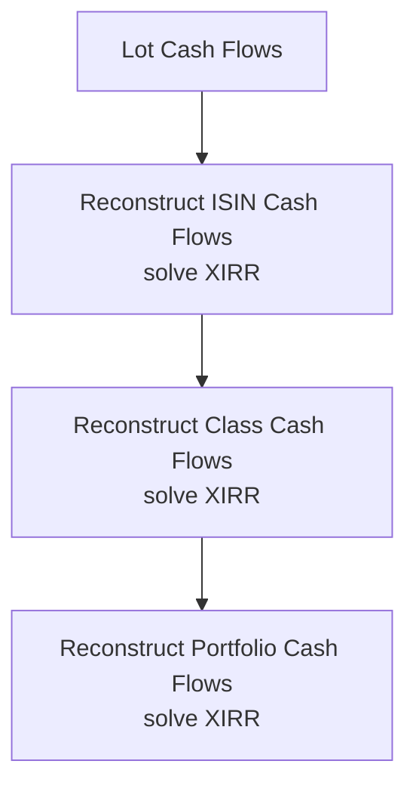

# Metrics & Methodology

A financial metric is not fully defined by its formula.

It also needs:

```text
grain
cash-flow treatment
time convention
tax treatment
benchmark convention
aggregation behaviour
interpretation
```

This page documents the methodology principles behind the current serving model.

---

## 1. The current metric surface is intentionally curated

Earlier versions calculated a broader set of institutional-style risk measures.

The production-hardening cycle removed metrics and processing that did not materially support my personal decision workflow.

The current investment serving surface emphasizes:

```text
CAGR
XIRR
After-Tax XIRR
Benchmark CAGR
Benchmark XIRR
Active Return
Max Drawdown
Outperforming Lot Ratio
tax-aware position state
```

The principle is:

> **Compute richly. Publish selectively.**

---

## 2. CAGR

For positive start/end values:

```text
CAGR = (V_end / V_start)^(365 / days) - 1
```

where:

- \(V_{start}\) = starting value,
- \(V_{end}\) = ending value,
- \(d\) = elapsed days.

The production helper is intentionally small:

```python
def calculate_cagr(
    start_value: float,
    end_value: float,
    days: int,
) -> float:
    if start_value <= 0 or end_value <= 0 or days <= 0:
        return 0.0

    try:
        return float(
            ((end_value / start_value) ** (365.0 / days)) - 1
        )
    except OverflowError:
        return float("nan")
```

### Interpretation

CAGR is useful when a start/end value relationship is meaningful.

It is not a substitute for cash-flow-aware performance when capital moves during the period.

---

## 3. XIRR

XIRR solves for \(r\):

```text
Find r such that:

Σ [ CF_i / (1 + r)^((d_i - d_0) / 365) ] = 0
```

The production wrapper delegates numerical solving to `pyxirr`:

```python
def calculate_xirr(
    dates: list[date],
    amounts: list[float],
) -> float:
    try:
        result = xirr(dates, amounts)
        return (
            float(result)
            if result is not None
            else float("nan")
        )
    except Exception:
        return float("nan")
```

The wrapper is not the interesting part.

The difficult part is constructing the correct cash-flow series.

---

## 4. XIRR is non-additive

This is one of the most important methodology rules in the project:

```text
Portfolio XIRR
≠ average(ISIN XIRR)

Class XIRR
≠ average(security XIRR)

ISIN XIRR
≠ average(lot XIRR)
```

At each analytical grain, the engine reconstructs dated cash flows and solves the return again.



This is why return aggregation is not a simple `group_by().mean()` problem.

---

## 5. After-Tax XIRR

After-tax performance uses tax-aware terminal state rather than pretending unrealized gains are fully spendable.

Conceptually:

```text
historical dated investment cash flows
        +
after-tax terminal value
        ↓
After-Tax XIRR
```

The terminal value reflects estimated tax embedded in active lots.

This is a modelled liquidation perspective, not an observed sale.

---

## 6. Benchmark XIRR

Benchmark return uses a shadow benchmark portfolio.

Real investment cash flows create benchmark-equivalent exposure at matching dates.

```text
real purchase
      ↓
benchmark shadow purchase

real disposal
      ↓
proportional benchmark shadow disposal
```

Benchmark XIRR therefore preserves capital-deployment timing.

It is not simply an index CAGR copied beside the portfolio return.

---

## 7. Active Return

The current serving interpretation is benchmark-relative return difference at a comparable grain.

Conceptually:

```text
Active Return = Portfolio Return - Benchmark Return
```

The exact return family should remain aligned:

```text
XIRR vs Benchmark XIRR
CAGR vs Benchmark CAGR
```

Mixing incompatible return methodologies would create a mathematically valid subtraction with weak financial meaning.

---

## 8. Max Drawdown

For a value series \(V_t\):

```text
Peak_t        = max(V_0, ..., V_t)
Drawdown_t    = (V_t / Peak_t) - 1
Max Drawdown  = min(Drawdown_t)
```

Max Drawdown survives the metric-pruning cycle because it answers a useful behavioural question:

> **How far did this investment/portfolio fall from a previous peak?**

It describes realized historical path risk.

It does not predict future drawdown.

---

## 9. Outperforming Lot Ratio

The metric previously named `Outperformance_Probability` was renamed because that label overstated the methodology.

The current concept is:

```text
Outperforming Lot Ratio
= Active Lots Outperforming Benchmark / Active Lots
```

This is a descriptive ratio of current lot state.

It is **not** a probabilistic forecast.

The rename is an example of a broader documentation rule:

> **Metric names are part of the analytical contract.**

---

## 10. Monthly market-value change

The old `ISIN_Monthly_Return` name was also misleading.

The current contract describes the quantity as:

```text
Monthly_Market_Value_Change_Pct
```

because the calculation represents percentage movement in market value rather than a fully cash-flow-adjusted investment return.

That distinction prevents users from interpreting capital-flow-driven value movement as performance.

---

## 11. Savings metrics

Savings can be defined differently depending on whether non-cash items are included.

Conceptually:

```text
Savings = Income - Expense
```

but the project can distinguish:

```text
economic savings
cash savings
core-spending-adjusted savings
```

The denominator and inclusion policy must therefore be documented with the metric.

A "savings rate" without a definition of income/expense scope is incomplete.

---

## 12. Net worth

At minimum:

```text
Net Worth = Assets - Liabilities
```

But the project carries multiple valuation states.

```text
Book Net Worth
→ reconstructed ledger values

Market Net Worth
→ market-valued investments

After-Tax Wealth
→ market wealth adjusted for estimated investment tax
```

Those are related metrics, not synonyms.

---

## 13. Cash-flow reconciliation difference

Conceptually:

```text
Calculated Closing Cash
= Opening Cash
+ Operating Cash Flow
+ Investing Cash Flow
+ Financing Cash Flow
+ Transfer Treatment

Unreconciled Difference
= Actual Closing Cash - Calculated Closing Cash
```

A non-zero difference is not suppressed.

It is a financial/data-quality signal.

---

## 14. Allocation weight

For a portfolio component \(i\):

```text
Weight_i = Market Value_i / Total Portfolio Market Value
```

Weights are non-additive across time.

They should be interpreted at one valuation date.

---

## 15. Allocation drift

Conceptually:

```text
Drift_i = Actual Weight_i - Target Weight_i
```

Rebalance policy compares absolute drift with configured tolerance.

The tolerance is now explicit FinancialRules policy rather than a hidden constant.

```python
class PortfolioManagementRules(BaseModel):
    rebalance_tolerance_pct_points: float = Field(
        default=5.0,
        ge=0.0,
    )
```

This is a good example of separating:

```text
metric
from
decision threshold
```

---

## 16. FIRE target

A simple deterministic FI target can be expressed as:

```text
FI Target = Annual Core Expense / Withdrawal Rate
```

But the useful model depends on policy around:

- expense scope,
- inflation,
- investable wealth,
- tax,
- expected returns,
- withdrawal behaviour.

The deterministic target is therefore a planning construct, not a universal constant.

---

## 17. Monte Carlo percentiles

Simulation outputs such as:

```text
P10
P50
P90
```

describe the distribution produced by the configured stochastic model.

For example:

```text
P50 months to FI
```

means the median simulated outcome under those assumptions.

It does **not** mean there is a 50% externally calibrated probability that the real world will exactly follow that path.

---

## 18. Additivity classification

| Metric | Behaviour |
| --- | --- |
| Income | Additive across compatible categories |
| Expense | Additive across compatible categories |
| Market value | Additive across assets at one date |
| Net worth | Semi-additive across time |
| Cash balance | Semi-additive across time |
| XIRR | Non-additive |
| CAGR | Non-additive |
| Max Drawdown | Non-additive |
| Allocation weight | Non-additive |
| Savings rate | Non-additive |
| Tax rate | Non-additive |

The target grain determines the correct aggregation method.

---

## 19. Metric methodology checklist

Before a new metric enters Gold, I want to be able to answer:

```text
What decision does it support?
What is its grain?
What inputs does it use?
Is it observed, reconstructed, estimated or simulated?
Is it additive?
How is it aggregated?
What assumptions does it depend on?
What could a reader misinterpret?
```

If those questions are difficult to answer, the metric is probably not ready for the serving layer.

---

## Go deeper

- [Investment Analytics](investment-analytics.md)
- [Cash Flow & Wealth](cashflow-and-wealth.md)
- [Tax Methodology](tax-methodology.md)
- [FIRE Methodology](fire-methodology.md)
- [Gold Data Contracts](../reference/gold-data-contracts.md)

[← Finance Home](README.md) · [← Documentation Home](../README.md)
