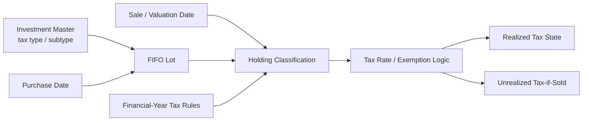
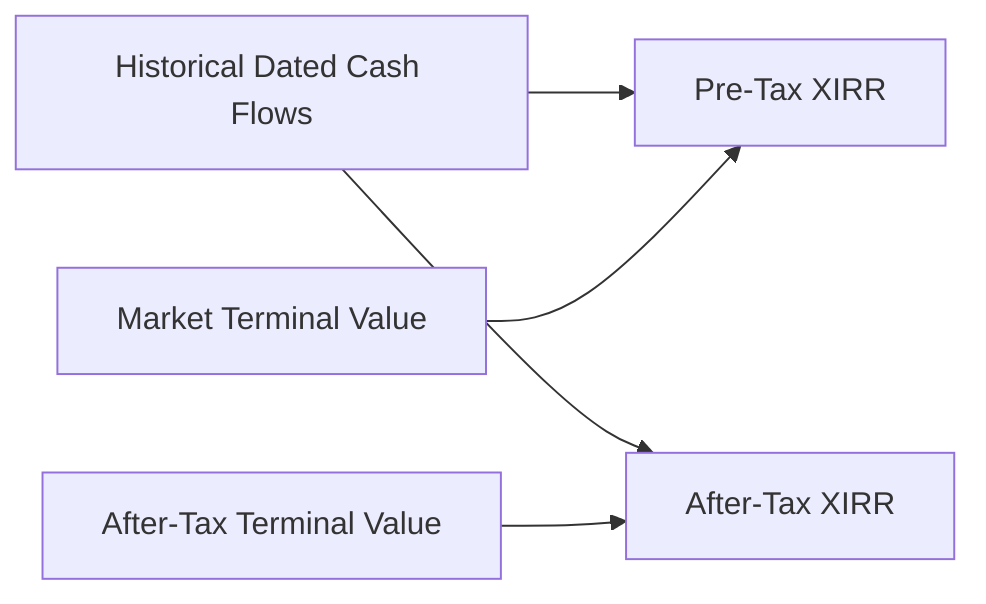

# Tax Methodology

Tax in Personal Finance ETL is modelled at **lot grain before portfolio aggregation**.

That is necessary because tax treatment can depend on:

```text
instrument tax classification
purchase date
sale / valuation date
holding period
realized vs unrealized state
financial-year rules
```

Two lots of the same ISIN can therefore have different tax state on the same date.

---

## 1. Tax lineage



Tax is not applied after portfolio aggregation.

It is attached to the lot state where the relevant facts still exist.

---

## 2. Holding period is contextual

When a sale consumes a lot:

```python
age_sale = max(
    (sell_date - lot.date).days,
    1,
)

holding_type = self.fy_table.get_holding_type(
    age_sale,
    self.tax_type,
    self.tax_subtype,
    lot.date,
    sell_date,
)
```

The method receives:

```text
age
tax type
tax subtype
purchase date
sale date
```

because holding-period treatment can change across tax regimes and asset classes.

A single universal:

```text
days > X → long term
```

rule would be too weak.

---

## 3. FIFO determines which tax history is realized

Suppose active inventory is:

```text
Lot A: 100 units @ ₹10
Lot B: 100 units @ ₹15
```

and 150 units are sold.

FIFO realizes:

```text
100 units from Lot A
50 units from Lot B
```

The remaining portfolio is:

```text
50 units from Lot B
```

Tax classification must therefore follow the acquisition dates of the consumed lots, not an average purchase date.

---

## 4. Realized gain/loss

For a consumed lot:

\[
RealizedPnL =
(SalePrice - PurchasePrice)
\times QuantitySold
\]

The production sale path computes:

```python
pnl = (
    (price - lot.price) * consumed
    if lot.price > 0
    else 0.0
)
```

The realized state is then classified using sale-date holding treatment.

---

## 5. Realized and unrealized tax are different states

### Realized

A sale occurred.

The gain/loss and holding classification belong to historical transaction state.

### Unrealized

No sale occurred.

The engine asks:

> **What tax would be estimated if this active lot were realized at the valuation price under the implemented rules?**

That estimate supports:

```text
after-tax market value
tax-aware planning
harvesting analysis
```

but is not an observed tax liability/payment.

---

## 6. Tax-aware terminal value

For an active lot:

```text
Market Value
- Estimated Tax If Sold
=
After-Tax Value
```

Aggregating that state gives an after-tax portfolio terminal value.

That value can feed:

```text
After-Tax XIRR
After-Tax Wealth
FIRE / planning state
```

This is where tax methodology becomes part of the broader financial model.

---

## 7. Losses matter too

Tax-aware analytics should not treat only gains as meaningful.

Active or realized losses can affect:

```text
STCL
LTCL
harvesting capacity
net taxable gain
```

depending on the configured jurisdictional methodology.

The current implementation is built around the Indian tax environment represented in the project's FinancialRules/reference state.

That behaviour is not yet jurisdiction-neutral.

---

## 8. Exemptions and thresholds are policy

Tax rates and exemption behaviour belong in validated financial policy/reference data rather than being scattered through presentation code.

Conceptually:

```text
Tax Rules
├── holding-period classification
├── STCG rate
├── LTCG rate
├── exemptions
└── effective-date behaviour
```

The investment engine consumes those rules at lot grain.

---

## 9. Financial-year awareness

Tax policy can change over time.

That is why the engine passes both acquisition and realization/valuation dates into tax classification.

```text
same asset
same holding duration
different tax regime date
→ potentially different treatment
```

The model therefore avoids assuming tax policy is timeless.

---

## 10. Broker reconciliation complicates tax evidence

Broker reconciliation can create adjustment inventory when transaction history and current broker quantity disagree.

That inventory is useful for reconciling current state.

But it does not magically reconstruct missing historical acquisition evidence.

So the tax interpretation must distinguish:

```text
observed historical lot
from
reconciliation lot
```

This is an important limitation.

Current-state correctness and historical-evidence completeness are different goals.

---

## 11. Tax-aware performance

Pre-tax XIRR uses market terminal value.

After-tax XIRR uses estimated after-tax terminal value.



The difference represents embedded estimated tax drag under the implemented liquidation assumptions.

---

## 12. Tax harvesting

Lot-level tax state can identify:

```text
realizable gains
realizable losses
short-term state
long-term state
harvesting capacity
```

Any action classification should remain decision support rather than automatic tax advice.

The system exposes state.

It does not execute trades.

---

## 13. Tax state and household wealth

After-tax investment value flows into household wealth.

```text
Investment Lot Tax State
        ↓
After-Tax Portfolio Value
        ↓
After-Tax Household Wealth
        ↓
Planning
```

This is why tax is not an isolated investment-report feature.

---

## 14. Tax methodology boundaries

The current implementation does **not** claim:

- universal jurisdiction support,
- legal/tax-advice status,
- perfect reconstruction when historical acquisition evidence is missing,
- that unrealized tax estimates are payable tax,
- that future tax regimes are known.

The methodology is a decision-support model under explicit current rules.

---

## 15. Tax invariants

1. Tax classification occurs before aggregation destroys lot history.
2. FIFO determines which acquisition history is realized.
3. Realized and unrealized tax remain separate.
4. Estimated tax does not become observed tax.
5. Holding treatment is date- and asset-aware.
6. Reconciliation inventory does not become fabricated historical evidence.
7. Tax policy remains explicit and jurisdiction-specific.
8. After-tax value can feed performance and household planning.

---

## Go deeper

- [Investment Analytics](investment-analytics.md)
- [Metrics & Methodology](metrics-and-methodology.md)
- [Financial Rules](../configuration/financial-rules.md)
- [Silver Data Contracts](../reference/silver-data-contracts.md)
- [Gold Data Contracts](../reference/gold-data-contracts.md)

[← Finance Home](README.md) · [← Documentation Home](../README.md)
